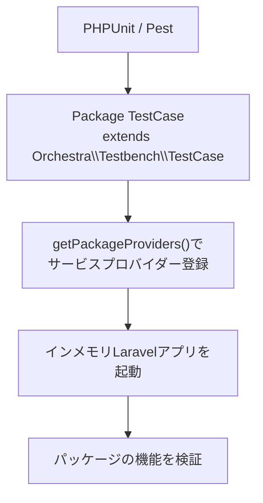

## Orchestra Testbenchとは

[Orchestra Testbench](https://github.com/orchestral/testbench) は、パッケージ開発向けのLaravelテストヘルパーです。`Orchestra\Testbench\TestCase` を継承すると、パッケージ単体でもLaravelアプリケーション内と同じ感覚でテストできます。

Laravel公式ドキュメントの[パッケージ開発](/jp/advanced/package-development)でも、パッケージテストにはTestbenchを使うことが案内されています。



## セットアップ

<Steps>
  <Step title="Testbenchをインストールする">
    ```bash
    composer require --dev orchestra/testbench
    ```
  </Step>
  <Step title="ベースのTestCaseを作成する">
    ```php
    <?php
    
    namespace Vendor\Package\Tests;
    
    use Orchestra\Testbench\TestCase as BaseTestCase;
    use Vendor\Package\PackageServiceProvider;
    
    abstract class TestCase extends BaseTestCase
    {
        /**
         * $app はTestbenchが起動したLaravelアプリケーションインスタンス。
         */
        protected function getPackageProviders($app): array
        {
            return [
                PackageServiceProvider::class,
            ];
        }
    }
    ```
  </Step>
  <Step title="必要なら設定やエイリアスを追加する">
    `getPackageAliases()` では、`config/app.php` の `aliases` と同様に、テスト中に使うファサードエイリアスを登録できます。

    ```php
    protected function getPackageAliases($app): array
    {
        return [
            'Package' => \Vendor\Package\Facades\Package::class,
        ];
    }
    
    protected function defineEnvironment($app): void
    {
        // テスト用設定をここで上書きする
        $app['config']->set('package.enabled', true);
    }
    ```
  </Step>
</Steps>

## 基本的なテストの書き方

サービスプロバイダーが読み込まれているか、ファサードが期待どおり動くか、設定が反映されているかを最初に確認します。

```php
<?php

namespace Vendor\Package\Tests\Feature;

use Vendor\Package\Facades\Package;
use Vendor\Package\PackageServiceProvider;
use Vendor\Package\Tests\TestCase;

class PackageBootstrapTest extends TestCase
{
    public function test_service_provider_is_registered(): void
    {
        $this->assertTrue($this->app->providerIsLoaded(PackageServiceProvider::class));
    }

    public function test_facade_returns_expected_value(): void
    {
        // ファサード経由で機能を検証する
        $this->assertSame('ok', Package::status());
    }

    public function test_package_config_is_available(): void
    {
        // defineEnvironment()で設定した値を確認する
        $this->assertTrue(config('package.enabled'));
    }
}
```

## ファイルシステム・データベースのテスト

DBを使うテストでは、`defineEnvironment()` でSQLiteインメモリを設定し、テスト対象のマイグレーションを読み込みます。

```php
<?php

namespace Vendor\Package\Tests;

use Orchestra\Testbench\TestCase as BaseTestCase;

abstract class TestCase extends BaseTestCase
{
    protected function defineEnvironment($app): void
    {
        // SQLiteインメモリDBを使う
        $app['config']->set('database.default', 'testing');
        $app['config']->set('database.connections.testing', [
            'driver' => 'sqlite',
            'database' => ':memory:',
            'prefix' => '',
        ]);
    }

    protected function setUp(): void
    {
        parent::setUp();

        // パッケージのマイグレーションを読み込む
        $this->loadMigrationsFrom(__DIR__.'/../database/migrations');
    }
}
```

```php
public function test_it_persists_data(): void
{
    \DB::table('widgets')->insert(['name' => 'test']);

    $this->assertDatabaseHas('widgets', ['name' => 'test']);
}
```

## 複数Laravelバージョンでのテスト

TestbenchのメジャーバージョンはLaravelのメジャーバージョンに対応します。詳細は公式の[Version Compatibility](https://packages.tools/testbench)を確認してください。

| Laravel | Testbench |
|---|---|
| 12.x | 10.x |
| 13.x | 11.x |

複数バージョンを継続検証する場合は、GitHub Actionsのマトリクスと組み合わせます。設計の考え方は[パッケージのバージョン互換性管理](/jp/advanced/package-versioning)を参照してください。

```yaml
strategy:
  fail-fast: false
  matrix:
    php: [8.3, 8.4]
    laravel: ["^12.0", "^13.0"]
    include:
      - laravel: "^13.0"
        testbench: "^11.0"
      - laravel: "^12.0"
        testbench: "^10.0"
```

## まとめ

Testbenchを使うと、Laravelアプリを手動で用意しなくても、パッケージの振る舞いを実運用に近い形で検証できます。サービスプロバイダー登録、設定、ファサード、DBまでテスト対象に含めることで、リリース後の不具合を大きく減らせます。

## 関連ページ

<Columns cols={2}>
  <Card title="Laravelパッケージ開発" icon="box" href="/jp/advanced/package-development">
    サービスプロバイダーを中心にしたパッケージ実装の基本を確認します。
  </Card>
  <Card title="パッケージのバージョン互換性管理" icon="git-branch" href="/jp/advanced/package-versioning">
    LaravelとTestbenchのバージョン戦略とCIマトリクス運用を確認します。
  </Card>
</Columns>
