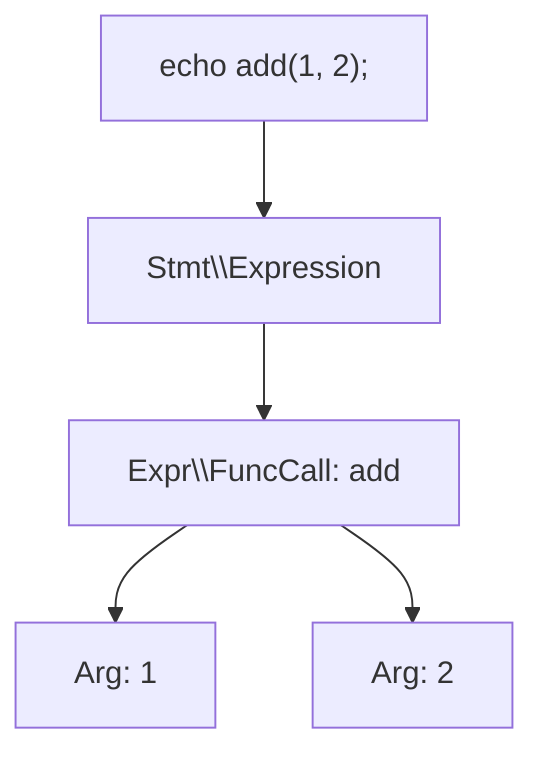

## PHP AST とは

AST（Abstract Syntax Tree / 抽象構文木）は、ソースコードを「意味のある構造」に分解した木構造です。

あなたがコード生成ツール、静的解析ツール、自動リファクタリングツールを作るとき、ASTはほぼ必須の基盤になります。文字列置換では壊れやすい変換でも、ASTを使えば「function call」「class declaration」「`use` statement」のような構文単位で安全に扱えます。



## PHP の内部 AST

PHP 7以降のZend Engineは、PHPコードをいきなりopcodeへ変換するのではなく、まず内部ASTへ変換してからコンパイルします。

- `php -r` で実行する1行コードでも、内部的には同じコンパイルパイプラインを通ります
- OPcacheは最終的に生成されたopcodeをキャッシュして再利用します
- 通常のアプリ開発では、この内部ASTを直接操作する機会はほとんどありません

つまりあなたが「ASTを使ってコードを編集したい」と考えたときは、PHPランタイム内部ASTではなく、ユーザーランドで扱えるASTライブラリを使うのが実用的です。

## nikic/PHP-Parser パッケージ

[nikic/PHP-Parser](https://github.com/nikic/PHP-Parser) は、PHPコードをASTとして解析・走査・再生成するための標準的なライブラリです。READMEと公式ドキュメントでは、次の3ステップが基本として説明されています。

### インストール

```bash
composer require nikic/php-parser
```

### 基本的なパース例（コードをASTへ変換）

```php
<?php

use PhpParser\Error;
use PhpParser\ParserFactory;

$code = <<<'CODE'
<?php
function greet(string $name): void {
    echo "Hello, {$name}";
}
CODE;

$parser = (new ParserFactory())->createForNewestSupportedVersion();

try {
    $ast = $parser->parse($code);
} catch (Error $error) {
    echo "Parse error: {$error->getMessage()}\n";
    return;
}
```

### NodeVisitor パターンでASTを走査・変更

```php
<?php

use PhpParser\Node;
use PhpParser\NodeTraverser;
use PhpParser\NodeVisitorAbstract;

$traverser = new NodeTraverser();

$traverser->addVisitor(new class extends NodeVisitorAbstract {
    public function leaveNode(Node $node)
    {
        if ($node instanceof Node\Scalar\Int_) {
            return new Node\Scalar\String_((string) $node->value);
        }
    }
});

$modifiedAst = $traverser->traverse($ast);
```

`NodeVisitorAbstract` を継承すると、必要なフック（`enterNode` / `leaveNode`）だけを実装できます。複雑な変換では、`enterNode` で情報を集めて `leaveNode` で置換する流れが有効です。

### Pretty Printer でコードを再生成

```php
<?php

use PhpParser\PrettyPrinter;

$prettyPrinter = new PrettyPrinter\Standard();
$newCode = $prettyPrinter->prettyPrintFile($modifiedAst);

echo $newCode;
```

この流れを使うと、あなたは「文字列としてのコード」ではなく「構文木としてのコード」を変換対象にできます。

## Laravel/Chisel での使用例

[laravel/chisel](https://github.com/laravel/chisel) は、スターターキットを後処理で削るためのライブラリです。`composer.json` では `nikic/php-parser` の5.x系を依存関係に含めています。

Chiselの `Laravel\Chisel\Ast\Source` では、次の手順でAST編集を実行しています。

1. `ParserFactory::createForNewestSupportedVersion()` でコードをパース
2. `NodeTraverser` に複数のVisitor（`RemoveImportVisitor` など）を追加して変換
3. `PhpParser\PrettyPrinter\Standard` の `printFormatPreserving()` で元のフォーマットを保ちながら書き戻し

この設計により、あなたは `use` 文・trait・interface の削除をテキスト置換ではなく構文ベースで安全に実行できます。

## ユースケース

ASTを使うと、あなたは次のような開発を進めやすくなります。

- コード生成CLI（雛形作成後に構文単位で編集）
- 静的解析ツール（特定構文の検出、ルール違反の検出）
- 自動リファクタリング（API移行や命名変更の半自動化）
- プロジェクトテンプレートの後処理（Chiselのような機能削除・置換）

## まとめ

PHP ASTは、一般的なLaravelアプリ開発では毎日使う機能ではありません。

ただし、あなたがツール開発やパッケージ開発を進めるなら、ASTは「壊れにくく再現性のあるコード変更」を実現する強力な基盤になります。まずは `nikic/php-parser` のParser・Visitor・Pretty Printerの3点を小さなCLIで試してください。
