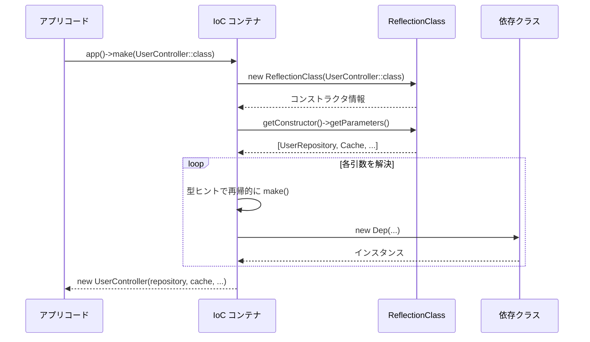

## PHP Reflection APIとは

PHP Reflection APIは、クラス・メソッド・プロパティ・関数・パラメーターなどのメタ情報を実行時に取得・検査できるPHPの組み込み機能です。クラスのコンストラクタが何を引数に取るか、メソッドにどんなアトリビュートが付いているかなどを、ソースコードを直接書き換えることなく調べられます。

Laravelは`Illuminate/Container/Container.php`の内部でReflection APIを多用しており、DIコンテナの自動解決・PHPアトリビュートの読み取り・メソッドインジェクションなどを実現しています。

## 主要クラス

| クラス | 主な用途 |
|---|---|
| `ReflectionClass` | クラスのメタ情報を取得する起点 |
| `ReflectionMethod` | メソッドの引数・アクセス修飾子・アトリビュートを取得 |
| `ReflectionProperty` | プロパティの型・デフォルト値・アトリビュートを取得 |
| `ReflectionParameter` | メソッド・関数の引数情報（型ヒント・デフォルト値）を取得 |
| `ReflectionFunction` | 関数・クロージャのメタ情報を取得 |
| `ReflectionAttribute` | アトリビュートのクラス名・引数を取得 |

### ReflectionClass — クラス情報を取得する

```php
$ref = new ReflectionClass(UserController::class);

$ref->getName();          // クラスの完全修飾名
$ref->getShortName();     // クラス名のみ
$ref->isInstantiable();   // インスタンス化できるか
$ref->getConstructor();   // コンストラクタを ReflectionMethod で返す
$ref->getMethods();       // すべてのメソッドを ReflectionMethod[] で返す
$ref->getProperties();    // すべてのプロパティを ReflectionProperty[] で返す
$ref->getAttributes();    // クラスに付いたアトリビュートを ReflectionAttribute[] で返す
```

### ReflectionParameter — コンストラクタ引数を検査する

```php
$ref = new ReflectionClass(UserController::class);
$constructor = $ref->getConstructor();

if ($constructor) {
    foreach ($constructor->getParameters() as $param) {
        $param->getName();           // 引数名
        $param->getType();           // 型ヒント（ReflectionType）
        $param->isOptional();        // 省略可能かどうか
        $param->isVariadic();        // 可変長引数かどうか
        $param->getDefaultValue();   // デフォルト値（存在する場合）
    }
}
```

## LaravelコンテナとReflection API

LaravelのIoCコンテナは、Reflection APIを使ってコンストラクタインジェクション（依存性の自動解決）を実現しています。`app()->make(SomeClass::class)` や依存性注入が動く仕組みを理解しましょう。



### コンテナの `build()` メソッド（簡略版）

実際の`Container.php`の`build()`メソッドはおよそ次のようなコードです。

```php
// Illuminate\Container\Container::build() を簡略化
public function build($concrete)
{
    // 1. ReflectionClass でクラスを検査
    $reflector = new ReflectionClass($concrete);

    // インスタンス化できないクラス（interface, abstract など）はエラー
    if (! $reflector->isInstantiable()) {
        throw new BindingResolutionException("[$concrete] is not instantiable.");
    }

    // 2. コンストラクタを取得
    $constructor = $reflector->getConstructor();

    // コンストラクタなし → そのままインスタンス化
    if (is_null($constructor)) {
        return new $concrete;
    }

    // 3. コンストラクタのパラメーターをすべて取得
    $dependencies = $constructor->getParameters();

    // 4. 各パラメーターを再帰的に解決
    $instances = $this->resolveDependencies($dependencies);

    return new $concrete(...$instances);
}

protected function resolveDependencies(array $dependencies): array
{
    $results = [];

    foreach ($dependencies as $dependency) {
        // 型ヒントが取れる場合はコンテナで再帰解決
        $className = Util::getParameterClassName($dependency);

        $results[] = is_null($className)
            ? $this->resolvePrimitive($dependency)  // プリミティブ型
            : $this->resolveClass($dependency, $className); // クラス型
    }

    return $results;
}
```

<Info>
  `Util::getParameterClassName()` は `$parameter->getType()` の結果から型名の文字列を取り出すユーティリティです。`ReflectionParameter::getType()` が返す `ReflectionNamedType` を扱いやすくラップしています。
</Info>

## PHPアトリビュートの読み取り

PHP 8.0以降、Reflection APIを使ってクラス・メソッド・プロパティに付いたアトリビュートを取得できます。Laravelはこの仕組みを使ってキューアトリビュートやEloquentアトリビュートを処理しています。

<Tip>
  PHPアトリビュートとLaravelへの組み込みについては [PHPアトリビュート](/jp/advanced/php-attributes) も合わせて参照してください。
</Tip>

### アトリビュートを読み取る基本パターン

```php
use ReflectionClass;

// 1. クラスに付いたアトリビュートを取得
$ref = new ReflectionClass(ProcessOrder::class);
$attrs = $ref->getAttributes(Queue::class); // 特定のアトリビュートだけ取得

foreach ($attrs as $attr) {
    $instance = $attr->newInstance(); // アトリビュートクラスをインスタンス化
    echo $instance->queue;            // アトリビュートのプロパティを読む
}

// 2. すべてのアトリビュートを取得（フィルターなし）
$allAttrs = $ref->getAttributes();

foreach ($allAttrs as $attr) {
    echo $attr->getName();       // アトリビュートクラス名（FQCN）
    print_r($attr->getArguments()); // コンストラクタ引数
}
```

### LaravelがQueue属性を読み取る仕組み（簡略版）

```php
// InteractsWithQueue トレイトの ReadsQueueAttributes より簡略化
protected function setJobInstanceForQueue(object $job): void
{
    $reflection = new ReflectionClass($job);

    foreach ($reflection->getAttributes(Queue::class) as $attribute) {
        $instance = $attribute->newInstance();
        $job->queue = $instance->queue instanceof \UnitEnum
            ? $instance->queue->value
            : $instance->queue;
    }
}
```

### メソッドのアトリビュートを読み取る

```php
$ref = new ReflectionClass(UserController::class);

foreach ($ref->getMethods() as $method) {
    $attrs = $method->getAttributes(Route::class);

    foreach ($attrs as $attr) {
        $route = $attr->newInstance();
        echo "{$method->getName()} => {$route->path}";
    }
}
```

## パッケージ開発での活用例

### クラスの実装インターフェースを検査する

パッケージでクラスが特定のインターフェースを実装しているかを動的に確認できます。

```php
use ReflectionClass;

function isQueueable(string $class): bool
{
    $ref = new ReflectionClass($class);

    return $ref->implementsInterface(\Illuminate\Contracts\Queue\ShouldQueue::class);
}
```

### メタデータ取得 — アトリビュートでルートを自動登録する

アトリビュートとReflectionを組み合わせてルートを自動収集するパターンです。

```php
// 独自のRouteアトリビュート定義
#[\Attribute(\Attribute::TARGET_METHOD)]
class Route
{
    public function __construct(
        public string $method,
        public string $path,
    ) {}
}

// コントローラーで使う
class UserController
{
    #[Route('GET', '/users')]
    public function index() { /* ... */ }

    #[Route('POST', '/users')]
    public function store() { /* ... */ }
}

// アトリビュートからルートを自動登録するサービスプロバイダー
class AttributeRouteServiceProvider extends ServiceProvider
{
    public function boot(Router $router): void
    {
        $ref = new ReflectionClass(UserController::class);

        foreach ($ref->getMethods(\ReflectionMethod::IS_PUBLIC) as $method) {
            foreach ($method->getAttributes(Route::class) as $attr) {
                $route = $attr->newInstance();
                $router->addRoute(
                    $route->method,
                    $route->path,
                    [UserController::class, $method->getName()],
                );
            }
        }
    }
}
```

### 動的なメソッド呼び出し — メソッドインジェクション

Laravelの`call()`メソッドはReflectionを使って引数を自動解決します。同じ仕組みをパッケージで実装する例です。

```php
use ReflectionFunction;
use ReflectionMethod;

function callWithDependencies(callable $callable, Container $container): mixed
{
    if (is_array($callable)) {
        [$object, $method] = $callable;
        $ref = new ReflectionMethod($object, $method);
        $params = $ref->getParameters();
    } else {
        $ref = new ReflectionFunction($callable);
        $params = $ref->getParameters();
    }

    $args = [];
    foreach ($params as $param) {
        $type = $param->getType()?->getName();
        $args[] = $type ? $container->make($type) : null;
    }

    return $callable(...$args);
}

// 使用例
callWithDependencies([new UserController(), 'index'], app());
```

### プロパティのデフォルト値を収集する

設定クラスのデフォルト値をReflectionで取得するパターンです。

```php
use ReflectionClass;
use ReflectionProperty;

function getDefaults(string $class): array
{
    $ref = new ReflectionClass($class);
    $defaults = [];

    foreach ($ref->getProperties(ReflectionProperty::IS_PUBLIC) as $prop) {
        if ($prop->hasDefaultValue()) {
            $defaults[$prop->getName()] = $prop->getDefaultValue();
        }
    }

    return $defaults;
}

class DatabaseConfig
{
    public string $driver = 'mysql';
    public int $port = 3306;
    public bool $strict = true;
}

// ['driver' => 'mysql', 'port' => 3306, 'strict' => true]
$defaults = getDefaults(DatabaseConfig::class);
```

## パフォーマンスへの配慮

Reflection APIはクラス情報を毎回パースするためコストがかかります。プロダクションコードでは結果をキャッシュするのがベストプラクティスです。

```php
class ReflectionCache
{
    private static array $cache = [];

    public static function getClass(string $class): \ReflectionClass
    {
        return self::$cache[$class] ??= new \ReflectionClass($class);
    }
}

// 使用例
$ref = ReflectionCache::getClass(UserController::class);
```

<Warning>
  PHPのOPcacheはReflectionの結果をキャッシュしません。大量のクラスをループで検査する場合は独自キャッシュを検討してください。ただし、Laravelコンテナ自体も同一リクエスト内では`ReflectionClass`インスタンスを再利用しています。
</Warning>

## 次のステップ

<Columns cols={2}>
  <Card title="PHPアトリビュート" icon="tag" href="/jp/advanced/php-attributes">
    ReflectionClass::getAttributes() を使って読み取るPHPアトリビュートの詳細を学びます。
  </Card>
  <Card title="パッケージ開発" icon="package" href="/jp/advanced/package-development">
    Reflection APIを活用したLaravelパッケージの開発方法を学びます。
  </Card>
</Columns>
