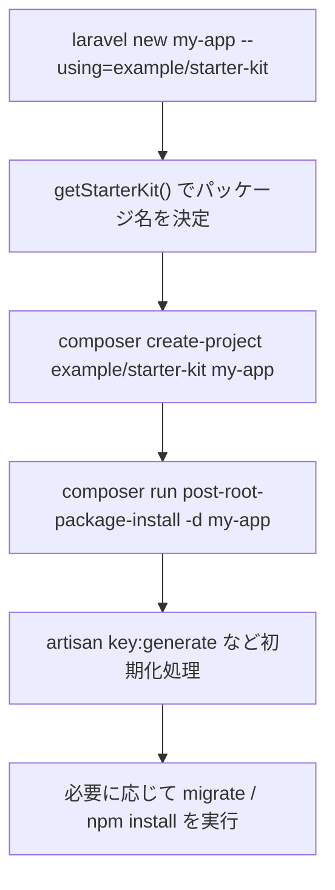

## はじめに

スターターキットは、`laravel new` でアプリを作るときに `create-project` で展開されるテンプレートプロジェクトです。Laravel 13 の公式スターターキットは React / Vue / Svelte / Livewire の4種類があり、認証や初期UIを含みます。

あなたが独自スターターキットを作るときも、やることは同じです。Laravelアプリをベースに整備して、Composerパッケージとして公開します。

- 公式ドキュメント: [Starter Kits](https://github.com/laravel/docs/blob/13.x/starter-kits.md)
- 公式実装例: [laravel/react-starter-kit](https://github.com/laravel/react-starter-kit)
- 参考ページ: [Laravel Console Starter](/jp/packages/laravel-console-starter/index)

## スターターキットの作成

### Laravelプロジェクトを初期化する

まずテンプレートになるLaravelプロジェクトを作り、不要なサンプルコードを整理します。次に `composer.json` の `name` に一意なパッケージ名を付けます。

```json
{
    "name": "example/starter-kit",
    "type": "project",
    "require": {
        "php": "^8.3",
        "laravel/framework": "^13.0"
    }
}
```

この `name` が、後で `laravel new my-app --using=example/starter-kit` で使われる識別子です。

### composer.json の scripts を設定する

`laravel new` 実行後は、スターターキット側のComposer scriptsが初期化フローに使われます。`post-root-package-install` と `post-create-project-cmd` は最低限そろえてください。

```json
"scripts": {
    "post-root-package-install": [
        "@php -r \"file_exists('.env') || copy('.env.example', '.env');\""
    ],
    "post-create-project-cmd": [
        "@php artisan key:generate --ansi",
        "@php -r \"file_exists('database/database.sqlite') || touch('database/database.sqlite');\"",
        "@php artisan migrate --graceful --ansi"
    ]
}
```

この例は [laravel/react-starter-kit の composer.json](https://github.com/laravel/react-starter-kit/blob/main/composer.json) をベースにした構成です。データベースを使うならそのまま流用できます。

### .gitattributes で配布対象を制御する

スターターキットのリポジトリには置きたいが、ユーザーの生成済みプロジェクトには含めたくないファイルを `export-ignore` で除外します。

```gitattributes
LICENSE export-ignore
composer.lock export-ignore
README.md export-ignore
```

詳細は [.gitattributes の公式例](https://github.com/laravel/react-starter-kit/blob/main/.gitattributes) を確認してください。

## Packagist への登録

ユーザーが `--using` で利用できるようにするには、Packagist登録が必要です。

<Steps>
  <Step title="GitHubで公開リポジトリを用意する">
    `composer.json` の `name` とリポジトリURLを整合させて公開します。
  </Step>
  <Step title="Packagistに登録する">
    [Packagist](https://packagist.org/) でリポジトリを登録します。公開後、`example/starter-kit` が解決可能になります。
  </Step>
  <Step title="利用コマンドをREADMEに明記する">
    ユーザー向けに次の導入コマンドを記載します。

    ```bash
    laravel new my-app --using=example/starter-kit
    ```
  </Step>
</Steps>

## laravel new コマンドのフロー

`laravel/installer` の `NewCommand` は、スターターキット指定時に `create-project` 先を切り替えて初期化コマンドを順番に実行します。



`NewCommand.php` で確認したい箇所:

- [--using オプション定義](https://github.com/laravel/installer/blob/master/src/NewCommand.php#L119-L120)
- [`create-project` と `post-root-package-install` の実行](https://github.com/laravel/installer/blob/master/src/NewCommand.php#L521-L569)
- [`getStarterKit()` の実装](https://github.com/laravel/installer/blob/master/src/NewCommand.php#L1237-L1255)

## フロントエンドフレームワークの選択

Laravel 13 の公式スターターキットは React / Vue / Svelte / Livewire を提供していますが、独自スターターキットはこの構成に合わせる必要はありません。目的に合わせて CSS や component library、認証方式を自由に決めて問題ありません。

| 選択肢 | 主な構成 | 向いているケース |
| --- | --- | --- |
| 公式 React / Vue / Svelte / Livewire | Inertia 3 や Livewire 4 を使う公式構成 | 公式に近い開発体験を提供したい |
| 独自フロントエンド | 任意のCSSやcomponent library | 既存デザインシステムや別CSS基盤を使いたい |
| シンプル Blade キット | Blade中心、最小限のフロント依存 | 軽量な構成で素早く導入したい |
| 独自認証キット | Fortifyに限定しない（例: Socialite中心） | 特定の認証方式に絞りたい |

<Info>
  コミュニティのスターターキットは、公式とは異なるCSS基盤を採用する例が一般的です。認証もFortify前提にせず、要件に合わせて設計してください。
</Info>

## バージョンアップメンテナンス

スターターキットは「作って終わり」ではありません。LaravelやPHPの更新に合わせて継続的に追従します。

### Laravel・PHPバージョンアップ対応

まず `composer.json` の要件を更新し、CIで互換性を確認します。

```json
"require": {
    "php": "^8.3",
    "laravel/framework": "^13.0"
}
```

Laravelメジャー更新時は、`laravel/framework` と周辺依存を同時に見直してください。

### 定期的な依存パッケージ更新

フロントエンド依存は変化が速いため、月次で更新タスクを回すのが安全です。

- Tailwind
- component library (shadcn/ui, shadcn-vue, shadcn-svelte, Flux UI)
- Inertia / Livewire 関連パッケージ

### 互換性テスト

少なくとも次の確認をCIに入れてください。

- `composer install` が成功する
- `php artisan test` が通る
- `npm install && npm run build` が通る

## ベストプラクティス

- **`name` は早い段階で固定する**: Packagist公開後の変更コストが高いです。
- **scripts は公式例を基準にする**: 初期化フローを崩すと導入失敗が増えます。
- **`.gitattributes` を最初に整備する**: テンプレート配布時のノイズを減らせます。
- **アップグレードを定期化する**: Laravelリリース後すぐに追従できる運用を作ってください。
- **関連ガイドを併読する**: [パッケージ開発の基礎](/jp/advanced/package-development) と [パッケージのバージョン互換性管理](/jp/advanced/package-versioning) を合わせて読むと設計が安定します。
