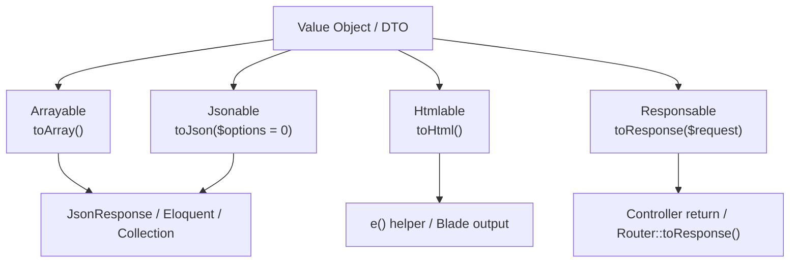

## Support Contractsとは

`Illuminate\Contracts\Support` には、Laravel全体で使われる小さく重要なインターフェースが集まっています。  
とくに `Arrayable` / `Jsonable` / `Htmlable` / `Responsable` は、Value Object・DTO・レスポンスオブジェクトをLaravelの既存フローに自然に乗せるための基本パターンです。



<Info>
  ここで扱うシグネチャは Laravel 13.x の公式ソース（`laravel/framework`）を参照しています。
</Info>

## 1) Arrayable

### インターフェース定義

```php
interface Arrayable
{
    public function toArray();
}
```

### 実装例

```php
use Illuminate\Contracts\Support\Arrayable;

final class Money implements Arrayable
{
    public function __construct(
        public readonly int $amount,
        public readonly string $currency,
    ) {}

    public function toArray(): array
    {
        return [
            'amount' => $this->amount,
            'currency' => $this->currency,
        ];
    }
}
```

### Laravelコアでの使用例

- `Illuminate\Database\Eloquent\Model` は `Arrayable` を実装し、`toArray()` を提供
- `Illuminate\Http\JsonResponse::setData()` は `Arrayable` を検出すると `json_encode($data->toArray(), ...)` でシリアライズ

### パッケージ開発での活用ポイント

- DTOやValue Objectをコントローラー・リソース・ログ出力で共通フォーマット化できる
- `array` への変換責務をオブジェクト側に閉じ込められる

## 2) Jsonable

### インターフェース定義

```php
interface Jsonable
{
    public function toJson($options = 0);
}
```

### 実装例

```php
use Illuminate\Contracts\Support\Jsonable;

final class ApiPayload implements Jsonable
{
    public function __construct(
        private array $data,
    ) {}

    public function toJson($options = 0): string
    {
        return json_encode([
            'data' => $this->data,
            'generated_at' => now()->toIso8601String(),
        ], $options | JSON_THROW_ON_ERROR);
    }
}
```

### Laravelコアでの使用例

- `Model` は `Jsonable` も実装し、`toJson($options = 0)` を提供
- `JsonResponse::setData()` は `Jsonable` を最優先で判定して `toJson()` を使う

### パッケージ開発での活用ポイント

- 監査ログ・Webhook送信などでJSON構造を厳密に固定できる
- `json_encode()` 側に任せず、ドメイン都合のJSON表現を明示できる

## 3) Htmlable

### インターフェース定義

```php
interface Htmlable
{
    public function toHtml();
}
```

### 実装例

```php
use Illuminate\Contracts\Support\Htmlable;

final class BadgeHtml implements Htmlable
{
    public function __construct(
        private string $label,
    ) {}

    public function toHtml(): string
    {
        $escaped = e($this->label);

        return "<span class=\"badge\">{$escaped}</span>";
    }
}
```

### Laravelコアでの使用例

- `Illuminate\Support\HtmlString` は `Htmlable` を実装
- `e()` ヘルパーは引数が `Htmlable` の場合 `toHtml()` を返す（再エスケープしない）

### パッケージ開発での活用ポイント

- Blade内で安全にHTML断片を渡す責務境界を明確にできる
- `{!! $obj !!}` を使う場面でも、出力をオブジェクトで管理しやすい

<Tip>
  `Htmlable` を実装するクラス内では、ユーザー入力をそのまま連結せず、必要な値は `e()` でエスケープしてから埋め込んでください。
</Tip>

## 4) Responsable

### インターフェース定義

```php
interface Responsable
{
    public function toResponse($request);
}
```

### 実装例

```php
use Illuminate\Contracts\Support\Responsable;

final class ExportCsvResponse implements Responsable
{
    public function __construct(
        private array $rows,
        private string $filename = 'export.csv',
    ) {}

    /**
     * @param \Illuminate\Http\Request $request
     */
    public function toResponse($request)
    {
        return response()->streamDownload(function () {
            $stream = fopen('php://output', 'w');

            foreach ($this->rows as $row) {
                fputcsv($stream, $row);
            }

            fclose($stream);
        }, $this->filename, [
            'Content-Type' => 'text/csv',
        ]);
    }
}
```

### Laravelコアでの使用例

- `Illuminate\Routing\Router::toResponse()` は最初に `Responsable` を判定し、`$response->toResponse($request)` を呼び出す
- `Illuminate\Http\Resources\Json\JsonResource` は `Responsable` を実装しており、コントローラーから直接 `return UserResource::make($user);` が可能

### パッケージ開発での活用ポイント

- コントローラーで配列組み立てをせず、レスポンス生成をオブジェクトへ移譲できる
- 「DTOをそのままreturn」する設計にしやすく、HTTP表現とドメイン表現を分離しやすい

## 実装の使い分けガイド

<Steps>
  <Step title="データを配列化して再利用したい">
    `Arrayable` を実装し、`toArray()` に正規化ロジックを集約します。
  </Step>
  <Step title="JSON表現を制御したい">
    `Jsonable` を実装し、`toJson($options)` で出力形式を明示します。
  </Step>
  <Step title="HTML断片として扱いたい">
    `Htmlable` を実装し、`toHtml()` でレンダリング文字列を返します。
  </Step>
  <Step title="HTTPレスポンスを直接返したい">
    `Responsable` を実装し、`toResponse($request)` へ責務を集約します。
  </Step>
</Steps>

## 次に読むページ

<Columns cols={2}>
  <Card title="Macroableトレイト" icon="puzzle-piece" href="/jp/advanced/macroable">
    既存クラスに独自メソッドを追加する拡張パターンを学びます。
  </Card>
  <Card title="Conditionableトレイト" icon="git-branch" href="/jp/advanced/conditionable">
    `when()` / `unless()` で条件分岐を組み込む設計を学びます。
  </Card>
  <Card title="tap() ヘルパー / Tappable" icon="hand-point-up" href="/jp/advanced/tap">
    副作用を挟みつつ値を返すチェーン設計を学びます。
  </Card>
  <Card title="Dumpableトレイト" icon="bug" href="/jp/advanced/dumpable">
    `dump()` / `dd()` をオブジェクトへ組み込むデバッグ手法を学びます。
  </Card>
</Columns>
