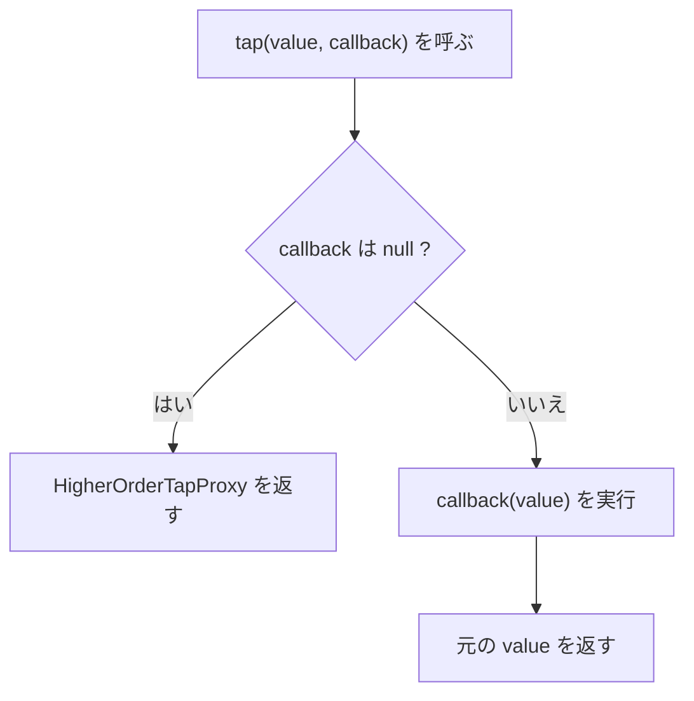

## tap() とは

`tap()` は「値を使いながら、その値をそのまま返す」ためのヘルパーです。副作用を挟みたいときに使います。

`Illuminate\Support\helpers.php` の実装はシンプルです。

```php
function tap($value, $callback = null)
{
    if (is_null($callback)) {
        return new HigherOrderTapProxy($value);
    }

    $callback($value);

    return $value;
}
```



<Info>
  `tap()` はコールバックの戻り値を無視します。戻り値は常に元の値です。
</Info>

## 基本的な使い方

もっとも基本的な使い方は、値を受け取って処理したあと、そのまま返す形です。

```php
use App\Models\User;

$user = tap(User::query()->latest()->firstOrFail(), function (User $model) {
    $model->update(['last_seen_at' => now()]);
});

// update() の戻り値に関係なく $user が返る
```

コールバックを省略すると `HigherOrderTapProxy` が返るので、メソッド呼び出しをそのままつなげられます。

```php
$updatedUser = tap($user)->update([
    'name' => $name,
    'email' => $email,
]);

// update() の戻り値ではなく元の User インスタンスが返る
```

## よくある使い所

### デバッグ出力を挟む

```php
$result = tap($query->get(), function ($users) {
    logger()->debug('Fetched users', ['count' => $users->count()]);
});
```

### チェーン中にログやイベント送信を挿入する

```php
$order = tap(Order::create($payload), function (Order $order) {
    event(new OrderCreated($order));
    logger()->info('Order created', ['id' => $order->id]);
});
```

### 返り値を変えずに副作用だけ実行する

```php
$response = tap($service->handle($request), function ($response) {
    \Illuminate\Support\Facades\Cache::increment('service_handle_success_total');
});
```

<Tip>
  返り値を加工したいなら `with()` や通常の変数代入を使います。`tap()` は副作用に限定すると読みやすくなります。
</Tip>

## Tappable トレイトとは

`Illuminate\Support\Traits\Tappable` を `use` すると、クラスに `tap()` メソッドを追加できます。

```php
trait Tappable
{
    public function tap($callback = null)
    {
        return tap($this, $callback);
    }
}
```

つまりインスタンスメソッド版の `tap()` を提供するだけです。

```php
use Illuminate\Support\Traits\Tappable;

class ReportBuilder
{
    use Tappable;
}

$builder = new ReportBuilder();

$builder = $builder->tap(function (ReportBuilder $instance) {
    logger()->debug('builder initialized');
});
```

## パッケージ開発での活用

`Tappable` は Fluent API の途中で副作用を差し込みたいときに便利です。`Macroable` と `Conditionable` を組み合わせると、Laravelらしい拡張可能なビルダーを作れます。

<Steps>
  <Step title="フルーエントなクラスを作る">
    ```php
    use Illuminate\Support\Traits\Conditionable;
    use Illuminate\Support\Traits\Macroable;
    use Illuminate\Support\Traits\Tappable;

    class QueryPresetBuilder
    {
        use Macroable;
        use Conditionable;
        use Tappable;

        protected array $filters = [];

        public function where(string $key, mixed $value): static
        {
            $this->filters[$key] = $value;

            return $this;
        }

        public function toArray(): array
        {
            return $this->filters;
        }
    }
    ```
  </Step>
  <Step title="Macroable・Conditionable・Tappable を組み合わせて使う">
    ```php
    QueryPresetBuilder::macro('forActiveUsers', function () {
        /** @var QueryPresetBuilder $this */
        return $this->where('active', true);
    });

    $filters = (new QueryPresetBuilder)
        ->forActiveUsers()
        ->when($request->filled('role'), fn ($builder) => $builder->where('role', $request->role))
        ->tap(fn ($builder) => logger()->debug('current filters', $builder->toArray()))
        ->toArray();
    ```
  </Step>
</Steps>

関連ページ:

- [Macroableトレイト](/jp/advanced/macroable)
- [Conditionableトレイト](/jp/advanced/conditionable)

## Laravelコア内での使用例

Laravel本体でも `tap()` / `Tappable` は実際に使われています。

- `Illuminate\Routing\Router` は `Macroable` と `Tappable` を併用しています
- `Router::respondWithRoute()` ではコールバックなしの `tap($route)->bind(...)` を使い、`bind()` 実行後も元の `$route` を返しています
- `Router::prepareResponse()` ではレスポンス変換後に `tap(..., fn (...) => event(...))` でイベントを発火しています
- `Illuminate\Testing\Fluent\Concerns\Has` では `->tap(...)->first(...)->etc()` というチェーンでアサーション補助を実装しています

```php
// Illuminate\Routing\Router より
$route = tap($this->routes->getByName($name))->bind($this->currentRequest);

return tap(static::toResponse($request, $response), function ($response) use ($request) {
    $this->events->dispatch(new ResponsePrepared($request, $response));
});
```

<Info>
  `tap()` は単体だと小さなヘルパーですが、`Macroable`・`Conditionable` と合わせると Laravel でよく見る読みやすいメソッドチェーンを作りやすくなります。
</Info>

## 次のステップ

<Columns cols={2}>
  <Card title="Macroableトレイト" icon="puzzle-piece" href="/jp/advanced/macroable">
    既存クラスに独自メソッドを追加する設計を学びます。
  </Card>
  <Card title="Conditionableトレイト" icon="git-branch" href="/jp/advanced/conditionable">
    `when()` / `unless()` による条件分岐チェーンを学びます。
  </Card>
</Columns>
