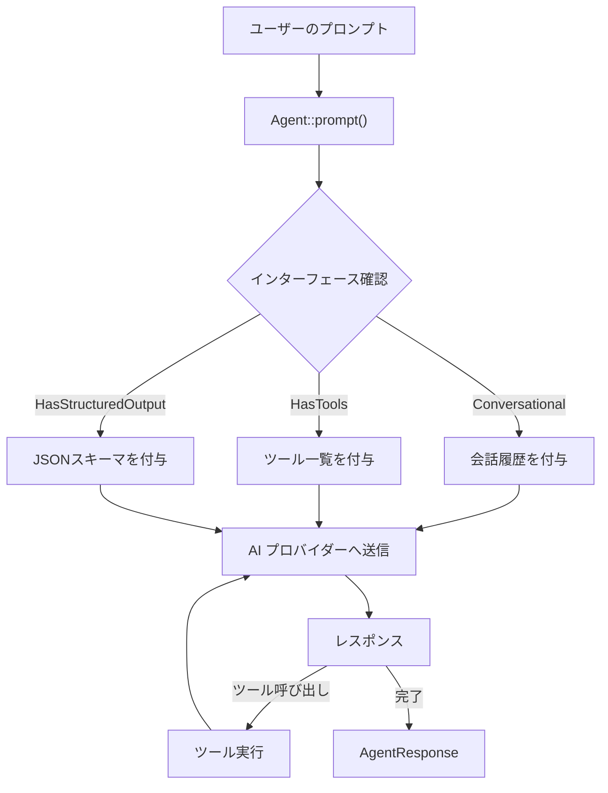

## はじめに

[Laravel AI SDK](https://github.com/laravel/ai) は、OpenAI・Anthropic・Gemini などの AI プロバイダーと対話するための統一された表現力豊かな API を提供します。AI SDK を使うと、ツールや構造化出力を備えたインテリジェントなエージェントの構築、画像生成、音声合成・文字起こし、ベクター埋め込みの作成など、多彩な AI 機能を一貫した Laravel らしいインターフェースで実現できます。

<Info>
  Laravel AI SDK は Laravel 13 で追加された公式パッケージです。`laravel/ai` として提供されており、複数の AI プロバイダーを統一 API で扱えます。
</Info>

## プロバイダーサポート一覧

| 機能 | 対応プロバイダー |
|---|---|
| テキスト生成 | OpenAI, Anthropic, Gemini, Azure, Groq, xAI, DeepSeek, Mistral, Ollama |
| 画像生成 | OpenAI, Gemini, xAI |
| 音声合成（TTS） | OpenAI, ElevenLabs |
| 音声認識（STT） | OpenAI, ElevenLabs, Mistral |
| 埋め込み | OpenAI, Gemini, Azure, Cohere, Mistral, Jina, VoyageAI |
| リランキング | Cohere, Jina |
| ファイル | OpenAI, Anthropic, Gemini |

## インストール

<Steps>
  <Step title="パッケージのインストール">
    Composer で Laravel AI SDK をインストールします。

    ```shell
    composer require laravel/ai
    ```
  </Step>
  <Step title="設定ファイルとマイグレーションの公開">
    `vendor:publish` Artisan コマンドで設定ファイルとマイグレーションを公開します。

    ```shell
    php artisan vendor:publish --provider="Laravel\Ai\AiServiceProvider"
    ```
  </Step>
  <Step title="マイグレーションの実行">
    データベースマイグレーションを実行します。`agent_conversations` と `agent_conversation_messages` テーブルが作成され、会話履歴の保存に使われます。

    ```shell
    php artisan migrate
    ```
  </Step>
</Steps>

## 設定

### 環境変数

使用する AI プロバイダーの API キーを `.env` ファイルに設定します。

```ini
ANTHROPIC_API_KEY=
AZURE_OPENAI_API_KEY=
COHERE_API_KEY=
DEEPSEEK_API_KEY=
ELEVENLABS_API_KEY=
GEMINI_API_KEY=
GROQ_API_KEY=
MISTRAL_API_KEY=
OLLAMA_API_KEY=
OPENAI_API_KEY=
OPENROUTER_API_KEY=
JINA_API_KEY=
VOYAGEAI_API_KEY=
XAI_API_KEY=
```

テキスト・画像・音声・文字起こし・埋め込みに使うデフォルトモデルは `config/ai.php` でも設定できます。

### カスタムベース URL

プロキシサービスを経由させる場合は、プロバイダーごとにカスタム URL を設定できます。

```php
'providers' => [
    'openai' => [
        'driver' => 'openai',
        'key' => env('OPENAI_API_KEY'),
        'url' => env('OPENAI_BASE_URL'),
    ],
    'anthropic' => [
        'driver' => 'anthropic',
        'key' => env('ANTHROPIC_API_KEY'),
        'url' => env('ANTHROPIC_BASE_URL'),
    ],
],
```

カスタムベース URL は OpenAI・Anthropic・Gemini・Groq・Cohere・DeepSeek・xAI・OpenRouter で利用できます。

### Lab enum

コード内でプロバイダーを参照するには `Lab` enum を使います。

```php
use Laravel\Ai\Enums\Lab;

Lab::Anthropic;
Lab::OpenAI;
Lab::Gemini;
```

---

## エージェント

エージェントは Laravel AI SDK の基本的な構成要素です。`make:agent` コマンドでエージェントクラスを生成できます。

```shell
php artisan make:agent SalesCoach

# 構造化出力付きエージェントの生成
php artisan make:agent SalesCoach --structured
```

生成されたエージェントは `app/Ai/Agents/` ディレクトリに配置されます。以下は主要なインターフェースをすべて実装したエージェントの例です。

```php
<?php

namespace App\Ai\Agents;

use App\Ai\Tools\RetrievePreviousTranscripts;
use App\Models\History;
use App\Models\User;
use Illuminate\Contracts\JsonSchema\JsonSchema;
use Laravel\Ai\Contracts\Agent;
use Laravel\Ai\Contracts\Conversational;
use Laravel\Ai\Contracts\HasStructuredOutput;
use Laravel\Ai\Contracts\HasTools;
use Laravel\Ai\Messages\Message;
use Laravel\Ai\Promptable;
use Stringable;

class SalesCoach implements Agent, Conversational, HasTools, HasStructuredOutput
{
    use Promptable;

    public function __construct(public User $user) {}

    public function instructions(): Stringable|string
    {
        return 'You are a sales coach, analyzing transcripts and providing feedback and an overall sales strength score.';
    }

    public function messages(): iterable
    {
        return History::where('user_id', $this->user->id)
            ->latest()
            ->limit(50)
            ->get()
            ->reverse()
            ->map(function ($message) {
                return new Message($message->role, $message->content);
            })->all();
    }

    public function tools(): iterable
    {
        return [new RetrievePreviousTranscripts];
    }

    public function schema(JsonSchema $schema): array
    {
        return [
            'feedback' => $schema->string()->required(),
            'score' => $schema->integer()->min(1)->max(10)->required(),
        ];
    }
}
```



### プロンプト

`prompt()` メソッドでエージェントにメッセージを送ります。

```php
$response = (new SalesCoach)->prompt('Analyze this sales transcript...');
return (string) $response;
```

`make()` 静的メソッドを使うと、コンテナから依存関係を解決してインスタンスを生成できます。

```php
$agent = SalesCoach::make(user: $user);
```

プロバイダー・モデル・タイムアウトは `prompt()` の引数で上書きできます。

```php
$response = (new SalesCoach)->prompt(
    'Analyze this sales transcript...',
    provider: Lab::Anthropic,
    model: 'claude-haiku-4-5-20251001',
    timeout: 120,
);
```

### 会話コンテキスト

`Conversational` インターフェースを実装して `messages()` メソッドを定義すると、過去の会話履歴を AI に渡せます。

`RemembersConversations` トレイトを使うと、会話履歴をデータベースに自動保存・取得できます。

```php
use Laravel\Ai\Concerns\RemembersConversations;

class SalesCoach implements Agent, Conversational
{
    use Promptable, RemembersConversations;

    public function instructions(): string
    {
        return 'You are a sales coach...';
    }
}
```

`forUser()` で会話を開始し、返ってきた `conversationId` を使って `continue()` で続きの会話ができます。

```php
$response = (new SalesCoach)->forUser($user)->prompt('Hello!');
$conversationId = $response->conversationId;

$response = (new SalesCoach)->continue($conversationId, as: $user)->prompt('Tell me more about that.');
```

### 構造化出力

`HasStructuredOutput` インターフェースを実装し、`schema()` メソッドで JSON スキーマを定義すると、AI のレスポンスを構造化されたデータとして受け取れます。

```php
public function schema(JsonSchema $schema): array
{
    return ['score' => $schema->integer()->required()];
}

$response = (new SalesCoach)->prompt('Analyze this...');
return $response['score'];
```

#### ネストされたオブジェクト

```php
public function schema(JsonSchema $schema): array
{
    return [
        'score' => $schema->integer()->required(),
        'metadata' => $schema->object(fn ($schema) => [
            'confidence' => $schema->string()->enum(['low', 'medium', 'high'])->required(),
            'language' => $schema->string()->required(),
        ])->required(),
    ];
}
```

#### オブジェクトの配列

```php
public function schema(JsonSchema $schema): array
{
    return [
        'feedback' => $schema->array()->items(
            $schema->object(fn ($schema) => [
                'comment' => $schema->string()->required(),
                'score' => $schema->integer()->required(),
            ])
        )->required(),
    ];
}
```

### 添付ファイル

`attachments` 引数でドキュメントや画像をエージェントに渡せます。

```php
use Laravel\Ai\Files;

$response = (new SalesCoach)->prompt(
    'Analyze the attached sales transcript...',
    attachments: [
        Files\Document::fromStorage('transcript.pdf'),
        Files\Document::fromPath('/home/laravel/transcript.md'),
        $request->file('transcript'),
    ]
);
```

画像の添付も同様に行えます。

```php
$response = (new ImageAnalyzer)->prompt('What is in this image?', attachments: [
    Files\Image::fromStorage('photo.jpg'),
    Files\Image::fromPath('/home/laravel/photo.jpg'),
    $request->file('photo'),
]);
```

### ストリーミング

`stream()` メソッドを使うと、レスポンスをチャンク単位で返せます。長いレスポンスをリアルタイムにフロントエンドへ送るのに適しています。

```php
Route::get('/coach', function () {
    return (new SalesCoach)->stream('Analyze this sales transcript...');
});
```

`then()` コールバックで、ストリーミング完了後の処理を記述できます。

```php
use Laravel\Ai\Responses\StreamedAgentResponse;

Route::get('/coach', function () {
    return (new SalesCoach)
        ->stream('Analyze this sales transcript...')
        ->then(function (StreamedAgentResponse $response) {
            // $response->text, $response->events, $response->usage...
        });
});
```

ストリームを手動でイテレートすることもできます。

```php
$stream = (new SalesCoach)->stream('Analyze this sales transcript...');

foreach ($stream as $event) {
    // ...
}
```

#### Vercel AI SDK プロトコル

フロントエンドで Vercel AI SDK を使う場合は `usingVercelDataProtocol()` を呼びます。

```php
Route::get('/coach', function () {
    return (new SalesCoach)->stream('Analyze...')->usingVercelDataProtocol();
});
```

### ブロードキャスト

ストリームのイベントを Laravel Echo などのブロードキャストチャンネルに送信できます。

```php
use Illuminate\Broadcasting\Channel;

$stream = (new SalesCoach)->stream('Analyze this sales transcript...');

foreach ($stream as $event) {
    $event->broadcast(new Channel('channel-name'));
}
```

`broadcastOnQueue()` を使うと、キューを経由してブロードキャストできます。

```php
(new SalesCoach)->broadcastOnQueue(
    'Analyze this sales transcript...',
    new Channel('channel-name'),
);
```

### キュー

`queue()` メソッドでプロンプトをキューに積んで非同期処理できます。

```php
use Laravel\Ai\Responses\AgentResponse;

Route::post('/coach', function (Request $request) {
    (new SalesCoach)
        ->queue($request->input('transcript'))
        ->then(function (AgentResponse $response) { /* ... */ })
        ->catch(function (Throwable $e) { /* ... */ });

    return back();
});
```

### ツール

ツールを使うと、AI がコード内の関数を呼び出せるようになります。`make:tool` コマンドでツールクラスを生成できます。

```shell
php artisan make:tool RandomNumberGenerator
```

```php
<?php

namespace App\Ai\Tools;

use Illuminate\Contracts\JsonSchema\JsonSchema;
use Laravel\Ai\Contracts\Tool;
use Laravel\Ai\Tools\Request;
use Stringable;

class RandomNumberGenerator implements Tool
{
    public function description(): Stringable|string
    {
        return 'This tool may be used to generate cryptographically secure random numbers.';
    }

    public function handle(Request $request): Stringable|string
    {
        return (string) random_int($request['min'], $request['max']);
    }

    public function schema(JsonSchema $schema): array
    {
        return [
            'min' => $schema->integer()->min(0)->required(),
            'max' => $schema->integer()->required(),
        ];
    }
}
```

エージェントの `tools()` メソッドでツールを登録します。

```php
public function tools(): iterable
{
    return [new RandomNumberGenerator];
}
```

#### 類似検索ツール

ベクター埋め込みを使った類似検索ツールを簡単に追加できます。

```php
use App\Models\Document;
use Laravel\Ai\Tools\SimilaritySearch;

public function tools(): iterable
{
    return [
        SimilaritySearch::usingModel(Document::class, 'embedding'),
    ];
}
```

オプションを指定することもできます。

```php
SimilaritySearch::usingModel(
    model: Document::class,
    column: 'embedding',
    minSimilarity: 0.7,
    limit: 10,
    query: fn ($query) => $query->where('published', true),
),
```

クロージャで独自の検索ロジックを定義することもできます。

```php
new SimilaritySearch(using: function (string $query) {
    return Document::query()
        ->where('user_id', $this->user->id)
        ->whereVectorSimilarTo('embedding', $query)
        ->limit(10)
        ->get();
}),
```

`withDescription()` でツールの説明をカスタマイズできます。

```php
SimilaritySearch::usingModel(Document::class, 'embedding')
    ->withDescription('Search the knowledge base for relevant articles.'),
```

### プロバイダーツール

AI プロバイダーがネイティブで実装している特別なツールです。

#### Web 検索

ウェブ検索をエージェントに追加します。Anthropic・OpenAI・Gemini に対応しています。

```php
use Laravel\Ai\Providers\Tools\WebSearch;

public function tools(): iterable
{
    return [new WebSearch];
}
```

オプションで検索件数やドメインの絞り込み、位置情報の指定ができます。

```php
(new WebSearch)->max(5)->allow(['laravel.com', 'php.net']),
(new WebSearch)->location(city: 'New York', region: 'NY', country: 'US');
```

#### Web フェッチ

指定した URL のコンテンツを取得するツールです。Anthropic・Gemini に対応しています。

```php
use Laravel\Ai\Providers\Tools\WebFetch;

public function tools(): iterable
{
    return [new WebFetch];
}

(new WebFetch)->max(3)->allow(['docs.laravel.com']),
```

#### ファイル検索

ベクターストアからドキュメントを検索するツールです。OpenAI・Gemini に対応しています。

```php
use Laravel\Ai\Providers\Tools\FileSearch;

public function tools(): iterable
{
    return [new FileSearch(stores: ['store_id'])];
}

// 複数のストアを指定
new FileSearch(stores: ['store_1', 'store_2']);

// メタデータでフィルタリング
new FileSearch(stores: ['store_id'], where: ['author' => 'Taylor Otwell', 'year' => 2026]);
```

`FileSearchQuery` を使った複雑なフィルターも指定できます。

```php
use Laravel\Ai\Providers\Tools\FileSearchQuery;

new FileSearch(stores: ['store_id'], where: fn (FileSearchQuery $query) =>
    $query->where('author', 'Taylor Otwell')
          ->whereNot('status', 'draft')
          ->whereIn('category', ['news', 'updates'])
);
```

### ミドルウェア

エージェントにミドルウェアを追加して、プロンプトやレスポンスをインターセプトできます。

```shell
php artisan make:agent-middleware LogPrompts
```

エージェントに `HasMiddleware` インターフェースを実装し、`middleware()` メソッドでミドルウェアを登録します。

```php
<?php

namespace App\Ai\Agents;

use App\Ai\Middleware\LogPrompts;
use Laravel\Ai\Contracts\Agent;
use Laravel\Ai\Contracts\HasMiddleware;
use Laravel\Ai\Promptable;

class SalesCoach implements Agent, HasMiddleware
{
    use Promptable;

    public function middleware(): array
    {
        return [new LogPrompts];
    }
}
```

ミドルウェアクラスの実装例です。

```php
<?php

namespace App\Ai\Middleware;

use Closure;
use Laravel\Ai\Prompts\AgentPrompt;

class LogPrompts
{
    public function handle(AgentPrompt $prompt, Closure $next)
    {
        Log::info('Prompting agent', ['prompt' => $prompt->prompt]);
        return $next($prompt);
    }
}
```

`then()` を使うと、レスポンス後の処理も追加できます。

```php
public function handle(AgentPrompt $prompt, Closure $next)
{
    return $next($prompt)->then(function (AgentResponse $response) {
        Log::info('Agent responded', ['text' => $response->text]);
    });
}
```

### 匿名エージェント

クラスを定義せずに `agent()` ヘルパーで匿名エージェントを使えます。

```php
use function Laravel\Ai\{agent};

$response = agent(
    instructions: 'You are an expert at software development.',
    messages: [],
    tools: [],
)->prompt('Tell me about Laravel');
```

構造化出力付きの匿名エージェントも作成できます。

```php
use Illuminate\Contracts\JsonSchema\JsonSchema;

$response = agent(
    schema: fn (JsonSchema $schema) => ['number' => $schema->integer()->required()],
)->prompt('Generate a random number less than 100');
```

### エージェント設定（PHP Attributes）

PHP Attribute を使ってエージェントのデフォルト設定を宣言的に記述できます。

| Attribute | 説明 |
|---|---|
| `#[Provider]` | 使用するプロバイダーを指定 |
| `#[Model]` | 使用するモデルを指定 |
| `#[MaxSteps]` | ツール呼び出しの最大ステップ数 |
| `#[MaxTokens]` | 最大トークン数 |
| `#[Temperature]` | 温度パラメーター |
| `#[Timeout]` | タイムアウト（秒） |
| `#[UseCheapestModel]` | 最安値モデルを自動選択 |
| `#[UseSmartestModel]` | 最高性能モデルを自動選択 |

```php
<?php

namespace App\Ai\Agents;

use Laravel\Ai\Attributes\MaxSteps;
use Laravel\Ai\Attributes\MaxTokens;
use Laravel\Ai\Attributes\Model;
use Laravel\Ai\Attributes\Provider;
use Laravel\Ai\Attributes\Temperature;
use Laravel\Ai\Attributes\Timeout;
use Laravel\Ai\Contracts\Agent;
use Laravel\Ai\Enums\Lab;
use Laravel\Ai\Promptable;

#[Provider(Lab::Anthropic)]
#[Model('claude-haiku-4-5-20251001')]
#[MaxSteps(10)]
#[MaxTokens(4096)]
#[Temperature(0.7)]
#[Timeout(120)]
class SalesCoach implements Agent
{
    use Promptable;
}
```

モデル選択のショートカット Attribute も用意されています。

```php
// 最も安価なモデルを使う
#[UseCheapestModel]
class SimpleSummarizer implements Agent
{
    use Promptable;
}

// 最も高性能なモデルを使う
#[UseSmartestModel]
class ComplexReasoner implements Agent
{
    use Promptable;
}
```

### プロバイダーオプション

`HasProviderOptions` インターフェースを実装すると、プロバイダー固有のオプションを渡せます。

```php
<?php

namespace App\Ai\Agents;

use Laravel\Ai\Contracts\Agent;
use Laravel\Ai\Contracts\HasProviderOptions;
use Laravel\Ai\Enums\Lab;
use Laravel\Ai\Promptable;

class SalesCoach implements Agent, HasProviderOptions
{
    use Promptable;

    public function providerOptions(Lab|string $provider): array
    {
        return match ($provider) {
            Lab::OpenAI => [
                'reasoning' => ['effort' => 'low'],
                'frequency_penalty' => 0.5,
                'presence_penalty' => 0.3,
            ],
            Lab::Anthropic => [
                'thinking' => ['budget_tokens' => 1024],
            ],
            default => [],
        };
    }
}
```

---

## 画像生成

`Image` クラスで画像を生成できます。OpenAI・Gemini・xAI プロバイダーが対応しています。

```php
use Laravel\Ai\Image;

$image = Image::of('A donut sitting on the kitchen counter')->generate();
$rawContent = (string) $image;
```

品質やアスペクト比・タイムアウトを指定できます。

```php
$image = Image::of('A donut sitting on the kitchen counter')
    ->quality('high')
    ->landscape()
    ->timeout(120)
    ->generate();
```

参照画像を添付して加工することもできます。

```php
use Laravel\Ai\Files;

$image = Image::of('Update this photo to be in the style of an impressionist painting.')
    ->attachments([Files\Image::fromStorage('photo.jpg')])
    ->landscape()
    ->generate();
```

### 画像の保存

```php
$path = $image->store();
$path = $image->storeAs('image.jpg');
$path = $image->storePublicly();
$path = $image->storePubliclyAs('image.jpg');
```

### キューで画像生成

```php
use Laravel\Ai\Responses\ImageResponse;

Image::of('A donut sitting on the kitchen counter')
    ->portrait()
    ->queue()
    ->then(function (ImageResponse $image) {
        $path = $image->store();
    });
```

---

## 音声合成（TTS）

`Audio` クラスでテキストを音声に変換できます。OpenAI・ElevenLabs プロバイダーが対応しています。

```php
use Laravel\Ai\Audio;

$audio = Audio::of('I love coding with Laravel.')->generate();
$rawContent = (string) $audio;
```

声の性別や具体的なボイス ID、話し方の指示も指定できます。

```php
$audio = Audio::of('I love coding with Laravel.')->female()->generate();
$audio = Audio::of('I love coding with Laravel.')->voice('voice-id-or-name')->generate();
$audio = Audio::of('I love coding with Laravel.')->female()->instructions('Said like a pirate')->generate();
```

### 音声の保存

```php
$path = $audio->store();
$path = $audio->storeAs('audio.mp3');
$path = $audio->storePublicly();
$path = $audio->storePubliclyAs('audio.mp3');
```

### キューで音声生成

```php
use Laravel\Ai\Responses\AudioResponse;

Audio::of('I love coding with Laravel.')
    ->queue()
    ->then(function (AudioResponse $audio) {
        $path = $audio->store();
    });
```

---

## 文字起こし（STT）

`Transcription` クラスで音声ファイルをテキストに変換できます。OpenAI・ElevenLabs・Mistral プロバイダーが対応しています。

```php
use Laravel\Ai\Transcription;

$transcript = Transcription::fromPath('/home/laravel/audio.mp3')->generate();
$transcript = Transcription::fromStorage('audio.mp3')->generate();
$transcript = Transcription::fromUpload($request->file('audio'))->generate();

return (string) $transcript;
```

### 話者分離（ダイアリゼーション）

`diarize()` を使うと、話者ごとに分離した文字起こしが得られます。

```php
$transcript = Transcription::fromStorage('audio.mp3')->diarize()->generate();
```

### キューで文字起こし

```php
use Laravel\Ai\Responses\TranscriptionResponse;

Transcription::fromStorage('audio.mp3')
    ->queue()
    ->then(function (TranscriptionResponse $transcript) { /* ... */ });
```

---

## 埋め込み（Embeddings）

テキストをベクター表現に変換して、類似検索などに活用できます。

```php
use Illuminate\Support\Str;

// Stringable を使う方法
$embeddings = Str::of('Napa Valley has great wine.')->toEmbeddings();
```

```php
use Laravel\Ai\Embeddings;

// 複数のテキストを一度に処理
$response = Embeddings::for(['Napa Valley has great wine.', 'Laravel is a PHP framework.'])->generate();
$response->embeddings; // [[0.123, 0.456, ...], [0.789, 0.012, ...]]
```

プロバイダー・モデル・次元数を指定することもできます。

```php
$response = Embeddings::for(['Napa Valley has great wine.'])
    ->dimensions(1536)
    ->generate(Lab::OpenAI, 'text-embedding-3-small');
```

### ベクター検索（pgvector）

PostgreSQL と pgvector 拡張を使ったベクター検索の設定例です。

<Steps>
  <Step title="マイグレーションの作成">
    ```php
    Schema::ensureVectorExtensionExists();

    Schema::create('documents', function (Blueprint $table) {
        $table->id();
        $table->string('title');
        $table->text('content');
        $table->vector('embedding', dimensions: 1536);
        $table->timestamps();
    });

    // HNSW インデックスを追加
    $table->vector('embedding', dimensions: 1536)->index();
    ```
  </Step>
  <Step title="モデルの設定">
    ```php
    protected function casts(): array
    {
        return ['embedding' => 'array'];
    }
    ```
  </Step>
  <Step title="類似検索クエリ">
    ```php
    // 埋め込みベクターで検索
    $documents = Document::query()
        ->whereVectorSimilarTo('embedding', $queryEmbedding, minSimilarity: 0.4)
        ->limit(10)
        ->get();

    // 文字列を渡すと自動で埋め込みを生成
    $documents = Document::query()
        ->whereVectorSimilarTo('embedding', 'best wineries in Napa Valley')
        ->limit(10)
        ->get();
    ```
  </Step>
</Steps>

低レベルのメソッドも利用できます。

```php
$documents = Document::query()
    ->select('*')
    ->selectVectorDistance('embedding', $queryEmbedding, as: 'distance')
    ->whereVectorDistanceLessThan('embedding', $queryEmbedding, maxDistance: 0.3)
    ->orderByVectorDistance('embedding', $queryEmbedding)
    ->limit(10)
    ->get();
```

### 埋め込みのキャッシュ

同じテキストの埋め込み生成を繰り返さないようにキャッシュできます。

`config/ai.php` でデフォルトのキャッシュ設定を行います。

```php
'caching' => [
    'embeddings' => [
        'cache' => true,
        'store' => env('CACHE_STORE', 'database'),
    ],
],
```

リクエストごとにキャッシュを制御することもできます。

```php
$response = Embeddings::for(['Napa Valley has great wine.'])->cache()->generate();
$response = Embeddings::for(['Napa Valley has great wine.'])->cache(seconds: 3600)->generate();

// Stringable でも同様
$embeddings = Str::of('Napa Valley has great wine.')->toEmbeddings(cache: true);
$embeddings = Str::of('Napa Valley has great wine.')->toEmbeddings(cache: 3600);
```

---

## リランキング

検索結果をクエリへの関連度でリランク（並び替え）できます。Cohere・Jina プロバイダーが対応しています。

```php
use Laravel\Ai\Reranking;

$response = Reranking::of([
    'Django is a Python web framework.',
    'Laravel is a PHP web application framework.',
    'React is a JavaScript library for building user interfaces.',
])->rerank('PHP frameworks');

$response->first()->document; // "Laravel is a PHP web application framework."
$response->first()->score;    // 0.95
$response->first()->index;    // 1
```

`limit()` で返す件数を絞り込めます。

```php
$response = Reranking::of($documents)->limit(5)->rerank('search query');
```

### コレクションのリランキング

Eloquent コレクションを直接リランクできます。

```php
// 単一フィールド
$posts = Post::all()->rerank('body', 'Laravel tutorials');

// 複数フィールド（JSON として送信）
$reranked = $posts->rerank(['title', 'body'], 'Laravel tutorials');

// クロージャで独自のテキスト生成
$reranked = $posts->rerank(fn ($post) => $post->title.': '.$post->body, 'Laravel tutorials');

// オプション付き
$reranked = $posts->rerank(
    by: 'content',
    query: 'Laravel tutorials',
    limit: 10,
    provider: Lab::Cohere,
);
```

---

## ファイル管理

AI プロバイダーにファイルをアップロードして、後から参照できます。

```php
use Laravel\Ai\Files\Document;
use Laravel\Ai\Files\Image;

// パスから
$response = Document::fromPath('/home/laravel/document.pdf')->put();
$response = Image::fromPath('/home/laravel/photo.jpg')->put();

// ストレージから
$response = Document::fromStorage('document.pdf', disk: 'local')->put();
$response = Image::fromStorage('photo.jpg', disk: 'local')->put();

// URL から
$response = Document::fromUrl('https://example.com/document.pdf')->put();
$response = Image::fromUrl('https://example.com/photo.jpg')->put();

return $response->id;
```

文字列やフォームアップロードからも扱えます。

```php
$stored = Document::fromString('Hello, World!', 'text/plain')->put();
$stored = Document::fromUpload($request->file('document'))->put();
```

### 保存済みファイルの参照

アップロード済みのファイル ID でエージェントに添付できます。

```php
use Laravel\Ai\Files;

$response = (new SalesCoach)->prompt(
    'Analyze the attached sales transcript...',
    attachments: [Files\Document::fromId('file-id')]
);
```

### ファイルの取得・削除

```php
// 取得
$file = Document::fromId('file-id')->get();
$file->id;
$file->mimeType();

// 削除
Document::fromId('file-id')->delete();
```

### プロバイダーの指定

```php
$response = Document::fromPath('/home/laravel/document.pdf')->put(provider: Lab::Anthropic);
```

---

## ベクターストア

ベクターストアを使うと、ドキュメントをプロバイダー側で管理できます。

```php
use Laravel\Ai\Stores;

// 作成
$store = Stores::create('Knowledge Base');
$store = Stores::create(
    name: 'Knowledge Base',
    description: 'Documentation.',
    expiresWhenIdleFor: days(30),
);
return $store->id;

// 取得
$store = Stores::get('store_id');
$store->id;
$store->name;
$store->fileCounts;
$store->ready;

// 削除
Stores::delete('store_id');
$store->delete();
```

### ストアへのファイル追加

```php
$store = Stores::get('store_id');

// さまざまな方法でファイルを追加
$document = $store->add('file_id');
$document = $store->add(Document::fromId('file_id'));
$document = $store->add(Document::fromPath('/path/to/document.pdf'));
$document = $store->add(Document::fromStorage('manual.pdf'));
$document = $store->add($request->file('document'));

$document->id;
$document->fileId;
```

メタデータを付与することもできます。

```php
$store->add(
    Document::fromPath('/path/to/document.pdf'),
    metadata: [
        'author' => 'Taylor Otwell',
        'department' => 'Engineering',
        'year' => 2026,
    ]
);
```

### ストアからのファイル削除

```php
$store->remove('file_id');

// ファイル自体も削除する場合
$store->remove('file_abc123', deleteFile: true);
```

---

## フェイルオーバー

複数のプロバイダーを配列で指定すると、最初のプロバイダーが失敗した場合に次のプロバイダーへ自動フォールバックします。

```php
use App\Ai\Agents\SalesCoach;
use Laravel\Ai\Image;

// エージェントのフェイルオーバー
$response = (new SalesCoach)->prompt(
    'Analyze this sales transcript...',
    provider: [Lab::OpenAI, Lab::Anthropic],
);

// 画像生成のフェイルオーバー
$image = Image::of('A donut sitting on the kitchen counter')
    ->generate(provider: [Lab::Gemini, Lab::xAI]);
```

---

## テスト

Laravel AI SDK はテスト用のフェイク機能を提供しており、実際の API を呼び出さずにテストできます。

### エージェントのテスト

```php
use App\Ai\Agents\SalesCoach;
use Laravel\Ai\Prompts\AgentPrompt;

// 固定レスポンスのフェイク
SalesCoach::fake();
SalesCoach::fake(['First response', 'Second response']);

// クロージャで動的レスポンス
SalesCoach::fake(function (AgentPrompt $prompt) {
    return 'Response for: '.$prompt->prompt;
});

// アサーション
SalesCoach::assertPrompted('Analyze this...');
SalesCoach::assertPrompted(function (AgentPrompt $prompt) {
    return $prompt->contains('Analyze');
});
SalesCoach::assertNotPrompted('Missing prompt');
SalesCoach::assertNeverPrompted();
```

キューイングのアサーションも用意されています。

```php
use Laravel\Ai\QueuedAgentPrompt;

SalesCoach::assertQueued('Analyze this...');
SalesCoach::assertQueued(function (QueuedAgentPrompt $prompt) {
    return $prompt->contains('Analyze');
});
SalesCoach::assertNotQueued('Missing prompt');
SalesCoach::assertNeverQueued();
```

`preventStrayPrompts()` を使うと、フェイクで定義していないプロンプトが呼ばれた場合に例外を投げます。

```php
SalesCoach::fake()->preventStrayPrompts();
```

匿名エージェントのテストには `AnonymousAgent::fake()` を使います。

```php
use Laravel\Ai\AnonymousAgent;

AnonymousAgent::fake(['Test response']);
```

### 画像生成のテスト

```php
use Laravel\Ai\Image;
use Laravel\Ai\Prompts\ImagePrompt;

Image::fake();
Image::fake([base64_encode($firstImage), base64_encode($secondImage)]);
Image::fake(function (ImagePrompt $prompt) {
    return base64_encode('...');
});

Image::assertGenerated(function (ImagePrompt $prompt) {
    return $prompt->contains('sunset') && $prompt->isLandscape();
});
Image::assertNotGenerated('Missing prompt');
Image::assertNothingGenerated();

Image::assertQueued(fn (QueuedImagePrompt $prompt) => $prompt->contains('sunset'));
Image::assertNotQueued('Missing prompt');
Image::assertNothingQueued();

Image::fake()->preventStrayImages();
```

### 音声合成のテスト

```php
use Laravel\Ai\Audio;
use Laravel\Ai\Prompts\AudioPrompt;

Audio::fake();
Audio::fake([base64_encode($firstAudio), base64_encode($secondAudio)]);
Audio::fake(function (AudioPrompt $prompt) {
    return base64_encode('...');
});

Audio::assertGenerated(function (AudioPrompt $prompt) {
    return $prompt->contains('Hello') && $prompt->isFemale();
});
Audio::assertNotGenerated('Missing prompt');
Audio::assertNothingGenerated();

Audio::assertQueued(fn (QueuedAudioPrompt $prompt) => $prompt->contains('Hello'));
Audio::assertNotQueued('Missing prompt');
Audio::assertNothingQueued();

Audio::fake()->preventStrayAudio();
```

### 文字起こしのテスト

```php
use Laravel\Ai\Transcription;
use Laravel\Ai\Prompts\TranscriptionPrompt;

Transcription::fake();
Transcription::fake(['First transcription text.', 'Second transcription text.']);
Transcription::fake(function (TranscriptionPrompt $prompt) {
    return 'Transcribed text...';
});

Transcription::assertGenerated(function (TranscriptionPrompt $prompt) {
    return $prompt->language === 'en' && $prompt->isDiarized();
});
Transcription::assertNotGenerated(fn (TranscriptionPrompt $prompt) => $prompt->language === 'fr');
Transcription::assertNothingGenerated();

Transcription::assertQueued(fn (QueuedTranscriptionPrompt $prompt) => $prompt->isDiarized());
Transcription::assertNotQueued(fn (QueuedTranscriptionPrompt $prompt) => $prompt->language === 'fr');
Transcription::assertNothingQueued();

Transcription::fake()->preventStrayTranscriptions();
```

### 埋め込みのテスト

```php
use Laravel\Ai\Embeddings;
use Laravel\Ai\Prompts\EmbeddingsPrompt;

Embeddings::fake();
Embeddings::fake([[$firstEmbeddingVector], [$secondEmbeddingVector]]);
Embeddings::fake(function (EmbeddingsPrompt $prompt) {
    return array_map(
        fn () => Embeddings::fakeEmbedding($prompt->dimensions),
        $prompt->inputs
    );
});

Embeddings::assertGenerated(function (EmbeddingsPrompt $prompt) {
    return $prompt->contains('Laravel') && $prompt->dimensions === 1536;
});
Embeddings::assertNotGenerated(fn (EmbeddingsPrompt $prompt) => $prompt->contains('Other'));
Embeddings::assertNothingGenerated();

Embeddings::assertQueued(fn (QueuedEmbeddingsPrompt $prompt) => $prompt->contains('Laravel'));
Embeddings::assertNotQueued(fn (QueuedEmbeddingsPrompt $prompt) => $prompt->contains('Other'));
Embeddings::assertNothingQueued();

Embeddings::fake()->preventStrayEmbeddings();
```

### リランキングのテスト

```php
use Laravel\Ai\Reranking;
use Laravel\Ai\Prompts\RerankingPrompt;
use Laravel\Ai\Responses\Data\RankedDocument;

Reranking::fake();
Reranking::fake([[
    new RankedDocument(index: 0, document: 'First', score: 0.95),
    new RankedDocument(index: 1, document: 'Second', score: 0.80),
]]);

Reranking::assertReranked(function (RerankingPrompt $prompt) {
    return $prompt->contains('Laravel') && $prompt->limit === 5;
});
Reranking::assertNotReranked(fn (RerankingPrompt $prompt) => $prompt->contains('Django'));
Reranking::assertNothingReranked();
```

### ファイルのテスト

```php
use Laravel\Ai\Files;
use Laravel\Ai\Contracts\Files\StorableFile;
use Laravel\Ai\Files\Document;

Files::fake();

Document::fromString('Hello, Laravel!', mimeType: 'text/plain')->as('hello.txt')->put();

Files::assertStored(fn (StorableFile $file) =>
    (string) $file === 'Hello, Laravel!' && $file->mimeType() === 'text/plain'
);
Files::assertNotStored(fn (StorableFile $file) => (string) $file === 'Hello, World!');
Files::assertNothingStored();

Files::assertDeleted('file-id');
Files::assertNotDeleted('file-id');
Files::assertNothingDeleted();
```

### ベクターストアのテスト

```php
use Laravel\Ai\Stores;

Stores::fake(); // ファイル操作もフェイクになる

$store = Stores::create('Knowledge Base');

Stores::assertCreated('Knowledge Base');
Stores::assertCreated(fn (string $name, ?string $description) => $name === 'Knowledge Base');
Stores::assertNotCreated('Other Store');
Stores::assertNothingCreated();

Stores::assertDeleted('store_id');
Stores::assertNotDeleted('other_store_id');
Stores::assertNothingDeleted();
```

ストアに対するファイル操作のアサーションも行えます。

```php
$store = Stores::get('store_id');
$store->add('added_id');
$store->remove('removed_id');

$store->assertAdded('added_id');
$store->assertRemoved('removed_id');
$store->assertNotAdded('other_file_id');
$store->assertNotRemoved('other_file_id');

// クロージャでコンテンツを検証
$store->add(Document::fromString('Hello, World!', 'text/plain')->as('hello.txt'));
$store->assertAdded(fn (StorableFile $file) => $file->name() === 'hello.txt');
$store->assertAdded(fn (StorableFile $file) => $file->content() === 'Hello, World!');
```

---

## イベント

Laravel AI SDK は以下のイベントをディスパッチします。これらのイベントをリスニングすることで、ログの記録や監視などに活用できます。

<AccordionGroup>
  <Accordion title="エージェント関連">
    - `PromptingAgent` — プロンプト送信前
    - `AgentPrompted` — プロンプト送信後
    - `StreamingAgent` — ストリーミング開始時
    - `AgentStreamed` — ストリーミング完了後
    - `InvokingTool` — ツール呼び出し前
    - `ToolInvoked` — ツール呼び出し後
  </Accordion>
  <Accordion title="画像・音声・文字起こし関連">
    - `GeneratingImage` — 画像生成前
    - `ImageGenerated` — 画像生成後
    - `GeneratingAudio` — 音声生成前
    - `AudioGenerated` — 音声生成後
    - `GeneratingTranscription` — 文字起こし前
    - `TranscriptionGenerated` — 文字起こし後
  </Accordion>
  <Accordion title="埋め込み・リランキング関連">
    - `GeneratingEmbeddings` — 埋め込み生成前
    - `EmbeddingsGenerated` — 埋め込み生成後
    - `Reranking` — リランキング前
    - `Reranked` — リランキング後
  </Accordion>
  <Accordion title="ファイル・ストア関連">
    - `StoringFile` — ファイル保存前
    - `FileStored` — ファイル保存後
    - `FileDeleted` — ファイル削除後
    - `CreatingStore` — ストア作成前
    - `StoreCreated` — ストア作成後
    - `AddingFileToStore` — ストアへのファイル追加前
    - `FileAddedToStore` — ストアへのファイル追加後
    - `RemovingFileFromStore` — ストアからのファイル削除前
    - `FileRemovedFromStore` — ストアからのファイル削除後
  </Accordion>
</AccordionGroup>
