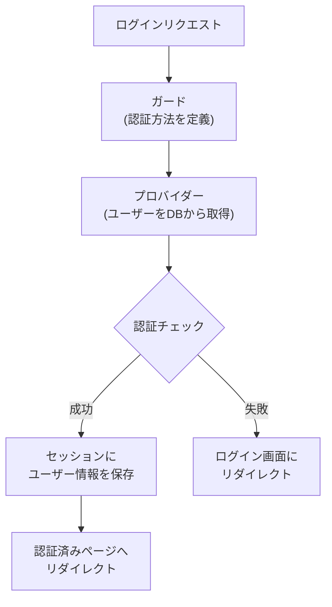

## 認証とは

認証(Authentication)とは、アクセスしてきたユーザーが「誰であるか」を確認する仕組みです。
Webアプリケーションでは、ログインフォームでメールアドレスとパスワードを受け取り、正しければセッションにユーザー情報を保存します。
以降のリクエストではそのセッションを参照してユーザーを識別します。

Laravelの認証機能は「ガード」と「プロバイダー」という2つの概念で構成されています。

- **ガード**: 各リクエストでユーザーをどう認証するかを定義します。デフォルトは `session` ガードで、セッションとCookieを使って状態を管理します。
- **プロバイダー**: ユーザーをデータベースからどう取得するかを定義します。デフォルトはEloquentを使います。

<Info>
  認証の設定ファイルは `config/auth.php` です。デフォルト設定のままほとんどのWebアプリケーションに対応できます。
</Info>



## スターターキットによる認証

Laravelでは、`laravel new` でアプリケーションを作成するときにスターターキットを選ぶだけで、ログイン・登録・パスワードリセットなどの認証機能が自動的に構築されます。これが最も推奨される方法です。

<Steps>
  <Step title="アプリケーションを作成する">
    Laravelインストーラーでアプリケーションを作成します。途中でスターターキットを選択するプロンプトが表示されます。

    ```shell
    laravel new my-app
    ```

    スターターキットとして **React**、**Vue**、**Livewire**、**Svelte** から選択できます。
    チームの技術スタックに合わせて選んでください。
  </Step>

  <Step title="フロントエンドの依存関係をインストールする">
    ```shell
    cd my-app
    npm install && npm run build
    ```
  </Step>

  <Step title="データベースを準備する">
    `.env` ファイルのデータベース設定を確認した上で、マイグレーションを実行します。

    ```shell
    php artisan migrate
    ```

    `users` テーブルを含む初期マイグレーションが適用されます。
  </Step>

  <Step title="開発サーバーを起動する">
    ```shell
    composer run dev
    ```

    ブラウザで `http://localhost:8000` にアクセスすると、ナビゲーションに「Register」と「Log in」リンクが表示されます。
    `/register` にアクセスしてユーザーを登録してみましょう。
  </Step>
</Steps>

スターターキットを使うと、以下の機能がすぐに利用できます。

| 機能 | URL |
| --- | --- |
| ユーザー登録 | `/register` |
| ログイン | `/login` |
| パスワードリセット | `/forgot-password` |
| メール確認 | `/email/verify` |
| プロフィール編集 | `/settings/profile` |

<Tip>
  スターターキットで生成されたコード(コントローラー・ルート・ビュー)はすべて自分のアプリケーション内に存在します。自由に修正してカスタマイズできます。
</Tip>

### 利用可能なスターターキット

#### React

React 19・TypeScript・Tailwind・[shadcn/ui](https://ui.shadcn.com) を使ったモダンなSPAを構築できます。
[Inertia](https://inertiajs.com) を使うことで、サーバーサイドルーティングを維持しながらReactのフロントエンドを利用できます。

#### Vue

Vue Composition API・TypeScript・Tailwind・[shadcn-vue](https://www.shadcn-vue.com/) を採用しています。
Reactと同様にInertiaを使ってサーバーサイドと連携します。

#### Livewire

PHPだけで動的なUIを構築できる[Livewire](https://livewire.laravel.com)を使います。
Bladeテンプレートが中心のチームや、JavaScriptフレームワークを使わずに済ませたい場合に最適です。
[Flux UI](https://fluxui.dev) コンポーネントライブラリが含まれています。

#### Svelte

Svelte 5・TypeScript・Tailwind・[shadcn-svelte](https://www.shadcn-svelte.com/) を使います。
Inertiaと組み合わせてモダンなSPAを構築できます。

## 認証ファサード

`Auth` ファサードを使うと、現在認証されているユーザーの情報を取得したり、認証状態を確認したりできます。

### 認証済みユーザーの取得

```php
use Illuminate\Support\Facades\Auth;

// 現在のユーザーを取得する
$user = Auth::user();

// ユーザーIDのみ取得する
$id = Auth::id();
```

コントローラーでは `Request` オブジェクトからもユーザーを取得できます。

```php
<?php

namespace App\Http\Controllers;

use Illuminate\Http\Request;

class DashboardController extends Controller
{
    public function index(Request $request)
    {
        $user = $request->user();

        return view('dashboard', ['user' => $user]);
    }
}
```

### 認証状態の確認

`Auth::check()` は、ユーザーがログインしているかどうかを `true` / `false` で返します。

```php
use Illuminate\Support\Facades\Auth;

if (Auth::check()) {
    // ログイン済み
} else {
    // 未ログイン
}
```

Bladeテンプレートでは `@auth` と `@guest` ディレクティブを使うと便利です。

```blade
@auth
    <p>こんにちは、{{ Auth::user()->name }} さん</p>
    <a href="/logout">ログアウト</a>
@endauth

@guest
    <a href="/login">ログイン</a>
    <a href="/register">新規登録</a>
@endguest
```

## ルートの保護

ログイン済みのユーザーだけがアクセスできるルートを作るには、`auth` ミドルウェアを使います。

```php
// routes/web.php

// 認証済みユーザーのみアクセス可能
Route::get('/dashboard', function () {
    return view('dashboard');
})->middleware('auth');
```

未認証のユーザーがアクセスしようとすると、自動的に `/login` にリダイレクトされます。

複数のルートをまとめて保護するにはグループを使います。

```php
Route::middleware('auth')->group(function () {
    Route::get('/dashboard', [DashboardController::class, 'index']);
    Route::get('/profile', [ProfileController::class, 'show']);
    Route::get('/settings', [SettingsController::class, 'index']);
});
```

<Warning>
  `auth` ミドルウェアを付け忘れると、未ログインのユーザーがアクセスできてしまいます。保護が必要なルートには必ず適用してください。
</Warning>

### ゲスト専用ルート

ログイン済みユーザーをリダイレクトするには `guest` ミドルウェアを使います。
ログインページや登録ページに適用することで、すでにログインしているユーザーをダッシュボードに転送できます。

```php
Route::middleware('guest')->group(function () {
    Route::get('/login', [AuthController::class, 'showLogin']);
    Route::get('/register', [AuthController::class, 'showRegister']);
});
```

## 手動認証

スターターキットを使わずに手動でログイン処理を実装するには `Auth::attempt()` を使います。

```php
<?php

namespace App\Http\Controllers;

use Illuminate\Http\Request;
use Illuminate\Http\RedirectResponse;
use Illuminate\Support\Facades\Auth;

class LoginController extends Controller
{
    public function login(Request $request): RedirectResponse
    {
        $credentials = $request->validate([
            'email' => ['required', 'email'],
            'password' => ['required'],
        ]);

        if (Auth::attempt($credentials)) {
            // 認証成功 — セッションを再生成してCSRF攻撃を防ぐ
            $request->session()->regenerate();

            return redirect()->intended('/dashboard');
        }

        // 認証失敗
        return back()->withErrors([
            'email' => 'メールアドレスまたはパスワードが正しくありません。',
        ])->onlyInput('email');
    }
}
```

`Auth::attempt()` の第1引数に認証情報の配列を渡します。
パスワードは自動的にハッシュと比較されるので、平文のまま渡してください。

「ログイン状態を保持する」機能を実装するには、第2引数に `true` を渡します。

```php
// 「ログイン状態を保持する」チェックボックスの値を使う
Auth::attempt($credentials, $request->boolean('remember'));
```

<Info>
  手動認証を実装する場合も、スターターキットのコードを参考にするのがおすすめです。安全な実装のお手本として活用できます。
</Info>

## ログアウト

ユーザーをログアウトさせるには `Auth::logout()` を呼び出します。
セッションの無効化とCSRFトークンの再生成も合わせて行うのがベストプラクティスです。

```php
<?php

namespace App\Http\Controllers;

use Illuminate\Http\Request;
use Illuminate\Http\RedirectResponse;
use Illuminate\Support\Facades\Auth;

class LogoutController extends Controller
{
    public function logout(Request $request): RedirectResponse
    {
        Auth::logout();

        // セッションを無効化する
        $request->session()->invalidate();

        // CSRFトークンを再生成する
        $request->session()->regenerateToken();

        return redirect('/');
    }
}
```

ルートにはPOSTメソッドを使います。

```php
Route::post('/logout', [LogoutController::class, 'logout'])->middleware('auth');
```

Bladeテンプレートではフォームを使ってPOSTリクエストを送ります。

```blade
<form method="POST" action="/logout">
    @csrf
    <button type="submit">ログアウト</button>
</form>
```

## まとめ

| やりたいこと | 方法 |
| --- | --- |
| 認証機能を素早く追加する | スターターキット(`laravel new`) |
| 現在のユーザーを取得する | `Auth::user()` / `$request->user()` |
| ログイン状態を確認する | `Auth::check()` |
| ルートを保護する | `->middleware('auth')` |
| 手動でログインする | `Auth::attempt($credentials)` |
| ログアウトする | `Auth::logout()` |

## 次のステップ

<Card title="ミドルウェア" icon="shield-halved" href="/jp/middleware">
  `auth` ミドルウェアの仕組みや独自ミドルウェアの作り方を詳しく学びます。
</Card>
