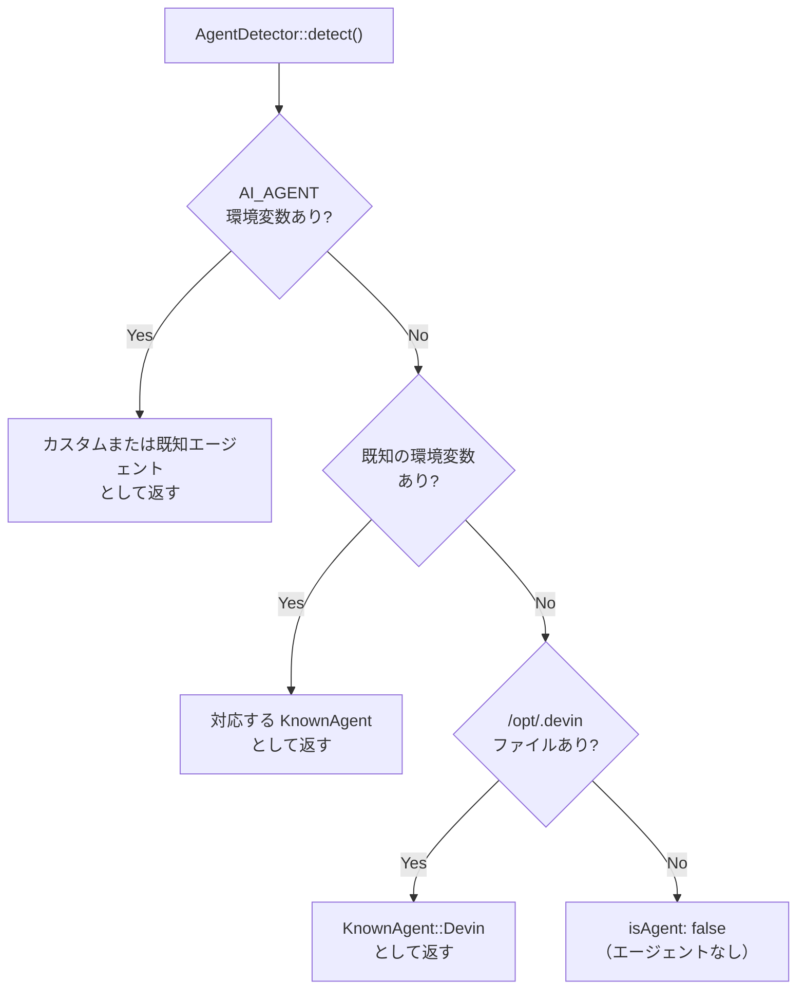

## はじめに

[laravel/agent-detector](https://github.com/laravel/agent-detector) は、PHPコードがAIエージェントや自動化開発環境の中で実行されているかを検出するための軽量ユーティリティです。2026年1月にLaravel公式パッケージとして公開されました。

AIエージェントが開発の現場に深く入り込んだ今、コード自体がどの環境で動作しているかを把握することが重要になっています。AIエージェントからのリクエストか人間からのリクエストかによってログの詳細度やレート制限を変えたり、エージェント専用のレスポンスを返したりといったケースが現実の開発で生まれています。



## インストール

```bash
composer require laravel/agent-detector
```

PHP 8.2 以上が必要です。

## 基本的な使い方

`AgentDetector::detect()` を呼び出すと `AgentResult` オブジェクトが返ります。

```php
use Laravel\AgentDetector\AgentDetector;
use Laravel\AgentDetector\KnownAgent;

$result = AgentDetector::detect();

if ($result->isAgent) {
    echo "Running inside: {$result->name}";
}

// 特定のエージェントを確認する
if ($result->knownAgent() === KnownAgent::Claude) {
    echo "Hello from Claude!";
}
```

スタンドアロン関数を使う書き方もあります。

```php
use function Laravel\AgentDetector\detectAgent;

$result = detectAgent();
```

### AgentResult のプロパティ

| プロパティ / メソッド | 型 | 説明 |
|----------------------|----|------|
| `$result->isAgent` | `bool` | AIエージェントの中で実行されている場合 `true` |
| `$result->name` | `?string` | エージェント名（例: `"claude"`）。エージェントでない場合 `null` |
| `$result->knownAgent()` | `?KnownAgent` | `KnownAgent` enumを返す。未知のエージェントは `null` |

## 対応エージェント一覧

| エージェント | 検出方法（環境変数 / ファイル） |
|-------------|-------------------------------|
| Custom | `AI_AGENT` 環境変数（任意の値） |
| GitHub Copilot | `AI_AGENT=github-copilot`、`AI_AGENT=github-copilot-cli`、`COPILOT_MODEL`、`COPILOT_ALLOW_ALL`、`COPILOT_GITHUB_TOKEN`、`COPILOT_CLI` |
| Cursor | `CURSOR_AGENT` |
| Claude | `CLAUDECODE` または `CLAUDE_CODE` |
| Cowork | `CLAUDE_CODE_IS_COWORK`（`CLAUDECODE` または `CLAUDE_CODE` と同時に設定） |
| Gemini | `GEMINI_CLI` |
| Codex | `CODEX_SANDBOX`、`CODEX_CI`、`CODEX_THREAD_ID` |
| Augment CLI | `AUGMENT_AGENT` |
| AMP | `AMP_CURRENT_THREAD_ID` |
| Opencode | `OPENCODE_CLIENT` または `OPENCODE` |
| Replit | `REPL_ID` |
| Devin | `/opt/.devin` ファイルが存在する |
| Antigravity | `ANTIGRAVITY_AGENT` |
| Pi | `PI_CODING_AGENT` |
| Kiro CLI | `KIRO_AGENT_PATH` |
| v0 | `AI_AGENT=v0` |

検出の優先順位は `AI_AGENT` 環境変数 → 既知の環境変数 → ファイルシステムの順です。

## カスタムエージェントの設定

`AI_AGENT` 環境変数に任意の値を設定すると、カスタムエージェントとして検出できます。

```bash
AI_AGENT=my-custom-agent php your-script.php
```

```php
$result = AgentDetector::detect();

// $result->isAgent === true
// $result->name    === 'my-custom-agent'
// $result->knownAgent() === null（未知のエージェント）
```

## 実用的なユースケース

### ミドルウェアでAIエージェントを検出する

Laravelのミドルウェアで実行環境を判定し、エージェント向けの処理を分岐させます。

```php
<?php

namespace App\Http\Middleware;

use Closure;
use Illuminate\Http\Request;
use Laravel\AgentDetector\AgentDetector;

class DetectAiAgent
{
    public function handle(Request $request, Closure $next): mixed
    {
        $agent = AgentDetector::detect();

        if ($agent->isAgent) {
            // エージェント名をリクエスト属性にセット
            $request->attributes->set('ai_agent', $agent->name);
        }

        return $next($request);
    }
}
```

### AIエージェント環境では詳細なログを出力する

```php
use Laravel\AgentDetector\AgentDetector;
use Illuminate\Support\Facades\Log;

$agent = AgentDetector::detect();

if ($agent->isAgent) {
    Log::withContext(['ai_agent' => $agent->name])
        ->debug('Agent request received', $request->all());
} else {
    Log::info('User request received');
}
```

### AIエージェントからのリクエストにレート制限を適用する

`ThrottleRequests` ミドルウェアのキーをエージェント検出に基づいて変えることで、エージェントと人間で異なるレート制限を設けられます。

```php
<?php

namespace App\Http\Middleware;

use Closure;
use Illuminate\Http\Request;
use Illuminate\Routing\Middleware\ThrottleRequests;
use Laravel\AgentDetector\AgentDetector;

class ThrottleByAiAgent
{
    public function handle(Request $request, Closure $next): mixed
    {
        $agent = AgentDetector::detect();

        // AIエージェントは 1 分あたり 10 リクエスト、人間は 60 リクエスト
        $maxAttempts = $agent->isAgent ? 10 : 60;

        return app(ThrottleRequests::class)->handle(
            $request,
            $next,
            $maxAttempts,
        );
    }
}
```

### コンソールコマンドで動作を切り替える

Artisanコマンドをエージェントが実行する際に詳細な進捗を出力する例です。

```php
use Laravel\AgentDetector\AgentDetector;

public function handle(): void
{
    $agent = AgentDetector::detect();

    if ($agent->isAgent) {
        $this->info("Running in {$agent->name} environment — verbose mode enabled.");
    }

    // 処理...
}
```

## まとめ

`laravel/agent-detector` は、シンプルな環境変数チェックとファイルシステム検査をまとめたパッケージです。複雑な設定なしで `AgentDetector::detect()` を呼び出すだけで使えます。

AIエージェントが開発フローの一部として定着しつつある今、「コードが誰（何）によって動かされているか」を把握することはますます重要になっていきます。ログ、レート制限、レスポンスのカスタマイズなど、様々な場面でこのパッケージが活用できるでしょう。

<Card title="laravel/agent-detector リポジトリ" icon="github" href="https://github.com/laravel/agent-detector">
  ソースコードと最新の対応エージェント一覧はこちら。
</Card>
