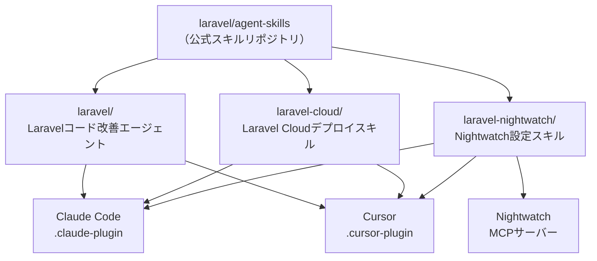

<Info>
  `laravel/agent-skills` はアクティブに開発中のリポジトリです（2026年4月時点）。現在のプラグインバージョンは `1.0.0` ですが、今後の内容変更・追加が予想されます。
</Info>

## laravel/agent-skillsとは

[laravel/agent-skills](https://github.com/laravel/agent-skills) は、Laravel公式が管理するAIエージェント向けスキル・プラグインのコレクションリポジトリです。Taylor Otwell 本人が作者として登録されており、Laravel公式のmarketplaceとして整備されていく予定です。

もともとはClaude Code向けのスキルを置くリポジトリとして始まりましたが、リポジトリ名を `agent-skills` にリニューアルし、**Claude Code** と **Cursor** の両方に対応したプラグインを提供するようになりました。

AIを活用してLaravelアプリを開発する場面で、エージェントがLaravelのベストプラクティスを理解し、Laravel CloudやNightwatchなどの公式サービスも自律的に操作できるようにするためのスキルセットです。



## リポジトリの構造

リポジトリはスキル（プラグイン）ごとにディレクトリが分かれており、各ディレクトリに Claude Code 用と Cursor 用の設定ファイルが含まれています。

```
laravel/agent-skills/
├── laravel/                      # Laravel コード改善エージェント
│   ├── .claude-plugin/
│   │   └── plugin.json           # Claude Codeプラグイン定義
│   ├── .cursor-plugin/
│   │   └── plugin.json           # Cursorプラグイン定義
│   └── agents/
│       └── laravel-simplifier.md # エージェントのシステムプロンプト
├── laravel-cloud/                # Laravel Cloud デプロイスキル
│   ├── .claude-plugin/
│   │   └── plugin.json
│   ├── .cursor-plugin/
│   │   └── plugin.json
│   └── skills/
│       └── deploying-laravel-cloud/
└── laravel-nightwatch/           # Laravel Nightwatch 設定スキル
    ├── .claude-plugin/
    │   └── plugin.json
    ├── .cursor-plugin/
    │   └── plugin.json
    ├── .mcp.json                 # Nightwatch MCPサーバー設定
    └── skills/
        └── configure-nightwatch/
```

## 提供されるプラグイン

### laravel — コード品質改善エージェント

**laravel-simplifier** は、最近変更されたPHP/Laravelコードをレビューし、機能を変えずにコードの明瞭さ・一貫性・保守性を高めるエージェントです。

主な機能：

- Laravelの規約とPSR-12標準の適用
- 不要な複雑さとネストの削減
- 変数名・関数名の可読性向上
- 関連ロジックの整理・統合
- `match` 式の活用による条件分岐の明確化

エージェントはデフォルトで「最近変更されたコード」だけを対象にします。コーディングセッションが終わった後に呼び出すと、自動的に変更箇所を特定してリファクタリングを提案してくれます。

```
> Review recent changes using the laravel-simplifier agent
```

### laravel-cloud — デプロイ・インフラ管理スキル

**laravel-cloud** は、[Laravel Cloud](https://cloud.laravel.com) へのデプロイとリソース管理を支援するスキルです。`cloud` CLIのコマンドパターンを熟知しており、デプロイ手順をステップバイステップでガイドします。

主な機能：

- 初回デプロイ・既存アプリのデプロイワークフローのガイド
- データベース・キャッシュ・ドメイン・バケットなどのインフラリソース管理
- マルチステップ作業のオペレーションチェックリスト
- Cloud CLIのCRUDコマンドパターンに準拠した操作

```
> Deploy my app to Laravel Cloud
> Set up a database and cache for the staging environment
```

### laravel-nightwatch — 監視設定スキル

**laravel-nightwatch** は、[Laravel Nightwatch](https://nightwatch.laravel.com) のデータ収集・サンプリングレート・フィルタリングルール・リダクションポリシーの設定を支援するスキルです。

さらに、**Nightwatch MCP サーバー**をバンドルしており、AIエージェントがNightwatchの問題を直接参照・操作できます。

| 機能 | 説明 |
|------|------|
| セットアップ・設定 | アプリへのNightwatchセットアップをガイド |
| サンプリング・フィルタリング | ルール設定によるデータ量のコントロール |
| PII リダクション | 機密データを保護するリダクションポリシー |
| イベント最適化 | 本番環境向けのイベント収集最適化 |
| MCP連携 | 問題の閲覧・スタックトレース確認・ステータス更新・コメント追加 |

```
> Configure Nightwatch sampling rates for production
> Set up PII redaction for Nightwatch
```

## インストール方法

### Claude Code

Claude Codeのマーケットプレイス機能を使ってインストールします。

```bash
# マーケットプレイスへの追加
/plugin marketplace add laravel/agent-skills

# 各プラグインのインストール
/plugin install laravel-simplifier@laravel
/plugin install laravel-cloud@laravel
/plugin install laravel-nightwatch@laravel
```

<Tip>
  必要なプラグインだけをインストールすることもできます。すべてインストールする必要はありません。
</Tip>

### Cursor

Cursorの場合は、プラグインマーケットプレイスのパネルで **Laravel** を検索してインストールします。

<Steps>
  <Step title="Cursorを開く">
    Cursorのサイドバーまたは設定から「Plugins」パネルを開きます。
  </Step>
  <Step title="Laravelを検索する">
    検索バーに「**Laravel**」と入力します。
  </Step>
  <Step title="必要なプラグインをインストールする">
    `laravel`・`laravel-cloud`・`laravel-nightwatch` の中から必要なものをインストールします。
  </Step>
</Steps>

## 使い方の例

### laravel-simplifier でコードレビューを自動化する

コーディングセッションの最後に呼び出すことで、書いたコードを自動的にLaravelのベストプラクティスに沿って洗練させます。

```
> Review recent changes using the laravel-simplifier agent
```

エージェントは自律的に動作し、変更されたファイルを特定して改善案を提示します。明示的に指示しない限り、最近変更したコードのみが対象になります。

### Laravel Cloudへのデプロイ

自然言語でデプロイ作業を指示できます。エージェントが `cloud` CLIのコマンドを適切に組み合わせて実行します。

```
> Deploy my app to Laravel Cloud
> Set up a database and cache for the staging environment
> Add a custom domain to my production environment
```

### Nightwatchで問題を調査する

NightwatchのMCPサーバーが統合されているため、AIに直接問題の調査を依頼できます。

```
> Show me the latest errors in Nightwatch
> What's the stack trace for issue #42?
> Mark issue #42 as resolved
```

## プラグインの仕組み

各プラグインは `.claude-plugin/plugin.json` または `.cursor-plugin/plugin.json` で定義されています。エージェント定義（`.md` ファイル）にはシステムプロンプトが記述されており、AIがどのように動作すべきかが詳細に規定されています。

laravel-simplifier のプロンプトの一部：

```
You are an expert PHP/Laravel code simplification specialist focused on 
enhancing code clarity, consistency, and maintainability while preserving 
exact functionality...
```

スキルはコンテキストファイル（Markdownドキュメント）の形でAIに追加知識を与えます。例えば laravel-cloud のスキルには、Cloud CLIの操作手順や注意点が詳細に記述されており、AIがデプロイを誤って実行しないようにガイドします。

## 今後の展望

`laravel/agent-skills` リポジトリは、**Laravelエコシステム全体をカバーするAIスキルの公式マーケットプレイス**として整備されていく予定です。

現在は Laravel・Laravel Cloud・Laravel Nightwatch の3つのプラグインが提供されていますが、今後は以下のような拡張が期待されます：

- 他のLaravel公式パッケージ（Forge・Vapour・Cashier・Sanctumなど）への対応
- GitHub CopilotなどClaude Code・Cursor以外のAIツールへの対応
- コミュニティによるサードパーティスキルの追加（マーケットプレイス化）

AI開発が標準的なワークフローになりつつある今、Laravelチームが公式にAIスキルを提供・管理することは、エコシステム全体の品質向上に大きく貢献するはずです。

<Card title="laravel/agent-skills リポジトリ" icon="github" href="https://github.com/laravel/agent-skills">
  スキルの詳細やインストール手順は公式リポジトリのREADMEを参照してください。
</Card>

<Card title="Laravel Cloud" icon="cloud" href="https://cloud.laravel.com">
  laravel-cloud スキルと連携するLaravel公式のホスティングサービスです。
</Card>

<Card title="Laravel Nightwatch" icon="eye" href="https://nightwatch.laravel.com">
  laravel-nightwatch スキルと連携するLaravel公式のエラー監視サービスです。
</Card>
