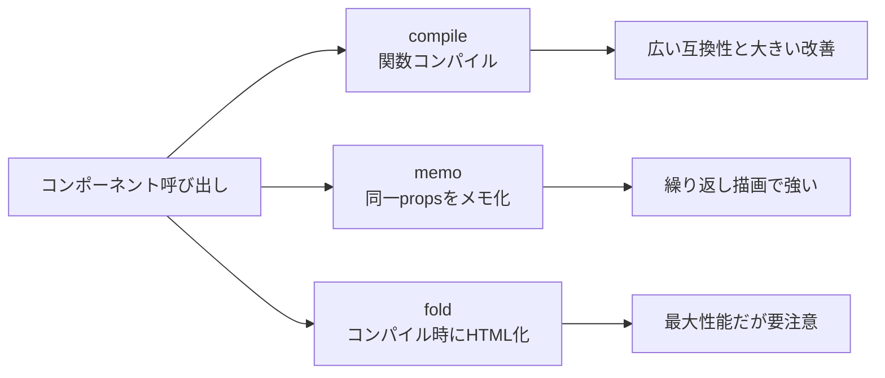

<Info>
  この記事は [livewire/blaze](https://github.com/livewire/blaze) の README を一次情報としてまとめています。現時点では laravel.com 側に Blaze の専用ドキュメントはありません。
</Info>

## Blazeとは何か

[Blaze](https://github.com/livewire/blaze) は、Livewire 公式が公開している Blade コンポーネント高速化パッケージです。対象は Livewire コンポーネントだけではなく、通常の匿名 Blade コンポーネントも含まれます。

README では、匿名コンポーネント 25,000 回描画のベンチマークとして **500ms → 13ms**（約 **97.4% 削減**）が示されています。シナリオ別でも 91〜97% の削減が報告されています。

## 3つの最適化戦略

Blaze は `compile`（デフォルト）、`memo`、`fold` の3戦略を提供します。



### どれを選ぶべきか

| 戦略 | いつ選ぶか | 利点 | 注意点 |
|---|---|---|---|
| `compile` | まず最初に選ぶ標準戦略 | 互換性が高く、設定なしで高速化しやすい | 制限事項は共通で確認が必要 |
| `memo` | 同じ props で何度も描画するアイコン・バッジなど | 初回以降の再描画コストを下げられる | slot を持つコンポーネントでは使えない |
| `fold` | 静的に確定できる UI で最大性能を狙うとき | 実行時オーバーヘッドをほぼ除去できる | グローバル状態や動的値の扱いを誤ると不整合になる |

判断に迷う場合は **`compile` から開始**し、ボトルネックが特定できた箇所にだけ `memo` / `fold` を適用する進め方が安全です。

## インストールと有効化

```bash
composer require livewire/blaze:^1.0
```

有効化は2通りあります。

### 1) `@blaze` を個別コンポーネントに付ける

```blade
@blaze

<button {{ $attributes }}>
    {{ $slot }}
</button>
```

必要に応じて戦略を切り替えます。

```blade
@blaze(memo: true)
@blaze(fold: true)
```

### 2) `Blaze::optimize()` でディレクトリ単位で有効化する

```php
use Livewire\Blaze\Blaze;

public function boot(): void
{
    Blaze::optimize()
        ->in(resource_path('views/components'));
}
```

有効化後はコンパイル済みビューをクリアします。

```bash
php artisan view:clear
```

<Tip>
  `@blaze` は「まず試す」用途、`Blaze::optimize()` は「運用で広く適用する」用途に向いています。README でもまず限定ディレクトリから段階的に適用することが推奨されています。
</Tip>

## 制限事項

README で明示されている制限事項です。

- クラスベースコンポーネントは非対応
- `$component` 変数は利用不可
- View composers / creators / lifecycle events は発火しない
- `View::share()` 変数の自動インジェクトは非対応（必要なら `$__env->shared('key')` を明示的に使う）
- Blade と Blaze をまたぐ `@aware` は制限あり（親子とも Blaze 側で使う必要がある）
- `view()` で Blaze コンポーネントを直接レンダリングできない（コンポーネントタグ経由のみ）

## Flux UI との相性

Blaze README では、[Flux UI](https://fluxui.dev/docs/installation) を使っている場合は **Blaze をインストールするだけで追加設定なしで利用開始できる** と案内されています。

## 仕組みの概要

通常の Blade は、コンポーネント解決や属性処理を含むレンダリングパイプラインを毎回通ります。Blaze の `compile` は、これを最適化済み PHP 関数へコンパイルして直接呼び出すことで、パイプラインのオーバーヘッドを大きく削減します。

README の説明にある通り、概念的には次の差があります。

- 通常: Blade の標準レンダリング処理を都度実行
- Blaze `compile`: コンパイル済み関数を直接呼び出す
- Blaze `fold`: コンパイル時に HTML を埋め込み、実行時計算をさらに減らす

`fold` は最速ですが、静的化の前提を崩す要素（認証状態、リクエスト依存値、セッション依存値、時間依存値など）があると不具合の原因になります。高負荷箇所だけを対象に、挙動確認をしながら段階適用してください。
