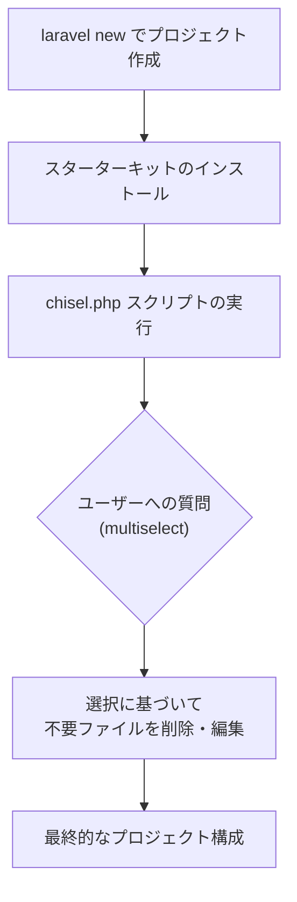
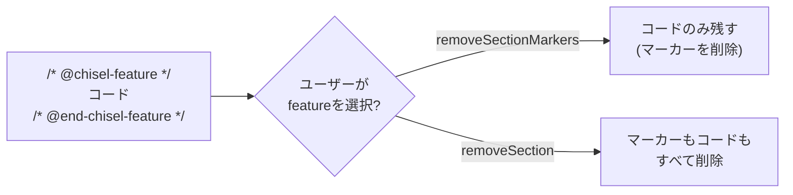

<Info>
  この記事はソースコード調査に基づく情報です。v0.1タグが付いたばかりの開発初期段階のパッケージです（2026年5月時点）。
</Info>

## Laravel Chiselとは

[Laravel Chisel](https://github.com/laravel/chisel) は、Laravelスターターキットから不要な機能を削除するための**ポストインストールスクリプト**を構築するためのプリミティブを提供するパッケージです。

スターターキットには多くの機能があらかじめ含まれていますが、プロジェクトによっては一部の機能が不要な場合があります。Chiselはこの問題を、インストール後に対話的に「必要な機能だけを残す」仕組みを提供することで解決します。



## なぜ必要か

Laravelスターターキットは多くの機能をバンドルしていますが、すべてのプロジェクトですべての機能が必要なわけではありません。例えば：

- メール認証が不要なプロジェクト
- パスキー認証を使わないプロジェクト
- 特定のLivewireコンポーネントが不要な構成

これまでは不要な機能を手動で削除する必要がありましたが、Chiselを使えば**インストール時の対話的なプロンプトでカスタマイズが完結**します。

## chisel.php スクリプトの定義

Chiselを使うスターターキットは、プロジェクトルートに `chisel.php` ファイルを配置します。このファイルが「どの機能をオプションにするか」を定義します。

```php
<?php

require getenv('LARAVEL_INSTALLER_AUTOLOADER');

use Laravel\Chisel\Chisel;
use Laravel\Chisel\Question;

return Chisel::script(dirname(__DIR__))
    ->questions([
        Question::multiselect(
            name: 'auth_features',
            label: 'Which authentication features would you like to enable?',
            options: [
                'email-verification' => 'Email verification',
            ],
            hint: 'Use space to select, enter to confirm.',
        ),
    ])
    ->selected('auth_features', 'email-verification',
        then: function (Chisel $c) {
            // 選択された場合: セクションマーカーを除去してコードを残す
            $c->files(
                'resources/js/pages/settings/profile.tsx',
                'app/Providers/FortifyServiceProvider.php',
            )->removeSectionMarkers('email-verification');
        },
        else: function (Chisel $c) {
            // 選択されなかった場合: 関連ファイルと機能を削除
            $c->php('app/Models/User.php')
                ->removeImport('Illuminate\Contracts\Auth\MustVerifyEmail')
                ->removeInterface('MustVerifyEmail');

            $c->file('config/fortify.php')->removeLinesContaining('Features::emailVerification()');

            $c->files(
                'app/Providers/FortifyServiceProvider.php',
                'resources/js/pages/settings/profile.tsx',
            )->removeSection('email-verification');

            $c->files(
                'resources/js/components/email-verification-notice.tsx',
                'resources/js/pages/auth/verify-email.tsx',
                'tests/Feature/Auth/EmailVerificationTest.php',
                'tests/Feature/Auth/VerificationNotificationTest.php',
            )->delete();
        },
    );
```

## スクリプト定義メソッド

| メソッド | 説明 |
|--------|------|
| `Chisel::script($directory)` | スクリプト定義を作成 |
| `Question::multiselect(...)` | 複数選択の質問を定義 |
| `questions([...])` | スクリプトの質問を設定 |
| `questions()` | 登録された質問を取得 |
| `collectAnswers()` | 質問への回答収集を開始 |
| `apply($callback)` | 無条件のミューテーションステップを登録 |
| `selected($key, $value, then:, else:)` | 単一の選択値で分岐 |
| `selectedAny($key, $values, then:, else:)` | いずれかの値が選択された場合に分岐 |
| `selectedAll($key, $values, then:, else:)` | すべての値が選択された場合に分岐 |
| `chisel($answers)` | 登録されたミューテーションを実行 |

## 対話的な回答収集

`collectAnswers()` は回答コレクターを返します。すべてのメソッドはフルエントで任意の順序で呼び出せます。非インタラクティブ環境ではデフォルト値が自動的に使用されます。

外部のArtisanコマンドが[Laravel Prompts](https://laravel.com/docs/prompts)を使ってプロンプトを表示し、回答をChiselに渡します。

```php
use Illuminate\Console\Command;
use Laravel\Chisel\Chisel;
use Laravel\Chisel\Question;
use RuntimeException;

use function Laravel\Prompts\multiselect;

class InstallFeatures extends Command
{
    protected $signature = 'install:features
        {--answers= : JSON string of answers to skip interactive prompts}';

    public function handle(): void
    {
        $script = require base_path('chisel.php');

        $providedAnswers = $this->option('answers') === null
            ? []
            : json_decode((string) $this->option('answers'), true, 512, JSON_THROW_ON_ERROR);

        $answers = $script
            ->collectAnswers()
            ->onQuestion(fn (Question $question) => match ($question->type) {
                'multiselect' => multiselect(
                    label: $question->label,
                    options: $question->options,
                    default: $question->default ?? [],
                    required: $question->required,
                    hint: $question->hint,
                ),
                default => throw new RuntimeException("Unsupported question type [{$question->type}]."),
            })
            ->interactive($this->input->isInteractive())
            ->withAnswers($providedAnswers);

        $script->chisel($answers);

        $chisel = Chisel::in(base_path());

        $chisel->npm()->install();
        $chisel->npm()->run('build');
    }
}
```

| メソッド | 説明 |
|--------|------|
| `onQuestion($callback)` | 質問プロンプトのハンドラを設定 |
| `interactive($interactive)` | インタラクティブモードを設定 |
| `withAnswers($answers)` | 事前収集した回答を提供してプロンプトをスキップ |

## ファイルミューテーション

`file($path)` で単一ファイルを、`files(...$paths)` で複数ファイルを対象にします。

| メソッド | 説明 |
|--------|------|
| `replace($search, $replace)` | 文字列を置換 |
| `removeLinesContaining($content)` | 指定文字列を含む行を削除 |
| `removeSectionMarkers($tag)` | セクションマーカーを除去し、コンテンツを残す |
| `removeSection($tag)` | セクションマーカーとその中のコンテンツを削除 |
| `delete()` | 対象ファイルを削除 |

## PHP ASTベース編集

`php($path)` はPHP ASTを使った編集を提供します。オブジェクトが破棄されるときに変更が自動保存されます。

[PHP AST（抽象構文木）の基礎と `nikic/php-parser` の使い方は、`/jp/advanced/php-ast` で先に整理しておくと理解しやすくなります。](/jp/advanced/php-ast)

| メソッド | 説明 |
|--------|------|
| `removeImport($class)` | `use` 文を削除 |
| `removeTrait($trait)` | クラスからtraitの使用を削除 |
| `removeInterface($interface)` | 実装されたinterfaceを削除 |

## Section Markers

オプションのコードをコメントペアで囲みます。

```php
/* @chisel-passkeys */
Fortify::authenticateUsingPasskeys();
/* @end-chisel-passkeys */
```

JSXファイルでは波括弧（`{}`）を使ったブロックコメントを使用します。

```tsx
{
    /* @chisel-passkeys */
}
<PasskeyButton />;
{
    /* @end-chisel-passkeys */
}
```

- `removeSectionMarkers('passkeys')` — マーカーを削除し、コードは残す
- `removeSection('passkeys')` — マーカーもコードも両方削除

`chisel-` プレフィックスは自動的に付加されます。



## npm サポート

| メソッド | 説明 |
|--------|------|
| `npm()->install()` | 検出されたパッケージマネージャーで依存関係をインストール |
| `npm()->run($script, ...$arguments)` | パッケージマネージャーのスクリプトを実行 |
| `npm()->remove(...$packages)` | 検出されたパッケージマネージャーでパッケージを削除 |

`npm()` メソッドはnpm・yarn・pnpm・bunを自動検出します。

## 現在の開発状況

- **GitHubリポジトリ**: [laravel/chisel](https://github.com/laravel/chisel)
- **リリース**: v0.1 (2026年5月公開)
- **開発期間**: 3ヶ月間の非公開開発を経て公開

ChiselはエンドユーザーがLaravelアプリに直接インストールするパッケージではなく、**スターターキットが内部的に使用するライブラリ**です。将来的にはLaravelの公式スターターキットがChiselを活用したポストインストールスクリプトを提供することが期待されています。

<Card title="laravel/chisel リポジトリ" icon="github" href="https://github.com/laravel/chisel">
  ソースコードと最新のAPIリファレンスはこちら。
</Card>

<Card title="Laravel スターターキット公式ドキュメント" icon="book-open" href="https://laravel.com/docs/starter-kits">
  スターターキット自体の使い方については公式ドキュメントを参照してください。
</Card>
