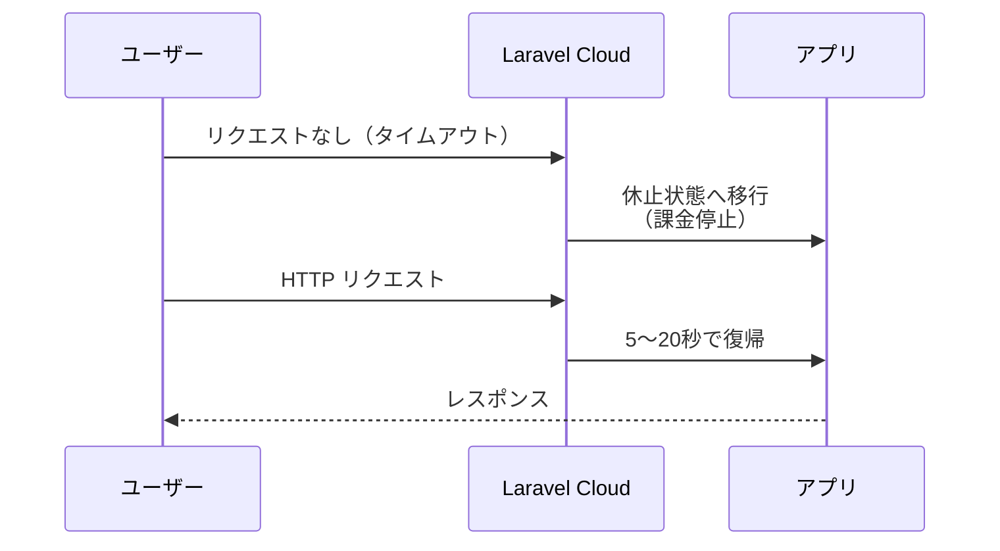

## Hibernation とは

Laravel Cloud の **Hibernation（自動休止）** は、一定時間 HTTP リクエストがない場合に環境を休止状態に移行する旧来の機能です。  
現在の新しい Flex コンピュートでは、より高速な **Scale to Zero** が後継として使われます。

Legacy Flex の Hibernation は、休止中のコンピュート課金を止められる一方で、HTTP リクエストを受けてからの復帰に通常 5〜20 秒かかります。新しい Scale to Zero では起動が **500ms 未満** まで短縮され、さらにスリープ中でもスケジュールタスクやキュー処理のために環境が自動で起動します。

<Warning>
  新規に Laravel Cloud を使うなら、Hibernation ではなく **Scale to Zero** を前提に考えるのが安全です。Managed Queues や新しい料金プランも含めた全体像は [Laravel Cloud — Laravel専用PaaSの全貌](/jp/blog/laravel-cloud) を確認してください。
</Warning>



## Scale to Zero で変わったこと

新しい Flex コンピュートの Scale to Zero では、以前の Hibernation で課題だった点がかなり解消されています。

| 項目 | 旧 Hibernation | 新しい Scale to Zero |
|---|---|---|
| HTTP リクエストでの復帰 | 5〜20 秒 | 500ms 未満 |
| Scheduled Tasks | 休止中は動かない | スリープ中でも自動起動して実行 |
| キュー処理 | 休止中は動かない | スリープ中でも自動起動。Managed Queues 併用が推奨 |
| 推奨用途 | 旧 Flex 環境の節約運用 | 現在の標準構成 |

<Info>
  以前の Hibernation では、休止中にタスクスケジュールやキューが動かない問題がありました。Scale to Zero ではこの問題が解消され、特にキュー処理は Managed Queues を使うと App cluster が眠っていても安全に継続できます。
</Info>

## 旧 Hibernation の有効化手順

<Steps>
  <Step title="App compute cluster を開く">
    環境のインフラキャンバスダッシュボードで、App compute cluster をクリックします。
  </Step>
  <Step title="Hibernation を有効にする">
    **Hibernation** トグルをオンにします。
  </Step>
  <Step title="保存して再デプロイする">
    **Save and Redeploy** をクリックして変更を反映します。

    <Warning>
      設定を変更しただけでは有効になりません。必ず Save and Redeploy が必要です。
    </Warning>
  </Step>
</Steps>

<Tip>
  現在の環境で新しく有効化するなら、App compute cluster の **Scale to Zero** トグルを使います。以下の制限事項は、主に旧 Hibernation / Legacy Flex を前提にした説明です。
</Tip>

## 旧 Hibernation 休止中の制限事項

Hibernation が有効で環境が休止している間は、以下の機能は動作しません。

| 機能 | 休止中の挙動 |
|---|---|
| HTTP リクエスト処理 | 停止（復帰後に処理） |
| Task Scheduler | 実行されない |
| Queue Worker | 実行されない |
| カスタムバックグラウンドプロセス | 実行されない |

<Info>
  休止から復帰すると、これらの処理は自動的に再開されます。ただし休止中に「来るべきだった」スケジュールのジョブが遡って実行されることはありません。
</Info>

また、Hibernation には以下の制限があります。

- **Flex コンピュートのみ** 休止が可能です。Pro コンピュートでは Hibernation を有効にできません。
- 休止は**環境単位**で行われます。App cluster が休止すると、同環境内のすべての Worker cluster も休止します。

## 不要な復帰の原因

HTTP リクエストがあれば環境は自動で復帰しますが、意図しないリクエストによっても復帰が発生します。

- **ボット・クローラー** — 検索エンジンやセキュリティスキャナーなどが自動的にページをクロールする
- **Slack や Teams のリンクプレビュー** — メッセージングアプリがリンクのサムネイル取得のためにアクセスする
- **WordPress スキャン** — WordPress 環境を探す自動スキャンが `/wp-admin` などにアクセスする
- **`.php` ファイルを探す攻撃** — PHP ファイルを直接狙う自動スキャン

Laravel Cloud の `*.laravel.cloud` ドメインは検索エンジンにインデックスされないよう `X-Robots-Tag: noindex, nofollow` ヘッダーが付与されますが、ドメインが発見されてしまうと防ぎきれません。カスタムドメインでは `noindex` ヘッダーは付与されません。

<Tip>
  なるべく複雑なドメイン名を使うことで、ボットにバニティドメインを発見されるリスクを減らせます。
</Tip>

## Path Blocking で不要な復帰を防ぐ

**Path Blocking** は、特定の拡張子やパスへのリクエストを休止状態のまま処理せずにブロックする機能です。WordPress スキャンや PHP ファイルを狙った攻撃リクエストによる不要な復帰を防ぎます。

デフォルトでブロックされる拡張子とパスは以下の通りです。

**ブロックされる拡張子:**

```
.php, .php3, .php4, .php5, .php6, .php7, .php8,
.phtml, .pht, .phps, .env, .git
```

**ブロックされるパス:**

```
/wp-admin, /wp-content, /wp-includes, /wp-json
```

これらのリクエストは、環境が休止中でもアプリを復帰させることなく応答を返します。

<Info>
  Laravel の通常のルーティングでは `.php` 拡張子付きのリクエストは使用しないため、これらをブロックしてもアプリの動作に影響はありません。
</Info>

## 旧 Hibernation が向いているユース・不向きなユース

<Columns cols={2}>
  <Card title="向いているユース" icon="check">
    - **ステージング・開発環境** — 常時稼働は不要なのでコストを大幅に削減できる
    - **個人ブログ・ポートフォリオ** — トラフィックが少なくて済む用途
    - **デモ・試験用アプリ** — 必要なときだけ復帰すれば十分
    - **低頻度の社内ツール** — 使用時間が限られている
  </Card>
  <Card title="不向きなユース" icon="xmark">
    - **タスクスケジュールを使う用途** — 休止中は `schedule:run` が実行されない
    - **定期的なキュージョブが必要な用途** — 休止中はキューも停止する
    - **起動レイテンシが許容できない本番環境** — 復帰に 5〜20 秒かかる
    - **WebSocket を使うアプリ** — 接続が維持できず休止も遅延する場合がある
  </Card>
</Columns>

<Warning>
  タスクスケジューラーで定期的に処理を実行したい場合（メール配信、データ集計など）は、Hibernation を有効にすると処理が実行されなくなります。このような用途では Hibernation をオフにするか、外部のスケジューラー（GitHub Actions など）からリクエストを送って環境を起こし続ける設計が必要です。
</Warning>

<Info>
  新しい Scale to Zero ではこの制約は緩和されています。Scheduled Tasks はスリープ中でも自動実行され、キュー処理も Managed Queues を使えば App cluster の休止に影響されません。
</Info>

## まとめ

Hibernation は Legacy Flex では今でもコスト削減に使えますが、現在は Scale to Zero のほうが実用的です。

- Legacy Flex では稼働時間のみ課金。タイムアウト後に自動休止。
- 旧 Hibernation の復帰時間は 5〜20 秒。
- 新しい Scale to Zero は 500ms 未満で起動する。
- Scale to Zero では Scheduled Tasks と Managed Queues がスリープ中でも動作する。
- Path Blocking でボットによる不要な復帰を防ぐ。
- Flex コンピュートのみ対応。

## 関連ページ

<Columns cols={2}>
  <Card title="スケジューリング" icon="calendar" href="/jp/scheduling">
    Task Scheduler の設定と Laravel Cloud での動作を確認します。
  </Card>
  <Card title="キュー" icon="list" href="/jp/queues">
    Queue Worker の設定と Laravel Cloud での運用方法を確認します。
  </Card>
  <Card title="Laravel Cloud 全体像" icon="cloud" href="/jp/blog/laravel-cloud">
    Managed Queues、Scale to Zero、新しい料金プランをまとめて確認します。
  </Card>
</Columns>
