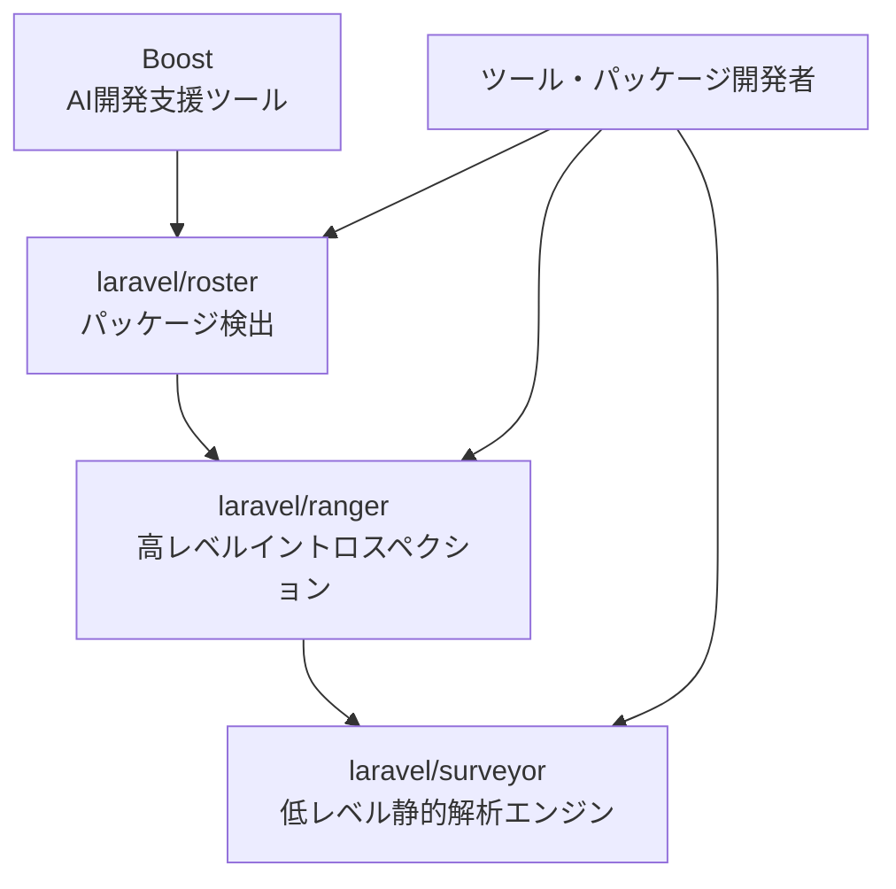
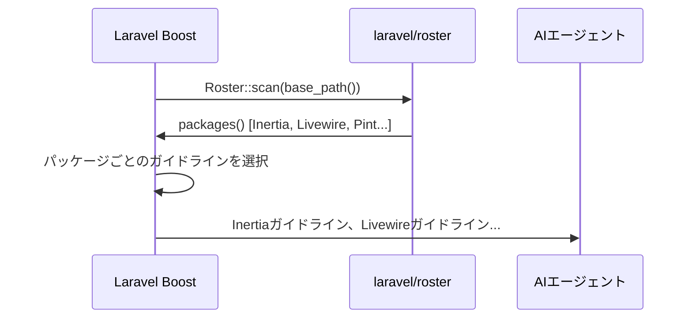
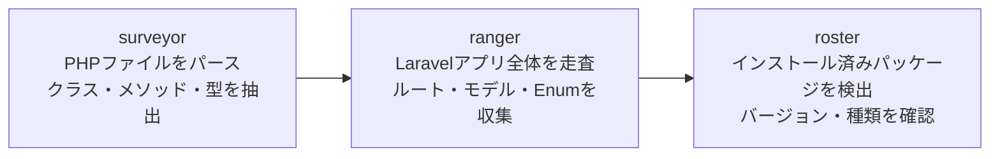

<Info>
  この記事はGitHubリポジトリのREADMEとソースコードに基づく情報です。3パッケージはいずれも正式リリース前のBeta版です（2026年4月時点）。
</Info>

<Warning>
  surveyor・ranger・rosterはいずれも**Betaリリース中**です。v1.0.0リリース前にAPIが変更される可能性があります。本番環境での利用は慎重に判断してください。
</Warning>

## 概要

Laravelは2026年に入り、コード解析に関連する3つのパッケージを公開しました。これらは単独でも使えますが、相互に連携した**コード解析エコシステム**を形成しています。



| パッケージ | 役割 | インストール |
|-----------|------|------------|
| `laravel/surveyor` | PHPコードの静的解析エンジン | `composer require laravel/surveyor` |
| `laravel/ranger` | Laravelアプリ全体のイントロスペクション | `composer require laravel/ranger` |
| `laravel/roster` | エコシステムパッケージの検出 | `composer require laravel/roster --dev` |

各パッケージの詳細を順に見ていきましょう。

---

## laravel/surveyor — 静的解析エンジン

[laravel/surveyor](https://github.com/laravel/surveyor) は、PHPファイルをパースしてクラス・メソッド・プロパティ・戻り値の型などの詳細なメタ情報を構造化形式で提供する静的解析ツールです。他のツールやパッケージが利用できる形で情報を抽出することに特化しています。

### インストール

```bash
composer require laravel/surveyor
```

### 基本的な使い方

#### ファイルを解析する

```php
use Laravel\Surveyor\Analyzer\Analyzer;

$analyzer = app(Analyzer::class);

// ファイルパスで解析
$result = $analyzer->analyze('/path/to/your/File.php');

// 解析済みスコープへアクセス
$scope = $result->analyzed();

// クラス結果へアクセス
$classResult = $result->result();
```

#### クラスを直接解析する

```php
$result = $analyzer->analyzeClass(\App\Models\User::class);
$classResult = $result->result();
```

### ClassResultで取得できる情報

```php
$classResult = $analyzer->analyzeClass(App\Models\User::class)->result();

// クラス情報
$name = $classResult->name();            // 'App\Models\User'
$namespace = $classResult->namespace();  // 'App\Models'
$filePath = $classResult->filePath();

// 継承関係
$extends = $classResult->extends();
$implements = $classResult->implements();

// メソッド情報
$method = $classResult->getMethod('store');
$returnType = $method->returnType();
$parameters = $method->parameters();
$rules = $method->validationRules(); // バリデーションルールも取得可能

// プロパティ情報
$property = $classResult->getProperty('email');
$type = $property->type;
$visibility = $property->visibility; // 'public', 'protected', 'private'

// 公開メソッド・プロパティの一覧
$publicMethods = $classResult->publicMethods();
$publicProperties = $classResult->publicProperties();
```

### 型システム

Surveyorは充実した型システムを持っており、PHPの型を構造化して扱えます。

```php
use Laravel\Surveyor\Types\Type;

// 各種型の生成
$stringType = Type::string();
$intType = Type::int();
$boolType = Type::bool();
$nullType = Type::null();

// ユニオン型（string|null など）
$unionType = Type::union(Type::string(), Type::null());

// 型の判定
use Laravel\Surveyor\Types\StringType;

if (Type::is($returnType, StringType::class)) {
    // 文字列型の処理
}
```

### キャッシュ設定

解析結果をキャッシュして繰り返し実行のパフォーマンスを改善できます。

```php
use Laravel\Surveyor\Analyzer\AnalyzedCache;

// ディスクキャッシュを有効にする
AnalyzedCache::enableDiskCache(storage_path('surveyor-cache'));

// キャッシュをクリアする
AnalyzedCache::clear();
```

環境変数でも設定できます。

```env
SURVEYOR_CACHE_ENABLED=true
SURVEYOR_CACHE_DIR=/path/to/cache
```

### Eloquentモデルの解析

Surveyorはデータベースへの接続を試みてEloquentモデルを特別に解析します。モデルのリレーション・属性・アクセサ・キャストも検出されます。

```php
$result = $analyzer->analyzeClass(App\Models\User::class)->result();

// データベース属性が自動検出される
$emailProperty = $result->getProperty('email');

// リレーションメソッドを判定
$method = $result->getMethod('posts');
if ($method->isModelRelation()) {
    // このメソッドはリレーション
}
```

<Info>
  SurveyorはEloquentモデルの解析時にデータベースへの接続を試みるため、完全な静的解析ではありません。また、パフォーマンスとメモリ使用量は現在改善中で、コントリビューションを歓迎しています。
</Info>

---

## laravel/ranger — 高レベルイントロスペクション

[laravel/ranger](https://github.com/laravel/ranger) はsurveyorをラップし、Laravelアプリケーション全体をウォークスルーしてルート・モデル・Enum・ブロードキャストイベント・環境変数・Inertiaコンポーネントなどの情報を収集する高レベルライブラリです。

### インストール

```bash
composer require laravel/ranger
```

### 基本的な使い方

コールバック形式で、各コンポーネントが発見されたときの処理を記述します。

```php
use Laravel\Ranger\Ranger;
use Laravel\Ranger\Components;
use Illuminate\Support\Collection;

$ranger = app(Ranger::class);

// ルートが発見されるたびに呼ばれる
$ranger->onRoute(function (Components\Route $route) {
    echo $route->uri();
});

// モデルが発見されるたびに呼ばれる
$ranger->onModel(function (Components\Model $model) {
    foreach ($model->getAttributes() as $name => $type) {
        // 属性名と型の処理
    }
});

// Enumが発見されるたびに呼ばれる
$ranger->onEnum(function (Components\Enum $enum) {
    //
});

// ブロードキャストイベントが発見されるたびに呼ばれる
$ranger->onBroadcastEvent(function (Components\BroadcastEvent $event) {
    //
});

// すべてのルートが収集された後に一度だけ呼ばれる
$ranger->onRoutes(function (Collection $routes) {
    //
});

// すべてのモデルが収集された後に一度だけ呼ばれる
$ranger->onModels(function (Collection $models) {
    //
});

// アプリケーション全体をウォークスルーしてコールバックを発火する
$ranger->walk();
```

### Rangerが収集するコンポーネント

| コレクター | 説明 |
|-----------|------|
| **Routes** | 全登録ルート（URI・パラメーター・HTTPメソッド・コントローラー・バリデーションルール・レスポンス） |
| **Models** | Eloquentモデルと属性・型・リレーション |
| **Enums** | PHPのBacked Enum（整数・文字列を持つEnum）とケース・値 |
| **BroadcastEvents** | `ShouldBroadcast`を実装したイベントとペイロード |
| **BroadcastChannels** | 登録済みブロードキャストチャンネル |
| **EnvironmentVariables** | `.env`ファイルで定義された環境変数 |
| **Inertia Shared Data** | グローバルに共有されたInertia.js props |
| **Inertia Components** | Inertia.jsのページコンポーネントと期待されるprops |

---

## laravel/roster — パッケージ検出ツール

[laravel/roster](https://github.com/laravel/roster) はプロジェクトにどのLaravelエコシステムパッケージがインストールされているかを検出するツールです。パッケージ開発者やツール作者が「このプロジェクトはInertiaを使っているか？」「Livewireのバージョンは？」といった情報を簡単に取得できます。

### インストール

```bash
composer require laravel/roster --dev
```

### 基本的な使い方

```php
use Laravel\Roster\Roster;
use Laravel\Roster\Packages;

// ディレクトリをスキャンしてRosterを取得
$roster = Roster::scan($directory);

// インストール済みパッケージの一覧
$roster->packages();

// 本番環境用パッケージのみ
$roster->packages()->production();

// 開発専用パッケージのみ
$roster->packages()->dev();

// 特定パッケージの有無を確認
$roster->uses(Packages::INERTIA);        // bool
$roster->uses(Packages::LIVEWIRE);       // bool

// バージョン条件を指定して確認
$roster->usesVersion(Packages::INERTIA, '2.0.0', '>=');   // Inertia 2.0.0以上か？
$roster->usesVersion(Packages::LIVEWIRE, '3.0.0', '>=');  // Livewire 3.0.0以上か？

// JavaScriptパッケージマネージャーの検出
$packageManager = $roster->nodePackageManager(); // 'npm', 'yarn', 'bun' など
```

---

## 実際のユースケース

### AIガイドライン生成ツール（Boost）

[Laravel Boost](https://github.com/laravel/boost) はrosterを使って、インストール済みのパッケージ構成を把握し、AIエージェント（GitHub CopilotやClaudeなど）向けのガイドラインとスキルの生成を自動調整しています。「このプロジェクトはInertiaを使っているか？」「Livewireは入っているか？」という情報を元に、適切なガイドラインファイルを選択してAIエージェントに提供します。



### パッケージ互換性チェッカーを作る

ユーザーのプロジェクトにインストールされているパッケージに応じて動作を変えるパッケージを開発する場合、rosterが非常に有効です。

```php
use Laravel\Roster\Roster;
use Laravel\Roster\Packages;

$roster = Roster::scan(base_path());

if ($roster->uses(Packages::INERTIA)) {
    // Inertia向けの処理
    if ($roster->usesVersion(Packages::INERTIA, '2.0.0', '>=')) {
        // Inertia v2以上向けの処理
    }
}

if ($roster->uses(Packages::LIVEWIRE)) {
    // Livewire向けの処理
}

// JavaScriptパッケージマネージャーに応じてインストールコマンドを変える
$pm = $roster->nodePackageManager();
echo "Run: {$pm} install your-package";
```

### アプリケーションドキュメント自動生成

rangerを使うと、Laravelアプリのルート・モデル・Enumを自動的に収集してドキュメントを生成するツールを構築できます。

```php
use Laravel\Ranger\Ranger;
use Laravel\Ranger\Components;

$ranger = app(Ranger::class);
$docs = [];

$ranger->onRoute(function (Components\Route $route) use (&$docs) {
    $docs['routes'][] = [
        'uri' => $route->uri(),
        // ルートのバリデーションルール・レスポンス型なども取得可能
    ];
});

$ranger->onModel(function (Components\Model $model) use (&$docs) {
    $docs['models'][] = [
        'attributes' => $model->getAttributes(),
    ];
});

$ranger->walk();

// $docs にアプリ全体の構造情報が収集される
```

---

## まとめ

surveyor・ranger・rosterは、Laravelエコシステムにおける**プログラムによるコード解析**の新しい基盤を提供します。



これらのパッケージは主にパッケージ開発者・ツール作者を対象としており、エンドユーザーが直接使うものではありません。しかし、Laravel BoostのようにLaravel公式ツールの内部でも積極的に活用されており、今後のエコシステム拡大が期待されます。

<Columns cols={3}>
  <Card title="laravel/surveyor" icon="github" href="https://github.com/laravel/surveyor">
    PHPコードの静的解析エンジン
  </Card>
  <Card title="laravel/ranger" icon="github" href="https://github.com/laravel/ranger">
    高レベルイントロスペクションライブラリ
  </Card>
  <Card title="laravel/roster" icon="github" href="https://github.com/laravel/roster">
    パッケージ検出ツール
  </Card>
</Columns>
