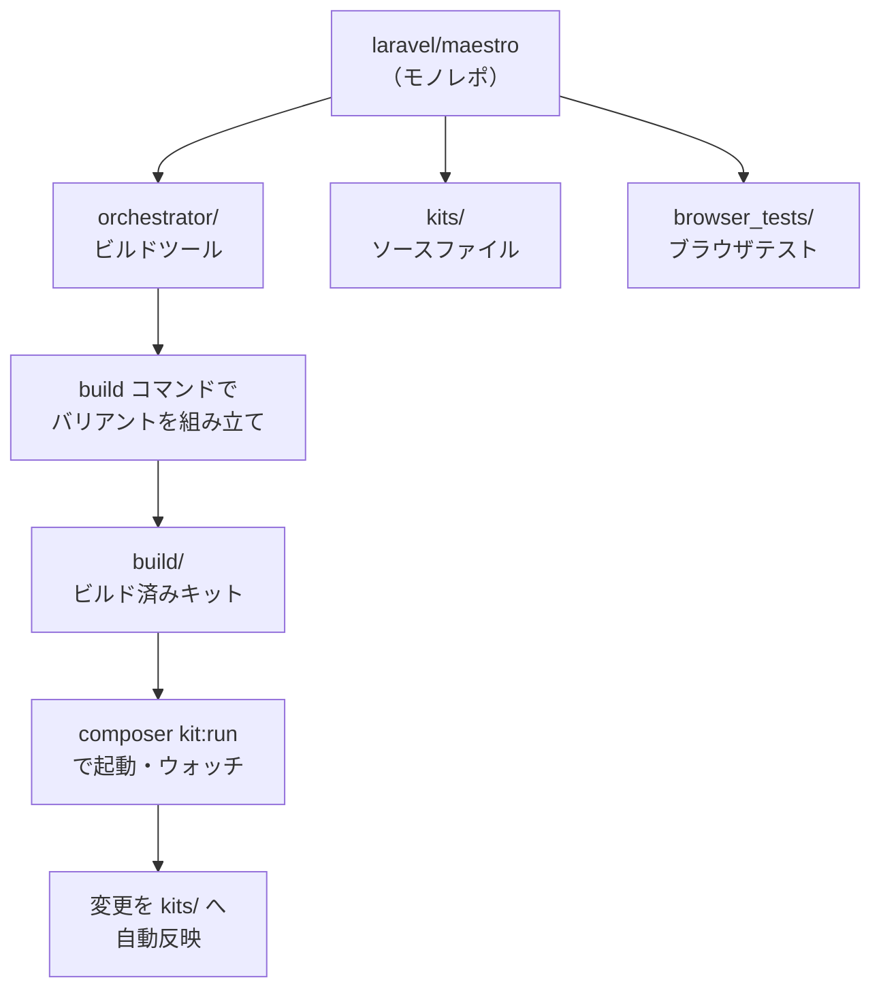
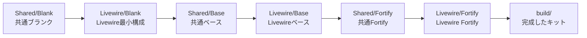

<Info>
  この記事はソースコード調査に基づく情報です。公式ドキュメントはまだ存在せず、正式リリース前のリポジトリとなります（2026年4月時点）。
</Info>

## Maestroとは

[Laravel Maestro](https://github.com/laravel/maestro) は、Laravelの[スターターキット](https://laravel.com/starter-kits)群を一元管理するためのモノレポ型オーケストレーターです。

Laravelのスターターキットには、React・Vue・Svelte（Inertia）とLivewireという複数のスタックがあり、さらにそれぞれに認証方式（Fortify・WorkOS）やオプション（Teams・Blank）を組み合わせた15種類以上のバリアントが存在します。Maestroはこれらすべてのバリアントを単一リポジトリで管理し、変更を各スターターキットリポジトリへ自動的に反映する仕組みを提供します。



## どんな問題を解決するか

スターターキットが多数のバリアントに分かれていると、一つの修正を全バリアントに反映する作業が煩雑になります。例えば認証フォームのバリデーション修正を React・Vue・Svelte・Livewire のそれぞれに個別にPRを出すのは非効率です。

Maestroはこの問題を「共有レイヤーとバリアントレイヤーの階層構造」で解決します。変更をどのレイヤーに加えるべきかをオーケストレーターが判断し、最も適切な場所に自動的に適用されます。

## スターターキットのバリアント

Maestroが管理するスターターキットは二つのスタックで構成されます。

### Livewire スタック（6バリアント）

| バリアント | 説明 |
|-----------|------|
| Blank | 認証なしの最小構成 |
| Fortify | Laravel Fortifyによる認証 |
| Fortify (Multi-file Components) | Bladeビューをコンポーネントファイルに分離した構成 |
| Fortify (Teams) | Fortify認証 + Teamsサポート |
| WorkOS | WorkOSによる認証 |
| WorkOS (Teams) | WorkOS認証 + Teamsサポート |

### Inertia スタック（15バリアント）

React・Vue・Svelteの3フレームワーク × Blank・Fortify・WorkOS × Teams有無の組み合わせで、合計15バリアントが存在します。

## リポジトリの構造

```
laravel/maestro/
├── orchestrator/    # ビルドを管理するLaravelアプリ
│   ├── app/Console/Commands/BuildCommand.php
│   ├── app/Enums/StarterKit.php
│   └── scripts/
├── kits/            # スターターキットのソースファイル
│   ├── Shared/      # 全バリアント共通ファイル
│   ├── Livewire/    # Livewire固有ファイル
│   └── Inertia/     # Inertia固有ファイル（React/Vue/Svelte）
└── browser_tests/   # ブラウザテスト
    ├── bootstrap/
    ├── common/
    └── teams/
```

`orchestrator` ディレクトリ自体がLaravelアプリケーションになっており、スターターキットのビルドと実行を管理します。

## ファイル階層システム

Maestroの核心は「レイヤーを重ねてスターターキットを組み立てる」仕組みです。Livewire（Fortify）の場合、以下の順でファイルがコピーされ、後のレイヤーが前のレイヤーを上書きします。



この階層のおかげで「すべてのキットに共通する修正は `Shared/` に、Livewire固有の修正は `Livewire/` に加える」という明確なルールができています。

## コントリビューションの流れ

スターターキットへのコントリビューションは、個別のスターターキットリポジトリではなく、このMaestroリポジトリで行います。

<Steps>
  <Step title="orchestratorディレクトリに移動してキットをビルドする">
    ```bash
    cd orchestrator
    php artisan build
    ```
    インタラクティブなプロンプトで対象キットと認証バリアントを選択します。フラグを使って直接指定することも可能です。

    ```bash
    php artisan build --kit=vue
    php artisan build --kit=react --workos
    php artisan build --kit=livewire --teams
    php artisan build --kit=vue --workos --teams
    ```
  </Step>
  <Step title="ビルドしたキットを起動する">
    ```bash
    composer kit:run
    ```
    Laravelの開発サーバーとファイルウォッチャーが同時に起動します。`build/` ディレクトリで行った変更は自動的に `kits/` の適切な場所へコピーされます。
  </Step>
  <Step title="変更を加えてテストする">
    `build/` ディレクトリ内のファイルを編集します。ウォッチャーが変更を検知し、自動的に `kits/` ディレクトリへ反映します。
  </Step>
  <Step title="PRを作成する">
    `kits/` ディレクトリへの変更をコミットしてPRを作成します。マージされると、Maestroが自動的に変更を各スターターキットリポジトリへプッシュします。
  </Step>
</Steps>

<Warning>
  `build/` ディレクトリはgitignoreされています。変更はすべて `build/` 内で行い、ウォッチャーに `kits/` へ同期させてからコミットしてください。
</Warning>

## その他の開発コマンド

### リント

```bash
# kitsとbrowser_testsにPintを実行（PHPのみ）
composer kits:pint

# PHPリント + 各Inertiaバリアントのフロントエンドリント
composer kits:lint

# 特定のフレームワークのみを対象にする
composer kits:lint -- --vue
composer kits:lint -- --react --svelte
```

### ブラウザテスト

```bash
# 全バリアントのブラウザテストを実行
composer kits:browser-tests

# 特定のフレームワーク・バリアントに絞り込む
composer kits:browser-tests -- --vue
composer kits:browser-tests -- --livewire --fortify
```

ブラウザテストはPest + Playwrightで動作します。`browser_tests/` ディレクトリに `bootstrap/`（共通設定）、`common/`（Fortify向け）、`teams/`（Teams向け）の3層構造でテストが整理されています。

### フラグによる絞り込み

各コマンドは `--livewire`・`--react`・`--svelte`・`--vue` フラグと `--blank`・`--fortify`・`--workos`・`--teams` フラグを組み合わせて対象を絞り込めます。

```bash
# VueとSvelteのFortifyバリアントのみチェック
composer kits:check -- --vue --svelte --fortify

# 全フレームワークのWorkOSバリアントのみ
composer kits:check -- --workos
```

## WorkOS環境変数の設定

WorkOSバリアントをビルドして実行する場合は、`orchestrator/.env` にWorkOSのクライアントIDとAPIキーを設定します。ビルド時にこれらの値が `build/` ディレクトリの `.env` ファイルにコピーされます。

```bash
# orchestrator/.env
WORKOS_CLIENT_ID=your_client_id
WORKOS_API_KEY=your_api_key
```

## 現在の開発状況

- **GitHubリポジトリ**: [laravel/maestro](https://github.com/laravel/maestro)
- **正式リリース**: なし（バージョンタグ・リリースは未公開）
- **最終コミット**: 2026年4月（アクティブに開発中）
- **必要なPHPバージョン**: ^8.2
- **Laravelバージョン**: ^13.0

Maestroはエンドユーザー向けのパッケージではなく、Laravelチームおよびコントリビューター向けの**開発インフラ**として機能しています。スターターキット本体（`laravel/starter-kit-react` など）はMaestroによってこのモノレポから生成・管理されます。

<Card title="laravel/maestro リポジトリ" icon="github" href="https://github.com/laravel/maestro">
  スターターキットへのコントリビューションに興味がある方は、まずMaestroのREADMEをご確認ください。
</Card>

<Card title="Laravel スターターキット公式ドキュメント" icon="book-open" href="https://laravel.com/docs/starter-kits">
  スターターキット自体の使い方については公式ドキュメントを参照してください。
</Card>
