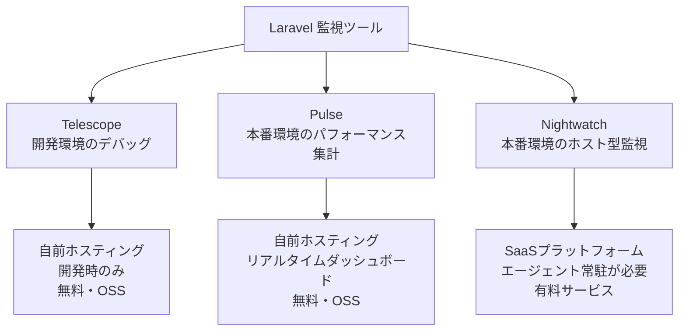
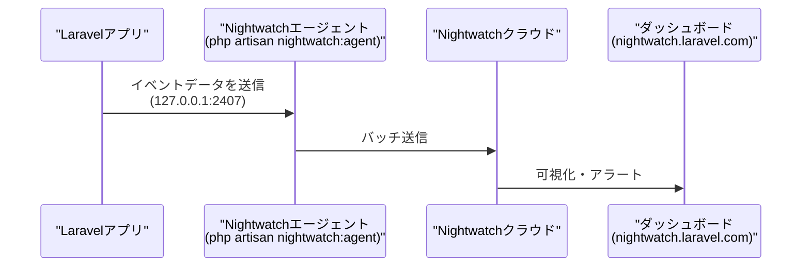
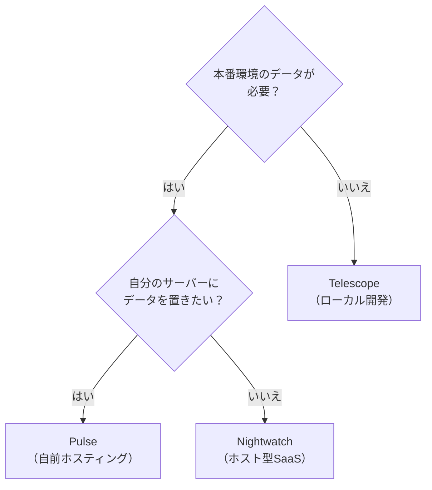

## Laravel Nightwatchとは

[Laravel Nightwatch](https://nightwatch.laravel.com) は、Laravelアプリケーションの本番環境を継続的に監視するための**ホスト型SaaSプラットフォーム**です。HTTPリクエスト、SQLクエリ、例外、キュージョブ、ログ、スケジュールタスクなど、アプリケーション全体のテレメトリーデータをリアルタイムに収集・可視化します。

<Info>
  Nightwatchは**有料サービス**（月額課金）です。無料プランでも利用できますが、収集できるイベント数に上限があります。無料プランで実用的に使うには、後述するサンプリングとフィルタリングの設定が必須です。
</Info>

---

## Telescope・Pulseとの違い

Nightwatchは、Laravelエコシステムにある既存の監視・デバッグツールと目的が異なります。それぞれの用途を整理します。



| ツール | 用途 | ホスティング | 対象環境 |
|--------|------|------------|----------|
| **Telescope** | 開発時のデバッグ・クエリ調査 | 自前（Laravelアプリ内） | ローカル開発 |
| **Pulse** | パフォーマンス指標の集計・表示 | 自前（Laravelアプリ内） | 本番・ステージング |
| **Nightwatch** | 本番アプリのリアルタイム監視 | Laravelホスト型SaaS | 本番環境 |

Telescopeとほぼ同じ情報を収集しますが、Nightwatchはエージェントプロセスを常駐させてデータをクラウドに送信します。そのため、サーバーが落ちていても履歴データを確認でき、複数サーバー・複数アプリケーションを一元管理できます。

---

## アーキテクチャ

Nightwatchは、LaravelアプリとNightwatchクラウドの間にエージェントプロセスを挟む構成を採っています。



エージェントはローカル（`127.0.0.1:2407`）で待機し、Laravelアプリからのイベントを受け取ってクラウドに転送します。このため、エージェントプロセスを常時稼働させる必要があります。

---

## インストールと初期設定

### 1. アカウント・アプリケーションの作成

[nightwatch.laravel.com](https://nightwatch.laravel.com) でアカウントを作成し、組織とアプリケーションを登録します。アプリケーション登録後に**環境トークン**が発行されます。

### 2. パッケージのインストール

```bash
composer require laravel/nightwatch
```

Telescopeとは異なり、`--dev` フラグは**不要**です。Nightwatchは本番環境での使用を前提としています。

### 3. トークンの設定

`.env` ファイルにトークンを追加します。

```ini
NIGHTWATCH_TOKEN=your-api-key
```

### 4. エージェントの起動

```bash
php artisan nightwatch:agent
```

エージェントはバックグラウンドで常時稼働させる必要があります。Laravel Cloud、Laravel Forge、Laravel Vapor には専用のガイドが用意されています。Forgeの場合、公式インテグレーションを使うと自動設定されます。

エージェントの状態確認：

```bash
php artisan nightwatch:status
```

### 5. テスト環境での無効化

テスト実行時はNightwatchを無効にすることを推奨します。

```ini
# .env
NIGHTWATCH_ENABLED=false
```

`phpunit.xml` でも設定できます。

```xml
<php>
    <env name="APP_ENV" value="testing"/>
    <env name="NIGHTWATCH_ENABLED" value="false"/>
</php>
```

---

## 無料プランで実用的に使うための設定

<Warning>
  **無料プランには月間イベント数の上限があります。** デフォルト設定（サンプリングレート100%・全データ収集）のままでは、トラフィックの多いアプリケーションではすぐに上限に達してしまいます。以下の設定を必ず適用してください。
</Warning>

### サンプリングレートを下げる

`NIGHTWATCH_REQUEST_SAMPLE_RATE` はデフォルトが `1.0`（全リクエスト収集）です。無料プランでは `0.1`（10%）程度に抑えることを推奨します。

```ini
# .env
NIGHTWATCH_REQUEST_SAMPLE_RATE=0.1
```

例外とコマンドは引き続き全件収集する設定例：

```ini
NIGHTWATCH_REQUEST_SAMPLE_RATE=0.1    # リクエストは10%のみ
NIGHTWATCH_EXCEPTION_SAMPLE_RATE=1.0  # 例外は全件（デフォルト）
NIGHTWATCH_COMMAND_SAMPLE_RATE=1.0    # コマンドは全件（デフォルト）
```

### クエリ収集を無効にする

データベースクエリはイベント数の大きな割合を占めます。無料プランではクエリ収集を無効にすることで、重要なイベント（例外・リクエスト・ジョブ）の保存余地を確保できます。

```ini
# .env
NIGHTWATCH_IGNORE_QUERIES=true
```

### その他のフィルタリング設定

必要に応じてキャッシュイベントやメール収集も無効化できます。

```ini
NIGHTWATCH_IGNORE_CACHE_EVENTS=true
NIGHTWATCH_IGNORE_MAIL=true
NIGHTWATCH_IGNORE_NOTIFICATIONS=true
NIGHTWATCH_IGNORE_OUTGOING_REQUESTS=true
```

### 無料プラン推奨設定まとめ

```ini
# .env（無料プラン推奨設定）
NIGHTWATCH_TOKEN=your-api-key
NIGHTWATCH_REQUEST_SAMPLE_RATE=0.1
NIGHTWATCH_IGNORE_QUERIES=true
```

この3行を設定するだけで、無料プランでも実用的なアプリケーション監視が実現できます。

---

## 主要機能

### リクエスト監視

HTTPリクエストごとにレスポンスタイム、ステータスコード、ルート情報などを収集します。異常に遅いエンドポイントを特定し、パフォーマンスのボトルネックを発見できます。

### 例外トラッキング

本番環境で発生した未処理の例外をリアルタイムに捕捉します。スタックトレースとソースコードのスニペットが自動的に記録され、原因調査が容易になります。

```ini
# 例外のソースコード収集（デフォルト有効）
NIGHTWATCH_CAPTURE_EXCEPTION_SOURCE_CODE=true
```

### ログ収集

Laravelのログシステム（`Log::error()` など）と統合し、構造化ログをNightwatchに送信します。

```ini
# 収集するログの最低レベル（デフォルト: debug）
NIGHTWATCH_LOG_LEVEL=error
```

### ジョブ・スケジュールタスク監視

キュージョブやスケジュールタスクの実行履歴、成功・失敗状態、実行時間を追跡します。バッチ処理の問題を素早く特定できます。

### デプロイメントトラッキング

リリースごとの変更点と問題を紐付けます。「このデプロイ後から例外が増えた」という調査が視覚的に行えます。

### アラートと通知

Slack連携やWebhookを使用して、例外の急増やパフォーマンス劣化を即座に通知できます。

---

## TelescopeとNightwatchの使い分け



- **ローカル開発** → Telescope
- **本番環境の集計ダッシュボードが欲しい** → Pulse
- **本番環境の詳細なトレースやアラートが欲しい** → Nightwatch

3つは相互排他ではなく、PulseとNightwatchを併用することも可能です。

---

## まとめ

Laravel Nightwatchは、本番Laravelアプリケーションの可視性を大幅に向上させる強力なSaaSツールです。導入の際は以下の点を押さえておきましょう。

- エージェントプロセスを常時稼働させる必要がある
- 無料プランは `NIGHTWATCH_REQUEST_SAMPLE_RATE=0.1` と `NIGHTWATCH_IGNORE_QUERIES=true` の設定が実用上必須
- Telescope（開発）・Pulse（集計）・Nightwatch（監視）は役割が異なり、併用できる

詳細な設定については[公式ドキュメント](https://nightwatch.laravel.com/docs/start-guide)および[環境変数リファレンス](https://nightwatch.laravel.com/docs/environment-variables)を参照してください。
