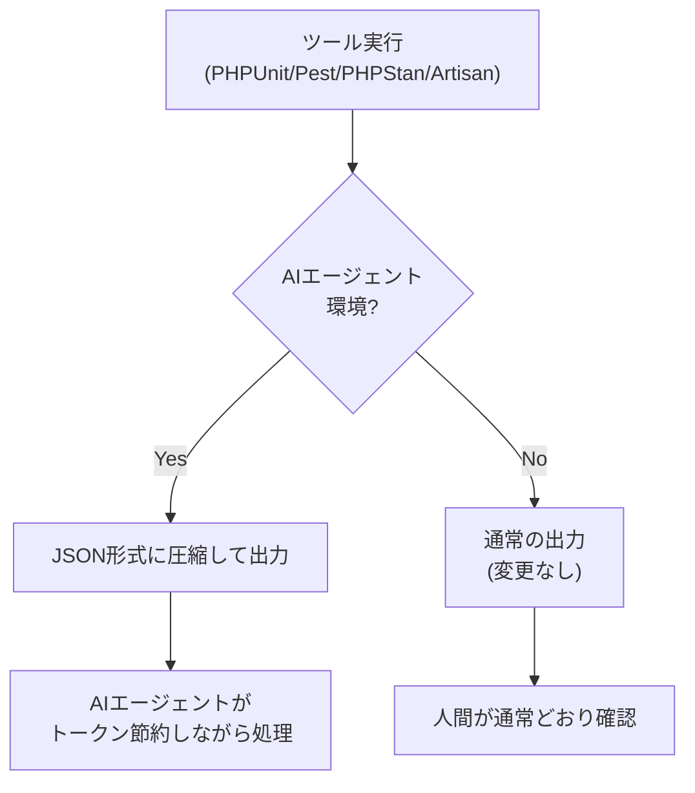

## はじめに

[laravel/pao](https://github.com/laravel/pao) は、PHP開発ツールの出力をAIエージェント向けに最適化するパッケージです。**PAO（PHP Agent-Optimized output）** は、PHPUnit・Pest・Paratest・PHPStan・Laravel Artisanの冗長な出力を、構造化されたコンパクトなJSONへ自動変換します。

GitHub Copilotを含む多くのAIエージェントがトークン数ベースの料金体系へ移行した結果、ツール出力の削減は直接コスト削減につながるようになりました。PAOはこの課題を解決するために設計されており、Laravel スターターキットのデフォルト依存として組み込まれる予定です。



## なぜ重要か

AIエージェントが開発フローに深く組み込まれるにつれて、ツールの出力トークン数がコストと応答速度に直結するようになっています。

テスト数が1,000件あるプロジェクトでは、PHPUnitの出力は数千行になりますが、AIエージェントが必要な情報は「成功・失敗・件数・失敗箇所」だけです。PAOはこの情報を1桁のJSONオブジェクトに圧縮します。

- **テスト出力**: 最大99.8%のトークン削減
- **PHPStan出力**: 構造化JSONで必要な情報だけを提供
- **Artisan出力**: ANSIコード・罫線文字・余白を除去して最大75%削減

## インストール

PHP 8.3以上、PHPUnit 12-13 / Pest 4-5 / Paratest / PHPStan / Laravel 12以上が対象です。

```bash
composer require laravel/pao --dev
```

インストールするだけで動作します。PAOはComposerのオートローダーを通じてPHPUnit・Pest・Paratest・PHPStanに自動でフックします。Laravelプロジェクトではサービスプロバイダーが自動検出され、Artisanの出力最適化も有効になります。

<Info>
PAOはAIエージェント環境を検出した場合のみ有効になります。人間がターミナルで直接実行する場合は完全に無効化され、通常の出力が維持されます。
</Info>

## 動作するAIエージェント

PAOは以下のAIエージェントを自動検出します。

| エージェント | 検出方法 |
|------------|--------|
| GitHub Copilot | `COPILOT_MODEL` などの環境変数 |
| Claude Code | `CLAUDECODE` または `CLAUDE_CODE` |
| Cursor | `CURSOR_AGENT` |
| Gemini CLI | `GEMINI_CLI` |
| Devin | `/opt/.devin` ファイル |
| Codex | `CODEX_SANDBOX` などの環境変数 |

## Before / After

### テスト出力（PHPUnit / Pest）

1,000件のテストスイートが次のように変換されます。

**Before（PAOなし）**

```
PHPUnit 12.5.14 by Sebastian Bergmann and contributors.

.............................................................   61 / 1002 (  6%)
.............................................................  122 / 1002 ( 12%)
...
..........................                                    1002 / 1002 (100%)

Time: 00:00.321, Memory: 46.50 MB

OK (1002 tests, 1002 assertions)
```

**After（PAOあり）**

```json
{
  "tool": "phpunit",
  "result": "passed",
  "tests": 1002,
  "passed": 1002,
  "duration_ms": 321
}
```

テスト数に関わらず出力は常に一定サイズです。テストが失敗した場合はファイルパス・行番号・失敗メッセージが含まれます。

### カバレッジなどのプラグイン出力

`--coverage` や `--profile` などのPestプラグインの追加出力はANSIコード・装飾を除去したうえで `raw` 配列に含まれます。

```json
{
  "tool": "pest",
  "result": "passed",
  "tests": 1002,
  "passed": 1002,
  "duration_ms": 1520,
  "raw": [
    "Http/Controllers/Controller 100.0%",
    "Models/User 0.0%",
    "Total: 33.3 %"
  ]
}
```

### PHPStan出力

```json
{
  "tool": "phpstan",
  "result": "failed",
  "errors": 2,
  "error_details": {
    "/app/Http/Controllers/Controller.php": [
      {
        "line": 9,
        "message": "Method Controller::index() should return int but returns string.",
        "identifier": "return.type"
      },
      {
        "line": 14,
        "message": "Call to an undefined method Controller::doesNotExist().",
        "identifier": "method.notFound"
      }
    ]
  }
}
```

### Laravel Artisan出力

`php artisan about` などのコマンド出力からANSIコード・罫線文字・ドット区切り・余白が除去されます。

**Before（PAOなし） — 2,111文字**

```
  Environment ................................................................
  Application Name ................................................... Laravel
  Laravel Version ..................................................... 13.3.0
  PHP Version .......................................................... 8.5.4
  Debug Mode ......................................................... ENABLED
```

**After（PAOあり） — 535文字**

```
 Environment ..
 Application Name .. Laravel
 Laravel Version .. 13.3.0
 PHP Version .. 8.5.4
 Debug Mode .. ENABLED
```

`about`・`db:show`・`migrate:status` などのコマンドで最大75%のトークン削減が見込めます。

## Laravel スターターキットへの統合

PAOはLaravelスターターキットのデフォルト依存として組み込まれる予定です。新規プロジェクトを作成すれば自動的にインストールされ、AIエージェントを使った開発でトークンコストを抑えた状態ですぐに始められます。

## まとめ

`laravel/pao` はインストールするだけで動作し、AIエージェント環境でのみ有効になるため、既存の開発ワークフローに一切影響を与えません。AIエージェントを使った開発コストを下げたいすべてのPHP・Laravelプロジェクトで導入を検討する価値があるパッケージです。

<Card title="laravel/pao リポジトリ" icon="github" href="https://github.com/laravel/pao">
  ソースコードと最新の対応ツール・エージェント一覧はこちら。
</Card>
