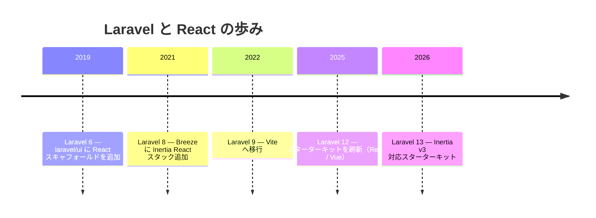
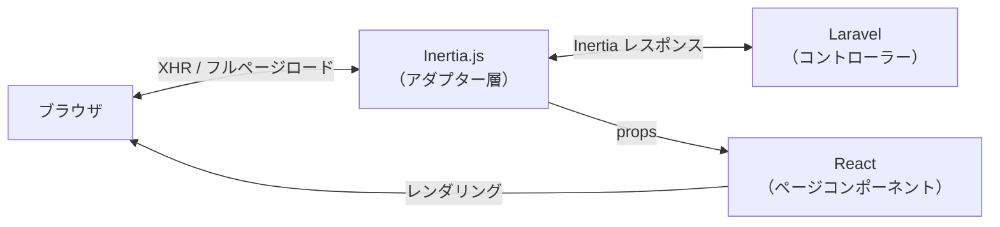

## Reactとは

React は Meta（旧 Facebook）が開発・維持するユーザーインターフェース構築のための JavaScript ライブラリです。宣言的な UI 記述と **コンポーネントベース**のアーキテクチャが特徴で、小規模なウィジェットからフル SPA まで幅広く活用されています。

Reactの核心は**仮想 DOM** を介した効率的な再レンダリングです。状態（state）が変化すると、React は差分だけを DOM に反映するため、手動で DOM を操作する必要がありません。

<Info>
  このページで解説するのは React 19 と Inertia v3 の組み合わせです。Laravel 13 のスターターキットはこの構成をデフォルトで使用します。
</Info>

### JSX と TSX

React コンポーネントは **JSX**（JavaScript XML）という構文で書きます。HTML に似た記法を JavaScript の中に直接書けます。

```jsx
// JSX の例
function Greeting({ name }) {
    return <h1>こんにちは、{name}さん</h1>
}
```

スターターキットでは **TypeScript**（`.tsx`）が標準採用されています。型定義により IDE の補完が強化され、バグを早期に発見できます。

```tsx
// TSX の例（TypeScript）
type Props = {
    name: string
}

function Greeting({ name }: Props) {
    return <h1>こんにちは、{name}さん</h1>
}
```

<Tip>
  Laravel の React スターターキットは TypeScript + TSX が標準です。本ページの例もすべて TSX で記述します。
</Tip>

---

## Laravel でのポジション

### 歴史

React と Laravel の関係は Vue よりやや浅めですが、現在では同等以上の扱いになっています。



**Laravel 6（2019年）** で認証スキャフォールドが `laravel/ui` パッケージとして切り離され、Vue と同時に React 版スキャフォールドも提供されました。ただし当時は Vue が主流で React 版の存在感は薄い状況でした。

**Laravel Breeze（2021年）** に Inertia + React スタックが追加されたことで本格的な採用が始まり、**Laravel 12（2025年）** のスターターキット刷新で React が Vue と完全に同列（むしろ最初に表示される）扱いになりました。

### 現在の主流スタイル：Inertia × React

現在の Laravel における React の使い方の中心は **Inertia × React** です。Inertia は API を設計せずに Laravel のコントローラーから直接 React コンポーネントにデータを渡せる「モダンモノリス」アーキテクチャを実現します。



---

## セットアップ

### スターターキット経由（推奨）

新規プロジェクトで始める場合はスターターキットを使うのが最も手軽です。

```shell
laravel new my-app
```

対話式プロンプトで **React** を選ぶと、以下がすべて自動でセットアップされます。

- `inertiajs/inertia-laravel`（サーバーサイドアダプター）
- `@inertiajs/react`（クライアントアダプター）
- `react` + `react-dom`（React 19 本体）
- `@vitejs/plugin-react`（Vite プラグイン）
- TypeScript + `@types/react`
- Tailwind CSS + shadcn/ui コンポーネントライブラリ
- `HandleInertiaRequests` ミドルウェア
- ログイン・登録などの認証画面（Inertia + React + TypeScript で実装済み）

### 手動インストール

既存プロジェクトに追加する場合は、サーバーサイドとクライアントサイドを別々にインストールします。

```shell
# サーバーサイド（PHP）
composer require inertiajs/inertia-laravel

# クライアントサイド（JavaScript）
npm install @inertiajs/react react react-dom
npm install --save-dev @vitejs/plugin-react @types/react @types/react-dom typescript
```

次に、`vite.config.ts` に React プラグインを追加します。

```ts
import { defineConfig } from 'vite'
import laravel from 'laravel-vite-plugin'
import react from '@vitejs/plugin-react'

export default defineConfig({
    plugins: [
        laravel({
            input: ['resources/css/app.css', 'resources/js/app.tsx'],
            refresh: true,
        }),
        react(),
    ],
})
```

`resources/js/app.tsx` で Inertia アプリを起動します。

```tsx
import { createInertiaApp } from '@inertiajs/react'
import { createRoot } from 'react-dom/client'
import { resolvePageComponent } from 'laravel-vite-plugin/inertia-helpers'

createInertiaApp({
    resolve: (name) =>
        resolvePageComponent(
            `./pages/${name}.tsx`,
            import.meta.glob('./pages/**/*.tsx'),
        ),
    setup({ el, App, props }) {
        createRoot(el).render(<App {...props} />)
    },
})
```

<Info>
  手動インストールの詳細（ルートテンプレートの設定やミドルウェアの登録など）は [Inertia 公式ドキュメント](https://inertiajs.com/installation) を参照してください。
</Info>

---

## ディレクトリ構造

スターターキットでは React のページコンポーネントを `resources/js/pages/` ディレクトリに配置します。

```
resources/js/
├── app.tsx            # Inertia アプリの起点
├── bootstrap.ts
├── components/        # 再利用可能な UI コンポーネント
│   ├── ui/            # shadcn/ui コンポーネント
│   └── ...
├── hooks/             # カスタム React フック
├── layouts/           # レイアウトコンポーネント
│   ├── app-layout.tsx
│   └── auth-layout.tsx
├── lib/               # ユーティリティ関数・設定
├── pages/             # Inertia ページコンポーネント（コントローラー名に対応）
│   ├── auth/
│   │   ├── login.tsx
│   │   └── register.tsx
│   ├── dashboard.tsx
│   └── posts/
│       ├── index.tsx
│       ├── create.tsx
│       └── show.tsx
└── types/             # TypeScript 型定義
```

`Inertia::render('posts/index', [...])` と書くと `resources/js/pages/posts/index.tsx` が対応するコンポーネントになります。

---

## ページコンポーネントの基本

Inertia のページコンポーネントは通常の React コンポーネントです。Laravel のコントローラーから渡したデータが props として受け取れます。

### コントローラー

```php
// app/Http/Controllers/PostController.php
use Inertia\Inertia;
use App\Models\Post;

class PostController extends Controller
{
    public function index()
    {
        return Inertia::render('posts/index', [
            'posts' => Post::latest()->paginate(10),
        ]);
    }
}
```

### React ページコンポーネント

```tsx
// resources/js/pages/posts/index.tsx
import { Link } from '@inertiajs/react'

type Post = {
    id: number
    title: string
    created_at: string
}

type Props = {
    posts: {
        data: Post[]
        // paginate(10) はページネーション情報も含むオブジェクトを返す
        // current_page, last_page, per_page, total なども利用可能
    }
}

export default function PostsIndex({ posts }: Props) {
    return (
        <div>
            <h1>投稿一覧</h1>
            {posts.data.map((post) => (
                <article key={post.id}>
                    <h2>
                        <Link href={`/posts/${post.id}`}>{post.title}</Link>
                    </h2>
                    <p>{post.created_at}</p>
                </article>
            ))}
        </div>
    )
}
```

コンポーネントの引数として props を受け取るだけで、コントローラーから渡したデータをそのまま使えます。REST API を定義する必要はありません。

---

## `Link` コンポーネント

`@inertiajs/react` が提供する `<Link>` コンポーネントを使うと、ページ遷移が XHR で行われ、ブラウザのフルリロードを回避できます。

```tsx
import { Link } from '@inertiajs/react'

export default function PostsIndex() {
    return (
        <div>
            {/* 基本的なリンク */}
            <Link href="/posts">投稿一覧</Link>

            {/* POST メソッドでリンク（削除など） */}
            <Link href="/posts/1" method="delete" as="button">
                削除
            </Link>

            {/* プリロード（ホバー時に事前取得） */}
            <Link href="/posts/1" preload>
                投稿を見る
            </Link>
        </div>
    )
}
```

通常の `<a>` タグと同じように書けますが、裏側で Inertia がページコンポーネントだけを差し替えるため SPA のような操作感になります。

---

## `useForm` フック

フォーム処理には `@inertiajs/react` の `useForm` フックを使います。フォームの状態管理・送信・バリデーションエラー表示がシンプルに実装できます。

### コントローラー側

```php
// app/Http/Controllers/PostController.php
class PostController extends Controller
{
    public function store(Request $request)
    {
        $validated = $request->validate([
            'title'   => ['required', 'string', 'max:255'],
            'content' => ['required', 'string'],
        ]);

        Post::create($validated + ['user_id' => auth()->id()]);

        return redirect()->route('posts.index')
            ->with('success', '投稿を作成しました。');
    }
}
```

### React フォームコンポーネント

```tsx
// resources/js/pages/posts/create.tsx
import { useForm } from '@inertiajs/react'
import { FormEventHandler } from 'react'

export default function PostCreate() {
    const { data, setData, post, processing, errors } = useForm({
        title: '',
        content: '',
    })

    const submit: FormEventHandler = (e) => {
        e.preventDefault()
        post('/posts')
    }

    return (
        <form onSubmit={submit}>
            <div>
                <label>タイトル</label>
                <input
                    type="text"
                    value={data.title}
                    onChange={(e) => setData('title', e.target.value)}
                />
                {errors.title && <p className="error">{errors.title}</p>}
            </div>

            <div>
                <label>本文</label>
                <textarea
                    value={data.content}
                    onChange={(e) => setData('content', e.target.value)}
                />
                {errors.content && <p className="error">{errors.content}</p>}
            </div>

            <button type="submit" disabled={processing}>
                {processing ? '送信中...' : '投稿する'}
            </button>
        </form>
    )
}
```

`useForm` が返すオブジェクトの主なプロパティをまとめます。

| プロパティ / メソッド | 説明 |
|----------------------|------|
| `data` | フォームのデータオブジェクト |
| `setData(field, value)` | フィールドの値を更新 |
| `errors` | バリデーションエラー（フィールド名でアクセス） |
| `processing` | 送信中は `true`（ボタン無効化に使う） |
| `isDirty` | 初期値から変更されている場合 `true` |
| `post(url)` | POST リクエストで送信 |
| `put(url)` | PUT リクエストで送信（更新） |
| `delete(url)` | DELETE リクエストで送信 |
| `reset()` | フォームを初期値にリセット |

バリデーションエラーが返ったとき、`useForm` は入力内容を保持したままエラーを表示します。

---

## 共有データ（Shared Data）

すべてのページで共通して必要なデータ（ログイン中のユーザー情報・フラッシュメッセージなど）は `HandleInertiaRequests` ミドルウェアの `share()` メソッドで定義します。

```php
// app/Http/Middleware/HandleInertiaRequests.php
use Illuminate\Http\Request;
use Inertia\Middleware;

class HandleInertiaRequests extends Middleware
{
    public function share(Request $request): array
    {
        return array_merge(parent::share($request), [
            'auth' => [
                'user' => $request->user()
                    ? $request->user()->only('id', 'name', 'email')
                    : null,
            ],
            'flash' => [
                'success' => $request->session()->get('success'),
                'error'   => $request->session()->get('error'),
            ],
        ]);
    }
}
```

React コンポーネントから共有データにアクセスするには `usePage()` フックを使います。

```tsx
import { usePage } from '@inertiajs/react'

type SharedProps = {
    auth: {
        user: { id: number; name: string; email: string } | null
    }
    flash: {
        success: string | null
        error: string | null
    }
}

export default function AppHeader() {
    const { auth, flash } = usePage<SharedProps>().props

    return (
        <>
            <header>
                {auth.user ? (
                    <span>{auth.user.name}</span>
                ) : (
                    <span>ゲスト</span>
                )}
            </header>

            {flash.success && (
                <div className="alert-success">{flash.success}</div>
            )}
        </>
    )
}
```

<Info>
  共有データはすべてのリクエストに含まれるため、必要最低限のデータに絞ることを推奨します。`fn()` を使ったレイジー評価にすると、実際にアクセスされたときだけ評価されます。
</Info>

---

## React フック基礎

Inertia × React で開発するうえで知っておくべき React の基本フックを紹介します。

### `useState` — ローカルな状態管理

```tsx
import { useState } from 'react'

export default function Counter() {
    const [count, setCount] = useState(0)
    const [isOpen, setIsOpen] = useState(false)

    return (
        <div>
            <p>{count}</p>
            <button onClick={() => setCount(count + 1)}>+1</button>
            <button onClick={() => setIsOpen(!isOpen)}>トグル</button>
        </div>
    )
}
```

### `useEffect` — 副作用の処理

```tsx
import { useState, useEffect } from 'react'

export default function Timer() {
    const [seconds, setSeconds] = useState(0)

    useEffect(() => {
        const timer = setInterval(() => {
            setSeconds((s) => s + 1)
        }, 1000)

        // クリーンアップ関数
        return () => clearInterval(timer)
    }, []) // 空配列 = マウント時に一度だけ実行

    return <p>経過時間: {seconds}秒</p>
}
```

### `useMemo` と `useCallback` — パフォーマンス最適化

```tsx
import { useMemo, useCallback } from 'react'
import { router } from '@inertiajs/react'

type Post = { id: number; title: string; published: boolean }
type Props = { posts: Post[] }

export default function PostsList({ posts }: Props) {
    // 値をメモ化（posts が変わらない限り再計算しない）
    const publishedPosts = useMemo(
        () => posts.filter((post) => post.published),
        [posts],
    )

    // 関数をメモ化（依存値が変わらない限り再生成しない）
    const handleClick = useCallback((id: number) => {
        router.visit(`/posts/${id}`)
    }, [])

    return (
        <ul>
            {publishedPosts.map((post) => (
                <li key={post.id} onClick={() => handleClick(post.id)}>
                    {post.title}
                </li>
            ))}
        </ul>
    )
}
```

---

## TypeScript サポート

スターターキットの React 版は TypeScript がデフォルトです。Inertia の型定義と組み合わせることで、props の型安全を確保できます。

### グローバル型定義

スターターキットでは `resources/js/types/index.d.ts` に共有データの型を定義します。

```ts
// resources/js/types/index.d.ts
export interface User {
    id: number
    name: string
    email: string
    email_verified_at?: string
}

export type PageProps<T extends Record<string, unknown> = Record<string, unknown>> = T & {
    auth: {
        user: User
    }
}
```

### ページコンポーネントでの型利用

```tsx
import { PageProps } from '@/types'

type Post = {
    id: number
    title: string
    content: string
}

export default function PostsIndex({ auth, posts }: PageProps<{ posts: Post[] }>) {
    return (
        <div>
            <p>ログイン中: {auth.user.name}</p>
            {posts.map((post) => (
                <article key={post.id}>
                    <h2>{post.title}</h2>
                </article>
            ))}
        </div>
    )
}
```

---

## まとめ

React は Laravel との組み合わせで、特に Inertia を経由した「モダンモノリス」構成で力を発揮します。TypeScript との相性も優れており、大規模なアプリケーション開発に向いています。

| 要素 | 役割 |
|------|------|
| Laravel コントローラー | ルーティング・データ取得・バリデーション |
| `Inertia::render()` | コントローラーから React コンポーネントへデータを渡す |
| React ページコンポーネント | props を受け取り UI をレンダリング |
| `useForm` | フォームの状態管理・送信・エラー表示 |
| `Link` コンポーネント | フルリロードなしのページ遷移 |
| `usePage().props` | 共有データへのアクセス |
| TypeScript | props の型安全・IDE 補完の強化 |

Inertia × React を使うと、Laravel バックエンドのシンプルさと React の強力なエコシステムを組み合わせた開発体験が得られます。スターターキットでプロジェクトを作成すれば、認証画面も含めてすぐに開発を始められます。

<Card title="Inertia.js 公式ドキュメント" icon="book-open" href="https://inertiajs.com">
  Inertia v3 の全機能については公式ドキュメントを参照してください。
</Card>
