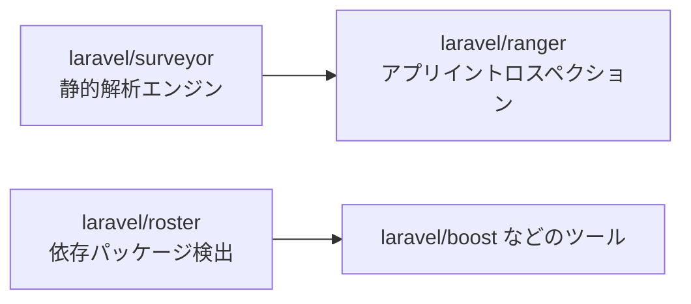

<Info>
  この記事は GitHub リポジトリの README・`composer.json`・リリース情報を一次情報として作成しています（2026年4月時点）。3パッケージとも `0.x` 系のため、仕様変更が入りやすい段階です。
</Info>

## 先に結論

- `surveyor` は PHP / Laravel 向けの低レベル解析エンジン
- `ranger` は `surveyor` を利用してアプリ全体を高レベルに走査する層
- `roster` はプロジェクトの依存パッケージ構成を検出する層



## laravel/roster

[laravel/roster](https://github.com/laravel/roster) は、Laravelプロジェクトをスキャンして「どのエコシステムパッケージを使っているか」を返す検出ライブラリです。README では `Roster::scan($directory)` から `packages()`・`uses()`・`usesVersion()`・`nodePackageManager()` を使うAPIが案内されています。`composer.json` は `php:^8.2` と `illuminate/*:^11|^12|^13` を要求しており、開発用途での導入を想定して `composer require laravel/roster --dev` が推奨されています。

```php
use Laravel\Roster\Roster;
use Laravel\Roster\Packages;

$roster = Roster::scan(base_path());

$roster->uses(Packages::INERTIA);
$roster->usesVersion(Packages::LIVEWIRE, '4.0.0', '>=');
```

現在の最新リリースは `v0.5.1`（2026-03-05）。`laravel/boost` 側の `composer.json` でも `laravel/roster:^0.5.0` が要求され、`BoostServiceProvider` で `Roster::scan(base_path())` が実行されています。つまり「Boostがプロジェクト構成を理解する入口」として実運用されています。

## laravel/ranger

[laravel/ranger](https://github.com/laravel/ranger) は、ルート・モデル・Enum・Broadcast・環境変数・Inertia情報などを横断収集するイントロスペクションライブラリです。README には `Beta` 表記があり、`v1.0.0` までAPI変更が想定されると明記されています。`Ranger` クラスは `onRoute()` や `onModel()` でコールバックを登録し、`walk()` 実行で各Collectorを巡回する構造です。

```php
use Laravel\Ranger\Ranger;
use Laravel\Ranger\Components;

$ranger = app(Ranger::class);

$ranger->onRoute(fn (Components\Route $route) => dump($route->uri()));
$ranger->onModel(fn (Components\Model $model) => dump($model->getAttributes()));

$ranger->walk();
```

最新リリースは `v0.1.12`（2026-04-16）。`composer.json` では `laravel/surveyor:^0.1.0` に依存しており、「高レベルAPIとしての ranger」と「解析エンジンとしての surveyor」の役割分離がはっきりしています。

## laravel/surveyor

[laravel/surveyor](https://github.com/laravel/surveyor) は、PHPコードを解析してクラス・メソッド・型情報を構造化して返す（mostly static analysis）ための基盤パッケージです。README では `Analyzer` による `analyze()` / `analyzeClass()` が中核APIとして説明され、`ClassResult`・型システム・キャッシュ機構・Eloquentモデル解析まで公開されています。こちらも README に `Beta` 表記があります。

```php
use Laravel\Surveyor\Analyzer\Analyzer;

$analyzer = app(Analyzer::class);
$result = $analyzer->analyzeClass(\App\Models\User::class);

$classResult = $result->result();
$classResult->publicMethods();
```

最新リリースは `v0.1.9`（2026-03-17）。`composer.json` は `php:^8.2` と `illuminate/*:^11|^12|^13` を要求し、Ranger と同じく Laravel 13 までのサポートが入っています。低レイヤーの解析器としてはかなり機能が公開されていますが、READMEにもあるとおりパフォーマンス最適化は継続中です。

## 現時点の所感

この3リポジトリは「単体で完結したユーザー向け機能」というより、Laravelエコシステムの周辺ツールを作るための基盤レイヤーに見えます。特に `roster` は Boost ですでに利用されており、`ranger` と `surveyor` は API の安定化とユースケース具体化がこれから進む段階です。情報がまだ断片的なので、`0.x` の更新履歴（Release / Changelog / 依存関係の変化）を継続ウォッチして、このページも追記していきます。

<Card title="比較: sentinel の調査記事" icon="book-open" href="/jp/blog/sentinel-introduction">
  同じ「新規公開リポジトリ調査」として `laravel/sentinel` の詳細はこちら。
</Card>
