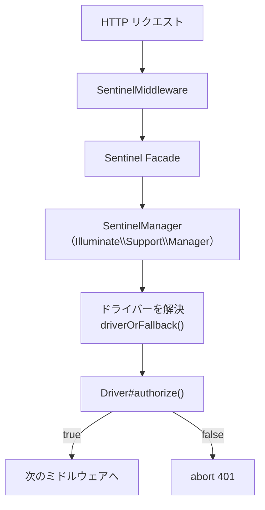
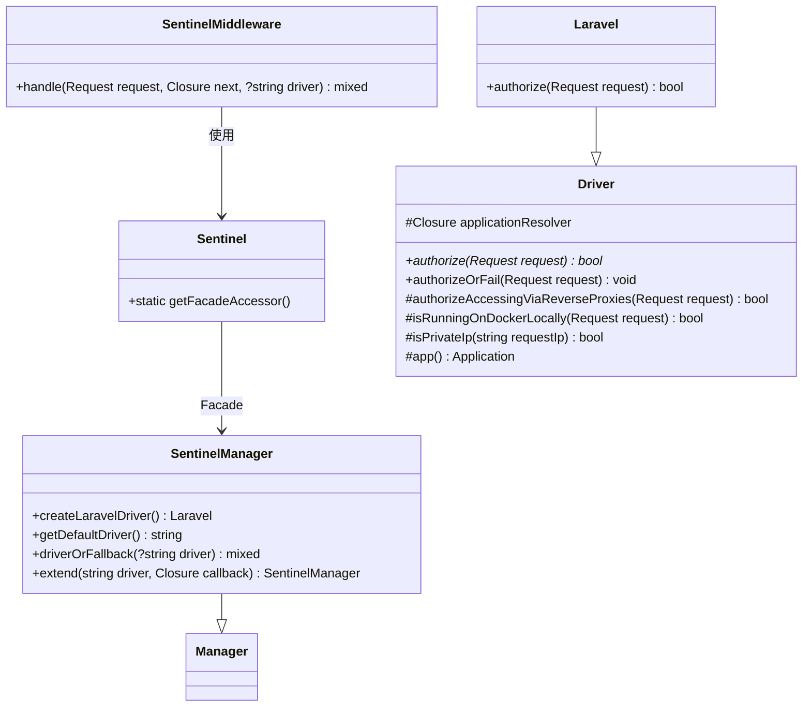
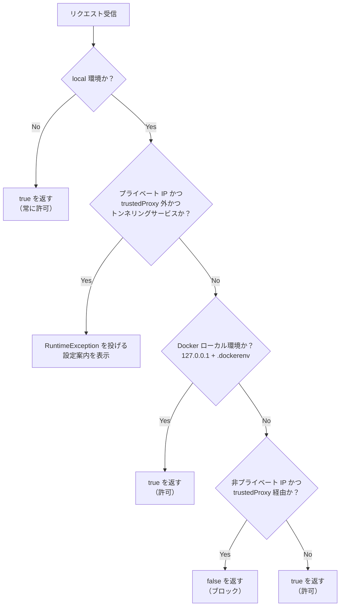

<Info>
  この記事はソースコード調査（`1.x` ブランチ）に基づく情報です。公式ドキュメントはまだ存在せず、正式リリース前のパッケージです（2026年4月時点）。
</Info>

## Sentinel とは

[Laravel Sentinel](https://github.com/laravel/sentinel) は、ルートへのアクセスをドライバーベースで制御するセキュリティミドルウェアパッケージです。Taylor Otwell と Mior Muhammad Zaki によって開発され、PHP ^8.0 / Laravel 8〜13 に対応しています。

主な用途は Telescope・Horizon・Pulse といった管理ツール系ルートの保護です。`SentinelMiddleware` をルートに適用するだけで、ドライバーが定義した認可ロジックでアクセスを制御できます。



## 従来の方法との比較

Telescope や Horizon にはそれぞれ `gate` を使った認可の仕組みが用意されていました。

```php
// 従来の方法（TelescopeServiceProvider など）
Gate::before(function ($user) {
    return $user->isAdmin() ? true : null;
});
```

この方式はユーザーの認証状態に依存しており、「ログインしていないと判定できない」という問題がありました。Sentinel はミドルウェアとして動作するため、認証の有無にかかわらずリクエスト単位でアクセスを制御できます。また複数の管理ツールに対して一か所でルールを定義できます。

## インストール

```bash
composer require laravel/sentinel
```

`composer.json` の `extra.laravel.providers` に `SentinelServiceProvider` が登録されているため、サービスプロバイダーは自動で検出されます。追加の設定ファイル公開は不要です。

## パッケージのアーキテクチャ



## デフォルトドライバー（Laravel ドライバー）の動作

デフォルトの `Laravel` ドライバーは、**ローカル環境（`APP_ENV=local`）においてのみ**制御を行います。

```php
// src/Drivers/Laravel.php
public function authorize(Request $request): bool
{
    if (! $this->app()->environment('local')) {
        return true; // local 以外は常に許可
    }

    // トンネリングサービス経由のアクセスに警告
    if ($this->isPrivateIp($request->ip())
        && ! $request->isFromTrustedProxy()
        && Str::endsWith($request->host(), ['.sharedwithexpose.com', '.ngrok-free.app', '.ngrok.io'])) {
        throw new RuntimeException(
            'Unable to access "..." using "local" environment, ...'
        );
    }

    // Docker ローカル環境は許可
    if ($this->isRunningOnDockerLocally($request)) {
        return true;
    }

    // リバースプロキシ経由のアクセスを確認
    return $this->authorizeAccessingViaReverseProxies($request);
}
```

フローをまとめると以下のとおりです。



<Warning>
  `Laravel` ドライバーは `local` 環境以外では常に `true`（許可）を返します。本番環境でのアクセス制御が必要な場合はカスタムドライバーを作成してください。
</Warning>

### プライベート IP の判定

`Driver` 基底クラスの `isPrivateIp()` は Symfony の `IpUtils` を使い、以下の IP 範囲をプライベート IP と判定します。

| 範囲 | 説明 |
|------|------|
| `127.0.0.0/8` | ループバック（RFC1700） |
| `10.0.0.0/8` | プライベート（RFC1918） |
| `192.168.0.0/16` | プライベート（RFC1918） |
| `172.16.0.0/12` | プライベート（RFC1918） |
| `169.254.0.0/16` | リンクローカル（RFC3927） |
| `::1/128` | IPv6 ループバック |
| `fc00::/7` | IPv6 ユニークローカル |
| `fe80::/10` | IPv6 リンクローカル |

### Docker ローカル環境の検出

```php
// src/Drivers/Driver.php
protected function isRunningOnDockerLocally(Request $request): bool
{
    return $request->server->get('REMOTE_ADDR') === '127.0.0.1'
        && file_exists(base_path('.dockerenv'));
}
```

`REMOTE_ADDR` が `127.0.0.1` で、かつプロジェクトルートに `.dockerenv` ファイルが存在する場合を Docker ローカル環境と判定します。

## ミドルウェアとして使う

### 基本的な使い方

```php
use Laravel\Sentinel\Http\Middleware\SentinelMiddleware;

Route::middleware(SentinelMiddleware::class)->group(function () {
    Route::get('/telescope', function () { /* ... */ });
    Route::get('/horizon', function () { /* ... */ });
    Route::get('/pulse', function () { /* ... */ });
});
```

### ドライバーを指定する

ミドルウェアの引数としてドライバー名を渡せます。存在しないドライバー名を渡した場合はデフォルトのドライバーにフォールバックします（`driverOrFallback()` の挙動）。

```php
Route::middleware([SentinelMiddleware::class . ':custom-driver'])->group(function () {
    // カスタムドライバーで認可
});
```

### ミドルウェアの実装

```php
// src/Http/Middleware/SentinelMiddleware.php
public function handle(Request $request, Closure $next, ?string $driver = null)
{
    abort_unless(Sentinel::driverOrFallback($driver)->authorize($request), 401);

    return $next($request);
}
```

`authorize()` が `false` を返すと HTTP 401 で中断します。`Driver::authorizeOrFail()` を使うと `AuthorizationException` を投げることもできます（ミドルウェア自体はこちらを使っていません）。

## カスタムドライバーの作成

`Driver` 抽象クラスを継承して `authorize()` メソッドを実装することでカスタムドライバーを作れます。

```php
use Laravel\Sentinel\Sentinel;
use Laravel\Sentinel\Drivers\Driver;
use Illuminate\Http\Request;

Sentinel::extend('admin-only', function ($app) {
    return new class extends Driver {
        public function authorize(Request $request): bool
        {
            // 認証済みかつ admin ロールを持つユーザーのみ許可
            $user = $request->user();

            return $user !== null && $user->hasRole('admin');
        }
    };
});
```

`extend()` の登録は `AppServiceProvider::boot()` などで行います。

### 基底クラスのユーティリティメソッドを活用する

`Driver` クラスには IP 判定などの便利なメソッドが用意されており、カスタムドライバーから自由に利用できます。

```php
public function authorize(Request $request): bool
{
    // 本番環境ではプライベート IP からのみ許可
    if ($this->app()->environment('production')) {
        return $this->isPrivateIp($request->ip());
    }

    // ローカルでは Docker か直接アクセスのみ
    return $this->isRunningOnDockerLocally($request)
        || $this->authorizeAccessingViaReverseProxies($request);
}
```

## SentinelManager の仕組み

`SentinelManager` は `Illuminate\Support\Manager` を継承しています。`Manager` はドライバーパターンを実装するための Laravel の基盤クラスで、`driver()` でドライバーインスタンスをキャッシュしながら解決します。

```php
// src/SentinelManager.php
class SentinelManager extends Manager
{
    protected function createLaravelDriver()
    {
        return new Laravel(fn () => $this->getContainer());
    }

    public function getDefaultDriver()
    {
        return 'laravel';
    }

    public function driverOrFallback(?string $driver)
    {
        return rescue(
            fn () => $this->driver($driver),
            value(fn () => $this->driver()),
            false  // ログに記録しない
        );
    }
}
```

`driverOrFallback()` は指定したドライバーが見つからない場合でもデフォルトドライバーに静かにフォールバックするため、ミドルウェア引数に存在しないドライバー名を渡してもエラーになりません。

`SentinelManager` は `SentinelServiceProvider` によってスコープ付きシングルトン（`scoped`）として登録されるため、1リクエスト内でドライバーのインスタンスが再利用されます。

```php
// src/SentinelServiceProvider.php
public function register(): void
{
    $this->app->scoped(SentinelManager::class, fn ($app) => new SentinelManager($app));
}
```

## まとめ

`laravel/sentinel` は小さなパッケージですが、`Illuminate\Support\Manager` を使ったドライバーパターンにより高い拡張性を持ちます。

| 項目 | 内容 |
|------|------|
| バージョン | 1.x |
| 対応 PHP | ^8.0 |
| 対応 Laravel | 8〜13 |
| デフォルトドライバー | local 環境のみ制御 |
| カスタムドライバー | `Sentinel::extend()` で追加可能 |

デフォルトの `Laravel` ドライバーはローカル開発時のトンネリングサービス経由のアクセスを防ぐことに特化しており、本番環境の保護には自前のカスタムドライバーを作成する必要があります。公式ドキュメントが整備されれば、より具体的な利用パターンが明らかになるでしょう。

<Card title="laravel/sentinel リポジトリ" icon="github" href="https://github.com/laravel/sentinel">
  ソースコードと最新の変更は GitHub の `1.x` ブランチで確認できます。
</Card>
