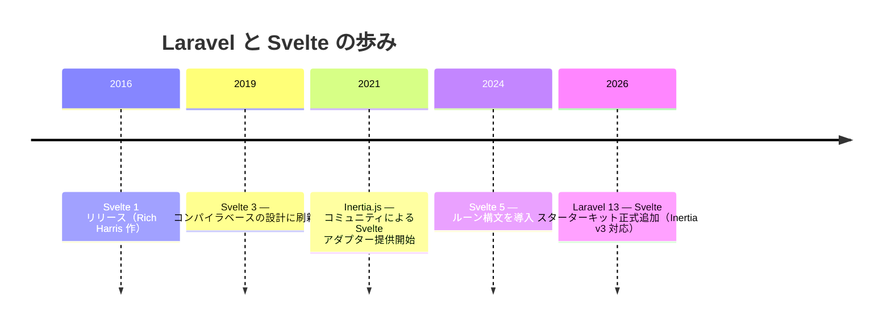
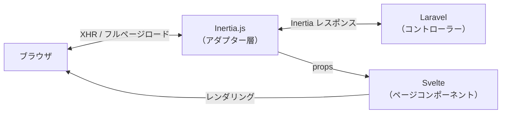

## Svelteとは

[Svelte](https://svelte.jp/) は JavaScript フレームワークの中でも独自の位置を占めています。React や Vue が**ランタイムライブラリ**として動作するのに対し、Svelte は**コンパイラ**として動作します。ビルド時にコンポーネントを純粋な JavaScript に変換するため、ブラウザに余分なフレームワークコードを送る必要がありません。

Svelte の最大の特徴は **Virtual DOM を使わない**点です。状態が変化すると、Svelte がコンパイル時に生成したコードが直接 DOM を更新します。これにより、非常に軽量で高速な UI が実現できます。

<Info>
  このページで解説するのは Svelte 5 と Inertia v3 の組み合わせです。Laravel 13 のスターターキットはこの構成をデフォルトで使用します。
</Info>

### Svelte 5 のルーン

Svelte 5（2024年リリース）では **ルーン（Runes）** と呼ばれる新しいリアクティビティシステムが導入されました。`$state`・`$derived`・`$effect` などの特別な関数（ルーン）を使ってリアクティブな状態を宣言します。Svelte 4 以前の暗黙的なリアクティビティとは異なり、明示的で予測しやすい設計になっています。

```svelte
<script lang="ts">
    let count = $state(0)

    function increment() {
        count++
    }
</script>

<button onclick={increment}>{count}</button>
```

<Tip>
  Laravel の Svelte スターターキットは Svelte 5 + TypeScript が標準です。本ページの例もすべて TypeScript（`lang="ts"`）で記述します。
</Tip>

---

## Laravel でのポジション

### 歴史

Svelte と Laravel の関係は Vue・React と比べて非常に新しく、**公式スターターキット**への採用が最初の公式サポートです。



**2026年の Laravel 13** でスターターキットに Svelte が正式追加されたことで、Svelte は Laravel エコシステムにおける公式フロントエンド選択肢の一つになりました。Vue・React と同列に扱われており、`laravel new` の対話プロンプトで選択できます。

Laravelユーザーにはまだあまり知られていないフレームワークですが、**コンパイラによる軽量バンドル**と**シンプルな構文**が特徴で、Vue や React から乗り換えると書く量が少ないことに驚くかもしれません。

### 現在の主流スタイル：Inertia × Svelte

現在の Laravel における Svelte の使い方の中心は **Inertia × Svelte** です。Inertia は API を設計せずに Laravel のコントローラーから直接 Svelte コンポーネントにデータを渡せる「モダンモノリス」アーキテクチャを実現します。



---

## セットアップ

### スターターキット経由（推奨）

新規プロジェクトで始める場合はスターターキットを使うのが最も手軽です。

```shell
laravel new my-app
```

対話式プロンプトで **Svelte** を選ぶと、以下がすべて自動でセットアップされます。

- `inertiajs/inertia-laravel`（サーバーサイドアダプター）
- `@inertiajs/svelte`（クライアントアダプター）
- `svelte` + `@sveltejs/vite-plugin-svelte`（Svelte 5 本体と Vite プラグイン）
- TypeScript + `svelte-check`
- Tailwind CSS + shadcn-svelte コンポーネントライブラリ
- `HandleInertiaRequests` ミドルウェア
- ログイン・登録などの認証画面（Inertia + Svelte + TypeScript で実装済み）

### 手動インストール

既存プロジェクトに追加する場合は、サーバーサイドとクライアントサイドを別々にインストールします。

```shell
# サーバーサイド（PHP）
composer require inertiajs/inertia-laravel

# クライアントサイド（JavaScript）
npm install @inertiajs/svelte @inertiajs/vite svelte
npm install --save-dev @sveltejs/vite-plugin-svelte svelte-check typescript
```

次に、`vite.config.ts` に Svelte プラグインと Inertia Vite プラグインを追加します。

```ts
import { defineConfig } from 'vite'
import laravel from 'laravel-vite-plugin'
import { svelte } from '@sveltejs/vite-plugin-svelte'
import inertia from '@inertiajs/vite'

export default defineConfig({
    plugins: [
        laravel({
            input: ['resources/css/app.css', 'resources/js/app.ts'],
            refresh: true,
        }),
        svelte(),
        inertia(),
    ],
})
```

`resources/js/app.ts` で Inertia アプリを起動します。`@inertiajs/vite` プラグインがページの自動解決とマウントを行うため、最小限のエントリーポイントだけで済みます。

```ts
import { createInertiaApp } from '@inertiajs/svelte'

createInertiaApp()
```

<Info>
  手動インストールの詳細（ルートテンプレートの設定やミドルウェアの登録など）は [Inertia 公式ドキュメント](https://inertiajs.com/installation) を参照してください。
</Info>

---

## ディレクトリ構造

スターターキットでは Svelte のページコンポーネントを `resources/js/pages/` ディレクトリに配置します。

```
resources/js/
├── app.ts             # Inertia アプリの起点
├── components/        # 再利用可能な UI コンポーネント
│   └── ui/            # shadcn-svelte コンポーネント
├── layouts/           # レイアウトコンポーネント
│   ├── AppLayout.svelte
│   └── AuthLayout.svelte
├── lib/               # ユーティリティ関数・Svelte ルーンモジュール
├── pages/             # Inertia ページコンポーネント（コントローラー名に対応）
│   ├── auth/
│   │   ├── Login.svelte
│   │   └── Register.svelte
│   ├── Dashboard.svelte
│   └── posts/
│       ├── Index.svelte
│       ├── Create.svelte
│       └── Show.svelte
└── types/             # TypeScript 型定義
```

`Inertia::render('posts/Index', [...])` と書くと `resources/js/pages/posts/Index.svelte` が対応するコンポーネントになります。

---

## Svelte ファイルの基本構造

`.svelte` ファイルは **`<script>`・テンプレート・`<style>`** の3つのブロックで構成されます。

```svelte
<script lang="ts">
    // ロジック（TypeScript）
    let name = $state('Laravel')
</script>

<!-- テンプレート（HTML ライクな記法） -->
<h1>Hello, {name}!</h1>

<style>
    /* スコープ付き CSS（このコンポーネントのみに適用） */
    h1 {
        color: #ff2d20;
    }
</style>
```

Vue の Single File Component（SFC）に似た構造ですが、テンプレートとスクリプトの記述量が少ないのが特徴です。`<style>` はデフォルトでスコープが限定されているため、クラス名の衝突を気にする必要がありません。

### テンプレート構文

#### 変数展開と式

テンプレート内では `{}` を使って JavaScript の値や式を埋め込みます。

```svelte
<script lang="ts">
    let name = $state('世界')
    let count = $state(3)
</script>

<p>こんにちは、{name}!</p>
<p>2倍は {count * 2}</p>
```

#### `{#if}` — 条件分岐

```svelte
<script lang="ts">
    let isLoggedIn = $state(false)
    let role = $state('editor')
</script>

{#if isLoggedIn}
    <p>ようこそ！</p>
{:else if role === 'admin'}
    <p>管理者としてログイン中</p>
{:else}
    <a href="/login">ログイン</a>
{/if}
```

Vue の `v-if` / `v-else`、React の三項演算子に相当します。

#### `{#each}` — リスト描画

```svelte
<script lang="ts">
    type Post = { id: number; title: string }
    let posts = $state<Post[]>([
        { id: 1, title: '最初の投稿' },
        { id: 2, title: '2番目の投稿' },
    ])
</script>

<ul>
    {#each posts as post (post.id)}
        <li>{post.title}</li>
    {/each}
</ul>
```

`(post.id)` はキー指定で、効率的な差分更新に使われます。Vue の `v-for` / React の `Array.map()` に相当します。

#### `bind:` — 双方向バインディング

`bind:value` を使うと、フォーム要素の値とリアクティブ変数を双方向に同期できます。

```svelte
<script lang="ts">
    let title = $state('')
    let agreed = $state(false)
    let role = $state('viewer')
</script>

<!-- テキスト入力 -->
<input bind:value={title} type="text" />
<p>入力中: {title}</p>

<!-- チェックボックス -->
<input bind:checked={agreed} type="checkbox" />
<p>同意: {agreed}</p>

<!-- セレクトボックス -->
<select bind:value={role}>
    <option value="viewer">閲覧者</option>
    <option value="editor">編集者</option>
    <option value="admin">管理者</option>
</select>
```

Vue の `v-model` に相当します。React では `onChange` ハンドラを手書きする必要がありましたが、Svelte では `bind:` で宣言的に書けます。

---

## ページコンポーネントの基本

Inertia のページコンポーネントは通常の Svelte コンポーネントです。Laravel のコントローラーから渡したデータが props として受け取れます。

### コントローラー

```php
// app/Http/Controllers/PostController.php
use Inertia\Inertia;
use App\Models\Post;

class PostController extends Controller
{
    public function index()
    {
        return Inertia::render('posts/Index', [
            'posts' => Post::latest()->paginate(10),
        ]);
    }
}
```

### Svelte ページコンポーネント

Svelte 5 では `$props()` ルーンを使って props を受け取ります。

```svelte
<!-- resources/js/pages/posts/Index.svelte -->
<script lang="ts">
    import { Link } from '@inertiajs/svelte'

    type Post = {
        id: number
        title: string
        created_at: string
    }

    type Props = {
        posts: {
            data: Post[]
        }
    }

    let { posts }: Props = $props()
</script>

<div>
    <h1>投稿一覧</h1>
    {#each posts.data as post (post.id)}
        <article>
            <h2>
                <Link href={`/posts/${post.id}`}>{post.title}</Link>
            </h2>
            <p>{post.created_at}</p>
        </article>
    {/each}
</div>
```

`$props()` で props を受け取るだけで、コントローラーから渡したデータをテンプレートで使えます。REST API を定義する必要はありません。

---

## `Link` コンポーネント

`@inertiajs/svelte` が提供する `<Link>` コンポーネントを使うと、ページ遷移が XHR で行われ、ブラウザのフルリロードを回避できます。

```svelte
<script lang="ts">
    import { Link } from '@inertiajs/svelte'
</script>

<!-- 基本的なリンク -->
<Link href="/posts">投稿一覧</Link>

<!-- POST メソッドでリンク（削除など） -->
<Link href="/posts/1" method="delete" as="button">
    削除
</Link>

<!-- プリロード（ホバー時に事前取得） -->
<Link href="/posts/1" preload>投稿を見る</Link>
```

通常の `<a>` タグと同じように書けますが、裏側で Inertia がページコンポーネントだけを差し替えるため SPA のような操作感になります。

---

## `Form` コンポーネント

`@inertiajs/svelte` が提供する `<Form>` コンポーネントは、スターターキットの認証画面で使われているフォーム送信の推奨スタイルです。`action` と `method` を props で指定し、内部を **`{#snippet}`** で記述します。

### 基本的な使い方

```svelte
<script lang="ts">
    import { Form } from '@inertiajs/svelte'
</script>

<Form action="/posts" method="post" class="flex flex-col gap-4">
    {#snippet children({ errors, processing })}
        <div>
            <label for="title">タイトル</label>
            <input id="title" name="title" type="text" required />
            {#if errors.title}
                <p class="error">{errors.title}</p>
            {/if}
        </div>

        <div>
            <label for="content">本文</label>
            <textarea id="content" name="content"></textarea>
            {#if errors.content}
                <p class="error">{errors.content}</p>
            {/if}
        </div>

        <button type="submit" disabled={processing}>
            {processing ? '送信中...' : '投稿する'}
        </button>
    {/snippet}
</Form>
```

`{#snippet children({ errors, processing })}` は Svelte のスニペット構文で、コンポーネントに渡すコンテンツブロックです（Vue のスロットや React の render props に相当）。`errors` と `processing` は `Form` コンポーネントが自動で算出して渡してくれます。フォームフィールドには `bind:value` ではなく HTML ネイティブの `name` 属性を使い、ブラウザの標準フォームデータ収集が機能します。

### スターターキットのパターン

スターターキットは [Wayfinder](https://github.com/laravel/wayfinder) を使ってルートをオブジェクトとして管理しています。`store.form()` はルートオブジェクトの `action` と `method` を含むオブジェクトを返し、`<Form>` に spread します。

```svelte
<script lang="ts">
    import { Form } from '@inertiajs/svelte'
    import { store } from '@/routes/login'
</script>

<Form
    {...store.form()}
    resetOnSuccess={['password']}
    class="flex flex-col gap-6"
>
    {#snippet children({ errors, processing })}
        <!-- フォームの中身 -->
    {/snippet}
</Form>
```

`resetOnSuccess` に指定したフィールドは、送信成功時に自動でリセットされます。パスワードフィールドなど送信後に空にしたいフィールドに指定します。

<Info>
  Wayfinder を使わない場合は `action="/login"` のように直接 URL を渡せば同じように動作します。
</Info>

---

## `useForm` フック

フォーム処理には `@inertiajs/svelte` の `useForm` フックを使います。フォームの状態管理・送信・バリデーションエラー表示がシンプルに実装できます。

### コントローラー側

```php
// app/Http/Controllers/PostController.php
class PostController extends Controller
{
    public function store(Request $request)
    {
        $validated = $request->validate([
            'title'   => ['required', 'string', 'max:255'],
            'content' => ['required', 'string'],
        ]);

        Post::create($validated + ['user_id' => auth()->id()]);

        return redirect()->route('posts.index')
            ->with('success', '投稿を作成しました。');
    }
}
```

### Svelte フォームコンポーネント

```svelte
<!-- resources/js/pages/posts/Create.svelte -->
<script lang="ts">
    import { useForm } from '@inertiajs/svelte'

    const form = useForm({
        title: '',
        content: '',
    })

    function submit(e: SubmitEvent) {
        e.preventDefault()
        form.post('/posts')
    }
</script>

<form onsubmit={submit}>
    <div>
        <label>タイトル</label>
        <input type="text" bind:value={form.data.title} />
        {#if form.errors.title}
            <p class="error">{form.errors.title}</p>
        {/if}
    </div>

    <div>
        <label>本文</label>
        <textarea bind:value={form.data.content}></textarea>
        {#if form.errors.content}
            <p class="error">{form.errors.content}</p>
        {/if}
    </div>

    <button type="submit" disabled={form.processing}>
        {form.processing ? '送信中...' : '投稿する'}
    </button>
</form>
```

`useForm` が返すオブジェクトの主なプロパティをまとめます。

| プロパティ / メソッド | 説明 |
|----------------------|------|
| `form.data` | フォームのデータオブジェクト |
| `form.errors` | バリデーションエラー（フィールド名でアクセス） |
| `form.processing` | 送信中は `true`（ボタン無効化に使う） |
| `form.isDirty` | 初期値から変更されている場合 `true` |
| `form.post(url)` | POST リクエストで送信 |
| `form.put(url)` | PUT リクエストで送信（更新） |
| `form.delete(url)` | DELETE リクエストで送信 |
| `form.reset()` | フォームを初期値にリセット |

バリデーションエラーが返ったとき、`useForm` は入力内容を保持したままエラーを表示します。`bind:value` との組み合わせでシームレスなフォーム体験を実現できます。

---

## 共有データ（Shared Data）

すべてのページで共通して必要なデータ（ログイン中のユーザー情報・フラッシュメッセージなど）は `HandleInertiaRequests` ミドルウェアの `share()` メソッドで定義します。

```php
// app/Http/Middleware/HandleInertiaRequests.php
use Illuminate\Http\Request;
use Inertia\Middleware;

class HandleInertiaRequests extends Middleware
{
    public function share(Request $request): array
    {
        return array_merge(parent::share($request), [
            'auth' => [
                'user' => $request->user()
                    ? $request->user()->only('id', 'name', 'email')
                    : null,
            ],
            'flash' => [
                'success' => $request->session()->get('success'),
                'error'   => $request->session()->get('error'),
            ],
        ]);
    }
}
```

Svelte コンポーネントから共有データにアクセスするには `usePage()` を使います。

```svelte
<script lang="ts">
    import { usePage } from '@inertiajs/svelte'

    type SharedProps = {
        auth: {
            user: { id: number; name: string; email: string } | null
        }
        flash: {
            success: string | null
            error: string | null
        }
    }

    const page = usePage<SharedProps>()
</script>

<header>
    {#if page.props.auth.user}
        <span>{page.props.auth.user.name}</span>
    {:else}
        <span>ゲスト</span>
    {/if}
</header>

{#if page.props.flash.success}
    <div class="alert-success">{page.props.flash.success}</div>
{/if}
```

<Info>
  共有データはすべてのリクエストに含まれるため、必要最低限のデータに絞ることを推奨します。`fn()` を使ったレイジー評価にすると、実際にアクセスされたときだけ評価されます。
</Info>

---

## Svelte 5 のリアクティビティ（ルーン）

Inertia × Svelte で開発するうえで知っておくべき Svelte 5 のルーン構文を紹介します。

### `$state` — リアクティブな状態

```svelte
<script lang="ts">
    let count = $state(0)
    let isOpen = $state(false)
    let items = $state<string[]>([])
</script>

<p>{count}</p>
<button onclick={() => count++}>+1</button>
<button onclick={() => isOpen = !isOpen}>トグル</button>
```

`$state` で宣言した変数は自動的にリアクティブになります。値が変わると DOM が自動更新されます。Vue の `ref` や React の `useState` に相当しますが、`.value` プロパティへのアクセスが不要で、代入するだけで状態を更新できます。

### `$derived` — 派生した値

```svelte
<script lang="ts">
    let posts = $state<{ title: string; published: boolean }[]>([])

    // published が true の投稿だけを抽出
    let publishedPosts = $derived(posts.filter(post => post.published))

    // 複数の依存関係がある場合
    let summary = $derived.by(() => {
        const total = posts.length
        const published = publishedPosts.length
        return `全${total}件中${published}件公開`
    })
</script>

<p>{summary}</p>
```

`$derived` は依存する値が変わると自動的に再計算されます。Vue の `computed` や React の `useMemo` に相当します。

### `$effect` — 副作用の処理

```svelte
<script lang="ts">
    let query = $state('')

    // query が変わるたびに実行
    $effect(() => {
        console.log('検索クエリが変わりました:', query)

        // クリーンアップ関数を返すことができる
        return () => {
            console.log('クリーンアップ')
        }
    })
</script>

<input bind:value={query} placeholder="検索..." />
```

`$effect` は依存する `$state` 値が変化するたびに実行されます。React の `useEffect` に相当しますが、依存配列を明示する必要がなく、使用した `$state` 変数が自動的に追跡されます。

---

## shadcn-svelte コンポーネント

スターターキットには [shadcn-svelte](https://www.shadcn-svelte.com/) が組み込まれています。shadcn-svelte は React 向けの shadcn/ui と同じ設計思想を持つコンポーネントライブラリで、コードをプロジェクトにコピーして自由にカスタマイズできます。

### コンポーネントの追加

```shell
npx shadcn-svelte@latest add button
npx shadcn-svelte@latest add input
npx shadcn-svelte@latest add card
```

コマンドを実行すると `resources/js/components/ui/` にコンポーネントのソースコードが配置されます。

### 使い方

```svelte
<script lang="ts">
    import { Button } from '@/components/ui/button'
    import { Input } from '@/components/ui/input'
    import * as Card from '@/components/ui/card'
    import { useForm } from '@inertiajs/svelte'

    const form = useForm({ email: '', password: '' })

    function submit(e: SubmitEvent) {
        e.preventDefault()
        form.post('/login')
    }
</script>

<Card.Root class="w-96">
    <Card.Header>
        <Card.Title>ログイン</Card.Title>
    </Card.Header>
    <Card.Content>
        <form onsubmit={submit} class="space-y-4">
            <Input
                type="email"
                bind:value={form.data.email}
                placeholder="メールアドレス"
            />
            {#if form.errors.email}
                <p class="text-sm text-red-500">{form.errors.email}</p>
            {/if}

            <Input
                type="password"
                bind:value={form.data.password}
                placeholder="パスワード"
            />

            <Button type="submit" disabled={form.processing} class="w-full">
                {form.processing ? 'ログイン中...' : 'ログイン'}
            </Button>
        </form>
    </Card.Content>
</Card.Root>
```

スターターキットには Button・Input・Card・Dialog・Dropdown など、よく使うコンポーネントがあらかじめ含まれています。追加したいコンポーネントは `npx shadcn-svelte@latest add` コマンドで随時追加できます。

---

## まとめ

Svelte は Laravel との組み合わせで、特に Inertia を経由した「モダンモノリス」構成で力を発揮します。コンパイラベースの設計によりバンドルサイズが小さく、ルーン構文によりリアクティビティが明示的で理解しやすいのが特徴です。

| 要素 | 役割 |
|------|------|
| Laravel コントローラー | ルーティング・データ取得・バリデーション |
| `Inertia::render()` | コントローラーから Svelte コンポーネントへデータを渡す |
| Svelte ページコンポーネント | `$props()` で props を受け取り UI をレンダリング |
| `useForm` | フォームの状態管理・送信・エラー表示 |
| `Link` コンポーネント | フルリロードなしのページ遷移 |
| `usePage().props` | 共有データへのアクセス |
| shadcn-svelte | 標準コンポーネントライブラリ |

Inertia × Svelte を使うと、Laravel バックエンドのシンプルさと Svelte のコンパクトな記述スタイルを組み合わせた開発体験が得られます。スターターキットでプロジェクトを作成すれば、認証画面も含めてすぐに開発を始められます。

<Card title="Inertia.js 公式ドキュメント" icon="book-open" href="https://inertiajs.com">
  Inertia v3 の全機能については公式ドキュメントを参照してください。
</Card>
