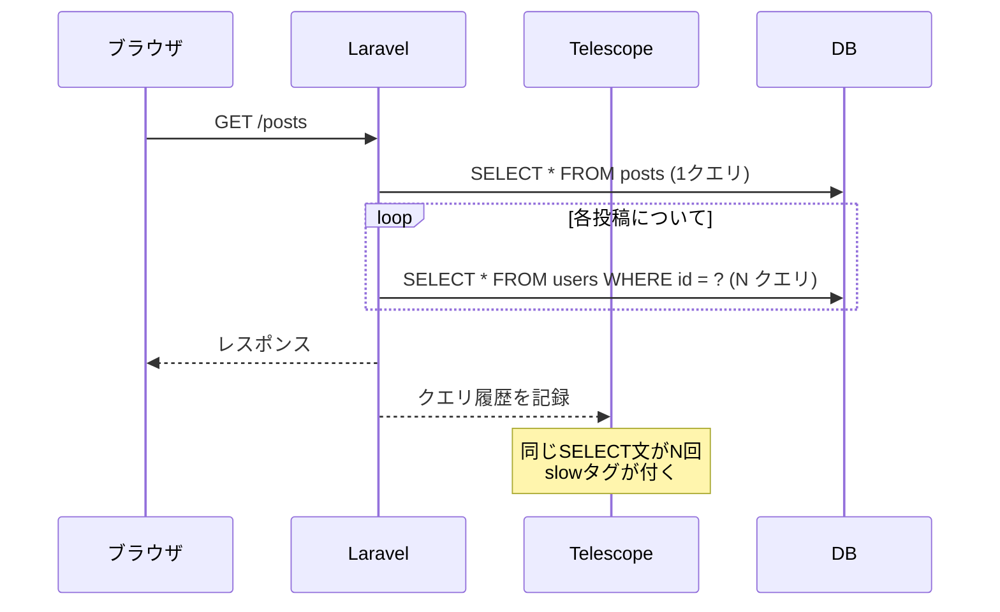

基本的なインストールと設定は[ガイドページ](/jp/telescope)を参照してください。このページでは公式ドキュメントには載っていない、ローカル開発での実践的な活用パターンを紹介します。

Telescopeは**ローカル開発専用**ツールです。本番環境の監視には [Laravel Pulse](/jp/pulse) や [Laravel Nightwatch](/jp/blog/nightwatch-introduction) を使ってください。

---

## N+1問題を体系的に発見する

Telescopeを使ったN+1デバッグの実践的な流れを解説します。単に「同じSELECTが繰り返されている」と気づくだけでなく、修正後の確認まで一連のワークフローとして行えます。



<Steps>
  <Step title="Requestsで遅いリクエストを見つける">
    `/telescope` を開き、Requestsタブで実行時間の長いリクエストを特定します。
  </Step>
  <Step title="Queriesで発行されたSQLを確認する">
    リクエストの詳細を開くと、そのリクエスト中に実行されたすべてのSQLクエリが表示されます。同じようなSELECT文が繰り返されていたらN+1です。
  </Step>
  <Step title="Eager Loadingを追加して修正する">
    コードに `with()` を追加してクエリを再確認します。クエリ数が大幅に減っていれば修正完了です。
  </Step>
</Steps>

```php
// N+1が発生するコード
$posts = Post::all();
foreach ($posts as $post) {
    echo $post->user->name; // 投稿の数だけ追加クエリ
}

// Eager Loadingで解決
$posts = Post::with('user')->get();
```

デバッグ用の `dd()` やログをコードに追加することなく、この一連の流れをブラウザ上で完結できます。

---

## タグを使った特定リクエストの追跡

Telescopeには**タグ**機能があります。`Telescope::tag()` でエントリに任意のタグを付けると、ダッシュボードのフィルターでそのタグのエントリだけを素早く絞り込めます。

特定のユーザーIDや注文IDに関連する処理だけを追跡したいケースで非常に有効です。

```php
use Laravel\Telescope\IncomingEntry;
use Laravel\Telescope\Telescope;

// TelescopeServiceProvider の tags メソッドをオーバーライドする
Telescope::tag(function (IncomingEntry $entry) {
    if ($entry->type === 'request') {
        return array_filter([
            'status:' . $entry->content['response_status'],
            auth()->check() ? 'user:' . auth()->id() : null,
        ]);
    }

    return [];
});
```

これで `/telescope/requests` 画面のSearchに `user:42` と入力するだけで、ユーザーID=42のリクエストだけを一覧できます。

### モデルにタグを自動付与する

`TelescopeServiceProvider` の `tags` メソッドで、特定のモデルIDをすべてのエントリに付与できます。

```php
// TelescopeServiceProvider
Telescope::tag(function (IncomingEntry $entry) {
    return $entry->tags();
});
```

さらに `HasTags` コントラクトをモデルに実装することで、そのモデルが記録されるとき自動的にタグが付きます。

```php
use Laravel\Telescope\Contracts\EntriesRepository;

class Order extends Model implements \Laravel\Telescope\Contracts\HasTags
{
    public function telescopeTags(): array
    {
        return ['order:' . $this->id];
    }
}
```

---

## Dumpウォッチャーの活用

`dump()` を使うとHTMLレスポンスに出力が混入してしまい、APIのデバッグが難しくなることがあります。TelescopeのDumpウォッチャーを使うと、`dump()` の出力をブラウザのレスポンスから切り離してダッシュボードに記録できます。

使い方はシンプルです。`/telescope` の「Dump」タブを開いた状態で `dump()` を呼び出すだけです。

```php
// コントローラー
public function index()
{
    $users = User::with('posts')->get();
    dump($users->first()->toArray()); // Telescopeのdumpタブに表示される
    return response()->json($users);
}
```

ページを開いた状態でのみキャプチャされるため、必要なときだけ監視できます。`dd()` とは違いアプリの実行を止めないので、連続したリクエストを流しながらデバッグする場合に便利です。

---

## Mailpit連携でメールデバッグを快適にする

MailウォッチャーとローカルSMTPサーバーの [Mailpit](https://mailpit.axllent.org/) を組み合わせることで、メール開発のフローが大幅に改善します。

```ini
# .env
MAIL_MAILER=smtp
MAIL_HOST=127.0.0.1
MAIL_PORT=1025
```

TelescopeのMailタブでは送信メールのHTML/テキスト両方をプレビューできます。Mailpitでは受信したメールをブラウザで確認でき、さらに添付ファイルの確認やスパムスコアの確認も可能です。

<Tip>
  テスト中に誤って外部にメールを送らないよう、ローカルでは必ずMailpitやMailhogなどのローカルSMTPを使いましょう。
</Tip>

---

## イベントとリスナーのデバッグ

イベントドリブンな実装のデバッグはしばしば難しくなります。「イベントは発火しているのか」「どのリスナーが呼ばれているのか」をログを見ながら追うのは面倒です。

TelescopeのEventsウォッチャーを使うと、発行されたイベントとそのリスナーが一覧で確認できます。

リスナーが呼ばれない場合、Eventsタブでイベントのエントリを確認します。

- イベントは発行されているがリスナーが表示されない → リスナーが登録されていない（`EventServiceProvider` の確認）
- イベント自体が発行されていない → `event()` の呼び出し箇所の確認

```php
// テスト代わりにローカルで確認する流れ
event(new OrderShipped($order));
// → /telescope/events で OrderShipped が表示されるか確認
// → リスナー SendShippingConfirmation が呼ばれているか確認
```

---

## キュージョブのデバッグ

非同期処理のデバッグはログを見るだけでは原因特定が難しいです。TelescopeのJobsウォッチャーは、ジョブのディスパッチから実行結果まで記録します。

失敗したジョブのエントリをクリックすると、スタックトレースと例外メッセージが確認できます。`queue:failed` テーブルとは別に、Telescopeでも確認できるため、失敗の原因調査が素早く行えます。

```php
// ジョブのデバッグ時はsyncドライバーで同期実行すると追跡しやすい
// .env
QUEUE_CONNECTION=sync
```

syncドライバーにすることで、ジョブがリクエスト内で同期実行され、Requestsウォッチャーにジョブの実行結果も含まれます。

---

## HTTPクライアントのデバッグ

外部APIとの通信をデバッグする際、HTTP Client Watcherが役立ちます。`Http::` ファサードで行われたリクエストと、そのレスポンスが記録されます。

```php
$response = Http::get('https://api.example.com/users');
// → /telescope/client-requests で確認できる
```

レスポンスの内容、ステータスコード、実行時間が一目でわかります。`dd($response->json())` を書かなくてもダッシュボードで確認できます。

---

## まとめ

| テクニック | 効果 |
|---------|------|
| N+1ワークフロー | dd()不要でクエリ問題を体系的に発見・修正 |
| タグ付け | 特定ユーザー・モデルの記録をすぐに絞り込み |
| Dumpウォッチャー | APIレスポンスを汚さずにdump出力を確認 |
| Mailpit連携 | ローカルメール開発の快適化 |
| Eventsウォッチャー | イベント/リスナーの発火を視覚的に確認 |
| Jobs + sync | 非同期処理を同期実行してデバッグ |
| HTTPクライアント | 外部API通信の記録と確認 |

<Columns cols={2}>
  <Card title="Laravel Telescope ガイド" icon="telescope" href="/jp/telescope">
    インストールとウォッチャー設定の詳細はガイドページを参照してください。
  </Card>
  <Card title="Laravel Nightwatch" icon="moon" href="/jp/blog/nightwatch-introduction">
    本番環境の監視はNightwatchで行います。
  </Card>
</Columns>
