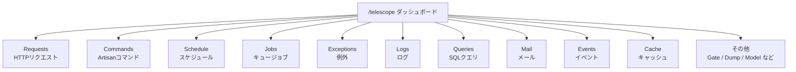
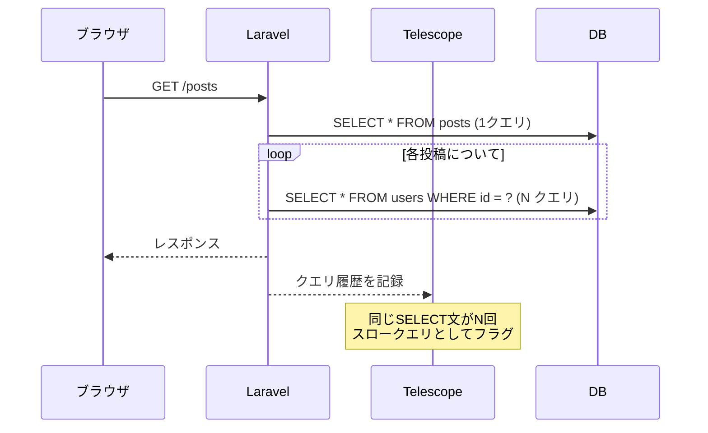

## Laravel Telescopeとは

[Laravel Telescope](https://github.com/laravel/telescope) は、Laravelアプリケーションの動作をリアルタイムで観察できるデバッグ・モニタリングツールです。ブラウザから `/telescope` にアクセスするだけで、HTTPリクエスト、SQLクエリ、例外、キュージョブ、メールなど、アプリケーション内で起きていることを一覧できます。

<Warning>
  Telescopeは**開発環境専用**のツールです。本番環境への誤インストールを防ぐために、必ず `--dev` フラグを使ってインストールしてください。
</Warning>

`dd()` や `Log::info()` を散りばめてデバッグする時代から、Telescopeを使うとどう変わるか。この記事ではインストールから主要機能の活用まで、実際の開発シナリオを交えて紹介します。

---

## インストール

### 開発依存としてインストールする

```shell
composer require laravel/telescope --dev
```

`--dev` を付けることで `composer.json` の `require-dev` に追加され、本番環境では `composer install --no-dev` を実行した際にインストールされません。

続けてアセットとマイグレーションを公開します。

```shell
php artisan telescope:install

php artisan migrate
```

`telescope:install` によって以下が作成されます。

- `config/telescope.php` — ウォッチャーの設定ファイル
- `app/Providers/TelescopeServiceProvider.php` — 認可ゲートやフィルタリングの設定
- `public/vendor/telescope/` — ダッシュボードのアセット

マイグレーション後は `/telescope` にアクセスするとダッシュボードが表示されます。

### ローカル環境専用の設定

`--dev` でインストールした場合、`TelescopeServiceProvider` が自動検出されないよう追加の設定が必要です。

まず `bootstrap/providers.php` から自動登録を削除し、代わりに `AppServiceProvider` の `register` メソッドで手動登録します。

```php
// app/Providers/AppServiceProvider.php

public function register(): void
{
    if ($this->app->environment('local') && class_exists(\Laravel\Telescope\TelescopeServiceProvider::class)) {
        $this->app->register(\Laravel\Telescope\TelescopeServiceProvider::class);
        $this->app->register(TelescopeServiceProvider::class);
    }
}
```

さらに `composer.json` でオートディスカバリーから除外します。

```json
"extra": {
    "laravel": {
        "dont-discover": [
            "laravel/telescope"
        ]
    }
}
```

この設定により、Telescopeは `local` 環境でのみ動作し、本番環境のコードパスには影響しません。

---

## ダッシュボードの全体像

インストール後、`/telescope` にアクセスすると以下のようなダッシュボードが表示されます。



各ウォッチャーはサイドバーから選択でき、エントリーをクリックすると詳細情報が表示されます。

---

## 主要ウォッチャーの紹介

### Requests — HTTPリクエストの全記録

リクエストのURL、HTTPメソッド、レスポンスステータス、実行時間、ペイロード、セッション、認証ユーザー情報まですべて記録されます。

「なぜこのリクエストが500を返すのか」という調査をするとき、Requestsウォッチャーを開けば、そのリクエスト中に実行されたSQLクエリや発生した例外も同時に確認できます。

### Queries — SQLクエリとN+1問題の発見

クエリウォッチャーはすべてのSQLクエリを記録します。実行時間の長いクエリはハイライト表示されます。

<Tip>
  `config/telescope.php` でスロークエリのしきい値（デフォルト100ms）を変更できます。

  ```php
  'watchers' => [
      Watchers\QueryWatcher::class => [
          'enabled' => env('TELESCOPE_QUERY_WATCHER', true),
          'slow' => 100,
      ],
  ],
  ```
</Tip>

N+1問題を発見する典型的なシナリオを考えます。投稿一覧ページで投稿ごとにユーザー名を表示する場合、`with('user')` を忘れると投稿の数だけ追加のSQLが発行されます。Telescopeのダッシュボードでこのリクエストを見ると、似たようなSELECT文が大量に並ぶため、すぐに気づけます。

```php
// N+1が発生するコード
$posts = Post::all(); // 1クエリ
foreach ($posts as $post) {
    echo $post->user->name; // 投稿の数だけ追加クエリ
}

// Eager Loadingで解決
$posts = Post::with('user')->get(); // 2クエリで完結
```

### Exceptions — スタックトレースの記録

発生した例外を自動的に記録し、スタックトレース全体をダッシュボードで確認できます。ローカルで例外が起きたとき、ターミナルに戻らずブラウザで確認できるのは地味に便利です。

### Mail — 送信メールのプレビュー

開発中にメールが正しく送信されているか確認したいとき、Mailウォッチャーを使えばブラウザ上でメールの内容をプレビューできます。`.eml` ファイルとしてダウンロードすることも可能です。

<Info>
  [Mailpit](https://mailpit.axllent.org/) などのローカルSMTPサーバーと組み合わせることで、メール送信の確認がより快適になります。
</Info>

### Jobs — キュージョブの処理状況

ジョブのディスパッチ、処理、失敗の状態をリアルタイムで追跡できます。失敗したジョブはスタックトレース付きで記録されます。非同期処理のデバッグに特に役立ちます。

### Cache — キャッシュのヒット/ミス

キャッシュへのアクセス（ヒット、ミス、書き込み、削除）をすべて記録します。「キャッシュが効いているはずなのに毎回DBを叩いている」といった問題の発見に使えます。

### Commands / Schedule — Artisanとスケジュールの実行履歴

Artisanコマンドの引数、オプション、終了コード、出力が記録されます。スケジュールされたタスクの実行結果も確認できます。

### Events — イベントとリスナーの追跡

ディスパッチされたイベントとそのリスナーが記録されます。イベントが発火しているか、どのリスナーが呼ばれているかをすぐに確認できます。

---

## フィルタリングの設定

`TelescopeServiceProvider` の `register` メソッド内の `filter` クロージャで、記録するエントリーを絞り込めます。デフォルトの設定はローカル環境では全エントリーを記録し、それ以外の環境では例外・失敗ジョブ・スケジュールタスク・スロークエリのみを記録します。

```php
use Laravel\Telescope\IncomingEntry;
use Laravel\Telescope\Telescope;

public function register(): void
{
    $this->hideSensitiveRequestDetails();

    Telescope::filter(function (IncomingEntry $entry) {
        if ($this->app->environment('local')) {
            return true;
        }

        return $entry->isReportableException() ||
            $entry->isFailedJob() ||
            $entry->isScheduledTask() ||
            $entry->isSlowQuery() ||
            $entry->hasMonitoredTag();
    });
}
```

記録量が多くなりすぎる場合は、不要なウォッチャーを無効化することもできます。

```php
// config/telescope.php
'watchers' => [
    Watchers\CacheWatcher::class => false, // 無効化
    Watchers\QueryWatcher::class => true,
    // ...
],
```

---

## データのプルーニング

`telescope_entries` テーブルはデータが急速に蓄積されます。定期的に古いデータを削除するため、スケジュールに `telescope:prune` を追加してください。

```php
use Illuminate\Support\Facades\Schedule;

Schedule::command('telescope:prune')->daily();
```

デフォルトでは24時間以上前のデータが削除されます。保持期間を変更するには `--hours` オプションを使います。

```php
Schedule::command('telescope:prune --hours=48')->daily();
```

---

## 本番環境での注意点

Telescopeのダッシュボードはデフォルトで `local` 環境のみアクセス可能です。本番環境や staging 環境でアクセスを許可する場合は、`TelescopeServiceProvider` の `gate` メソッドで認可ゲートを設定します。

```php
use App\Models\User;

protected function gate(): void
{
    Gate::define('viewTelescope', function (User $user) {
        return in_array($user->email, [
            'developer@example.com',
        ]);
    });
}
```

<Warning>
  本番環境の `.env` で `APP_ENV=production` が設定されていることを確認してください。`local` のままだとTelescopeダッシュボードが公開状態になります。
</Warning>

---

## 実践シナリオ：N+1問題を発見して修正する

Telescopeを使ったデバッグの具体的な流れを見てみましょう。



<Steps>
  <Step title="Requestsで遅いリクエストを見つける">
    `/telescope` を開き、Requestsタブで実行時間の長いリクエストを特定します。
  </Step>
  <Step title="Queriesで発行されたSQLを確認する">
    リクエストの詳細を開くと、そのリクエスト中に実行されたすべてのSQLクエリが表示されます。同じようなSELECT文が繰り返されていたらN+1です。
  </Step>
  <Step title="Eager Loadingを追加して修正する">
    コードに `with()` を追加してクエリを再確認します。クエリ数が大幅に減っていれば修正完了です。
  </Step>
</Steps>

この一連の流れを、デバッグ用の `dd()` やログ出力なしで完結できます。

---

## まとめ

| ウォッチャー | 主な用途 |
|-------------|---------|
| Requests | HTTPリクエスト・レスポンスの詳細確認 |
| Queries | N+1問題の発見、スロークエリの特定 |
| Exceptions | 例外とスタックトレースの記録 |
| Mail | 送信メールのプレビュー |
| Jobs | キュージョブの処理状況と失敗の追跡 |
| Cache | キャッシュのヒット/ミスの確認 |
| Commands | Artisanコマンドの実行履歴 |
| Events | イベントとリスナーの追跡 |
| Schedule | スケジュールタスクの実行確認 |

Telescopeは `dd()` やログをコードに書かなくてもアプリケーションの動作を観察できるツールです。特にSQLクエリとリクエストの関係を視覚的に把握できるため、パフォーマンス問題の調査効率が大きく上がります。開発環境では常に有効にしておくことをおすすめします。

<Card title="Laravel Telescope公式ドキュメント" icon="book-open" href="https://laravel.com/docs/telescope">
  フィルタリング、タギング、全ウォッチャーの設定オプションについては公式ドキュメントを参照してください。
</Card>
