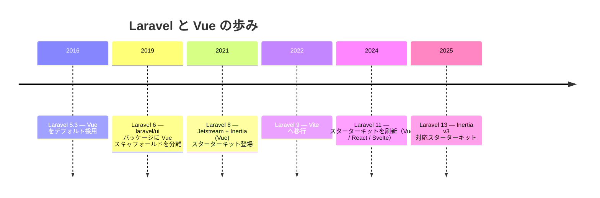
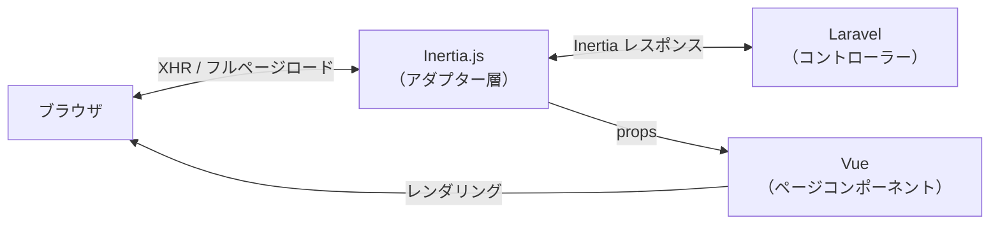

## Vue.jsとは

Vue.js（以下 Vue）は、ユーザーインターフェースを構築するためのプログレッシブJavaScriptフレームワークです。「プログレッシブ」とは、小さな部分から始めて必要に応じて機能を追加していけるという意味で、既存のHTMLページへの部分的な組み込みも、大規模なSPAの構築にも対応できます。

Vueの核心は**リアクティビティ**です。データが変わるとDOMが自動的に更新されるため、開発者は「いつ、どの要素を更新するか」を手動で管理する必要がありません。

<Info>
  このページで解説するのは Vue 3 と Inertia v3 の組み合わせです。Laravel 13 のスターターキットはこの構成をデフォルトで使用します。
</Info>

### Options API と Composition API

Vue 3 はコンポーネントを書くスタイルとして **Options API** と **Composition API** の2つを提供しています。

**Options API** は Vue 2 から続く従来のスタイルです。`data`・`methods`・`computed`・`mounted` などのオプションオブジェクトでコンポーネントを定義します。

```vue
<!-- Options API の例 -->
<script>
export default {
    data() {
        return { count: 0 }
    },
    methods: {
        increment() {
            this.count++
        }
    }
}
</script>

<template>
    <button @click="increment">{{ count }}</button>
</template>
```

**Composition API** は Vue 3 で導入された新しいスタイルです。`<script setup>` 構文と組み合わせることで、より簡潔に書けます。ロジックの再利用性も高く、TypeScriptとの相性も優れています。

```vue
<!-- Composition API（<script setup>）の例 -->
<script setup>
import { ref } from 'vue'

const count = ref(0)

function increment() {
    count.value++
}
</script>

<template>
    <button @click="increment">{{ count }}</button>
</template>
```

<Tip>
  Inertia × Laravel のスターターキットでは `<script setup>` を使った Composition API スタイルが標準です。本ページの例もすべて `<script setup>` で記述します。
</Tip>

---

## Laravel でのポジション

### 歴史

VueとLaravelの関係は古く、**Laravel 5.3（2016年）** に Vue がデフォルトのフロントエンドフレームワークとして採用されたことに始まります。当時の `package.json` には Vue が含まれており、`resources/js/components/ExampleComponent.vue` というサンプルコンポーネントも同梱されていました。



**Laravel 6（2019年）** で認証スキャフォールドが `laravel/ui` パッケージとして切り離され、Vue のスキャフォールドも同パッケージに移行しました。現在は `laravel new` のスターターキット経由で Inertia + Vue 構成を選ぶのが主流スタイルです。

Laravelユーザーにとって Vue は最もなじみ深いJSフレームワークであり、日本語の学習リソースも豊富です。

### 現在の主流スタイル：Inertia × Vue

現在の Laravel における Vue の使い方の中心は **Inertia × Vue** です。Inertia はAPIを設計せずにLaravelのコントローラーから直接Vueコンポーネントにデータを渡せる「モダンモノリス」アーキテクチャを実現します。



---

## セットアップ

### スターターキット経由（推奨）

新規プロジェクトで始める場合はスターターキットを使うのが最も手軽です。

```shell
laravel new my-app
```

対話式プロンプトで **Vue** を選ぶと、以下がすべて自動でセットアップされます。

- `inertiajs/inertia-laravel`（サーバーサイドアダプター）
- `@inertiajs/vue3`（クライアントアダプター）
- `vue`（Vue 3 本体）
- `@vitejs/plugin-vue`（Vite プラグイン）
- `HandleInertiaRequests` ミドルウェア
- ログイン・登録などの認証画面（Inertia + Vue で実装済み）

### 手動インストール

既存プロジェクトに追加する場合は、サーバーサイドとクライアントサイドを別々にインストールします。

```shell
# サーバーサイド（PHP）
composer require inertiajs/inertia-laravel

# クライアントサイド（JavaScript）
npm install @inertiajs/vue3 vue
npm install --save-dev @vitejs/plugin-vue
```

次に、`vite.config.js` に Vue プラグインを追加します。

```js
import { defineConfig } from 'vite'
import laravel from 'laravel-vite-plugin'
import vue from '@vitejs/plugin-vue'

export default defineConfig({
    plugins: [
        laravel({
            input: ['resources/css/app.css', 'resources/js/app.js'],
            refresh: true,
        }),
        vue({
            template: {
                transformAssetUrls: {
                    base: null,
                    includeAbsolute: false,
                },
            },
        }),
    ],
})
```

`resources/js/app.js` で Inertia アプリを起動します。

```js
import { createApp, h } from 'vue'
import { createInertiaApp } from '@inertiajs/vue3'
import { resolvePageComponent } from 'laravel-vite-plugin/inertia-helpers'

createInertiaApp({
    resolve: (name) =>
        resolvePageComponent(
            `./pages/${name}.vue`,
            import.meta.glob('./pages/**/*.vue'),
        ),
    setup({ el, App, props, plugin }) {
        createApp({ render: () => h(App, props) })
            .use(plugin)
            .mount(el)
    },
})
```

<Info>
  手動インストールの詳細（ルートテンプレートの設定やミドルウェアの登録など）は [Inertia 公式ドキュメント](https://inertiajs.com/installation) を参照してください。
</Info>

---

## ディレクトリ構造

スターターキットでは Vue のページコンポーネントを `resources/js/pages/` ディレクトリに配置します。

```
resources/js/
├── app.js             # Inertia アプリの起点
├── bootstrap.js
├── components/        # 再利用可能な UI コンポーネント
│   ├── NavBar.vue
│   └── ...
├── layouts/           # レイアウトコンポーネント
│   ├── AppLayout.vue
│   └── AuthLayout.vue
└── pages/             # Inertia ページコンポーネント（コントローラー名に対応）
    ├── Auth/
    │   ├── Login.vue
    │   └── Register.vue
    ├── Dashboard.vue
    └── Posts/
        ├── Index.vue
        ├── Create.vue
        └── Show.vue
```

`Inertia::render('Posts/Index', [...])` と書くと `resources/js/pages/Posts/Index.vue` が対応するコンポーネントになります。

---

## ページコンポーネントの基本

Inertia のページコンポーネントは通常の Vue コンポーネントです。Laravelのコントローラーから渡したデータが props として受け取れます。

### コントローラー

```php
// app/Http/Controllers/PostController.php
use Inertia\Inertia;
use App\Models\Post;

class PostController extends Controller
{
    public function index()
    {
        return Inertia::render('Posts/Index', [
            'posts' => Post::latest()->paginate(10),
        ]);
    }
}
```

### Vue ページコンポーネント

```vue
<!-- resources/js/pages/Posts/Index.vue -->
<script setup>
import { Link } from '@inertiajs/vue3'

defineProps({
    posts: Object,
})
</script>

<template>
    <div>
        <h1>投稿一覧</h1>
        <article v-for="post in posts.data" :key="post.id">
            <h2>
                <Link :href="`/posts/${post.id}`">{{ post.title }}</Link>
            </h2>
            <p>{{ post.created_at }}</p>
        </article>
    </div>
</template>
```

`defineProps()` で props を宣言するだけで、コントローラーから渡したデータをテンプレートで使えます。REST APIを定義する必要はありません。

---

## `Link` コンポーネント

`@inertiajs/vue3` が提供する `<Link>` コンポーネントを使うと、ページ遷移が XHR で行われ、ブラウザのフルリロードを回避できます。

```vue
<script setup>
import { Link } from '@inertiajs/vue3'
</script>

<template>
    <!-- 基本的なリンク -->
    <Link href="/posts">投稿一覧</Link>

    <!-- POST メソッドでリンク（削除など） -->
    <Link href="/posts/1" method="delete" as="button" type="button">
        削除
    </Link>

    <!-- プリロード（ホバー時に事前取得） -->
    <Link href="/posts/1" preload>投稿を見る</Link>
</template>
```

通常の `<a>` タグと同じように書けますが、裏側で Inertia がページコンポーネントだけを差し替えるため SPA のような操作感になります。

---

## `useForm` ヘルパー

フォーム処理には `@inertiajs/vue3` の `useForm` ヘルパーを使います。フォームの状態管理・送信・バリデーションエラー表示がシンプルに実装できます。

### コントローラー側

```php
// app/Http/Controllers/PostController.php
class PostController extends Controller
{
    public function store(Request $request)
    {
        $validated = $request->validate([
            'title'   => ['required', 'string', 'max:255'],
            'content' => ['required', 'string'],
        ]);

        Post::create($validated + ['user_id' => auth()->id()]);

        return redirect()->route('posts.index')
            ->with('success', '投稿を作成しました。');
    }
}
```

### Vue フォームコンポーネント

```vue
<!-- resources/js/pages/Posts/Create.vue -->
<script setup>
import { useForm } from '@inertiajs/vue3'

const form = useForm({
    title: '',
    content: '',
})

function submit() {
    form.post('/posts')
}
</script>

<template>
    <form @submit.prevent="submit">
        <div>
            <label>タイトル</label>
            <input v-model="form.title" type="text" />
            <p v-if="form.errors.title" class="error">{{ form.errors.title }}</p>
        </div>

        <div>
            <label>本文</label>
            <textarea v-model="form.content"></textarea>
            <p v-if="form.errors.content" class="error">{{ form.errors.content }}</p>
        </div>

        <button type="submit" :disabled="form.processing">
            {{ form.processing ? '送信中...' : '投稿する' }}
        </button>
    </form>
</template>
```

`useForm` が返すオブジェクトの主なプロパティをまとめます。

| プロパティ / メソッド | 説明 |
|----------------------|------|
| `form.data` | フォームのデータオブジェクト |
| `form.errors` | バリデーションエラー（フィールド名でアクセス） |
| `form.processing` | 送信中は `true`（ボタン無効化に使う） |
| `form.isDirty` | 初期値から変更されている場合 `true` |
| `form.post(url)` | POST リクエストで送信 |
| `form.put(url)` | PUT リクエストで送信（更新） |
| `form.delete(url)` | DELETE リクエストで送信 |
| `form.reset()` | フォームを初期値にリセット |

バリデーションエラーが返ったとき、`useForm` は入力内容を保持したままエラーを表示します。`v-model` との組み合わせでシームレスなフォーム体験を実現できます。

---

## 共有データ（Shared Data）

すべてのページで共通して必要なデータ（ログイン中のユーザー情報・フラッシュメッセージなど）は `HandleInertiaRequests` ミドルウェアの `share()` メソッドで定義します。

```php
// app/Http/Middleware/HandleInertiaRequests.php
use Illuminate\Http\Request;
use Inertia\Middleware;

class HandleInertiaRequests extends Middleware
{
    public function share(Request $request): array
    {
        return array_merge(parent::share($request), [
            'auth' => [
                'user' => $request->user()
                    ? $request->user()->only('id', 'name', 'email')
                    : null,
            ],
            'flash' => [
                'success' => $request->session()->get('success'),
                'error'   => $request->session()->get('error'),
            ],
        ]);
    }
}
```

Vue コンポーネントから共有データにアクセスするには `usePage()` を使います。

```vue
<script setup>
import { computed } from 'vue'
import { usePage } from '@inertiajs/vue3'

const page = usePage()

// 共有データへのアクセス
const user = computed(() => page.props.auth.user)
const flash = computed(() => page.props.flash)
</script>

<template>
    <header>
        <span v-if="user">{{ user.name }}</span>
        <span v-else>ゲスト</span>
    </header>

    <div v-if="flash.success" class="alert-success">
        {{ flash.success }}
    </div>
</template>
```

<Info>
  共有データはすべてのリクエストに含まれるため、必要最低限のデータに絞ることを推奨します。`fn()` を使ったレイジー評価にすると、実際にアクセスされたときだけ評価されます。
</Info>

---

## Vue 3 のリアクティビティ基礎

Inertia × Vue で開発するうえで知っておくべき Vue 3 のリアクティビティ API を紹介します。

### `ref` — プリミティブなリアクティブ値

```vue
<script setup>
import { ref } from 'vue'

const count = ref(0)
const isOpen = ref(false)

// .value でアクセス（テンプレート内では不要）
count.value++
</script>

<template>
    <p>{{ count }}</p>
    <button @click="isOpen = !isOpen">トグル</button>
</template>
```

### `computed` — 算出プロパティ

```vue
<script setup>
import { ref, computed } from 'vue'

const posts = ref([])

const publishedPosts = computed(() =>
    posts.value.filter(post => post.published)
)
</script>
```

### `onMounted` — マウント後の処理

```vue
<script setup>
import { onMounted } from 'vue'

onMounted(() => {
    console.log('コンポーネントがマウントされました')
})
</script>
```

---

## まとめ

Vue.js は Laravel との親和性が高く、特に Inertia を経由した「モダンモノリス」構成で力を発揮します。

| 要素 | 役割 |
|------|------|
| Laravel コントローラー | ルーティング・データ取得・バリデーション |
| `Inertia::render()` | コントローラーから Vue コンポーネントへデータを渡す |
| Vue ページコンポーネント | props を受け取りUIをレンダリング |
| `useForm` | フォームの状態管理・送信・エラー表示 |
| `Link` コンポーネント | フルリロードなしのページ遷移 |
| `usePage().props` | 共有データへのアクセス |

Inertia × Vue を使うと、LaravelのバックエンドのシンプルさとVueのリアクティブなUIの両方を享受できます。スターターキットでプロジェクトを作成すれば、認証画面も含めてすぐに開発を始められます。

<Card title="Inertia.js 公式ドキュメント" icon="book-open" href="https://inertiajs.com">
  Inertia v3 の全機能については公式ドキュメントを参照してください。
</Card>
