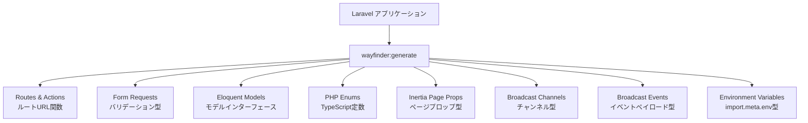

## Wayfinderとは

**Laravel Wayfinder** は、LaravelバックエンドとTypeScriptフロントエンドをゼロフリクションで橋渡しするパッケージです。コントローラーとルートから完全に型付けされたTypeScript関数を自動生成するため、フロントエンドのコードからLaravelのエンドポイントを関数として直接呼び出せます。

URLのハードコーディング、ルートパラメーターの手動管理、バックエンド変更の手作業同期——これらがすべて不要になります。

<Info>
  WayfinderはBeta版です（現在 v0.1.x）。v1.0.0 のリリースまでに API が変更される可能性があります。重要な変更はすべて [CHANGELOG](https://github.com/laravel/wayfinder/blob/main/CHANGELOG.md) に記録されます。
</Info>

---

## ZiggyとWayfinderの違い

### Ziggyとは

[Ziggy](https://github.com/tighten/ziggy) は長年にわたってLaravelエコシステムで広く使われてきたルートヘルパーです。Laravelのルート定義をJavaScript側に公開し、`route('posts.show', { id: 1 })` のような形でURLを生成できました。

### なぜWayfinderに置き換えられたか

Ziggyはルート名とパラメーターを文字列で扱うため、TypeScriptとの相性に限界がありました。ルート名のタイポや間違ったパラメーター名はランタイムエラーにしかなりません。

WayfinderはTypeScriptファーストの設計で、コントローラーのメソッドを **インポート可能な関数** として生成します。

| 比較項目 | Ziggy | Wayfinder |
|---------|-------|-----------|
| ルート参照方法 | `route('posts.show', { id: 1 })` | `import { show } from "@/actions/..."` |
| 型安全性 | 型定義が限定的 | 完全な TypeScript 型 |
| IDEサポート | 補完は弱い | 補完・型チェック完全対応 |
| ツリーシェイキング | 全ルートをバンドルに含む | 使ったルートのみバンドル |
| 生成タイミング | ランタイムに注入 | ビルド時に静的生成 |

Inertia ベースのLaravelスターターキット（React・Vue・Svelte）では、Wayfinder が標準で採用されています。

---

## インストール

### 1. Composerでサーバーサイドパッケージをインストール

```bash
composer require laravel/wayfinder
```

### 2. NPMでViteプラグインをインストール

```bash
npm i -D @laravel/vite-plugin-wayfinder
```

### 3. `vite.config.js` にプラグインを追加

```ts
import { wayfinder } from "@laravel/vite-plugin-wayfinder";
import { defineConfig } from "vite";
import laravel from "laravel-vite-plugin";

export default defineConfig({
    plugins: [
        laravel({
            input: ["resources/js/app.ts"],
            refresh: true,
        }),
        wayfinder(),
    ],
});
```

Viteプラグインを追加すると、開発サーバー起動中にPHPファイルやルートファイルが変更されるたびに自動的にTypeScriptファイルが再生成されます。

---

## TypeScript定義ファイルの生成

`wayfinder:generate` コマンドで TypeScript ファイルを生成します。

```bash
php artisan wayfinder:generate
```

デフォルトでは `resources/js` 以下に3つのディレクトリが生成されます。

```
resources/js/
├── actions/         # コントローラーアクションの関数
│   └── App/Http/Controllers/
│       └── PostController.ts
├── routes/          # 名前付きルートの関数
│   └── post.ts
└── wayfinder/       # 型定義ファイル
    └── types.ts
```

<Tip>
  生成されるファイルはビルドのたびに完全に再生成されるため、`.gitignore` に追加することを推奨します。`wayfinder`, `actions`, `routes` の3ディレクトリをまとめて除外してください。
</Tip>

出力先を変更したい場合は `--path` オプションを使います。

```bash
php artisan wayfinder:generate --path=resources/js/api
```

コントローラーアクションのみ、またはルートのみ生成することも可能です。

```bash
php artisan wayfinder:generate --skip-actions  # ルートのみ生成
php artisan wayfinder:generate --skip-routes   # アクションのみ生成
```

---

## 基本的な使い方

### アクションのインポートと使用

`PostController` の `show` メソッドに対応するURLを生成する例です。

```ts
import { show } from "@/actions/App/Http/Controllers/PostController";

show(1);
// { url: "/posts/1", method: "get" }
```

URLだけが必要な場合は `.url()` を使います。

```ts
show.url(1); // "/posts/1"
```

特定の HTTP メソッドを指定することもできます。

```ts
show.head(1); // { url: "/posts/1", method: "head" }
```

### パラメーターの渡し方

Wayfinder の関数はさまざまな形式のパラメーターを受け付けます。

```ts
import { update } from "@/actions/App/Http/Controllers/PostController";

// 単一パラメーター
show(1);
show({ id: 1 });

// 複数パラメーター
update([1, 2]);
update({ post: 1, author: 2 });
update({ post: { id: 1 }, author: { id: 2 } });
```

ルートにキーバインディングが指定されている場合 (`/posts/{post:slug}`) はその値を使えます。

```ts
// ルートが /posts/{post:slug} の場合
show("my-new-post");
show({ slug: "my-new-post" });
```

### コントローラー全体のインポート

コントローラー全体をインポートしてメソッドを呼び出すこともできます。

```ts
import PostController from "@/actions/App/Http/Controllers/PostController";

PostController.show(1);
PostController.index();
```

<Warning>
  コントローラー全体をインポートするとツリーシェイキングが効かず、すべてのアクションがバンドルに含まれます。個別にインポートするほうが最終バンドルサイズを小さく保てます。
</Warning>

### 単一アクションコントローラー

単一アクションコントローラー（Invokable Controller）は、インポートした関数をそのまま呼び出します。

```ts
import StorePostController from "@/actions/App/Http/Controllers/StorePostController";

StorePostController(); // { url: "/posts", method: "post" }
```

### 名前付きルートのインポート

ルート名でアクセスするには `routes/` 配下のファイルを使います。

```ts
import { show } from "@/routes/post";

// ルート名が `post.show` の場合
show(1); // { url: "/posts/1", method: "get" }
```

### クエリパラメーター

すべてのWayfinder関数は `query` オプションでクエリパラメーターを追加できます。

```ts
import { show } from "@/actions/App/Http/Controllers/PostController";

show(1, { query: { page: 1, sort_by: "name" } });
// { url: "/posts/1?page=1&sort_by=name", method: "get" }
```

現在のURLのクエリパラメーターとマージするには `mergeQuery` を使います。

```ts
// 現在の URL: /posts/1?page=1&sort_by=category&q=shirt

show.url(1, { mergeQuery: { page: 2, sort_by: "name" } });
// "/posts/1?page=2&sort_by=name&q=shirt"

// パラメーターを削除するには null を指定
show.url(1, { mergeQuery: { sort_by: null } });
// "/posts/1?page=1&q=shirt"
```

### フォームバリアント

従来のHTMLフォームで使う場合は `--with-form` オプションを付けて生成し、`.form` バリアントを使います。

```bash
php artisan wayfinder:generate --with-form
```

```tsx
import { store, update } from "@/actions/App/Http/Controllers/PostController";

// React の例
const Page = () => (
    <form {...store.form()}>
        {/* <form action="/posts" method="post"> */}
    </form>
);

const EditPage = () => (
    <form {...update.form(1)}>
        {/* <form action="/posts/1?_method=PATCH" method="post"> */}
    </form>
);
```

---

## InertiaとWayfinderの組み合わせ

InertiaのフォームヘルパーとWayfinderを組み合わせると、URLの文字列を一切書かずにフォーム送信ができます。

```ts
import { useForm } from "@inertiajs/react";
import { store } from "@/actions/App/Http/Controllers/PostController";

const form = useForm({ name: "My Post" });

form.submit(store()); // POST /posts に送信
```

`Link` コンポーネントでも同様に使えます。

```tsx
import { Link } from "@inertiajs/react";
import { show } from "@/actions/App/Http/Controllers/PostController";

const Nav = () => (
    <Link href={show(1)}>投稿を見る</Link>
);
```

---

## スターターキットでの採用

`laravel new` で新規プロジェクトを作成し、React・Vue・Svelteを選ぶと、Wayfinderが自動セットアップされた構成が提供されます。スターターキットには以下が含まれます。

- Composerパッケージ `laravel/wayfinder`
- NPMパッケージ `@laravel/vite-plugin-wayfinder`
- `vite.config.js` にプラグイン設定済み
- `.gitignore` に生成ディレクトリ追加済み

既存プロジェクトへの手動導入も上記の手順で対応できます。

---

## 予約語と競合するメソッド名の処理

`delete` や `import` など、JavaScriptの予約語と同名のコントローラーメソッドには `Method` サフィックスが付きます。

```ts
// コントローラーに delete メソッドがある場合
import { deleteMethod } from "@/actions/App/Http/Controllers/PostController";

deleteMethod(1); // { url: "/posts/1", method: "delete" }
```

---

## 現在の状況（v0.1.x）

現在の安定版は `v0.1.x` ブランチで提供されています。2026年3月時点の最新バージョンは **v0.1.15** です。

### v0.1.x 系の主な変更履歴

| バージョン | 主な内容 |
|-----------|---------|
| v0.1.15 | Laravel 13対応、Bladeビュークラッシュ修正 |
| v0.1.13 | クエリパラメーターのTypeScript strict互換性改善 |
| v0.1.7 | URLデフォルトパラメーターのフロントエンド指定対応 |
| v0.1.6 | Viteプラグインの追加 |
| v0.1.5 | PHP 8.2サポート、キャッシュ済みルートへの対応 |
| v0.1.0 | 初期リリース |

---

## nextブランチで開発中の次世代機能

`next` ブランチでは、現在の v0.1.x から大幅に機能が拡張された次期バージョンが開発されています。

<Warning>
  `next` ブランチは `dev-next` 制約でインストールできますが、APIが大きく変わる可能性があります。本番環境での使用は推奨されません。
</Warning>

```bash
composer require laravel/wayfinder:dev-next
```

### 生成される TypeScript の範囲が大幅に拡大

v0.1.x がルートとコントローラーアクションのみを対象としているのに対し、次期バージョンは以下をすべて TypeScript として生成します。



### Form Request の TypeScript 型生成

```php
class StorePostRequest extends FormRequest
{
    public function rules(): array
    {
        return [
            'title'   => ['required', 'string', 'max:255'],
            'content' => ['required', 'string'],
            'tags'    => ['nullable', 'array'],
            'tags.*'  => ['string'],
        ];
    }
}
```

上記のForm Requestから以下の型が生成されます。

```ts
export type Request = {
    title: string;
    content: string;
    tags?: string[] | null;
};
```

### Eloquent モデルの型生成

```php
class User extends Model
{
    protected $casts = [
        'email_verified_at' => 'datetime',
        'is_admin' => 'boolean',
    ];

    public function posts(): HasMany
    {
        return $this->hasMany(Post::class);
    }
}
```

上記のモデルから `types.d.ts` に型が生成されます。

```ts
export namespace App.Models {
    export type User = {
        id: number;
        name: string;
        email: string;
        email_verified_at: string | null;
        is_admin: boolean;
        posts: App.Models.Post[];
    };
}
```

### PHP Enum の TypeScript 変換

```php
enum PostStatus: string
{
    case Draft = 'draft';
    case Published = 'published';
    case Archived = 'archived';
}
```

型と定数の両方が生成されます。

```ts
// 型定義（types.d.ts）
export namespace App.Enums {
    export type PostStatus = "draft" | "published" | "archived";
}

// 定数（App/Enums/PostStatus.ts）
export const Draft = "draft";
export const Published = "published";
export const Archived = "archived";

export const PostStatus = { Draft, Published, Archived } as const;
```

### 出力ディレクトリの変更

v0.1.x では `actions/`、`routes/`、`wayfinder/` の3ディレクトリに分かれていましたが、次期バージョンでは `resources/js/wayfinder` 以下にまとめられます。

```
resources/js/wayfinder/
├── App/Http/Controllers/
│   └── PostController.ts    # アクション関数（actions/ が廃止）
├── routes/
│   └── post.ts              # 名前付きルート（同じ）
├── broadcast-channels.ts    # ブロードキャストチャンネル
├── broadcast-events.ts      # ブロードキャストイベント
└── types.d.ts               # 全型定義（types.ts から変更）
```

### v0.1.x から next への主な変更点

- インポートパスが `@/actions/...` から `@/wayfinder/...` に変更
- `--skip-actions`、`--skip-routes`、`--with-form` フラグが廃止され、設定ファイルへ移行
- `types.ts` が `types.d.ts` に変更

---

## まとめ

Laravel Wayfinder は、Ziggyが提供していた「LaravelのルートをJavaScriptから参照する」という機能を、TypeScriptファーストで再設計したパッケージです。生成された関数をインポートして使うアプローチにより、型安全性・IDEサポート・ツリーシェイキングのすべてで大きく改善しています。

現在の v0.1.x でもルートとコントローラーアクションの型安全な参照が実現できており、InertiaベースのLaravelスターターキットで標準採用されています。`next` ブランチで開発中の次期バージョンでは、Form Request・Eloquent モデル・Enum・Inertia ページプロップまで TypeScript として生成する、より包括的な型安全基盤へと進化する予定です。

<Card title="Laravel Wayfinder GitHub" icon="github" href="https://github.com/laravel/wayfinder">
  ソースコード、CHANGELOG、Issue はこちら。
</Card>

<Card title="Vite Plugin Wayfinder" icon="bolt" href="https://github.com/laravel/vite-plugin-wayfinder">
  Viteプラグインの設定オプション詳細はこちら。
</Card>
