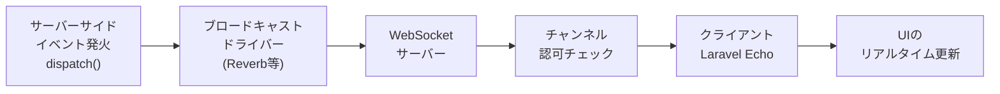

## ブロードキャストとは

WebSocketを使うと、サーバーからクライアントへリアルタイムにデータを送信できます。
Laravelのブロードキャストは、サーバーサイドのイベントをWebSocket経由でフロントエンドのJavaScriptに届ける仕組みです。

たとえば注文ステータスが変化したとき、ページを再読み込みしなくてもブラウザ上で即座に更新を表示できます。
サーバーサイドのイベント名とデータを、クライアントサイドとそのまま共有できるのがLaravelブロードキャストの強みです。

<Info>
  ブロードキャストはLaravelのイベントシステムの上に構築されています。
  まず[イベントとリスナー](/jp/events)の基本を理解しておくことを推奨します。
</Info>



## セットアップ

新規Laravelアプリケーションではブロードキャストはデフォルトで無効です。
`install:broadcasting` Artisanコマンドで有効化します。

```shell
php artisan install:broadcasting
```

このコマンドを実行すると、使用するブロードキャストサービスを選択するよう促されます。
また、`config/broadcasting.php` と `routes/channels.php` が生成されます。

## Laravel Reverb

Laravel 11以降では、公式WebSocketサーバーである **Laravel Reverb** が推奨されます。
Reverbはセルフホスト型で、追加の外部サービス不要でリアルタイム通信を実現します。

### インストール

`install:broadcasting` コマンドに `--reverb` オプションを付けると、Reverbに必要なComposerパッケージ・NPMパッケージのインストールと `.env` の設定を一括で行います。

```shell
php artisan install:broadcasting --reverb
```

手動でインストールする場合は、Composerでパッケージを追加してからインストールコマンドを実行します。

```shell
composer require laravel/reverb

php artisan reverb:install
```

### .env の主な設定値

```ini
BROADCAST_CONNECTION=reverb

REVERB_APP_ID=my-app-id
REVERB_APP_KEY=my-app-key
REVERB_APP_SECRET=my-app-secret
REVERB_HOST=localhost
REVERB_PORT=8080
REVERB_SCHEME=http

VITE_REVERB_APP_KEY="${REVERB_APP_KEY}"
VITE_REVERB_HOST="${REVERB_HOST}"
VITE_REVERB_PORT="${REVERB_PORT}"
VITE_REVERB_SCHEME="${REVERB_SCHEME}"
```

### Reverbサーバーの起動

```shell
php artisan reverb:start
```

本番環境ではSupervisorなどのプロセスマネージャーでデーモンとして管理します。

<Tip>
  ブロードキャストイベントはキュー経由で処理されます。
  Reverbサーバーと別にキューワーカーも起動しておく必要があります。
  ```shell
  php artisan queue:work
  ```
</Tip>

## ブロードキャストイベントの作成

### イベントクラスの生成

```shell
php artisan make:event OrderShipmentStatusUpdated
```

生成されたイベントクラスに `ShouldBroadcast` インターフェースを実装します。

```php
<?php

namespace App\Events;

use App\Models\Order;
use Illuminate\Broadcasting\Channel;
use Illuminate\Broadcasting\InteractsWithSockets;
use Illuminate\Broadcasting\PrivateChannel;
use Illuminate\Contracts\Broadcasting\ShouldBroadcast;
use Illuminate\Queue\SerializesModels;

class OrderShipmentStatusUpdated implements ShouldBroadcast
{
    use InteractsWithSockets, SerializesModels;

    public function __construct(
        public Order $order,
    ) {}

    /**
     * イベントをブロードキャストするチャンネルを返す
     */
    public function broadcastOn(): Channel
    {
        return new PrivateChannel('orders.' . $this->order->id);
    }
}
```

`ShouldBroadcast` を実装するだけで、イベントが発火されると自動的にキュー経由でブロードキャストされます。

### ブロードキャストデータのカスタマイズ

デフォルトでは、イベントクラスの `public` プロパティがすべてブロードキャストのペイロードに含まれます。
送信するデータを絞り込む場合は `broadcastWith` メソッドを定義します。

```php
public function broadcastWith(): array
{
    return [
        'order_id' => $this->order->id,
        'status'   => $this->order->status,
    ];
}
```

### ブロードキャスト名のカスタマイズ

デフォルトではクラス名がイベント名になります。
`broadcastAs` メソッドでカスタム名を指定できます。

```php
public function broadcastAs(): string
{
    return 'order.status.updated';
}
```

フロントエンドでリスニングするときは、先頭に `.` を付けてアプリの名前空間プレフィックスを無効にします。

```js
Echo.private(`orders.${orderId}`)
    .listen('.order.status.updated', (e) => {
        console.log(e);
    });
```

## チャンネルの種類

| チャンネル | クラス | 説明 |
|---|---|---|
| **Public** | `Channel` | 認証不要。誰でもサブスクライブできる |
| **Private** | `PrivateChannel` | 認証済みユーザーのみ。認可ロジックが必要 |
| **Presence** | `PresenceChannel` | Privateの拡張。チャンネルの参加者一覧を取得できる |

```php
use Illuminate\Broadcasting\Channel;
use Illuminate\Broadcasting\PresenceChannel;
use Illuminate\Broadcasting\PrivateChannel;

// Publicチャンネル
public function broadcastOn(): Channel
{
    return new Channel('posts');
}

// Privateチャンネル
public function broadcastOn(): Channel
{
    return new PrivateChannel('orders.' . $this->order->id);
}

// Presenceチャンネル
public function broadcastOn(): Channel
{
    return new PresenceChannel('rooms.' . $this->room->id);
}
```

複数チャンネルにブロードキャストするには配列で返します。

```php
public function broadcastOn(): array
{
    return [
        new PrivateChannel('orders.' . $this->order->id),
        new Channel('admin.orders'),
    ];
}
```

## チャンネル認可

PrivateチャンネルとPresenceチャンネルは、サブスクライブ前にサーバーサイドで認可チェックが行われます。

### routes/channels.php

`install:broadcasting` コマンドで生成される `routes/channels.php` に認可コールバックを定義します。

```php
use App\Models\Order;
use App\Models\User;
use Illuminate\Support\Facades\Broadcast;

Broadcast::channel('orders.{orderId}', function (User $user, int $orderId) {
    return $user->id === Order::findOrNew($orderId)->user_id;
});
```

コールバックの第1引数は認証済みユーザー、以降の引数はチャンネル名のワイルドカードです。
`true` またはtruthyな値を返すと認可成功、`false` を返すと拒否されます。

<Info>
  ルートモデルバインディングも使用できます。
  チャンネル名を `orders.{order}` とすると、`Order` モデルのインスタンスが渡されます。
</Info>

```php
Broadcast::channel('orders.{order}', function (User $user, Order $order) {
    return $user->id === $order->user_id;
});
```

### チャンネルクラスによる認可

チャンネルが増えてきた場合は、チャンネルクラスを使って整理できます。

```shell
php artisan make:channel OrderChannel
```

```php
<?php

namespace App\Broadcasting;

use App\Models\Order;
use App\Models\User;

class OrderChannel
{
    public function join(User $user, Order $order): bool
    {
        return $user->id === $order->user_id;
    }
}
```

`routes/channels.php` で登録します。

```php
use App\Broadcasting\OrderChannel;

Broadcast::channel('orders.{order}', OrderChannel::class);
```

## イベントの発火

`ShouldBroadcast` を実装したイベントは、通常のイベントと同じように発火します。

```php
use App\Events\OrderShipmentStatusUpdated;

OrderShipmentStatusUpdated::dispatch($order);
```

自分自身を除く他のユーザーにだけブロードキャストしたい場合は `toOthers` を使います。

```php
broadcast(new OrderShipmentStatusUpdated($order))->toOthers();
```

<Warning>
  `toOthers` を使うには、イベントクラスが `InteractsWithSockets` トレイトを使用している必要があります。
</Warning>

## フロントエンドでの受信

### Laravel Echoのセットアップ

Reverbを使う場合、`resources/js/bootstrap.js` にEchoインスタンスを設定します。

```shell
npm install --save-dev laravel-echo pusher-js
```

```js
import Echo from 'laravel-echo';
import Pusher from 'pusher-js';

window.Pusher = Pusher;

window.Echo = new Echo({
    broadcaster: 'reverb',
    key: import.meta.env.VITE_REVERB_APP_KEY,
    wsHost: import.meta.env.VITE_REVERB_HOST,
    wsPort: import.meta.env.VITE_REVERB_PORT ?? 80,
    wssPort: import.meta.env.VITE_REVERB_PORT ?? 443,
    forceTLS: (import.meta.env.VITE_REVERB_SCHEME ?? 'https') === 'https',
    enabledTransports: ['ws', 'wss'],
});
```

### イベントのリスニング

```js
// Publicチャンネル
Echo.channel('posts')
    .listen('PostPublished', (e) => {
        console.log(e.post);
    });

// Privateチャンネル
Echo.private(`orders.${orderId}`)
    .listen('OrderShipmentStatusUpdated', (e) => {
        console.log(e.order);
    });

// Presenceチャンネル
Echo.join(`rooms.${roomId}`)
    .here((users) => {
        console.log('現在のメンバー:', users);
    })
    .joining((user) => {
        console.log(user.name, 'が参加しました');
    })
    .leaving((user) => {
        console.log(user.name, 'が退出しました');
    })
    .listen('MessagePosted', (e) => {
        console.log(e.message);
    });
```

### React / Vue フックの使用

React・Vueのスターターキットを使っている場合、専用フックを使うと簡潔に書けます。

```js
import { useEcho } from "@laravel/echo-react";

// Privateチャンネル
useEcho(
    `orders.${orderId}`,
    "OrderShipmentStatusUpdated",
    (e) => {
        console.log(e.order);
    },
);

// Publicチャンネル
import { useEchoPublic } from "@laravel/echo-react";

useEchoPublic("posts", "PostPublished", (e) => {
    console.log(e.post);
});
```

`useEcho` フックはコンポーネントのアンマウント時に自動でチャンネルを離脱します。

<Tip>
  フロントエンドのアセットをビルドする前に、`.env` の `VITE_REVERB_*` 変数が正しく設定されていることを確認してください。

  ```shell
  npm run build
  ```
</Tip>

## 実践例: 注文ステータスのリアルタイム更新

<Steps>
  <Step title="ブロードキャストを有効化する">
    ```shell
    php artisan install:broadcasting --reverb
    ```

    Reverbサーバーとキューワーカーを起動します。

    ```shell
    php artisan reverb:start
    php artisan queue:work
    ```
  </Step>

  <Step title="イベントクラスを作成する">
    ```shell
    php artisan make:event OrderShipmentStatusUpdated
    ```

    `app/Events/OrderShipmentStatusUpdated.php` を編集します。

    ```php
    <?php

    namespace App\Events;

    use App\Models\Order;
    use Illuminate\Broadcasting\Channel;
    use Illuminate\Broadcasting\InteractsWithSockets;
    use Illuminate\Broadcasting\PrivateChannel;
    use Illuminate\Contracts\Broadcasting\ShouldBroadcast;
    use Illuminate\Queue\SerializesModels;

    class OrderShipmentStatusUpdated implements ShouldBroadcast
    {
        use InteractsWithSockets, SerializesModels;

        public function __construct(
            public Order $order,
        ) {}

        public function broadcastOn(): Channel
        {
            return new PrivateChannel('orders.' . $this->order->id);
        }

        public function broadcastWith(): array
        {
            return [
                'order_id' => $this->order->id,
                'status'   => $this->order->status,
            ];
        }
    }
    ```
  </Step>

  <Step title="チャンネル認可を定義する">
    `routes/channels.php` に認可ロジックを追加します。

    ```php
    use App\Models\Order;
    use App\Models\User;
    use Illuminate\Support\Facades\Broadcast;

    Broadcast::channel('orders.{order}', function (User $user, Order $order) {
        return $user->id === $order->user_id;
    });
    ```
  </Step>

  <Step title="イベントを発火する">
    注文ステータスを更新するコントローラやJobで発火します。

    ```php
    use App\Events\OrderShipmentStatusUpdated;

    $order->update(['status' => 'shipped']);

    OrderShipmentStatusUpdated::dispatch($order);
    ```
  </Step>

  <Step title="フロントエンドでリスニングする">
    Bladeテンプレートにインラインスクリプト、またはReact/Vueコンポーネントで受信します。

    ```js
    Echo.private(`orders.${orderId}`)
        .listen('OrderShipmentStatusUpdated', (e) => {
            document.getElementById('status').textContent = e.status;
        });
    ```
  </Step>
</Steps>

## 次のステップ

<Card title="キューとジョブ" href="/jp/queues">
  ブロードキャストはキュー経由で処理されます。キューの設定と運用方法を確認してください。
</Card>

<Card title="イベントとリスナー" href="/jp/events">
  ブロードキャストの基盤となるLaravelイベントシステムの詳細を学びます。
</Card>
