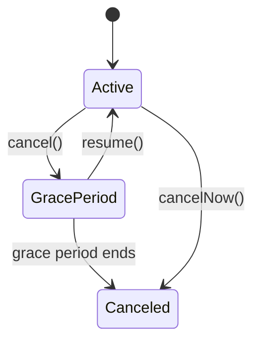

## 概要

Laravel Cashier (Stripe) は、Stripe の課金機能を Laravel から扱うための公式パッケージです。あなたは Subscription の作成・状態確認・キャンセル、1回払い、請求書のダウンロード、Webhook 処理を統一された API で実装できます。

## インストールと設定

まず Cashier をインストールし、必要なテーブルを作成してください。

```shell
composer require laravel/cashier
php artisan vendor:publish --tag="cashier-migrations"
php artisan migrate
```

次に、`App\Models\User` などの課金対象モデルに `Billable` トレイトを追加します。

```php
<?php

namespace App\Models;

use Illuminate\Foundation\Auth\User as Authenticatable;
use Laravel\Cashier\Billable;

class User extends Authenticatable
{
    use Billable;
}
```

`.env` に Stripe のキーを設定します。

```ini
STRIPE_KEY=your-stripe-key
STRIPE_SECRET=your-stripe-secret
STRIPE_WEBHOOK_SECRET=your-stripe-webhook-secret
```

## 顧客管理

Stripe Customer をまだ作成していない可能性がある場合は、`createOrGetStripeCustomer()` を使います。

```php
$stripeCustomer = $user->createOrGetStripeCustomer();
```

明示的に作成するなら `createAsStripeCustomer()` を使います。

```php
$stripeCustomer = $user->createAsStripeCustomer();
```

## Subscription

### 新規作成

`newSubscription()` と `create()` で Subscription を開始します。
`$paymentMethodId` には Stripe.js などで取得した Payment Method ID を渡します。

```php
$user->newSubscription('default', 'price_monthly')
    ->create($paymentMethodId);
```

`price_monthly` は例です。実装時は Stripe ダッシュボードで作成した実際の Price ID を指定してください。

### 状態確認

`subscribed()` で有効な Subscription かどうかを確認できます。

```php
if ($user->subscribed('default')) {
    // Active subscription...
}
```

### キャンセルと再開

```php
$user->subscription('default')->cancel();

if ($user->subscription('default')->onGracePeriod()) {
    // The user is on the grace period...
}

$user->subscription('default')->resume();
```



## 1回払い (Charge)

`charge()` で 1 回だけ課金できます。金額は通貨の最小単位で渡してください（例: USD なら `100` は `$1.00`）。
ここでも `$paymentMethodId` には Stripe で作成した Payment Method ID を使います。

```php
$payment = $user->charge(100, $paymentMethodId);
```

課金に失敗した場合、`charge()` は例外をスローします。

## 請求書

請求書一覧は `invoices()` で取得できます。

```php
$invoices = $user->invoices();
```

PDF ダウンロードには `dompdf/dompdf` をインストールし、`downloadInvoice()` を使います。`$invoiceId` には `invoices()` で取得した請求書 ID を渡してください。

```shell
composer require dompdf/dompdf
```

```php
return $user->downloadInvoice($invoiceId);
```

## Webhook の設定

Cashier は Stripe Webhook 用のルートを自動登録し、デフォルトで `/stripe/webhook` を使います。Stripe ダッシュボードにこの URL を設定してください。

Webhook の作成は `cashier:webhook` で実行できます。

```shell
php artisan cashier:webhook
```

CSRF 保護から `stripe/*` を除外してください。

```php
->withMiddleware(function (Middleware $middleware): void {
    $middleware->preventRequestForgery(except: [
        'stripe/*',
    ]);
})
```

`STRIPE_WEBHOOK_SECRET` を `.env` に設定すると、Cashier の署名検証ミドルウェアで Webhook リクエストを検証できます。
