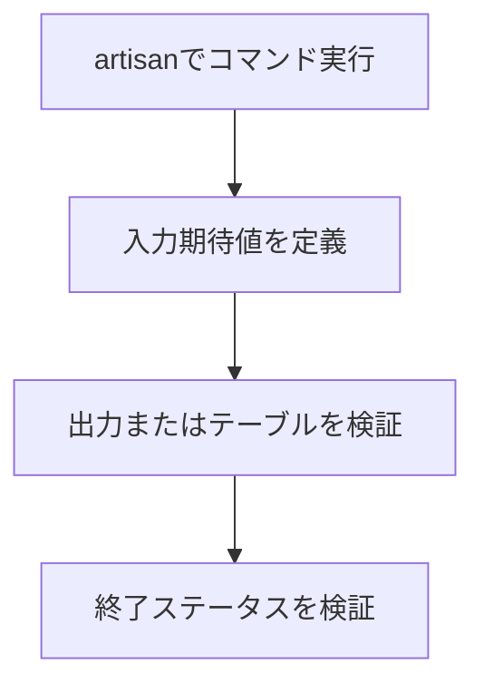

# コンソールテスト

Laravelでは、Artisanコマンドに対して入力・出力を含むテストを簡潔に記述できます。

<Info>
このページはLaravel最新のコンソールテストAPIに合わせており、Laravel Promptsの検索入力を検証する `expectsSearch` も扱います。
</Info>

## はじめに

`artisan` メソッドでコマンドを実行し、期待値をチェーンして検証します。

<Tabs>
  <Tab title="Pest">

  ```php
  test('questionコマンド', function () {
      // ユーザー入力と出力を順番に検証する
      $this->artisan('question')
          ->expectsQuestion('What is your name?', 'Taylor Otwell')
          ->expectsQuestion('Which language do you prefer?', 'PHP')
          ->expectsOutput('Your name is Taylor Otwell and you prefer PHP.')
          ->doesntExpectOutput('Your name is Taylor Otwell and you prefer Ruby.')
          ->assertExitCode(0);
  });
  ```

  </Tab>
  <Tab title="PHPUnit">

  ```php
  public function test_question_command(): void
  {
      // コマンドの対話フローを確認する
      $this->artisan('question')
          ->expectsQuestion('What is your name?', 'Taylor Otwell')
          ->expectsQuestion('Which language do you prefer?', 'PHP')
          ->expectsOutput('Your name is Taylor Otwell and you prefer PHP.')
          ->doesntExpectOutput('Your name is Taylor Otwell and you prefer Ruby.')
          ->assertExitCode(0);
  }
  ```

  </Tab>
</Tabs>



## 成功 / 失敗のアサーション

終了ステータスを検証して、コマンドの成功・失敗を判定できます。

```php
$this->artisan('inspire')->assertExitCode(0);
$this->artisan('inspire')->assertSuccessful();
$this->artisan('inspire')->assertFailed();
```

## 入力 / 出力の期待値

### 入力の期待値

質問入力や検索入力に対するユーザー操作をモックできます。

```php
// 質問入力と検索入力の両方をモックする
$this->artisan('example')
    ->expectsQuestion('What is your name?', 'Taylor Otwell')
    ->expectsSearch('What is your name?', search: 'Tay', answers: [
        'Taylor Otwell',
        'Taylor Swift',
        'Darian Taylor',
    ], answer: 'Taylor Otwell')
    ->assertExitCode(0);
```

### 出力の期待値

出力文字列の完全一致・部分一致・テーブル表示を検証できます。

```php
// 期待する出力のみが表示されることを確認する
$this->artisan('users:all')
    ->expectsOutput('The expected output')
    ->doesntExpectOutput('Unexpected output')
    ->expectsOutputToContain('expected')
    ->expectsTable([
        'ID',
        'Email',
    ], [
        [1, 'taylor@example.com'],
        [2, 'abigail@example.com'],
    ])
    ->assertExitCode(0);
```

## 確認の期待値

Yes / No の確認プロンプトには `expectsConfirmation` を使います。

```php
$this->artisan('module:import')
    ->expectsConfirmation('Do you really wish to run this command?', 'no')
    ->assertExitCode(1);
```

## コンソールイベント

デフォルトではテスト実行時に `CommandStarting` / `CommandFinished` は発火しません。

イベント検証が必要なテストクラスには `WithConsoleEvents` を追加します。

```php
<?php

namespace Tests\Feature;

use Illuminate\Foundation\Testing\WithConsoleEvents;
use Tests\TestCase;

class ConsoleEventTest extends TestCase
{
    use WithConsoleEvents;
}
```

<Tip>
`WithConsoleEvents` は必要なテストに限定して使うと、通常のテスト速度を維持しやすくなります。
</Tip>
