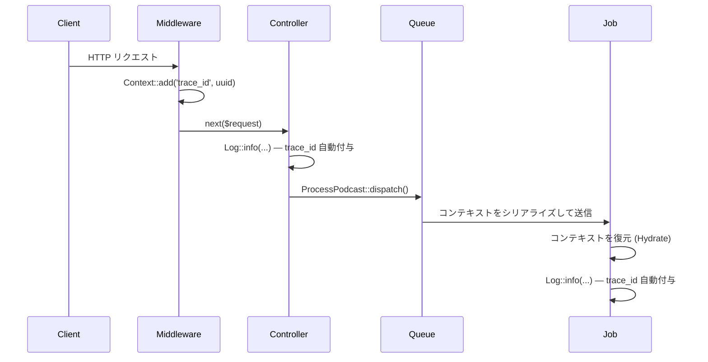

## Context とは

Laravel の Context 機能は、リクエスト・キュージョブ・コマンドの実行をまたいで情報を記録・共有するための仕組みです。
`Illuminate\Support\Facades\Context` ファサードを通じて情報を追加すると、その情報はアプリケーションが書き出すすべてのログエントリに自動的に付与されます。

これにより、個別のログ呼び出しに渡した情報と、Context が保持する共有情報を明確に区別できます。
分散システムやキューを使ったアーキテクチャでトレーシングを行う際に特に有用です。

### コンテキストの伝播フロー



## 基本的な使い方

最も典型的な使い方はミドルウェアで `trace_id` を設定することです。以降のすべてのログエントリに自動的に含まれます。

<Steps>
  <Step title="ミドルウェアを作成する">
    ```shell
    php artisan make:middleware AddContext
    ```
  </Step>

  <Step title="Context にトレース ID を追加する">
    ```php
    <?php

    namespace App\Http\Middleware;

    use Closure;
    use Illuminate\Http\Request;
    use Illuminate\Support\Facades\Context;
    use Illuminate\Support\Str;
    use Symfony\Component\HttpFoundation\Response;

    class AddContext
    {
        public function handle(Request $request, Closure $next): Response
        {
            Context::add('url', $request->url());
            Context::add('trace_id', Str::uuid()->toString());

            return $next($request);
        }
    }
    ```
  </Step>

  <Step title="ミドルウェアを登録する">
    `bootstrap/app.php` でグローバルミドルウェアとして登録します。

    ```php
    ->withMiddleware(function (Middleware $middleware) {
        $middleware->append(\App\Http\Middleware\AddContext::class);
    })
    ```
  </Step>
</Steps>

この設定後、コントローラーやサービスで書き込むログには `url` と `trace_id` が自動的に付与されます。

```php
Log::info('User authenticated.', ['auth_id' => Auth::id()]);
```

```text
User authenticated. {"auth_id":27} {"url":"https://example.com/login","trace_id":"e04e1a11-e75c-4db3-b5b5-cfef4ef56697"}
```

## コンテキストへの書き込み

### add — 値を追加する

```php
use Illuminate\Support\Facades\Context;

Context::add('key', 'value');

// 複数まとめて追加
Context::add([
    'first_key'  => 'value',
    'second_key' => 'value',
]);
```

`add` は既存のキーを上書きします。キーが存在しない場合のみ追加したいときは `addIf` を使います。

```php
Context::add('key', 'first');
Context::addIf('key', 'second');

Context::get('key');
// "first" — 上書きされない
```

### increment / decrement — カウンターを管理する

数値を増減させる専用メソッドです。第2引数で変化量を指定できます。

```php
Context::increment('records_added');
Context::increment('records_added', 5);

Context::decrement('records_added');
Context::decrement('records_added', 5);
```

### when — 条件付きで追加する

`when` メソッドを使うと条件が `true` のとき・`false` のときそれぞれで異なるデータを追加できます。

```php
use Illuminate\Support\Facades\Auth;
use Illuminate\Support\Facades\Context;

Context::when(
    Auth::user()->isAdmin(),
    fn ($context) => $context->add('permissions', Auth::user()->permissions),
    fn ($context) => $context->add('permissions', []),
);
```

### push — スタックに追加する

Context はリスト形式のデータを保持する「スタック」をサポートしています。
`push` を使うと追加した順序でデータが積み重なります。

```php
Context::push('breadcrumbs', 'first_value');
Context::push('breadcrumbs', 'second_value', 'third_value');

Context::get('breadcrumbs');
// ['first_value', 'second_value', 'third_value']
```

クエリの実行履歴をスタックで記録する例です。

```php
use Illuminate\Support\Facades\Context;
use Illuminate\Support\Facades\DB;

// AppServiceProvider.php の boot メソッドで登録
DB::listen(function ($event) {
    Context::push('queries', [$event->time, $event->sql]);
});
```

## コンテキストの取得

### get / all

```php
$value = Context::get('key');

// すべて取得
$data = Context::all();
```

### only / except — 一部だけ取得する

```php
$data = Context::only(['first_key', 'second_key']);

$data = Context::except(['first_key']);
```

### pull / pop — 取得して削除する

`pull` はキーの値を取得すると同時にコンテキストから削除します。

```php
$value = Context::pull('key');
```

スタックから最後の値を取り出すには `pop` を使います。

```php
Context::push('breadcrumbs', 'first_value', 'second_value');

Context::pop('breadcrumbs');
// 'second_value'

Context::get('breadcrumbs');
// ['first_value']
```

### remember — 存在しなければ設定して返す

```php
$permissions = Context::remember(
    'user-permissions',
    fn () => $user->permissions,
);
```

### has / missing — キーの存在確認

```php
if (Context::has('key')) {
    // ...
}

if (Context::missing('key')) {
    // ...
}
```

<Info>
  `has` は `null` が格納されていても `true` を返します。キーが登録されているかどうかだけを確認します。
</Info>

## コンテキストの削除

`forget` でキーを削除します。

```php
Context::add(['first_key' => 1, 'second_key' => 2]);

Context::forget('first_key');

Context::all();
// ['second_key' => 2]

// 複数まとめて削除
Context::forget(['first_key', 'second_key']);
```

## スコープ付きコンテキスト

`scope` メソッドを使うと、クロージャの実行中だけコンテキストを一時的に変更し、実行後に元の状態へ自動的に戻せます。
テストや局所的な処理で一時的な追加情報をログに含めたいときに便利です。

```php
use Illuminate\Support\Facades\Context;
use Illuminate\Support\Facades\Log;

Context::add('trace_id', 'abc-999');
Context::addHidden('user_id', 123);

Context::scope(
    function () {
        Context::add('action', 'adding_friend');

        $userId = Context::getHidden('user_id');

        Log::debug("Adding user [{$userId}] to friends list.");
        // Adding user [987] to friends list.  {"trace_id":"abc-999","user_name":"taylor_otwell","action":"adding_friend"}
    },
    data: ['user_name' => 'taylor_otwell'],
    hidden: ['user_id' => 987],
);

// スコープ終了後、元の値に戻っている
Context::all();
// ['trace_id' => 'abc-999']

Context::allHidden();
// ['user_id' => 123]
```

<Warning>
  スコープ内でオブジェクトを変更した場合、その変更はスコープの外にも反映されます。プリミティブ値を使う場合は問題ありません。
</Warning>

## Hidden Context

ログに出力したくないデータ（パスワード・APIキー・個人識別情報など）は Hidden Context に格納します。
通常の `get` メソッドでは取得できず、`getHidden` などの専用メソッドでのみアクセスできます。

```php
use Illuminate\Support\Facades\Context;

Context::addHidden('key', 'value');

Context::getHidden('key');
// 'value'

Context::get('key');
// null — 通常の get では取得できない
```

Hidden Context は通常のコンテキストと同じメソッド群を持ちます。

```php
Context::addHidden(/* ... */);
Context::addHiddenIf(/* ... */);
Context::pushHidden(/* ... */);
Context::getHidden(/* ... */);
Context::pullHidden(/* ... */);
Context::popHidden(/* ... */);
Context::onlyHidden(/* ... */);
Context::exceptHidden(/* ... */);
Context::allHidden(/* ... */);
Context::hasHidden(/* ... */);
Context::missingHidden(/* ... */);
Context::forgetHidden(/* ... */);
```

## キュージョブへの引き継ぎ

ジョブをキューにディスパッチすると、現在のコンテキストは自動的にシリアライズされてジョブのペイロードに含まれます。
ジョブ実行時に元のコンテキストが復元されるため、リクエストで付与した `trace_id` がキュー上のログにも自動的に引き継がれます。

```php
// ミドルウェアで設定
Context::add('trace_id', Str::uuid()->toString());

// コントローラーでジョブをディスパッチ
ProcessPodcast::dispatch($podcast);
```

```php
class ProcessPodcast implements ShouldQueue
{
    use Queueable;

    public function handle(): void
    {
        Log::info('Processing podcast.', ['podcast_id' => $this->podcast->id]);
    }
}
```

```text
Processing podcast. {"podcast_id":95} {"url":"https://example.com/login","trace_id":"e04e1a11-e75c-4db3-b5b5-cfef4ef56697"}
```

リクエスト時の `trace_id` がキュー上のログにも含まれることが確認できます。

### Dehydrating — ジョブ送信時のカスタマイズ

`Context::dehydrating` を使うと、ジョブ送信の直前にコンテキストを加工できます。
たとえば、`Accept-Language` ヘッダーで決まるロケールをキューに渡したい場合に使います。

```php
// AppServiceProvider.php

use Illuminate\Log\Context\Repository;
use Illuminate\Support\Facades\Config;
use Illuminate\Support\Facades\Context;

public function boot(): void
{
    Context::dehydrating(function (Repository $context) {
        $context->addHidden('locale', Config::get('app.locale'));
    });
}
```

<Warning>
  `dehydrating` コールバック内では `Context` ファサードを使わず、コールバックに渡された `$context` リポジトリだけを操作してください。
  ファサードを使うと現在のプロセスのコンテキストを変更してしまいます。
</Warning>

### Hydrated — ジョブ実行時の復元

`Context::hydrated` を使うと、ジョブ実行の直前にコンテキストが復元されたタイミングで処理を追加できます。
たとえば、保存していたロケールを設定ファイルに反映させます。

```php
// AppServiceProvider.php

use Illuminate\Log\Context\Repository;
use Illuminate\Support\Facades\Config;
use Illuminate\Support\Facades\Context;

public function boot(): void
{
    Context::hydrated(function (Repository $context) {
        if ($context->hasHidden('locale')) {
            Config::set('app.locale', $context->getHidden('locale'));
        }
    });
}
```

<Warning>
  `hydrated` コールバック内でも `Context` ファサードは使わず、渡された `$context` リポジトリだけを操作してください。
</Warning>

## まとめ

<AccordionGroup>
  <Accordion title="Context vs Log::withContext の違い">
    | | `Context` | `Log::withContext` |
    | --- | --- | --- |
    | 対象 | すべてのログチャンネル | 特定のチャンネルのみ |
    | キュージョブへの引き継ぎ | 自動（Dehydrate/Hydrate） | なし |
    | Hidden データ | サポート | なし |
    | 用途 | トレーシング・分散システム | チャンネル固有のメタデータ |
  </Accordion>

  <Accordion title="Hidden Context を使うべきデータ">
    Hidden Context はログに出力されないため、以下のようなデータを安全に格納できます。

    - セッション ID やユーザー ID（ログに残したくない場合）
    - API キーや認証トークン
    - ロケールや設定値（キューに引き継ぎたいが、ログには不要）
    - 内部的なフラグや状態
  </Accordion>

  <Accordion title="Dehydrate/Hydrate のよくある使いパターン">
    1. **ロケールの引き継ぎ**: `dehydrating` で `app.locale` を Hidden Context に保存し、`hydrated` で `Config::set` して復元。
    2. **認証情報の伝播**: リクエストで認証したユーザーの情報をキュージョブでも参照できるようにする。
    3. **テナント ID**: マルチテナントアプリでテナント識別子をキューをまたいで共有する。
  </Accordion>
</AccordionGroup>
