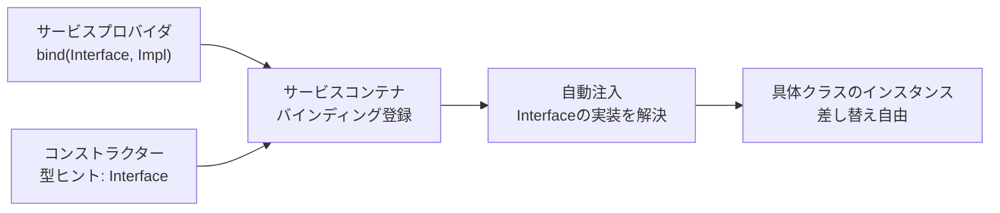

## Contractとは

Laravelの「Contracts」は、フレームワークが提供するコアサービスを定義するインターフェースのセットです。例えば、`Illuminate\Contracts\Queue\Queue` Contractはジョブのキューイングに必要なメソッドを定義し、`Illuminate\Contracts\Mail\Mailer` Contractはメール送信に必要なメソッドを定義しています。

各Contractにはフレームワークが提供する対応する実装があります。例えば、Laravelはさまざまなドライバーのキュー実装と、[Symfony Mailer](https://symfony.com/doc/current/mailer.html)を使ったメーラー実装を提供しています。

すべてのLaravel Contractsは[専用のGitHubリポジトリ](https://github.com/illuminate/contracts)にあります。これはすべての利用可能なContractへのクイックリファレンスを提供し、Laravelサービスと連携するパッケージを構築する際に利用できる単一の分離されたパッケージです。

<Info>
  Contractはただのインターフェースです。PHPのインターフェースと全く同じ仕組みで動作します。Laravelはこのインターフェースへの実装を提供し、サービスコンテナを通じて注入します。
</Info>

## ContractとFacadeの違い

[ファサード](/jp/facades)とヘルパー関数は、サービスコンテナからContractを型ヒントで解決する必要なく、Laravelのサービスを簡単に利用する方法を提供しています。ほとんどの場合、各ファサードには対応するContractがあります。

ファサードとContractの主な違いは次のとおりです。

| 観点 | ファサード | Contract |
|---|---|---|
| 依存の宣言 | 不要（どこからでも呼び出せる） | コンストラクターで明示的に宣言 |
| テスト | `shouldReceive()` でモック | 標準的なモックライブラリで差し替え |
| 主な用途 | アプリケーション内の手軽な使用 | パッケージ開発、明示的な依存管理 |
| コードの可読性 | インポートが1行で済む | コンストラクターで依存が一目瞭然 |

<Tip>
  ファサードはクラスのコンストラクターで要求する必要がありませんが、Contractはクラスのコンストラクターで明示的な依存として定義できます。一部の開発者はこの明示的な依存の定義を好み、Contractを使います。他の開発者はファサードの利便性を好みます。**一般的に、ほとんどのアプリケーションは開発中にファサードを問題なく使えます。**
</Tip>

## Contractをいつ使うか

ContractとFacadeのどちらを使うかは、個人の好みや開発チームの好みによります。ContractとFacadeはどちらも堅牢でテストしやすいLaravelアプリケーションを作成するために使えます。ContractとFacadeは相互に排他的ではありません。アプリケーションの一部ではFacadeを使い、他の部分ではContractに依存することも可能です。

特にContractが有用な場面は次のとおりです。

- **複数のPHPフレームワークと連携するパッケージを構築する場合** — `illuminate/contracts` パッケージを使ってLaravelサービスとの連携を定義することで、`composer.json` にLaravelの具体的な実装を要求せずに済みます。
- **依存を明示的にしたい場合** — コンストラクターを見るだけでクラスが何に依存しているか一目でわかります。
- **実装を差し替えたい場合** — サービスコンテナを通じて別の実装に差し替えることが容易になります。

## Contractの使い方

Contractの実装を取得するにはどうすればよいでしょうか。実はとても簡単です。

コントローラー、イベントリスナー、ミドルウェア、キュージョブ、ルートクロージャなど、Laravelの多くの種類のクラスはサービスコンテナを通じて解決されます。そのため、Contractの実装を取得するには、解決されているクラスのコンストラクターでインターフェースを「型ヒント」するだけです。



例えば、次のイベントリスナーを見てください。

```php
<?php

namespace App\Listeners;

use App\Events\OrderWasPlaced;
use App\Models\User;
use Illuminate\Contracts\Redis\Factory;

class CacheOrderInformation
{
    /**
     * イベントリスナーを生成する
     */
    public function __construct(
        protected Factory $redis,
    ) {}

    /**
     * イベントを処理する
     */
    public function handle(OrderWasPlaced $event): void
    {
        // ...
    }
}
```

イベントリスナーが解決されると、サービスコンテナはクラスのコンストラクターの型ヒントを読み取り、適切な値を注入します。

## カスタムContractの作成

独自のContractを作成することで、アプリケーションのコンポーネント間の依存を明確にできます。

<Steps>
  <Step title="インターフェースを定義する">
    `app/Contracts` ディレクトリにインターフェースを作成します。

    ```php
    <?php

    namespace App\Contracts;

    interface PaymentGateway
    {
        /**
         * 指定された金額を決済する
         */
        public function charge(int $amount, string $token): bool;

        /**
         * 決済を返金する
         */
        public function refund(string $transactionId): bool;
    }
    ```
  </Step>
  <Step title="実装クラスを作成する">
    Contractを実装するクラスを作成します。

    ```php
    <?php

    namespace App\Services;

    use App\Contracts\PaymentGateway;

    class StripePaymentGateway implements PaymentGateway
    {
        public function charge(int $amount, string $token): bool
        {
            // Stripe APIを使った決済処理...
            return true;
        }

        public function refund(string $transactionId): bool
        {
            // Stripe APIを使った返金処理...
            return true;
        }
    }
    ```
  </Step>
  <Step title="サービスプロバイダでバインドする">
    [サービスプロバイダ](/jp/service-providers)でContractと実装をバインドします。

    ```php
    use App\Contracts\PaymentGateway;
    use App\Services\StripePaymentGateway;

    $this->app->singleton(PaymentGateway::class, StripePaymentGateway::class);
    ```
  </Step>
  <Step title="型ヒントで注入を受け取る">
    コントローラーや他のクラスのコンストラクターで型ヒントします。

    ```php
    <?php

    namespace App\Http\Controllers;

    use App\Contracts\PaymentGateway;
    use Illuminate\Http\Request;

    class OrderController extends Controller
    {
        public function __construct(
            protected PaymentGateway $payment,
        ) {}

        public function store(Request $request)
        {
            $this->payment->charge(
                $request->amount,
                $request->payment_token
            );

            // ...
        }
    }
    ```
  </Step>
</Steps>

このパターンにより、決済サービスを `Stripe` から別のプロバイダに切り替える場合も、バインディングを1か所変更するだけで対応でき、コントローラーのコードは変更不要です。

## 主要なContract一覧

よく使うContractとその対応するファサードの対応表です（一部抜粋）。

| Contract | 対応するファサード |
|---|---|
| `Illuminate\Contracts\Auth\Access\Gate` | `Gate` |
| `Illuminate\Contracts\Auth\Factory` | `Auth` |
| `Illuminate\Contracts\Bus\Dispatcher` | `Bus` |
| `Illuminate\Contracts\Cache\Factory` | `Cache` |
| `Illuminate\Contracts\Cache\Repository` | `Cache::driver()` |
| `Illuminate\Contracts\Config\Repository` | `Config` |
| `Illuminate\Contracts\Console\Kernel` | `Artisan` |
| `Illuminate\Contracts\Container\Container` | `App` |
| `Illuminate\Contracts\Encryption\Encrypter` | `Crypt` |
| `Illuminate\Contracts\Events\Dispatcher` | `Event` |
| `Illuminate\Contracts\Filesystem\Factory` | `Storage` |
| `Illuminate\Contracts\Filesystem\Filesystem` | `Storage::disk()` |
| `Illuminate\Contracts\Hashing\Hasher` | `Hash` |
| `Illuminate\Contracts\Mail\Mailer` | `Mail` |
| `Illuminate\Contracts\Notifications\Dispatcher` | `Notification` |
| `Illuminate\Contracts\Queue\Factory` | `Queue` |
| `Illuminate\Contracts\Queue\Queue` | `Queue::connection()` |
| `Illuminate\Contracts\Queue\ShouldQueue` | — |
| `Illuminate\Contracts\Redis\Factory` | `Redis` |
| `Illuminate\Contracts\Routing\ResponseFactory` | `Response` |
| `Illuminate\Contracts\Routing\UrlGenerator` | `URL` |
| `Illuminate\Contracts\Session\Session` | `Session::driver()` |
| `Illuminate\Contracts\Translation\Translator` | `Lang` |
| `Illuminate\Contracts\Validation\Factory` | `Validator` |
| `Illuminate\Contracts\View\Factory` | `View` |

すべてのContractの一覧は[illuminate/contracts](https://github.com/illuminate/contracts)リポジトリで確認できます。

## 次のステップ

<Card title="ファサード" icon="layer-group" href="/jp/facades">
  ファサードの仕組みとテスト方法を確認します。
</Card>
