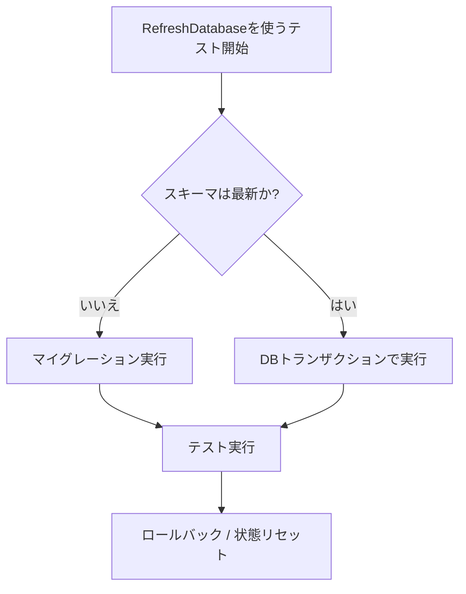

## はじめに

Laravelには、データベースを使う機能を安全かつ高速に検証するための仕組みが標準で用意されています。データベースリセット用トレイト、モデルファクトリ、シーダー、専用アサーションを組み合わせることで、壊れにくいテストを作成できます。

まずは `RefreshDatabase` を使うのが基本です。多くのケースで、完全リセットより高速にテストの独立性を保てます。

## 各テスト後のデータベースリセット

前のテストデータが次のテストに影響しないように、Laravelのデータベースリセット用トレイトを利用します。

<CodeGroup>
```php Pest
<?php

use Illuminate\Foundation\Testing\RefreshDatabase;

uses(RefreshDatabase::class);

test('基本例', function () {
    $response = $this->get('/');

    $response->assertOk();
});
```

```php PHPUnit
<?php

namespace Tests\Feature;

use Illuminate\Foundation\Testing\RefreshDatabase;
use Tests\TestCase;

class ExampleTest extends TestCase
{
    use RefreshDatabase;

    public function test_basic_example(): void
    {
        $response = $this->get('/');

        $response->assertOk();
    }
}
```
</CodeGroup>

`RefreshDatabase` は、スキーマが最新かどうかを判定します。最新ならトランザクションでテストを実行し、最新でなければ先にマイグレーションを実行します。



トランザクション方式ではなく、毎回完全にリセットしたい場合は次のトレイトを使います。

| トレイト | 挙動 | 使いどころ |
| --- | --- | --- |
| `RefreshDatabase` | スキーマが最新ならトランザクション、必要時のみマイグレーション | 通常はこれを第一候補にする |
| `DatabaseMigrations` | 各テストごとにマイグレーションを実行 | 毎回マイグレーションのライフサイクルを通したい場合 |
| `DatabaseTruncation` | テーブルをTRUNCATEして初期化 | トランザクションが適さない環境で全件クリアしたい場合 |

## モデルファクトリ

テスト前にデータを準備する際、モデルファクトリを使うとEloquentモデルを簡潔に生成できます。

ファクトリ定義・state・リレーションの詳細は [Eloquentファクトリ](/jp/eloquent-factories) を参照してください。

<CodeGroup>
```php Pest
<?php

use App\Models\User;

test('モデルを生成できる', function () {
    $user = User::factory()->create();

    expect($user->exists)->toBeTrue();
});
```

```php PHPUnit
<?php

namespace Tests\Feature;

use App\Models\User;
use Tests\TestCase;

class UserFactoryTest extends TestCase
{
    public function test_models_can_be_instantiated(): void
    {
        $user = User::factory()->create();

        $this->assertTrue($user->exists);
    }
}
```
</CodeGroup>

## シーダーの実行

テスト中にデータを投入したい場合は `seed()` を使います。引数なしなら `DatabaseSeeder`、引数ありなら特定シーダー（または配列）を実行できます。

<CodeGroup>
```php Pest
<?php

use Database\Seeders\OrderStatusSeeder;
use Database\Seeders\TransactionStatusSeeder;
use Illuminate\Foundation\Testing\RefreshDatabase;

uses(RefreshDatabase::class);

test('注文を作成できる', function () {
    $this->seed();

    $this->seed(OrderStatusSeeder::class);

    $this->seed([
        OrderStatusSeeder::class,
        TransactionStatusSeeder::class,
    ]);

    // ...
});
```

```php PHPUnit
<?php

namespace Tests\Feature;

use Database\Seeders\OrderStatusSeeder;
use Database\Seeders\TransactionStatusSeeder;
use Illuminate\Foundation\Testing\RefreshDatabase;
use Tests\TestCase;

class OrderTest extends TestCase
{
    use RefreshDatabase;

    public function test_orders_can_be_created(): void
    {
        $this->seed();

        $this->seed(OrderStatusSeeder::class);

        $this->seed([
            OrderStatusSeeder::class,
            TransactionStatusSeeder::class,
        ]);

        // ...
    }
}
```
</CodeGroup>

`RefreshDatabase` を使う全テストで毎回自動シードしたい場合は、基底のテストクラスに `#[Seed]` 属性を付けます。

```php
<?php

namespace Tests;

use Illuminate\Foundation\Testing\Attributes\Seed;
use Illuminate\Foundation\Testing\TestCase as BaseTestCase;

#[Seed]
abstract class TestCase extends BaseTestCase
{
}
```

特定シーダーのみを自動実行したい場合は `#[Seeder(...)]` を使います。

```php
<?php

namespace Tests\Feature;

use Database\Seeders\OrderStatusSeeder;
use Illuminate\Foundation\Testing\Attributes\Seeder;
use Illuminate\Foundation\Testing\RefreshDatabase;
use Tests\TestCase;

#[Seeder(OrderStatusSeeder::class)]
class OrderStatusTest extends TestCase
{
    use RefreshDatabase;
}
```

## 利用可能なアサーション

Laravelには、Pest / PHPUnitのどちらでも使えるデータベース専用アサーションが用意されています。

### `assertDatabaseCount`

テーブル内のレコード件数が期待値と一致することを確認します。

<CodeGroup>
```php Pest
$this->assertDatabaseCount('users', 5);
```

```php PHPUnit
$this->assertDatabaseCount('users', 5);
```
</CodeGroup>

### `assertDatabaseEmpty`

テーブルが空であることを確認します。

<CodeGroup>
```php Pest
$this->assertDatabaseEmpty('users');
```

```php PHPUnit
$this->assertDatabaseEmpty('users');
```
</CodeGroup>

### `assertDatabaseHas`

指定した条件に一致するレコードが存在することを確認します。

<CodeGroup>
```php Pest
$this->assertDatabaseHas('users', [
    'email' => 'sally@example.com',
]);
```

```php PHPUnit
$this->assertDatabaseHas('users', [
    'email' => 'sally@example.com',
]);
```
</CodeGroup>

### `assertDatabaseMissing`

指定した条件に一致するレコードが存在しないことを確認します。

<CodeGroup>
```php Pest
$this->assertDatabaseMissing('users', [
    'email' => 'sally@example.com',
]);
```

```php PHPUnit
$this->assertDatabaseMissing('users', [
    'email' => 'sally@example.com',
]);
```
</CodeGroup>

### `assertSoftDeleted`

対象のEloquentモデルがソフトデリート済みであることを確認します。

<CodeGroup>
```php Pest
$this->assertSoftDeleted($user);
```

```php PHPUnit
$this->assertSoftDeleted($user);
```
</CodeGroup>

### `assertNotSoftDeleted`

対象のEloquentモデルがソフトデリートされていないことを確認します。

<CodeGroup>
```php Pest
$this->assertNotSoftDeleted($user);
```

```php PHPUnit
$this->assertNotSoftDeleted($user);
```
</CodeGroup>

### `assertModelExists`

指定したモデル（またはモデルコレクション）がDB上に存在することを確認します。

<CodeGroup>
```php Pest
<?php

use App\Models\User;

$user = User::factory()->create();

$this->assertModelExists($user);
```

```php PHPUnit
<?php

use App\Models\User;

$user = User::factory()->create();

$this->assertModelExists($user);
```
</CodeGroup>

### `assertModelMissing`

指定したモデル（またはモデルコレクション）がDB上に存在しないことを確認します。

<CodeGroup>
```php Pest
<?php

use App\Models\User;

$user = User::factory()->create();
$user->delete();

$this->assertModelMissing($user);
```

```php PHPUnit
<?php

use App\Models\User;

$user = User::factory()->create();
$user->delete();

$this->assertModelMissing($user);
```
</CodeGroup>

### `expectsDatabaseQueryCount`

テスト冒頭で、実行されるデータベースクエリの総数を厳密に指定します。実際の実行回数が一致しない場合は失敗します。

<CodeGroup>
```php Pest
$this->expectsDatabaseQueryCount(5);

// Test...
```

```php PHPUnit
$this->expectsDatabaseQueryCount(5);

// Test...
```
</CodeGroup>
