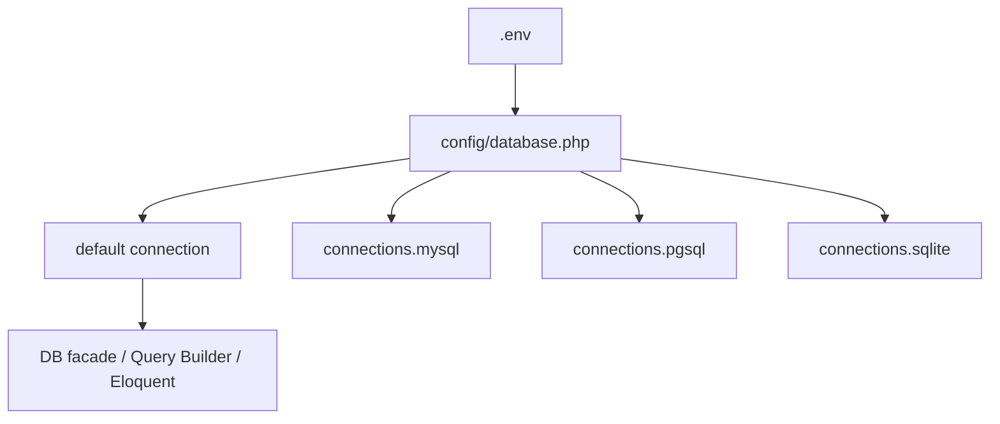
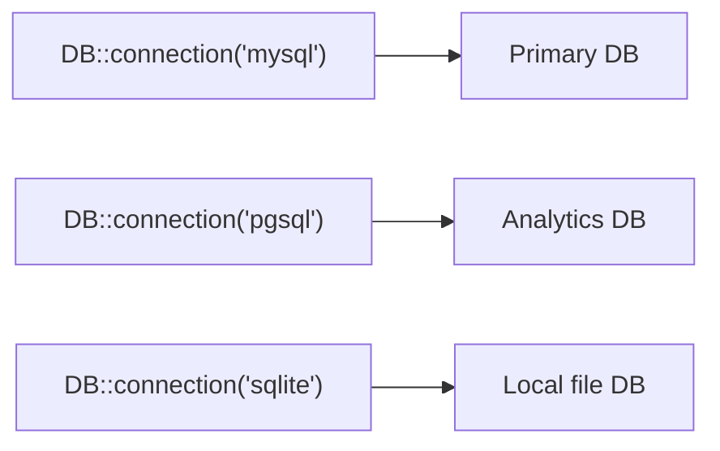

## はじめに

Laravelは次のデータベースを公式にサポートしています。

- MySQL / MariaDB
- PostgreSQL
- SQLite
- SQL Server

あなたは生SQL、Query Builder、Eloquent ORMのどれでも同じ接続設定を使えます。

<Info>
  このページはデータベース接続の前提を扱います。実践的なクエリは[Query Builder](/jp/query-builder)、スキーマ管理は[Migrations](/jp/migrations)、初期データ投入は[Seeding](/jp/seeding)を参照してください。
</Info>

## 設定

データベース設定は `config/database.php` に集約されています。
あなたは `default` で既定の接続名を選び、`connections` で接続ごとの詳細を定義します。



```php
// config/database.php
'default' => env('DB_CONNECTION', 'sqlite'),

'connections' => [
    'mysql' => [
        'driver' => 'mysql',
        'host' => env('DB_HOST', '127.0.0.1'),
        'port' => env('DB_PORT', '3306'),
        'database' => env('DB_DATABASE', 'laravel'),
        'username' => env('DB_USERNAME', 'root'),
        'password' => env('DB_PASSWORD', ''),
    ],
],
```

`.env` では少なくとも次を設定してください。

```ini
DB_CONNECTION=mysql
DB_HOST=127.0.0.1
DB_PORT=3306
DB_DATABASE=app
DB_USERNAME=app_user
DB_PASSWORD=secret
```

SQLiteを使う場合は `DB_CONNECTION=sqlite` と `DB_DATABASE` のパスを設定します。

## 読み取り・書き込み接続の分離

読み取り(`SELECT`)と書き込み(`INSERT` / `UPDATE` / `DELETE`)を別ホストに分離したい場合、同じ接続内で `read` と `write` を設定してください。

```php
'mysql' => [
    'driver' => 'mysql',
    'read' => [
        'host' => ['10.0.0.10', '10.0.0.11'],
    ],
    'write' => [
        'host' => ['10.0.0.20'],
    ],
    'sticky' => true,

    'port' => env('DB_PORT', '3306'),
    'database' => env('DB_DATABASE', 'laravel'),
    'username' => env('DB_USERNAME', 'root'),
    'password' => env('DB_PASSWORD', ''),
],
```

`sticky` を `true` にすると、同一リクエスト内で書き込み後の読み取りがwrite接続に固定されます。

<Tip>
  レプリカ遅延がある構成では `sticky` を有効にすると、書き込み直後に古いデータを読むリスクを下げられます。
</Tip>

## 複数データベース接続

あなたは `config/database.php` に接続を複数定義し、`DB::connection()` で切り替えられます。

```php
use Illuminate\Support\Facades\DB;

$users = DB::connection('sqlite')->select('select * from users');
$pdo = DB::connection('pgsql')->getPdo();
```



## SQLクエリの実行

`DB` facadeはクエリ種別ごとに専用メソッドを持ちます。

```php
use Illuminate\Support\Facades\DB;

$users = DB::select('select * from users where active = ?', [1]);

DB::insert('insert into users (name, email) values (?, ?)', ['Taylor', 'taylor@example.com']);

$affected = DB::update('update users set votes = 100 where name = ?', ['Taylor']);

$deleted = DB::delete('delete from sessions where user_id = ?', [1]);

DB::statement('drop table temporary_imports');
```

<Warning>
  ユーザー入力をSQL文字列に直接連結しないでください。必ずバインディング引数を使ってSQL injectionを防いでください。
</Warning>

## クエリリスニング

実行されたSQLを追跡したいときは、Service Providerの `boot()` で `DB::listen()` を登録してください。

```php
use Illuminate\Database\Events\QueryExecuted;
use Illuminate\Support\Facades\DB;

public function boot(): void
{
    DB::listen(function (QueryExecuted $query) {
        logger()->debug('SQL executed', [
            'sql' => $query->toRawSql(),
            'time_ms' => $query->time,
        ]);
    });
}
```

## transaction

複数の更新を1つの単位として扱うなら `DB::transaction()` を使ってください。
例外が発生するとLaravelが自動でロールバックします。

```php
use Illuminate\Support\Facades\DB;

DB::transaction(function () {
    DB::update('update users set votes = 1');
    DB::delete('delete from posts where archived = 1');
});
```

デッドロック再試行が必要なら `attempts` を指定できます。

```php
DB::transaction(function () {
    // ...
}, attempts: 5);
```

手動で制御したい場合は `beginTransaction` / `rollBack` / `commit` を使ってください。

```php
DB::beginTransaction();

try {
    DB::update('update accounts set balance = balance - 100 where id = ?', [1]);
    DB::update('update accounts set balance = balance + 100 where id = ?', [2]);

    DB::commit();
} catch (\Throwable $e) {
    DB::rollBack();
    throw $e;
}
```

## 次のステップ

<Card title="Query Builder" icon="table" href="/jp/query-builder">
  接続設定を使って安全にクエリを組み立てる方法を学びます。
</Card>

<Card title="Migrations" icon="hammer" href="/jp/migrations">
  接続したデータベースのスキーマをバージョン管理する方法を学びます。
</Card>

<Card title="Seeding" icon="seedling" href="/jp/seeding">
  開発・テスト用データを再現可能な形で投入する方法を学びます。
</Card>
