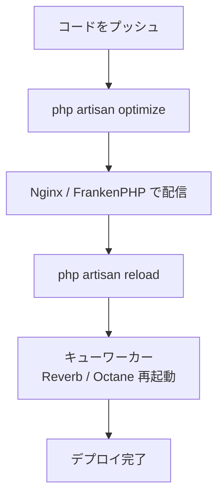

## はじめに

Laravelアプリケーションを本番環境にデプロイするときは、できるだけ効率よく動作するよう準備が必要です。
このガイドでは、本番デプロイを確実に行うための重要なポイントを解説します。

## デプロイフロー



## サーバー要件

Laravelフレームワークには以下のシステム要件があります。
**PHP 8.3 以上**と、下記のPHP拡張モジュールが必要です。

| 拡張モジュール | 説明 |
| --- | --- |
| Ctype | 文字型チェック |
| cURL | HTTP通信 |
| DOM | XML/HTMLのDOM操作 |
| Fileinfo | MIMEタイプ検出 |
| Filter | データのフィルタリング |
| Hash | ハッシュ関数 |
| Mbstring | マルチバイト文字列処理 |
| OpenSSL | 暗号化 |
| PCRE | 正規表現 |
| PDO | データベース接続 |
| Session | セッション管理 |
| Tokenizer | PHPトークン解析 |
| XML | XML処理 |

## サーバー設定

### Nginx

Nginxを使用している場合は、以下の設定ファイルをベースにしてください。
**すべてのリクエストを `public/index.php` に転送する**ことが重要です。
`index.php` をプロジェクトルートに移動しないでください。機密設定ファイルが外部に公開されてしまいます。

```nginx
server {
    listen 80;
    listen [::]:80;
    server_name example.com;
    root /srv/example.com/public;

    add_header X-Frame-Options "SAMEORIGIN";
    add_header X-Content-Type-Options "nosniff";

    index index.php;

    charset utf-8;

    location / {
        try_files $uri $uri/ /index.php?$query_string;
    }

    location = /favicon.ico { access_log off; log_not_found off; }
    location = /robots.txt  { access_log off; log_not_found off; }

    error_page 404 /index.php;

    location ~ ^/index\.php(/|$) {
        fastcgi_pass unix:/var/run/php/php8.3-fpm.sock;
        fastcgi_param SCRIPT_FILENAME $realpath_root$fastcgi_script_name;
        include fastcgi_params;
        fastcgi_hide_header X-Powered-By;
    }

    location ~ /\.(?!well-known).* {
        deny all;
    }
}
```

### FrankenPHP

[FrankenPHP](https://frankenphp.dev/) はGoで書かれたモダンなPHPアプリケーションサーバーです。
以下のコマンドだけでLaravelアプリケーションを起動できます。

```shell
frankenphp php-server -r public/
```

HTTP/3、モダンな圧縮、[Laravel Octane](https://laravel.com/docs/octane) 連携、スタンドアロンバイナリ化などの高度な機能は [FrankenPHPのLaravelドキュメント](https://frankenphp.dev/docs/laravel/) を参照してください。

### ディレクトリ権限

Laravelは `bootstrap/cache` と `storage` ディレクトリへの書き込みが必要です。
Webサーバーのプロセスオーナーがこれらのディレクトリに書き込めるよう権限を設定してください。

```shell
chmod -R 775 storage bootstrap/cache
chown -R www-data:www-data storage bootstrap/cache
```

## 最適化

本番環境へのデプロイ時には、設定・イベント・ルート・ビューをキャッシュしてパフォーマンスを向上させます。
`optimize` コマンドで一括キャッシュできます。

```shell
php artisan optimize
```

キャッシュを削除するには `optimize:clear` を使います。

```shell
php artisan optimize:clear
```

### 個別の最適化コマンド

`optimize` は以下のコマンドをまとめて実行します。必要に応じて個別に実行することも可能です。

| コマンド | 説明 |
| --- | --- |
| `php artisan config:cache` | 設定ファイルを1ファイルにまとめてキャッシュする |
| `php artisan event:cache` | イベント→リスナーのマッピングをキャッシュする |
| `php artisan route:cache` | ルート定義をキャッシュしてルート登録を高速化する |
| `php artisan view:cache` | Bladeビューをプリコンパイルしてリクエストを高速化する |

<Info>
  `config:cache` を実行した後は、設定ファイル内でのみ `env()` 関数を呼び出してください。
  キャッシュ後は `.env` ファイルが読み込まれなくなるため、設定ファイル以外で `env()` を呼ぶと `null` が返ります。
</Info>

## サービスのリロード

新しいバージョンをデプロイした後、キューワーカー・Laravel Reverb・Laravel Octane などの長時間動作するサービスは、新しいコードを使うために再起動が必要です。

```shell
php artisan reload
```

このコマンドはリロード可能なサービスを終了させます。
プロセスモニター（Supervisorなど）が自動的に再起動するよう設定しておいてください。

<Info>
  Laravel Cloudを使用している場合、すべてのサービスのグレースフルリロードは自動的に処理されるため、`reload` コマンドは不要です。
</Info>

## デバッグモード

`config/app.php` の `debug` オプションは、エラー情報をユーザーにどれだけ表示するかを制御します。
デフォルトでは `.env` ファイルの `APP_DEBUG` 環境変数の値が使われます。

<Warning>
  **本番環境では `APP_DEBUG` を必ず `false` にしてください。**
  `APP_DEBUG=true` のまま本番環境で動作させると、データベース接続情報や秘密鍵などの機密設定値がエンドユーザーに露出するリスクがあります。
</Warning>

```ini
# .env（本番環境）
APP_DEBUG=false
```

## ヘルスチェックルート

Laravelにはアプリケーションの状態を監視するためのヘルスチェックルートが組み込まれています。
アップタイムモニター・ロードバランサー・Kubernetesなどのオーケストレーションシステムと連携できます。

デフォルトでは `/up` エンドポイントが用意されており、アプリケーションが正常に起動していれば `200`、起動時に例外が発生していれば `500` を返します。

`bootstrap/app.php` でURIをカスタマイズできます。

```php
->withRouting(
    web: __DIR__.'/../routes/web.php',
    commands: __DIR__.'/../routes/console.php',
    health: '/status', // デフォルトは /up
)
```

このルートへのリクエスト時に `Illuminate\Foundation\Events\DiagnosingHealth` イベントが発行されるため、
データベースやキャッシュの追加チェックをリスナーで実装できます。

## Laravel CloudまたはForgeでデプロイする

### Laravel Cloud

完全マネージドの自動スケールデプロイプラットフォームをお探しなら、[Laravel Cloud](https://cloud.laravel.com) がおすすめです。
マネージドコンピュート・データベース・キャッシュ・オブジェクトストレージを提供する、Laravelに最適化されたPaaSです。

Laravelの開発チームが直接チューニングしており、フレームワークとシームレスに連携します。

### Laravel Forge

自分でサーバーを管理したいけれど、NginxやMySQLなどの各種サービスのセットアップには手間をかけたくない場合は、[Laravel Forge](https://forge.laravel.com) が便利です。

DigitalOcean・Linode・AWSなど主要なクラウドプロバイダーにサーバーを作成し、Nginx・MySQL・Redis・Memcached・Beanstalkなどのツールを自動的にインストール・管理します。

## 次のステップ

<Card title="デプロイメント — 公式ドキュメント" icon="arrow-right" href="https://laravel.com/docs/deployment">
  公式ドキュメントでは最新のデプロイ設定の詳細を確認できます。
</Card>
