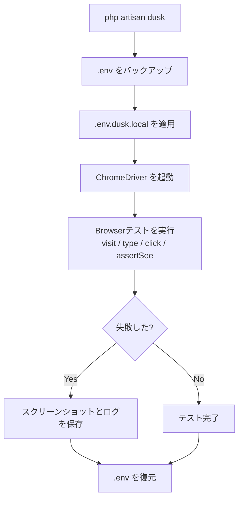

## Laravel Duskとは

Laravel Duskは、ブラウザを実際に操作して画面全体を検証するE2Eテストツールです。  
デフォルトではSeleniumサーバーを別途準備しなくても、ChromeDriverでテストを実行できます。

<Warning>
  公式ドキュメントでは、新規プロジェクトではPest 4のブラウザテストも推奨されています。既存プロジェクトでDuskを使っている場合や、DuskのAPIを使いたい場合に本ページを活用してください。
</Warning>

## インストール

まずGoogle Chromeをインストールし、Duskを開発依存として追加します。

```shell
composer require laravel/dusk --dev
php artisan dusk:install
```

ChromeDriverのバージョンを調整したい場合は、`dusk:chrome-driver` コマンドを使います。

```shell
# ローカルChromeに合うバージョンを検出してインストール
php artisan dusk:chrome-driver --detect
```

## 環境設定（`.env.dusk.local`）

Dusk専用の環境変数を使うには、プロジェクトルートに `.env.dusk.{environment}` を作成します。  
ローカル環境なら `.env.dusk.local` を使います。

```ini
APP_URL=http://127.0.0.1:8000
DB_CONNECTION=mysql
DB_DATABASE=app_testing
DB_USERNAME=root
DB_PASSWORD=root
```

Dusk実行中は `.env` がバックアップされ、`.env.dusk.local` の内容が一時的に適用されます。

## 基本的なブラウザテスト

テストを生成し、`php artisan dusk` で実行します。

```shell
php artisan dusk:make LoginTest
php artisan dusk
```

失敗したテストだけを再実行する場合:

```shell
php artisan dusk:fails
```

### 基本操作の例

```php
<?php

namespace Tests\Browser;

use App\Models\User;
use Laravel\Dusk\Browser;
use Tests\DuskTestCase;

class LoginTest extends DuskTestCase
{
    public function test_user_can_login(): void
    {
        $user = User::factory()->create([
            'email' => 'taylor@laravel.com',
        ]);

        $this->browse(function (Browser $browser) use ($user) {
            $browser->visit('/login')
                ->type('email', $user->email)
                ->type('password', 'password')
                ->press('Login')
                ->assertPathIs('/dashboard')
                ->assertSee('Dashboard');
        });
    }
}
```

`visit()`、`type()`、`press()`、`assertSee()` はDuskで最もよく使う操作です。

<Warning>
  Duskテストでは `RefreshDatabase` は使いません。公式ドキュメントのとおり、`DatabaseMigrations` か `DatabaseTruncation` を使ってテスト間のデータを初期化してください。
</Warning>

## ページオブジェクトパターン

複雑な画面をテストするときは、`dusk:page` でページオブジェクトを作ると保守しやすくなります。

```shell
php artisan dusk:page Login
```

`tests/Browser/Pages/Login.php` で `url()` や `elements()` を定義して、テスト側では再利用します。

```php
use Tests\Browser\Pages\Login;

$browser->visit(new Login)
    ->type('@email', 'taylor@laravel.com')
    ->type('@password', 'password')
    ->click('@submit')
    ->assertSee('Dashboard');
```

## スクリーンショットとデバッグ

失敗調査ではスクリーンショットとコンソールログの保存が有効です。

```php
$browser->screenshot('login-failed');
$browser->responsiveScreenshots('login-page');
$browser->screenshotElement('#login-form', 'login-form');
$browser->storeConsoleLog('login-console');
```

- スクリーンショット: `tests/Browser/screenshots`
- コンソールログ: `tests/Browser/console`

## CI（GitHub Actions）で実行する

GitHub Actionsでは、ChromeDriverとLaravelの内蔵サーバーを起動してから `php artisan dusk` を実行します。

```yaml
name: Dusk tests

on: [push, pull_request]

jobs:
  dusk:
    runs-on: ubuntu-latest
    env:
      APP_URL: http://127.0.0.1:8000
      DB_USERNAME: root
      DB_PASSWORD: root
      MAIL_MAILER: log
    steps:
      - uses: actions/checkout@v5
      - run: cp .env.example .env
      - run: composer install --no-progress --prefer-dist --optimize-autoloader
      - run: php artisan key:generate
      - run: php artisan dusk:chrome-driver --detect
      - run: ./vendor/laravel/dusk/bin/chromedriver-linux --port=9515 &
      - run: php artisan serve --no-reload &
      - run: php artisan dusk
```

## Dusk実行フロー



## 公式ドキュメント

<Card title="Laravel Dusk — 公式ドキュメント" icon="arrow-right" href="https://laravel.com/docs/dusk">
  Duskの全API（待機、アサーション、キーボード操作、iframe操作など）は公式ドキュメントで確認してください。
</Card>
