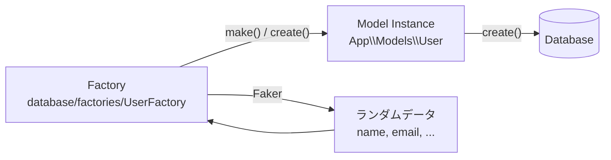
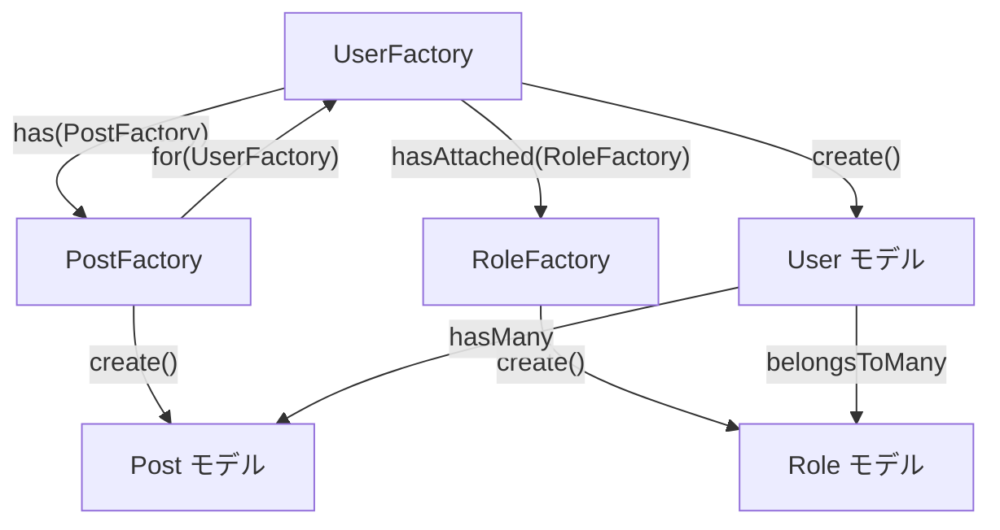

## ファクトリとは

テストやデータベースシーディングでは、データベースにレコードを挿入する必要があります。
手動で各カラムの値を指定する代わりに、Laravelの**モデルファクトリ**を使うと各Eloquentモデルのデフォルト属性セットを定義できます。

すべての新しいLaravelアプリケーションには `database/factories/UserFactory.php` が付属しています。

```php
namespace Database\Factories;

use Illuminate\Database\Eloquent\Factories\Factory;
use Illuminate\Support\Facades\Hash;
use Illuminate\Support\Str;

class UserFactory extends Factory
{
    // 同じパスワードを毎回再ハッシュしないためにキャッシュする
    protected static ?string $password;

    public function definition(): array
    {
        return [
            'name' => fake()->name(),
            'email' => fake()->unique()->safeEmail(),
            'email_verified_at' => now(),
            'password' => static::$password ??= Hash::make('password'),
            'remember_token' => Str::random(10),
        ];
    }
}
```

`fake()` ヘルパーを通じて [Faker](https://github.com/FakerPHP/Faker) ライブラリが利用でき、様々なランダムデータを生成できます。



<Info>
  Fakerのロケールは `config/app.php` の `faker_locale` オプションで変更できます。
</Info>

## ファクトリの生成

`make:factory` Artisanコマンドでファクトリを作成します。

```shell
php artisan make:factory PostFactory
```

新しいファクトリクラスは `database/factories` ディレクトリに配置されます。

### モデルとファクトリの自動検出

モデルに `HasFactory` トレイトを使用すると、Laravelが自動的に対応するファクトリを見つけます。
`Database\Factories` 名前空間で、モデル名に `Factory` を付けたクラス名を検索します。

命名規則が合わない場合は `UseFactory` 属性で明示的に指定できます。

```php
use Illuminate\Database\Eloquent\Attributes\UseFactory;
use Database\Factories\Administration\FlightFactory;

#[UseFactory(FlightFactory::class)]
class Flight extends Model
{
    // ...
}
```

## ファクトリの定義

### `definition()` メソッド

ファクトリの中心となる `definition()` メソッドでデフォルト属性を定義します。

```php
namespace Database\Factories;

use Illuminate\Database\Eloquent\Factories\Factory;

class PostFactory extends Factory
{
    public function definition(): array
    {
        return [
            'user_id' => \App\Models\User::factory(),
            'title' => fake()->sentence(),
            'content' => fake()->paragraphs(3, true),
            'published_at' => fake()->optional()->dateTimeBetween('-1 year', 'now'),
        ];
    }
}
```

Fakerがよく使われるメソッドの一覧：

| メソッド | 生成されるデータ例 |
| --- | --- |
| `fake()->name()` | `John Doe` |
| `fake()->email()` | `john@example.com` |
| `fake()->sentence()` | ランダムな文 |
| `fake()->paragraph()` | ランダムな段落 |
| `fake()->numberBetween(1, 100)` | `1`〜`100`の整数 |
| `fake()->dateTime()` | ランダムな日時 |
| `fake()->boolean()` | `true` / `false` |

## ファクトリステート (States)

ステートメソッドを使うと、ファクトリに対して個別の変更を定義できます。

```php
use Illuminate\Database\Eloquent\Factories\Factory;

class UserFactory extends Factory
{
    public function definition(): array
    {
        return [
            'name' => fake()->name(),
            'email' => fake()->unique()->safeEmail(),
            'account_status' => 'active',
        ];
    }

    // 停止中ユーザーのステート
    public function suspended(): static
    {
        return $this->state(fn (array $attributes) => [
            'account_status' => 'suspended',
        ]);
    }

    // 管理者ユーザーのステート
    public function admin(): static
    {
        return $this->state(fn (array $attributes) => [
            'is_admin' => true,
        ]);
    }
}
```

ステートは組み合わせて使えます。

```php
$user = User::factory()->suspended()->create();
$admin = User::factory()->admin()->create();
```

### ソフトデリートのステート

ソフトデリート対応のモデルには、ビルトインの `trashed()` ステートが利用できます。

```php
$user = User::factory()->trashed()->create();
```

## ファクトリコールバック (Callbacks)

`afterMaking` と `afterCreating` でモデル生成後の追加処理を定義します。

```php
namespace Database\Factories;

use App\Models\User;
use Illuminate\Database\Eloquent\Factories\Factory;

class UserFactory extends Factory
{
    public function configure(): static
    {
        return $this->afterMaking(function (User $user) {
            // make() 後に実行（DBには保存されていない）
        })->afterCreating(function (User $user) {
            // create() 後に実行（DBに保存済み）
        });
    }

    // ...
}
```

ステートメソッド内でもコールバックを登録できます。

```php
public function withProfile(): static
{
    return $this->state(fn (array $attributes) => [])
        ->afterCreating(function (User $user) {
            $user->profile()->create([
                'bio' => fake()->paragraph(),
            ]);
        });
}
```

## モデルの生成

### make() — DBに保存しない

```php
use App\Models\User;

// 1件生成
$user = User::factory()->make();

// 3件生成（コレクションで返る）
$users = User::factory()->count(3)->make();
```

### create() — DBに保存する

```php
// 1件生成してDBに保存
$user = User::factory()->create();

// 3件生成してDBに保存
$users = User::factory()->count(3)->create();
```

### 属性の上書き

`make()` や `create()` に配列を渡すと、特定の属性だけ上書きできます。

```php
$user = User::factory()->make([
    'name' => '山田太郎',
]);

$user = User::factory()->create([
    'name' => '鈴木花子',
    'email' => 'hanako@example.com',
]);
```

ステートを使ったインライン上書きも可能です。

```php
$user = User::factory()->state([
    'name' => '田中一郎',
])->make();
```

<Info>
  ファクトリでモデルを生成する際、マスアサインメント保護は自動的に無効になります。
</Info>

### Sequence（シーケンス）

複数モデルを生成する際に属性を交互に変える場合は `Sequence` を使います。

```php
use App\Models\User;
use Illuminate\Database\Eloquent\Factories\Sequence;

$users = User::factory()
    ->count(10)
    ->state(new Sequence(
        ['admin' => 'Y'],
        ['admin' => 'N'],
    ))
    ->create();
// 5件はadmin='Y'、5件はadmin='N'で生成される
```

`sequence()` メソッドを使うとより簡潔に書けます。

```php
$users = User::factory()
    ->count(2)
    ->sequence(
        ['name' => '最初のユーザー'],
        ['name' => '2番目のユーザー'],
    )
    ->create();
```

クロージャでランダムな値を動的に生成することもできます。

```php
use Illuminate\Database\Eloquent\Factories\Sequence;

$users = User::factory()
    ->count(10)
    ->state(new Sequence(
        fn (Sequence $sequence) => ['name' => 'ユーザー ' . $sequence->index],
    ))
    ->create();
```

## リレーションシップのファクトリ



### Has Many（1対多）

`has()` メソッドで「1対多」リレーションを持つモデルを生成します。

```php
use App\Models\Post;
use App\Models\User;

// 3件のPostを持つUserを生成
$user = User::factory()
    ->has(Post::factory()->count(3))
    ->create();
```

マジックメソッドを使うとより簡潔に書けます（`has` + リレーション名の複数形）。

```php
$user = User::factory()
    ->hasPosts(3)
    ->create();

// 属性を上書き
$user = User::factory()
    ->hasPosts(3, ['published' => false])
    ->create();
```

### Belongs To（逆リレーション）

`for()` メソッドで「属する」親モデルを指定します。

```php
use App\Models\Post;
use App\Models\User;

// 特定ユーザーに属する3件のPostを生成
$posts = Post::factory()
    ->count(3)
    ->for(User::factory()->state(['name' => '田中花子']))
    ->create();

// 既存モデルを親として使用
$user = User::factory()->create();
$posts = Post::factory()->count(3)->for($user)->create();
```

マジックメソッド版：

```php
$posts = Post::factory()
    ->count(3)
    ->forUser(['name' => '田中花子'])
    ->create();
```

### Many to Many（多対多）

`hasAttached()` メソッドで多対多リレーションを扱います。中間テーブルの属性も指定できます。

```php
use App\Models\Role;
use App\Models\User;

$user = User::factory()
    ->hasAttached(
        Role::factory()->count(3),
        ['active' => true]  // 中間テーブルの属性
    )
    ->create();
```

マジックメソッド版：

```php
$user = User::factory()
    ->hasRoles(1, ['name' => 'Editor'])
    ->create();
```

### ポリモーフィックリレーション

通常の「1対多」と同様に `has()` またはマジックメソッドが使えます。

```php
use App\Models\Post;

$post = Post::factory()->hasComments(3)->create();
```

`morphTo` リレーションにはマジックメソッドは使えません。`for()` に関係名を明示します。

```php
$comments = Comment::factory()->count(3)->for(
    Post::factory(), 'commentable'
)->create();
```

### ファクトリ内でのリレーション定義

`definition()` 内で外部キーに別のファクトリを割り当てると、モデル生成時に自動的に親モデルも生成されます。

```php
class PostFactory extends Factory
{
    public function definition(): array
    {
        return [
            'user_id' => \App\Models\User::factory(),
            'title' => fake()->sentence(),
            'content' => fake()->paragraph(),
        ];
    }
}
```

### recycle() — 既存モデルの再利用

複数のリレーションで同じモデルインスタンスを再利用したい場合は `recycle()` を使います。

```php
// 同じAirlineをTicketとFlightの両方で使い回す
Ticket::factory()
    ->recycle(Airline::factory()->create())
    ->create();

// コレクションからランダムに選択
$airlines = Airline::factory()->count(3)->create();
Ticket::factory()->count(10)->recycle($airlines)->create();
```

## シーディングでの利用

`DatabaseSeeder` やシーダークラスからファクトリを呼び出します。

```php
namespace Database\Seeders;

use App\Models\User;
use Illuminate\Database\Seeder;

class DatabaseSeeder extends Seeder
{
    public function run(): void
    {
        // 10件のユーザーを生成し、各ユーザーに3件の投稿を持たせる
        User::factory()
            ->count(10)
            ->hasPosts(3)
            ->create();
    }
}
```

シーダーの実行：

```shell
php artisan db:seed
```

## テストでの利用

テストでは `RefreshDatabase` トレイトと組み合わせてファクトリを使います。

```php
namespace Tests\Feature;

use App\Models\User;
use App\Models\Post;
use Illuminate\Foundation\Testing\RefreshDatabase;
use Tests\TestCase;

class PostTest extends TestCase
{
    use RefreshDatabase;

    public function test_user_can_view_their_posts(): void
    {
        $user = User::factory()->create();
        $posts = Post::factory()->count(3)->for($user)->create();

        $response = $this->actingAs($user)
            ->get('/dashboard');

        $response->assertOk();
        $response->assertSee($posts->first()->title);
    }

    public function test_suspended_user_cannot_post(): void
    {
        $user = User::factory()->suspended()->create();

        $response = $this->actingAs($user)
            ->post('/posts', ['title' => 'テスト']);

        $response->assertForbidden();
    }
}
```

`RefreshDatabase` はテストごとにデータベースをリセットするため、テスト間でデータが干渉しません。

<Tip>
  PestでテストするときもファクトリのAPIは同じです。
  `uses(RefreshDatabase::class)` を使ってデータベースをリセットしてください。
</Tip>

## 次のステップ

<Card title="データベースシーディング" icon="seedling" href="/jp/seeding">
  シーダーとファクトリを組み合わせて初期データを投入する方法を確認します。
</Card>

<Card title="テスト入門" icon="flask" href="/jp/testing">
  Laravelのテスト機能とRefreshDatabaseトレイトの使い方を確認します。
</Card>
