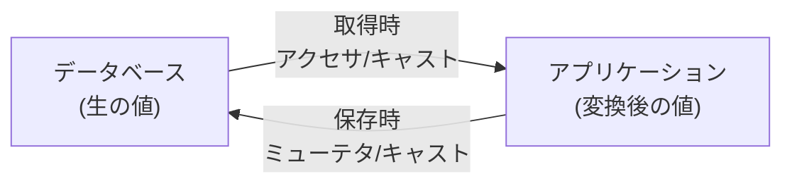

## はじめに

**アクセサ**・**ミューテタ**・**属性キャスト**は、Eloquentモデルの属性値をモデルインスタンスで取得・設定するときに変換する仕組みです。

- **アクセサ** — DBから取得した生の値を加工してアプリケーションに渡す
- **ミューテタ** — アプリケーションからセットされた値を加工してDBに保存する
- **キャスト** — 追加メソッドなしで属性の型変換を宣言的に定義する



## アクセサの定義

アクセサを定義するには、モデルに `protected` メソッドを追加します。メソッド名はキャメルケース、戻り値型は `Illuminate\Database\Eloquent\Casts\Attribute` にします。

```php
<?php

namespace App\Models;

use Illuminate\Database\Eloquent\Casts\Attribute;
use Illuminate\Database\Eloquent\Model;

class User extends Model
{
    /**
     * ユーザーのファーストネームを取得します。
     */
    protected function firstName(): Attribute
    {
        return Attribute::make(
            get: fn (string $value) => ucfirst($value),
        );
    }
}
```

`get` クロージャにDBの生の値が渡されます。モデルインスタンスから `first_name` プロパティとしてアクセスできます。

```php
$user = User::find(1);

$firstName = $user->first_name; // ucfirst() が適用された値
```

<Info>
  アクセサで計算した値をJSON/配列に含めたい場合は、モデルの `$appends` プロパティに追加するか、シリアライズ用の設定が必要です。
</Info>

### 複数の属性から値オブジェクトを生成する

`get` クロージャは第2引数として `$attributes`（モデルのすべての属性）を受け取れます。複数カラムを組み合わせて1つの値オブジェクトを返すことができます。

```php
use App\Support\Address;
use Illuminate\Database\Eloquent\Casts\Attribute;

protected function address(): Attribute
{
    return Attribute::make(
        get: fn (mixed $value, array $attributes) => new Address(
            $attributes['address_line_one'],
            $attributes['address_line_two'],
        ),
    );
}
```

### アクセサのキャッシュ

値オブジェクトを返すアクセサは、Eloquentが同じインスタンスを返すよう自動でキャッシュします。文字列や数値など基本型でもキャッシュしたい場合は `shouldCache()` を呼び出します。

```php
protected function hash(): Attribute
{
    return Attribute::make(
        get: fn (string $value) => bcrypt(gzuncompress($value)),
    )->shouldCache();
}
```

オブジェクトのキャッシュを無効にしたい場合は `withoutObjectCaching()` を使います。

```php
protected function address(): Attribute
{
    return Attribute::make(
        get: fn (mixed $value, array $attributes) => new Address(
            $attributes['address_line_one'],
            $attributes['address_line_two'],
        ),
    )->withoutObjectCaching();
}
```

## ミューテタの定義

ミューテタは `Attribute::make()` の `set` 引数として定義します。アクセサと同じメソッドにまとめられます。

```php
protected function firstName(): Attribute
{
    return Attribute::make(
        get: fn (string $value) => ucfirst($value),
        set: fn (string $value) => strtolower($value),
    );
}
```

モデルに値をセットすると `set` クロージャが呼ばれます。

```php
$user = User::find(1);
$user->first_name = 'SALLY'; // strtolower() が適用されて 'sally' が保存される
```

### 複数の属性に書き込む

`set` クロージャから配列を返すと、複数のカラムをまとめて更新できます。

```php
use App\Support\Address;
use Illuminate\Database\Eloquent\Casts\Attribute;

protected function address(): Attribute
{
    return Attribute::make(
        get: fn (mixed $value, array $attributes) => new Address(
            $attributes['address_line_one'],
            $attributes['address_line_two'],
        ),
        set: fn (Address $value) => [
            'address_line_one' => $value->lineOne,
            'address_line_two' => $value->lineTwo,
        ],
    );
}
```

## 属性キャスト

**キャスト**は、アクセサ・ミューテタを書かなくても属性の型変換を宣言できる簡便な方法です。モデルの `casts()` メソッドで配列を返します。

```php
<?php

namespace App\Models;

use Illuminate\Database\Eloquent\Model;

class User extends Model
{
    protected function casts(): array
    {
        return [
            'is_admin'   => 'boolean',
            'score'      => 'float',
            'settings'   => 'array',
            'created_at' => 'datetime',
        ];
    }
}
```

### 組み込みキャスト一覧

| キャスト | 説明 |
|---|---|
| `integer` / `int` | 整数 |
| `float` / `double` / `real` | 浮動小数点数 |
| `decimal:<桁数>` | 指定桁数の小数 |
| `string` | 文字列 |
| `boolean` / `bool` | 真偽値（`0`/`1` を含む） |
| `array` | JSONを配列に相互変換 |
| `object` | JSONをオブジェクトに相互変換 |
| `collection` | JSONをコレクションに変換 |
| `date` | 日付（Carbon） |
| `datetime` | 日時（Carbon） |
| `immutable_date` | イミュータブルな日付 |
| `immutable_datetime` | イミュータブルな日時 |
| `timestamp` | UNIXタイムスタンプ |
| `hashed` | 保存時にハッシュ化 |
| `encrypted` | 保存時に暗号化 |

<Warning>
  `null` の属性はキャストされません。また、リレーション名と同じ名前のキャストや、主キーへのキャストは定義しないでください。
</Warning>

### Stringable キャスト

`AsStringable` を使うと、属性を `Illuminate\Support\Stringable` オブジェクトとして扱えます。

```php
use Illuminate\Database\Eloquent\Casts\AsStringable;

protected function casts(): array
{
    return [
        'bio' => AsStringable::class,
    ];
}
```

## 配列・JSON キャスト

JSON/TEXT カラムを PHP 配列として透過的に扱えます。

```php
protected function casts(): array
{
    return [
        'options' => 'array',
    ];
}
```

```php
$user = User::find(1);

// 自動的にPHP配列として取得
$options = $user->options;

// 変更して保存すると自動的にJSONシリアライズされる
$user->options = array_merge($options, ['theme' => 'dark']);
$user->save();
```

`->` 演算子で JSON の特定キーだけを更新することもできます。

```php
$user->update(['options->theme' => 'dark']);
```

### AsArrayObject / AsCollection キャスト

標準の `array` キャストは、配列の特定オフセットを直接変更しようとするとエラーになります。`AsArrayObject` や `AsCollection` を使うとこの問題を回避できます。

```php
use Illuminate\Database\Eloquent\Casts\AsArrayObject;
use Illuminate\Database\Eloquent\Casts\AsCollection;

protected function casts(): array
{
    return [
        'options' => AsArrayObject::class,   // ArrayObjectとして扱う
        'tags'    => AsCollection::class,    // Collectionとして扱う
    ];
}
```

カスタムコレクションクラスを使いたい場合は `using()` を指定します。

```php
use App\Collections\TagCollection;
use Illuminate\Database\Eloquent\Casts\AsCollection;

protected function casts(): array
{
    return [
        'tags' => AsCollection::using(TagCollection::class),
    ];
}
```

## 日時キャスト

`created_at` / `updated_at` はデフォルトで Carbon にキャストされます。追加の日時カラムも同様に定義できます。

```php
protected function casts(): array
{
    return [
        'published_at' => 'datetime',
        'expires_at'   => 'immutable_datetime',
    ];
}
```

フォーマットを指定すると、JSON シリアライズ時にそのフォーマットが使われます。

```php
protected function casts(): array
{
    return [
        'published_at' => 'datetime:Y-m-d',
    ];
}
```

すべての日付のデフォルトシリアライズフォーマットを変えたい場合は `serializeDate()` をオーバーライドします（DB保存フォーマットには影響しません）。

```php
use DateTimeInterface;

protected function serializeDate(DateTimeInterface $date): string
{
    return $date->format('Y-m-d');
}
```

<Tip>
  `immutable_datetime` を使うと Carbon の代わりに CarbonImmutable が返ります。元のインスタンスを変更せずに日時操作できるため、副作用のないコードを書きやすくなります。
</Tip>

## Enum キャスト

PHP 8.1 以降の Backed Enum をキャストとして指定できます。

```php
<?php

namespace App\Enums;

enum ServerStatus: string
{
    case Provisioned = 'provisioned';
    case Ready       = 'ready';
    case Archived    = 'archived';
}
```

```php
use App\Enums\ServerStatus;

protected function casts(): array
{
    return [
        'status' => ServerStatus::class,
    ];
}
```

DBには Enum のバッキング値（`string` または `int`）が保存され、取得時には Enum インスタンスに変換されます。

```php
$server = Server::find(1);

if ($server->status === ServerStatus::Provisioned) {
    $server->status = ServerStatus::Ready;
    $server->save();
}
```

### Enum の配列キャスト

複数の Enum 値を1カラムに配列として保存したい場合は `AsEnumCollection` を使います。

```php
use App\Enums\ServerStatus;
use Illuminate\Database\Eloquent\Casts\AsEnumCollection;

protected function casts(): array
{
    return [
        'statuses' => AsEnumCollection::of(ServerStatus::class),
    ];
}
```

## クエリ時のキャスト

クエリ実行時に動的にキャストを適用するには `withCasts()` を使います。

```php
use App\Models\Post;
use App\Models\User;

$users = User::select([
    'users.*',
    'last_posted_at' => Post::selectRaw('MAX(created_at)')
        ->whereColumn('user_id', 'users.id'),
])->withCasts([
    'last_posted_at' => 'datetime',
])->get();
```

## カスタムキャスト

独自のキャストクラスを作成することも可能です。`CastsAttributes` インターフェースを実装し、`get` と `set` メソッドを定義します。

```shell
php artisan make:cast AsJson
```

詳細な実装方法（Value Object パターン、インバウンドキャスト、Castables など）は以下の上級ページを参照してください。

<Card title="カスタムキャスト詳解" icon="book" href="/jp/advanced/eloquent-casts">
  CastsAttributes インターフェースの実装方法や、Value Object パターン・Castables など上級のカスタムキャストを解説します。
</Card>

## 関連ページ

<Card title="Eloquent APIリソース" icon="link" href="/jp/eloquent-resources">
  モデルを一貫したJSON APIレスポンスに変換するリソースクラスの使い方を確認します。
</Card>
