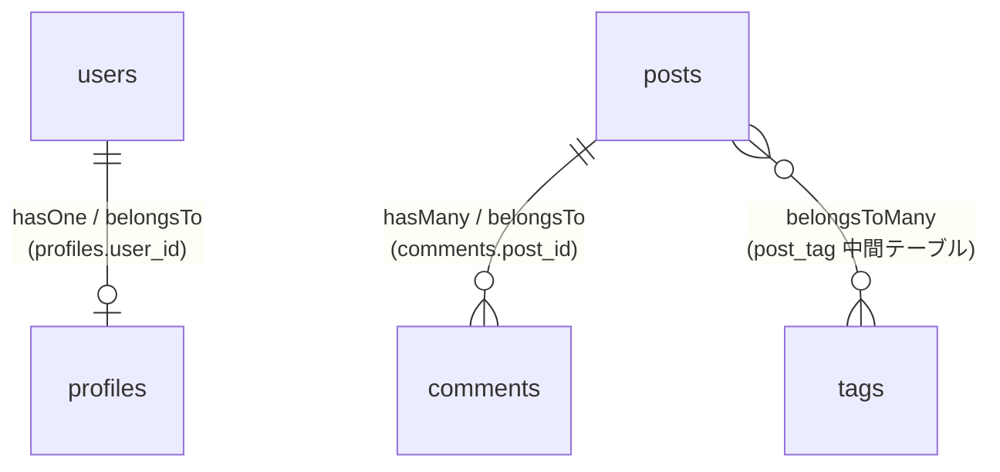

## リレーションとは

データベースのテーブルは互いに関連し合っていることがよくあります。たとえば、ブログ投稿には多数のコメントがあったり、注文はそれを行ったユーザーに関連していたりします。

Eloquentはこうしたテーブル間の関連（リレーション）を簡単に定義・操作する仕組みを提供しています。リレーションはEloquentモデルのメソッドとして定義します。

<Info>
  このページでは `User`、`Post`、`Comment`、`Tag` などの具体的なモデルを例として使います。
  これらのモデルとテーブルはあらかじめ作成されている前提で進めます。
</Info>

Eloquentが対応する主なリレーションは以下のとおりです。

| リレーション | 説明 |
| --- | --- |
| `hasOne` | 1対1（親が1つの子を持つ） |
| `belongsTo` | 1対1の逆（子が親に属する） |
| `hasMany` | 1対多（親が複数の子を持つ） |
| `belongsToMany` | 多対多（中間テーブルを使う） |



## hasOne（1対1）

`hasOne` は、あるモデルが別のモデルを1つだけ持つ関係を表します。たとえば `User` が1つの `Profile` を持つ場合です。

### リレーションの定義

`User` モデルに `profile` メソッドを定義します。

```php
<?php

namespace App\Models;

use Illuminate\Database\Eloquent\Model;
use Illuminate\Database\Eloquent\Relations\HasOne;

class User extends Model
{
    public function profile(): HasOne
    {
        return $this->hasOne(Profile::class);
    }
}
```

Eloquentは親モデル名をもとに外部キーを自動的に推測します。この場合、`profiles` テーブルに `user_id` カラムがあると想定します。

### 関連データの取得

定義したリレーションはプロパティとしてアクセスできます。

```php
$user = User::find(1);
$profile = $user->profile;
```

<Tip>
  リレーションメソッドをプロパティとして呼び出すと、Eloquentが自動的にクエリを発行して関連データを返します。これを「ダイナミックリレーションプロパティ」といいます。
</Tip>

## belongsTo（1対1の逆）

`belongsTo` は `hasOne` の逆で、外部キーを持つ側のモデルに定義します。`Profile` が `User` に属する関係を表します。

### リレーションの定義

```php
<?php

namespace App\Models;

use Illuminate\Database\Eloquent\Model;
use Illuminate\Database\Eloquent\Relations\BelongsTo;

class Profile extends Model
{
    public function user(): BelongsTo
    {
        return $this->belongsTo(User::class);
    }
}
```

Eloquentはリレーションメソッド名に `_id` を付けたカラム名（この場合 `user_id`）を外部キーとして使います。

### 関連データの取得

```php
$profile = Profile::find(1);
$user = $profile->user;

echo $user->name;
```

## hasMany（1対多）

`hasMany` は、1つの親モデルが複数の子モデルを持つ最もよく使われるリレーションです。たとえば、1つの `Post` が複数の `Comment` を持つ場合です。

### リレーションの定義

```php
<?php

namespace App\Models;

use Illuminate\Database\Eloquent\Model;
use Illuminate\Database\Eloquent\Relations\HasMany;

class Post extends Model
{
    public function comments(): HasMany
    {
        return $this->hasMany(Comment::class);
    }
}
```

Eloquentは `comments` テーブルに `post_id` カラムがあると想定します。

### 関連データの取得

`hasMany` のリレーションはコレクションを返します。

```php
$post = Post::find(1);

foreach ($post->comments as $comment) {
    echo $comment->body;
}
```

クエリに条件を追加することもできます。

```php
$recentComments = Post::find(1)
    ->comments()
    ->latest()
    ->take(5)
    ->get();
```

### 逆のリレーション（belongsTo）

コメントから投稿を参照するには、`Comment` モデルに `belongsTo` を定義します。

```php
<?php

namespace App\Models;

use Illuminate\Database\Eloquent\Model;
use Illuminate\Database\Eloquent\Relations\BelongsTo;

class Comment extends Model
{
    public function post(): BelongsTo
    {
        return $this->belongsTo(Post::class);
    }
}
```

```php
$comment = Comment::find(1);
echo $comment->post->title;
```

## belongsToMany（多対多）

多対多リレーションは、両方のモデルが互いに複数の関連を持つ場合に使います。たとえば、`Post` が複数の `Tag` を持ち、`Tag` も複数の `Post` に属する場合です。

### テーブル構造

多対多には中間テーブルが必要です。`Post` と `Tag` の場合、`post_tag` という中間テーブルを用意します。

```text
posts
    id - integer
    title - string

tags
    id - integer
    name - string

post_tag
    post_id - integer
    tag_id - integer
```

<Info>
  中間テーブル名はEloquentが関連する2つのモデル名をアルファベット順に結合して自動的に推測します（`post` + `tag` → `post_tag`）。
</Info>

### リレーションの定義

```php
<?php

namespace App\Models;

use Illuminate\Database\Eloquent\Model;
use Illuminate\Database\Eloquent\Relations\BelongsToMany;

class Post extends Model
{
    public function tags(): BelongsToMany
    {
        return $this->belongsToMany(Tag::class);
    }
}
```

`Tag` 側にも同様に定義することで、逆方向からも参照できます。

```php
<?php

namespace App\Models;

use Illuminate\Database\Eloquent\Model;
use Illuminate\Database\Eloquent\Relations\BelongsToMany;

class Tag extends Model
{
    public function posts(): BelongsToMany
    {
        return $this->belongsToMany(Post::class);
    }
}
```

### 関連データの取得

```php
$post = Post::find(1);

foreach ($post->tags as $tag) {
    echo $tag->name;
}
```

### 関連データの追加・削除

`attach` で中間テーブルにレコードを追加、`detach` で削除します。

```php
$post = Post::find(1);

// タグを追加
$post->tags()->attach($tagId);

// タグを削除
$post->tags()->detach($tagId);

// 現在の関連をすべて置き換える
$post->tags()->sync([$tagId1, $tagId2]);
```

<Tip>
  `sync` を使うと、指定したID以外の中間テーブルレコードを自動的に削除して、渡したIDだけが関連として残るように更新します。
</Tip>

## Eagerローディング

### N+1問題とは

リレーションをプロパティとしてアクセスすると、Eloquentはその都度クエリを発行します。これを「遅延ロード（Lazy Loading）」といいます。ループ内でリレーションにアクセスすると、N+1問題が発生します。

```php
// 全投稿を取得する1回のクエリ
$posts = Post::all();

foreach ($posts as $post) {
    // 各投稿ごとにユーザーを取得するクエリが発行される（N回）
    echo $post->user->name;
}
```

投稿が100件あれば、合計101回のクエリが発行されます。これはパフォーマンスに大きな影響を与えます。

### with()によるEagerローディング

`with()` メソッドを使うと、関連データをまとめて取得できます。これにより、クエリが2回だけに抑えられます。

```php
// 投稿とユーザーを2回のクエリで取得
$posts = Post::with('user')->get();

foreach ($posts as $post) {
    // 追加のクエリは発行されない
    echo $post->user->name;
}
```

実行されるSQLは以下の2つだけです。

```sql
select * from posts

select * from users where id in (1, 2, 3, ...)
```

### 複数のリレーションを同時にEagerロード

配列で複数のリレーションを指定できます。

```php
$posts = Post::with(['user', 'comments', 'tags'])->get();
```

### ネストしたEagerロード

ドット記法でネストしたリレーションもEagerロードできます。

```php
// 投稿のコメントと、各コメントのユーザーをEagerロード
$posts = Post::with('comments.user')->get();
```

<Warning>
  EagerローディングはN+1問題を防ぐために非常に重要です。ループ内でリレーションにアクセスするときは、常に `with()` を使う習慣をつけましょう。
</Warning>

## 次のステップ

<Card title="Eloquent入門" icon="database" href="/jp/eloquent">
  Eloquentの基本的なCRUD操作に戻って復習します。
</Card>