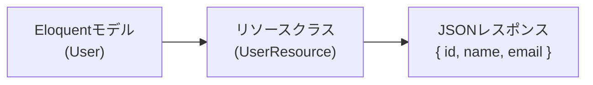
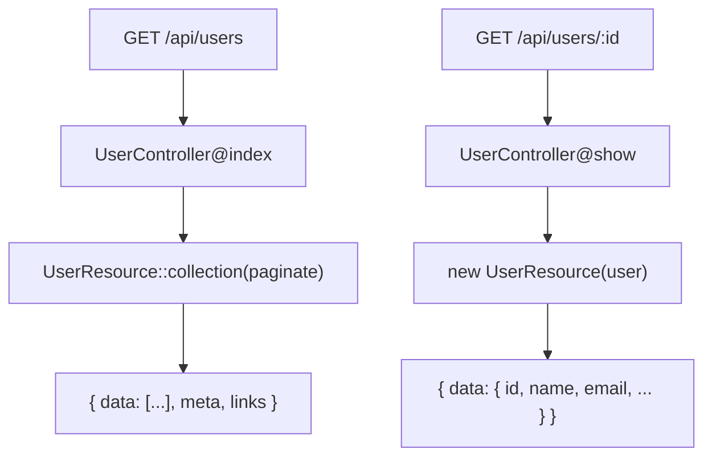

## APIリソースとは

APIを構築するとき、EloquentモデルをそのままJSONとして返すと、隠したいカラムが漏れたり、クライアントが必要としていない大量のデータを送り付けてしまうことがあります。

**Eloquent APIリソース**は、モデルとJSONレスポンスの間に変換レイヤーを挟む仕組みです。`toArray()` メソッドで「何をどの形式でレスポンスに含めるか」を明示的に定義できます。



主なメリットは次のとおりです。

- レスポンスに含めるフィールドを完全にコントロールできる
- フィールド名の変換や値の加工をひとつの場所にまとめられる
- 条件によってフィールドを出し分けられる
- リレーションをネストして一貫した構造を保てる

## リソースの作成

`make:resource` Artisanコマンドでリソースクラスを生成します。

```shell
php artisan make:resource UserResource
```

生成されたクラスは `app/Http/Resources` ディレクトリに置かれます。

```php
<?php

namespace App\Http\Resources;

use Illuminate\Http\Request;
use Illuminate\Http\Resources\Json\JsonResource;

class UserResource extends JsonResource
{
    public function toArray(Request $request): array
    {
        return [
            'id' => $this->id,
            'name' => $this->name,
            'email' => $this->email,
            'created_at' => $this->created_at,
            'updated_at' => $this->updated_at,
        ];
    }
}
```

`$this` でモデルのプロパティに直接アクセスできます。これはリソースクラスが内部でモデルへのアクセスをプロキシしているためです。

## コントローラーでの使用

定義したリソースはコントローラーやルートから返せます。

```php
use App\Http\Resources\UserResource;
use App\Models\User;

Route::get('/users/{user}', function (User $user) {
    return new UserResource($user);
});
```

または、モデルの `toResource()` メソッドを使う方法もあります。

```php
Route::get('/users/{user}', function (User $user) {
    return $user->toResource();
});
```

`toResource()` はモデル名に基づいて対応するリソースクラス（`UserResource`）を自動的に探します。

デフォルトでは、レスポンスは `data` キーでラップされます。

```json
{
  "data": {
    "id": 1,
    "name": "山田 太郎",
    "email": "yamada@example.com",
    "created_at": "2024-01-15T10:00:00.000000Z",
    "updated_at": "2024-01-15T10:00:00.000000Z"
  }
}
```

## リソースコレクション

複数のモデルを返す場合は `collection()` メソッドを使います。

```php
use App\Http\Resources\UserResource;
use App\Models\User;

Route::get('/users', function () {
    return UserResource::collection(User::all());
});
```

または、Eloquentコレクションの `toResourceCollection()` を使います。

```php
return User::all()->toResourceCollection();
```

### カスタムコレクションリソース

コレクション全体にメタデータを付加したい場合は、専用のコレクションリソースを作成します。

```shell
php artisan make:resource UserCollection
```

```php
<?php

namespace App\Http\Resources;

use Illuminate\Http\Request;
use Illuminate\Http\Resources\Json\ResourceCollection;

class UserCollection extends ResourceCollection
{
    public function toArray(Request $request): array
    {
        return [
            'data' => $this->collection,
            'links' => [
                'self' => route('users.index'),
            ],
        ];
    }
}
```

```php
Route::get('/users', function () {
    return new UserCollection(User::all());
});
```

## フィールドの加工と変換

`toArray()` 内でフィールド名の変更や値の加工ができます。

```php
public function toArray(Request $request): array
{
    return [
        'id' => $this->id,
        'full_name' => $this->name,                         // フィールド名を変換
        'email_address' => $this->email,                    // フィールド名を変換
        'role' => strtoupper($this->role),                  // 値を加工
        'registered_at' => $this->created_at->toDateString(), // 日付をフォーマット
    ];
}
```

## 条件付きフィールド

### when() — 条件に応じてフィールドを追加

特定の条件を満たすときだけフィールドを含めたい場合は `when()` を使います。

```php
public function toArray(Request $request): array
{
    return [
        'id' => $this->id,
        'name' => $this->name,
        'email' => $this->email,
        // 認証ユーザーが管理者のときだけ含める
        'secret_token' => $this->when(
            $request->user()?->isAdmin(),
            $this->secret_token
        ),
    ];
}
```

`when()` の条件が `false` のとき、そのキー自体がレスポンスから取り除かれます。

### mergeWhen() — 複数フィールドをまとめて条件付き追加

同じ条件で複数のフィールドをまとめて出し分けるには `mergeWhen()` を使います。

```php
public function toArray(Request $request): array
{
    return [
        'id' => $this->id,
        'name' => $this->name,
        $this->mergeWhen($request->user()?->isAdmin(), [
            'admin_note' => $this->admin_note,
            'internal_id' => $this->internal_id,
        ]),
    ];
}
```

### whenLoaded() — ロード済みリレーションのみ含める

リレーションがEagerロードされているときだけ含めることで、N+1問題を防ぎながら柔軟なレスポンスを作れます。

```php
use App\Http\Resources\PostResource;

public function toArray(Request $request): array
{
    return [
        'id' => $this->id,
        'name' => $this->name,
        'email' => $this->email,
        // postsがwith()でロードされているときだけ含める
        'posts' => PostResource::collection($this->whenLoaded('posts')),
    ];
}
```

コントローラー側でリレーションをロードするかどうかを制御できます。

```php
// postsを含めて返す
return new UserResource($user->load('posts'));

// postsなしで返す
return new UserResource($user);
```

### whenCounted() — カウントを条件付きで含める

`loadCount()` で取得したリレーションのカウントを条件付きで含めます。

```php
public function toArray(Request $request): array
{
    return [
        'id' => $this->id,
        'name' => $this->name,
        'posts_count' => $this->whenCounted('posts'),
    ];
}
```

```php
return new UserResource($user->loadCount('posts'));
```

## ネストしたリソース

リレーションを別のリソースクラスでネストすることで、一貫した構造を保てます。

```php
// app/Http/Resources/PostResource.php
class PostResource extends JsonResource
{
    public function toArray(Request $request): array
    {
        return [
            'id' => $this->id,
            'title' => $this->title,
            'body' => $this->body,
            'author' => new UserResource($this->whenLoaded('user')),
            'comments' => CommentResource::collection($this->whenLoaded('comments')),
            'published_at' => $this->published_at?->toDateString(),
        ];
    }
}
```

```php
// コントローラー
$post = Post::with(['user', 'comments'])->findOrFail($id);

return new PostResource($post);
```

```json
{
  "data": {
    "id": 1,
    "title": "Laravelで学ぶAPIリソース",
    "author": {
      "id": 5,
      "name": "山田 太郎",
      "email": "yamada@example.com"
    },
    "comments": [
      { "id": 10, "body": "参考になりました！" }
    ]
  }
}
```

## メタデータの追加

### with() — トップレベルのメタデータ

コレクション全体にメタデータを付加するには `with()` メソッドをオーバーライドします。

```php
class UserCollection extends ResourceCollection
{
    public function toArray(Request $request): array
    {
        return parent::toArray($request);
    }

    public function with(Request $request): array
    {
        return [
            'meta' => [
                'version' => '1.0',
                'generated_at' => now()->toIso8601String(),
            ],
        ];
    }
}
```

レスポンス例:

```json
{
  "data": [...],
  "meta": {
    "version": "1.0",
    "generated_at": "2024-01-15T10:00:00+00:00"
  }
}
```

### additional() — 動的にメタデータを追加

コントローラー側で動的にメタデータを追加したい場合は `additional()` を使います。

```php
return User::all()
    ->load('roles')
    ->toResourceCollection()
    ->additional(['meta' => [
        'total_admins' => User::where('role', 'admin')->count(),
    ]]);
```

## ページネーションとの組み合わせ

ページネーション結果をリソースに渡すだけで、`meta` と `links` が自動的に付加されます。

```php
Route::get('/users', function () {
    return UserResource::collection(User::paginate(15));
});
```

または:

```php
return User::paginate(15)->toResourceCollection();
```

レスポンス例:

```json
{
  "data": [
    { "id": 1, "name": "山田 太郎" },
    { "id": 2, "name": "鈴木 花子" }
  ],
  "links": {
    "first": "https://example.com/users?page=1",
    "last": "https://example.com/users?page=5",
    "prev": null,
    "next": "https://example.com/users?page=2"
  },
  "meta": {
    "current_page": 1,
    "from": 1,
    "last_page": 5,
    "per_page": 15,
    "to": 15,
    "total": 72
  }
}
```

<Info>
  ページネーションレスポンスでは、`withoutWrapping()` を呼んでいても `data` キーは必ず付きます。ページネーションの `meta` や `links` キーと共存させるためです。
</Info>

## データラッピングの無効化

デフォルトでは最外層のリソースが `data` キーにラップされます。これを無効にするには `AppServiceProvider` の `boot()` 内で `withoutWrapping()` を呼びます。

```php
use Illuminate\Http\Resources\Json\JsonResource;

public function boot(): void
{
    JsonResource::withoutWrapping();
}
```

<Warning>
  `withoutWrapping()` は最外層のラッピングのみに影響します。自分で定義した `data` キーは削除されません。
</Warning>

## 実践例：ユーザーAPIの実装

ユーザー管理APIを例に、リソースを使った一貫したレスポンス設計を示します。



### UserResource

```php
<?php

namespace App\Http\Resources;

use Illuminate\Http\Request;
use Illuminate\Http\Resources\Json\JsonResource;

class UserResource extends JsonResource
{
    public function toArray(Request $request): array
    {
        return [
            'id' => $this->id,
            'name' => $this->name,
            'email' => $this->email,
            'avatar_url' => $this->avatar_url,
            'role' => $this->role,
            // 管理者にのみ表示
            'created_at' => $this->when(
                $request->user()?->isAdmin(),
                $this->created_at->toDateString()
            ),
            // ロードされているときだけ含める
            'posts' => PostResource::collection($this->whenLoaded('posts')),
            'posts_count' => $this->whenCounted('posts'),
        ];
    }
}
```

### UserController

```php
<?php

namespace App\Http\Controllers\Api;

use App\Http\Resources\UserResource;
use App\Models\User;
use Illuminate\Http\Request;
use Illuminate\Http\Resources\Json\AnonymousResourceCollection;

class UserController extends Controller
{
    public function index(): AnonymousResourceCollection
    {
        $users = User::withCount('posts')->paginate(20);

        return UserResource::collection($users);
    }

    public function show(User $user): UserResource
    {
        $user->loadCount('posts')->load('posts');

        return new UserResource($user);
    }
}
```

## 関連ページ

<Card title="Eloquentリレーション入門" icon="link" href="/jp/eloquent-relationships">
  リレーションの定義方法とEagerローディングを確認します。
</Card>

<Card title="ページネーション" icon="list" href="/jp/pagination">
  ページネーション結果をAPIリソースと組み合わせる方法を確認します。
</Card>
