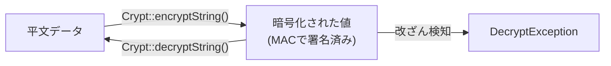

## Cryptファサードとは

Laravelの暗号化サービスは、**OpenSSL** の AES-256-CBC 暗号化（または AES-128-CBC）を使って、値の暗号化・復号をシンプルなインターフェースで提供します。

Laravelで暗号化されたすべての値は、**メッセージ認証コード(MAC)** で署名されています。
これにより、暗号化後の値が改ざんされた場合は復号できなくなります。



---

## 設定

### APP_KEYの生成

暗号化を使う前に、`config/app.php` の `key` 設定が必要です。
この値は `APP_KEY` 環境変数から読み込まれます。

`php artisan key:generate` コマンドを使って安全なキーを生成してください。
PHPのセキュアな乱数生成器を使って暗号学的に安全なキーが生成されます。

```shell
php artisan key:generate
```

Laravelのインストール時に通常は自動生成されます。生成されたキーは `.env` ファイルに保存されます。

```ini
APP_KEY=base64:J63qRTDLub5NuZvP+kb8YIorGS6qFYHKVo6u7179stY=
```

<Warning>
  `APP_KEY` は絶対に公開しないでください。このキーが漏洩すると、暗号化されたデータがすべて復号されてしまいます。
</Warning>

### 暗号化キーのローテーション

暗号化キーを変更すると、すべての認証済みユーザーセッションがログアウトされます。
Laravelはセッションクッキーを含むすべてのクッキーを暗号化しているためです。

また、以前のキーで暗号化されたデータは復号できなくなります。

この問題を軽減するため、`APP_PREVIOUS_KEYS` に古いキーをコンマ区切りで列挙できます。

```ini
APP_KEY="base64:J63qRTDLub5NuZvP+kb8YIorGS6qFYHKVo6u7179stY="
APP_PREVIOUS_KEYS="base64:2nLsGFGzyoae2ax3EF2Lyq/hH6QghBGLIq5uL+Gp8/w="
```

Laravelは暗号化には常に現在のキーを使用しますが、復号時は現在のキーで失敗した場合に古いキーを順番に試します。
これにより、キーのローテーション中もユーザーはアプリケーションを継続して使用できます。

---

## 暗号化

`Crypt` ファサードの `encryptString` メソッドを使って値を暗号化します。
暗号化された値はOpenSSLとAES-256-CBC暗号を使用し、MACで署名されます。

```php
<?php

namespace App\Http\Controllers;

use Illuminate\Http\RedirectResponse;
use Illuminate\Http\Request;
use Illuminate\Support\Facades\Crypt;

class DigitalOceanTokenController extends Controller
{
    /**
     * ユーザーのAPIトークンを保存する
     */
    public function store(Request $request): RedirectResponse
    {
        $request->user()->fill([
            'token' => Crypt::encryptString($request->token),
        ])->save();

        return redirect('/secrets');
    }
}
```

<Tip>
  `encryptString` はシリアライズ**なし**で文字列を暗号化します。オブジェクトや配列を暗号化する場合は `encrypt` を使用してください。
</Tip>

| メソッド | 用途 |
| --- | --- |
| `Crypt::encryptString($value)` | 文字列をそのまま暗号化 |
| `Crypt::encrypt($value)` | 値をシリアライズしてから暗号化（配列・オブジェクト対応） |

---

## 復号

`Crypt` ファサードの `decryptString` メソッドで暗号化された値を復号します。
MACが無効な場合など、正常に復号できないときは `DecryptException` がスローされます。

```php
use Illuminate\Contracts\Encryption\DecryptException;
use Illuminate\Support\Facades\Crypt;

try {
    $decrypted = Crypt::decryptString($encryptedValue);
} catch (DecryptException $e) {
    // 復号に失敗した場合の処理
    abort(400, '無効なデータです。');
}
```

| メソッド | 用途 |
| --- | --- |
| `Crypt::decryptString($value)` | 文字列として復号 |
| `Crypt::decrypt($value)` | 復号してアンシリアライズ（配列・オブジェクト対応） |

---

## モデルのキャスト

Eloquentモデルで `encrypted` キャストを使うと、属性の暗号化・復号を自動で行えます。

```php
<?php

namespace App\Models;

use Illuminate\Database\Eloquent\Model;

class User extends Model
{
    protected function casts(): array
    {
        return [
            'secret_note'    => 'encrypted',           // 文字列の暗号化
            'profile_data'   => 'encrypted:array',     // 配列を暗号化して保存
            'preferences'    => 'encrypted:collection',// コレクションを暗号化して保存
            'metadata'       => 'encrypted:object',    // オブジェクトを暗号化して保存
            'settings'       => 'encrypted:json',      // JSONとして暗号化して保存
        ];
    }
}
```

キャストを設定すると、モデルへの値の代入・取得時に自動で暗号化・復号されます。

```php
// 自動的に暗号化されてDBに保存される
$user->secret_note = '秘密のメモ';
$user->save();

// 自動的に復号されて取得される
echo $user->secret_note; // '秘密のメモ'
```

<Info>
  `encrypted:*` キャストは内部で `Crypt::encrypt` と `Crypt::decrypt` を使用します。
  データベースのカラム型は `text` または `longText` を推奨します。
</Info>

---

## 実用例：個人情報の暗号化保存

個人情報（マイナンバー、クレジットカード番号など）をデータベースに安全に保存する典型的なパターンです。

### マイグレーション

```php
Schema::create('profiles', function (Blueprint $table) {
    $table->id();
    $table->foreignId('user_id')->constrained();
    $table->text('my_number')->nullable();     // 暗号化された値はtextで保存
    $table->text('bank_account')->nullable();
    $table->timestamps();
});
```

### モデル

```php
<?php

namespace App\Models;

use Illuminate\Database\Eloquent\Model;

class Profile extends Model
{
    protected $fillable = ['user_id', 'my_number', 'bank_account'];

    protected function casts(): array
    {
        return [
            'my_number'    => 'encrypted',
            'bank_account' => 'encrypted',
        ];
    }
}
```

### コントローラー

```php
use App\Models\Profile;
use Illuminate\Http\Request;

class ProfileController extends Controller
{
    public function store(Request $request)
    {
        $request->validate([
            'my_number'    => ['required', 'string'],
            'bank_account' => ['required', 'string'],
        ]);

        // モデルが自動的に暗号化して保存する
        Profile::create([
            'user_id'      => $request->user()->id,
            'my_number'    => $request->my_number,
            'bank_account' => $request->bank_account,
        ]);

        return redirect('/profile');
    }

    public function show(Request $request)
    {
        $profile = $request->user()->profile;

        // モデルが自動的に復号して返す
        return view('profile.show', ['profile' => $profile]);
    }
}
```

---

## まとめ

| やりたいこと | 方法 |
| --- | --- |
| APP_KEYを生成 | `php artisan key:generate` |
| 文字列を暗号化 | `Crypt::encryptString($value)` |
| 文字列を復号 | `Crypt::decryptString($value)` |
| 配列・オブジェクトを暗号化 | `Crypt::encrypt($value)` |
| モデル属性を自動暗号化 | `'column' => 'encrypted'` キャスト |
| キーローテーション | `APP_PREVIOUS_KEYS` に旧キーを列挙 |

## 次のステップ

<Columns cols={2}>
  <Card title="ハッシュ" icon="lock" href="/jp/hashing">
    パスワードの安全なハッシュ化と検証方法を学びます。
  </Card>
  <Card title="認可" icon="shield" href="/jp/authorization">
    ポリシーとゲートを使ったアクセス制御を解説します。
  </Card>
</Columns>
