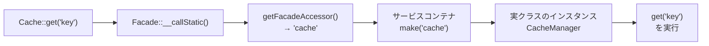

## ファサードとは

ファサードは、アプリケーションの[サービスコンテナ](/jp/service-container)で利用可能なクラスへの「静的」なインターフェースを提供します。Laravelにはほぼすべての機能にアクセスできる多くのファサードが同梱されています。

Laravelのファサードはサービスコンテナ内の実体クラスへの「静的プロキシ」として機能し、従来の静的メソッドよりもテストしやすく柔軟性を保ちながら、簡潔で表現力豊かな構文を提供します。

すべてのLaravelファサードは `Illuminate\Support\Facades` 名前空間に定義されています。

```php
use Illuminate\Support\Facades\Cache;
use Illuminate\Support\Facades\Route;

Route::get('/cache', function () {
    return Cache::get('key');
});
```

<Info>
  ファサードの仕組みを完全に理解していなくても問題ありません。まずは使い方を覚えて、Laravelを学び続けましょう。
</Info>

## ファサードの仕組み

Laravelアプリケーションでは、ファサードはコンテナからオブジェクトへのアクセスを提供するクラスです。この仕組みは `Facade` クラスによって実現されています。Laravelのすべてのファサード、およびカスタムファサードは、基底クラス `Illuminate\Support\Facades\Facade` を継承します。

`Facade` 基底クラスは `__callStatic()` マジックメソッドを使って、ファサードへの呼び出しをコンテナから解決されたオブジェクトへ委譲します。



```php
<?php

namespace App\Http\Controllers;

use Illuminate\Support\Facades\Cache;
use Illuminate\View\View;

class UserController extends Controller
{
    /**
     * 指定されたユーザーのプロフィールを表示する
     */
    public function showProfile(string $id): View
    {
        $user = Cache::get('user:'.$id);

        return view('profile', ['user' => $user]);
    }
}
```

ファイルの先頭で `Cache` ファサードをインポートしています。このファサードは `Illuminate\Contracts\Cache\Factory` インターフェースの実装へのアクセスをプロキシします。ファサードを使った呼び出しはすべて、Laravelのキャッシュサービスの内部インスタンスに渡されます。

`Illuminate\Support\Facades\Cache` クラスを見ると、静的メソッド `get` は存在しません。

```php
class Cache extends Facade
{
    /**
     * コンポーネントの登録名を取得する
     */
    protected static function getFacadeAccessor(): string
    {
        return 'cache';
    }
}
```

`Cache` ファサードは基底 `Facade` クラスを継承し、`getFacadeAccessor()` メソッドを定義しています。このメソッドはサービスコンテナのバインディング名を返します。ユーザーが `Cache` ファサードの静的メソッドを呼び出すと、Laravelはサービスコンテナから `cache` バインディングを解決し、そのオブジェクトに対してリクエストされたメソッド（この場合 `get`）を実行します。

## ファサードを使う場面・使わない場面

### ファサードのメリット

ファサードには多くのメリットがあります。手動で注入・設定しなければならない長いクラス名を覚えることなく、Laravelの機能を使える簡潔で覚えやすい構文を提供します。また、PHPのダイナミックメソッドの独自の使い方により、テストが容易です。

### スコープクリープに注意する

ファサードを使う際の主な危険性はクラスの「スコープクリープ」です。ファサードは使いやすく注入を必要としないため、クラスが肥大化して多くのファサードを使い続けてしまいがちです。依存注入を使えば、大きなコンストラクターが視覚的なフィードバックを与えてくれます。ファサードを使う場合は、クラスのサイズに注意して責務の範囲を狭く保ちましょう。

<Warning>
  クラスが大きくなりすぎたと感じたら、複数の小さなクラスに分割することを検討してください。
</Warning>

### ファサード vs. 依存注入

依存注入の主なメリットの一つは、注入されたクラスの実装を差し替えられることです。これはテスト時に役立ちます。モックやスタブを注入して、スタブに対してさまざまなメソッドが呼ばれたことをアサートできます。

真に静的なクラスメソッドはモックやスタブにできないのが通常ですが、ファサードはダイナミックメソッドを使ってサービスコンテナから解決されたオブジェクトへのメソッド呼び出しをプロキシするため、注入されたクラスインスタンスをテストするのと同じようにファサードをテストできます。

```php
use Illuminate\Support\Facades\Cache;

Route::get('/cache', function () {
    return Cache::get('key');
});
```

このルートに対して、次のテストを書いて `Cache::get` が期待する引数で呼び出されたことを検証できます。

```php
use Illuminate\Support\Facades\Cache;

test('basic example', function () {
    Cache::shouldReceive('get')
        ->with('key')
        ->andReturn('value');

    $response = $this->get('/cache');

    $response->assertSee('value');
});
```

### ファサード vs. ヘルパー関数

ファサードに加えて、Laravelはビューの生成、イベントの発火、ジョブのディスパッチ、HTTPレスポンスの送信など、一般的なタスクを実行できる「ヘルパー」関数を提供しています。多くのヘルパー関数は対応するファサードと同じ機能を実行します。

```php
// ファサードを使った呼び出し
return Illuminate\Support\Facades\View::make('profile');

// ヘルパー関数を使った同等の呼び出し
return view('profile');
```

ファサードとヘルパー関数の間には実質的な違いはありません。ヘルパー関数を使っている場合でも、対応するファサードと同じようにテストできます。

```php
use Illuminate\Support\Facades\Cache;

test('cache helper test', function () {
    Cache::shouldReceive('get')
        ->with('key')
        ->andReturn('value');

    $response = $this->get('/cache');

    $response->assertSee('value');
});
```

## リアルタイムファサード

リアルタイムファサードを使うと、アプリケーション内の任意のクラスをファサードとして扱えます。使い方を説明するために、まずリアルタイムファサードを使わないコードを見てみましょう。

例えば、`Podcast` モデルに `publish` メソッドがあるとします。ただし、ポッドキャストを公開するには `Publisher` インスタンスを注入する必要があります。

```php
<?php

namespace App\Models;

use App\Contracts\Publisher;
use Illuminate\Database\Eloquent\Model;

class Podcast extends Model
{
    /**
     * ポッドキャストを公開する
     */
    public function publish(Publisher $publisher): void
    {
        $this->update(['publishing' => now()]);

        $publisher->publish($this);
    }
}
```

リアルタイムファサードを使うと、同じテスト容易性を維持しながら `Publisher` インスタンスを明示的に渡す必要がなくなります。リアルタイムファサードを生成するには、インポートするクラスの名前空間に `Facades` というプレフィックスを付けます。

```php
<?php

namespace App\Models;

use Facades\App\Contracts\Publisher;
use Illuminate\Database\Eloquent\Model;

class Podcast extends Model
{
    /**
     * ポッドキャストを公開する
     */
    public function publish(): void
    {
        $this->update(['publishing' => now()]);

        Publisher::publish($this);
    }
}
```

リアルタイムファサードが使われると、`Facades` プレフィックスの後に現れるインターフェースまたはクラス名の部分を使ってサービスコンテナからパブリッシャーの実装が解決されます。

```php
<?php

use App\Models\Podcast;
use Facades\App\Contracts\Publisher;
use Illuminate\Foundation\Testing\RefreshDatabase;

pest()->use(RefreshDatabase::class);

test('podcast can be published', function () {
    $podcast = Podcast::factory()->create();

    Publisher::shouldReceive('publish')->once()->with($podcast);

    $podcast->publish();
});
```

<Tip>
  リアルタイムファサードは、テスト時のモックを簡単にしながら、引数として渡す必要をなくしたい場合に便利です。
</Tip>

## ファサードのテスト

ファサードをテストするには `shouldReceive` メソッドを使います。これにより、Mockeryのモックインスタンスが返されます。ファサードは実際にサービスコンテナによって解決・管理されるため、通常の静的クラスよりもはるかにテストしやすいです。

```php
use Illuminate\Support\Facades\Cache;

test('ユーザープロフィールを表示する', function () {
    Cache::shouldReceive('get')
        ->once()
        ->with('user:1')
        ->andReturn(['name' => 'Taylor']);

    $response = $this->get('/users/1');

    $response->assertSee('Taylor');
});
```

よく使うモックメソッドは次のとおりです。

| メソッド | 説明 |
|---|---|
| `shouldReceive('method')` | メソッドが呼ばれることを期待する |
| `once()` | 1回だけ呼ばれることを期待する |
| `times(n)` | n回呼ばれることを期待する |
| `with(args)` | 特定の引数で呼ばれることを期待する |
| `andReturn(value)` | 指定した値を返す |
| `andReturnNull()` | nullを返す |

## 主要なファサード一覧

よく使うファサードとその実体クラス、サービスコンテナのバインディング名の対応表です。

| ファサード | クラス | バインディング |
|---|---|---|
| `App` | `Illuminate\Foundation\Application` | `app` |
| `Auth` | `Illuminate\Auth\AuthManager` | `auth` |
| `Cache` | `Illuminate\Cache\CacheManager` | `cache` |
| `Config` | `Illuminate\Config\Repository` | `config` |
| `Cookie` | `Illuminate\Cookie\CookieJar` | `cookie` |
| `Crypt` | `Illuminate\Encryption\Encrypter` | `encrypter` |
| `DB` | `Illuminate\Database\DatabaseManager` | `db` |
| `Event` | `Illuminate\Events\Dispatcher` | `events` |
| `File` | `Illuminate\Filesystem\Filesystem` | `files` |
| `Gate` | `Illuminate\Contracts\Auth\Access\Gate` | — |
| `Hash` | `Illuminate\Contracts\Hashing\Hasher` | `hash` |
| `Http` | `Illuminate\Http\Client\Factory` | — |
| `Log` | `Illuminate\Log\LogManager` | `log` |
| `Mail` | `Illuminate\Mail\Mailer` | `mailer` |
| `Notification` | `Illuminate\Notifications\ChannelManager` | — |
| `Queue` | `Illuminate\Queue\QueueManager` | `queue` |
| `RateLimiter` | `Illuminate\Cache\RateLimiter` | — |
| `Redirect` | `Illuminate\Routing\Redirector` | `redirect` |
| `Request` | `Illuminate\Http\Request` | `request` |
| `Route` | `Illuminate\Routing\Router` | `router` |
| `Schema` | `Illuminate\Database\Schema\Builder` | — |
| `Session` | `Illuminate\Session\SessionManager` | `session` |
| `Storage` | `Illuminate\Filesystem\FilesystemManager` | `filesystem` |
| `URL` | `Illuminate\Routing\UrlGenerator` | `url` |
| `Validator` | `Illuminate\Validation\Factory` | `validator` |
| `View` | `Illuminate\View\Factory` | `view` |

## 次のステップ

<Card title="Contracts（契約）" icon="file-contract" href="/jp/contracts">
  ファサードと対をなすContractsの概念と使い分けを学びます。
</Card>
