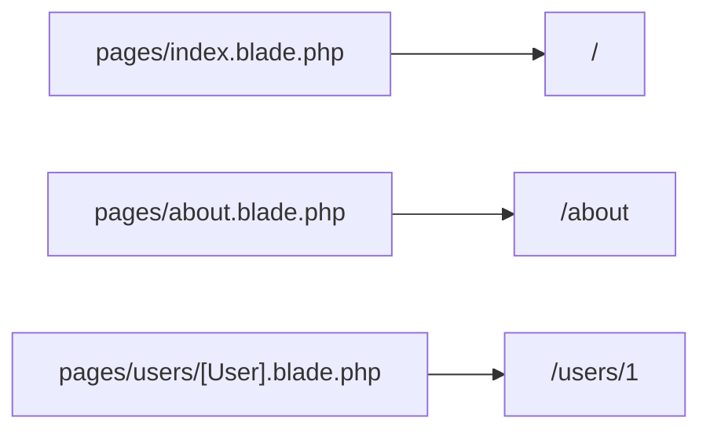

## はじめに

Laravel Folioは、Bladeファイルを配置するだけでルートを定義できるページベースのルーターです。
従来の `routes/web.php` 中心の定義と違い、ファイルシステムの構造をそのままURLに反映できます。

コンテンツ中心のサイトや、画面ごとに素早くページを追加したい管理画面で特に有効です。
APIのように細かいHTTP制御が必要な領域は、通常のルーティングと併用するのが実践的です。

## インストール

まずはComposerでFolioを追加します。

```bash
composer require laravel/folio
php artisan folio:install
```

`folio:install` はFolioのサービスプロバイダーを登録します。
デフォルトでは `resources/views/pages/` がページディレクトリになります。

```php
use Laravel\Folio\Folio;

Folio::path(resource_path('views/pages/guest'))->uri('/');

Folio::path(resource_path('views/pages/admin'))
    ->uri('/admin');
```

## ルートの作成

Folioは、マウントされたディレクトリ配下のBladeファイル名からURLを自動生成します。

```text
resources/views/pages/schedule.blade.php -> /schedule
```

```bash
php artisan folio:list
```

### ネストされたルート

ディレクトリをネストすると、URLも同じ構造でネストされます。

```bash
php artisan folio:page user/profile
# pages/user/profile.blade.php -> /user/profile
```

### インデックスルート

`index.blade.php` は、そのディレクトリのルートにマッピングされます。

```bash
php artisan folio:page index
# pages/index.blade.php -> /

php artisan folio:page users/index
# pages/users/index.blade.php -> /users
```

## ルートパラメーター

ファイル名の `[]` でURLセグメントを受け取れます。

```bash
php artisan folio:page "users/[id]"
# pages/users/[id].blade.php -> /users/1
```

```blade
<div>User {{ $id }}</div>
```

複数セグメントを受け取る場合は `...` を使います。

```bash
php artisan folio:page "users/[...ids]"
# pages/users/[...ids].blade.php -> /users/1/2/3
```

```blade
@foreach ($ids as $id)
    <li>User {{ $id }}</li>
@endforeach
```

## ルートモデルバインディング

`[User].blade.php` のようにモデル名を使うと、自動でモデル解決されます。

```bash
php artisan folio:page "users/[User]"
# pages/users/[User].blade.php -> /users/1
```

```blade
<div>User {{ $user->id }}</div>
```

ソフトデリート済みモデルも扱う場合は、ページ内で `withTrashed()` を呼び出します。

```php
<?php

use function Laravel\Folio\withTrashed;

withTrashed();
```

<Info>
  `[Post:slug].blade.php` のように書くと、`id` 以外のキー（例: `slug`）でもモデル解決できます。
</Info>

## ミドルウェア

特定ページにだけ適用する場合は、ページテンプレート内で `middleware()` を使います。

```php
<?php

use function Laravel\Folio\middleware;

middleware(['auth', 'verified']);
```

複数ページへ一括適用する場合は、`Folio::path(...)->middleware()` を使います。

```php
use Laravel\Folio\Folio;

Folio::path(resource_path('views/pages'))->middleware([
    'admin/*' => ['auth', 'verified'],
]);
```

## 名前付きルート

Folioページにも `name()` でルート名を付けられます。

```php
<?php

use function Laravel\Folio\name;

name('users.index');
```

付与したルート名は `route()` ヘルパーでURL生成できます。

```php
route('users.index');
route('users.show', ['user' => $user]);
```

## ファイルとURLの対応



## 従来のルーティングとの比較

| 特徴 | 通常ルーティング | Folio |
| --- | --- | --- |
| ルート定義 | `routes/web.php` | ファイル名で自動 |
| コントローラー | 必要（またはクロージャ） | 不要（Bladeに直接） |
| 向いているケース | APIやSPA、複雑なHTTP制御 | コンテンツサイト、管理画面 |

<Tip>
  Folioを使う場合でも、`php artisan route:cache` でルートキャッシュを有効にすると本番性能を最適化できます。
</Tip>
