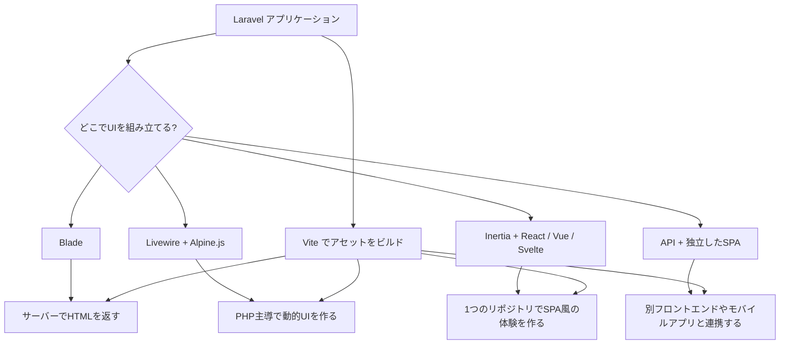

## 概要

Laravelはバックエンドフレームワークですが、フロントエンドまで含めた開発体験も重視しています。  
Laravel 13 では、PHP中心で進める方法と、React・Vue・Svelte などのJavaScriptフレームワークを活用する方法の両方が用意されています。

どのアプローチを選ぶかは、次の3点で考えると整理しやすくなります。

- UIを主に **PHP** で書きたいか
- UIを主に **JavaScript / TypeScript** で書きたいか
- 1つのリポジトリで完結させたいか、APIとSPAを分離したいか

## PHPで進める

### Blade

[Blade](/jp/blade) は、Laravel標準のテンプレートエンジンです。コントローラーやルートからビューを返し、サーバーで生成したHTMLをブラウザへ返します。

**長所**

- Laravelのルーティング、バリデーション、認証と自然に統合できる
- PHPだけで完結しやすく、学習コストが低い
- SEOや初期表示を重視するページと相性がよい

**短所**

- ページ遷移やフォーム送信のたびに全面再描画になりやすい
- 複雑なインタラクションはJavaScriptの補助が必要になる

Bladeは、管理画面、社内ツール、コンテンツ中心の画面、フォーム主体のアプリケーションに向いています。

### Livewire

[Laravel Livewire](https://livewire.laravel.com) は、Bladeをベースにしながら、より動的なUIをPHP中心で実装できるアプローチです。モーダル、検索、インライン編集のような操作を、ReactやVueに近い体験で構築できます。

**長所**

- PHPとBladeの延長で動的UIを作れる
- Laravelの状態管理やバリデーションと結び付きやすい
- 必要な箇所だけJavaScriptを足したい場合は Alpine.js と組み合わせやすい

**短所**

- 複雑なクライアントサイド状態管理はJavaScriptフレームワークほど得意ではない
- フロントエンドの責務が大きい大規模SPAには不向きなことがある

<Tip>
  Livewireを詳しく知りたい場合は [Livewire入門](/jp/blog/livewire-introduction) を参照してください。
</Tip>

### PHPファーストのスターターキット

Laravel 13 の [スターターキット](/jp/starter-kits) には、PHP中心で始めたいチーム向けに **Livewire** ベースの選択肢があります。認証・レイアウト・Vite設定までまとめて用意されるため、最短で開発を始められます。

## JavaScriptフレームワークを使う

### Inertia + React / Vue / Svelte

[Inertia](https://inertiajs.com) は、Laravelのルート・コントローラー・認証を活かしたまま、React・Vue・Svelte でページコンポーネントを構築するための橋渡しです。APIサーバーとSPAを完全分離せず、1つのLaravelアプリケーション内でモダンなUIを作れます。

**長所**

- React / Vue / Svelte のコンポーネントモデルを利用できる
- ルーティングや認証はLaravel側に寄せられる
- バックエンドとフロントエンドを1つのリポジトリで管理しやすい

**短所**

- Bladeだけの構成より学習対象が増える
- Node.jsツールチェーンやTypeScriptの知識が必要になりやすい

Laravel 13 の公式スターターキットでは、**React / Vue / Svelte + Inertia** が最初から選べます。

<Tip>
  詳しくは [Inertia入門](/jp/blog/inertia-introduction)、[React入門](/jp/blog/react-introduction)、[Vue入門](/jp/blog/vue-introduction)、[Svelte入門](/jp/blog/svelte-introduction) を参照してください。
</Tip>

### APIと独立したSPAを分ける場合

フロントエンドをLaravelと完全に分離し、別のSPAやモバイルアプリからAPIを利用する構成も選べます。複数クライアントで同じバックエンドを共有したい場合に向いています。

この場合、Laravelは主に次の役割を担います。

- APIルートの提供
- 認証・認可（例: [Sanctum](/jp/sanctum)）
- JSONレスポンス整形（例: [Eloquent API Resources](/jp/eloquent-resources)）

**長所**

- Web、モバイル、デスクトップなど複数クライアントに展開しやすい
- フロントエンドの技術選定をLaravel本体から切り離せる

**短所**

- 認証、データ取得、デプロイを別々に設計する必要がある
- 1つのLaravelアプリだけで完結する構成より複雑になりやすい

### JavaScriptファーストのスターターキット

[スターターキット](/jp/starter-kits) を使うと、Inertia・React / Vue / Svelte・Tailwind CSS・Vite が組み込まれた状態で始められます。認証画面も最初から揃うため、UI開発に集中しやすくなります。

## Viteでアセットをまとめる

どのアプローチを選んでも、Laravel 13 では通常 [Vite](/jp/vite) を使ってCSSやJavaScriptをビルドします。BladeやLivewireでは軽量なスクリプトやスタイルを、Inertiaではアプリケーション全体のフロントエンドコードをViteでまとめます。

Viteを使うメリットは次のとおりです。

- ローカル開発時の高速なHMR
- 本番用アセットのバンドルとバージョニング
- Laravelの `@vite()` ディレクティブとの統合

<Info>
  Laravel 13 のスターターキットでは、Viteベースのフロントエンド構成があらかじめ設定されています。
</Info>

## アプローチ比較

| アプローチ | 向いているケース | 長所 | 短所 |
| --- | --- | --- | --- |
| Blade | コンテンツ中心のページ、フォーム主体の管理画面 | シンプルで学びやすい。Laravel標準機能と自然に統合できる | 高度なUIではページ全体の再描画が増えやすい |
| Livewire | PHP中心で動的UIを作りたい業務アプリ | PHPのまま反応のよいUIを作れる | 複雑なクライアントサイド状態管理はやや苦手 |
| Inertia + React / Vue / Svelte | モダンなUIとLaravelの一体運用を両立したいアプリ | 1つのリポジトリでSPA風の体験を構築できる | JavaScript / TypeScript の習熟が必要 |
| API + 独立SPA | 複数クライアントやモバイル連携が前提のプロダクト | フロントエンドを独立して展開しやすい | 認証・デプロイ・運用が複雑になりやすい |

## 次のステップ

<CardGroup cols={2}>
  <Card title="Bladeテンプレート" icon="file-code-2" href="/jp/blade">
    サーバーサイドレンダリングの基本を確認します。
  </Card>
  <Card title="スターターキット" icon="rocket" href="/jp/starter-kits">
    React、Vue、Svelte、Livewire の初期構成を比較します。
  </Card>
  <Card title="Viteによるアセットバンドル" icon="package" href="/jp/vite">
    開発サーバー、HMR、本番ビルドの流れを学びます。
  </Card>
  <Card title="Inertia入門" icon="panels-top-left" href="/jp/blog/inertia-introduction">
    InertiaでLaravelとJavaScriptフレームワークをつなぐ考え方を確認します。
  </Card>
</CardGroup>
