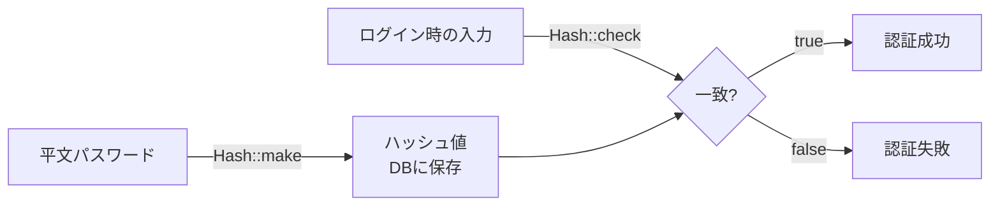
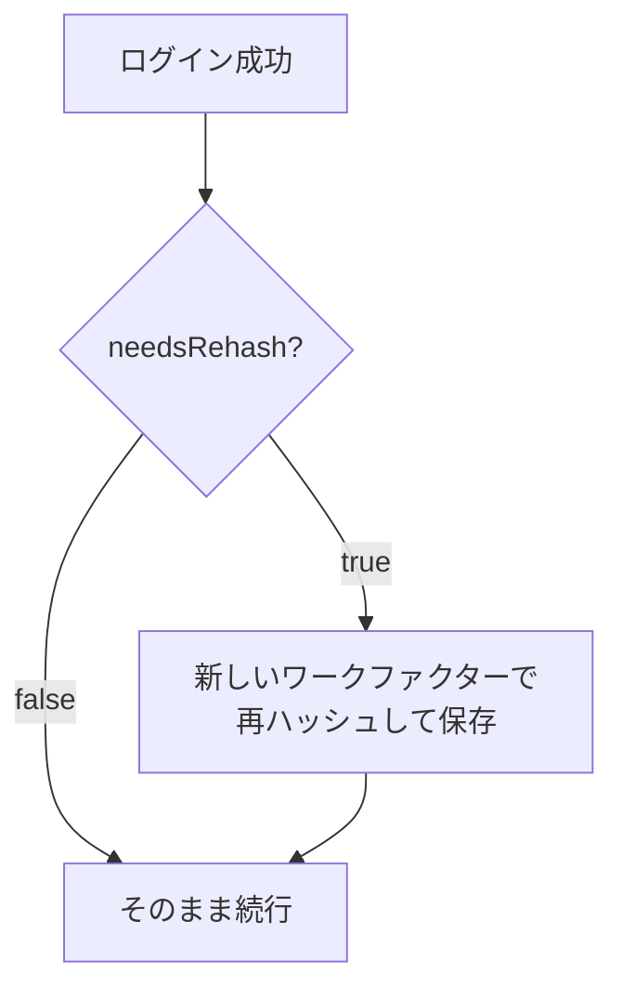

## ハッシュとは

ハッシュ(Hashing)とは、パスワードなどの平文データを一方向の変換で固定長の文字列に変換する処理です。
同じ入力からは常に同じハッシュが生成されますが、ハッシュから元の平文を復元することはできません。

Laravel の `Hash` ファサードは、安全なパスワード保存のために **bcrypt** と **Argon2** のハッシュアルゴリズムをサポートしています。

### アルゴリズムの比較

| アルゴリズム | 特徴 | 推奨用途 |
| --- | --- | --- |
| **bcrypt** | ワークファクター(rounds)で計算コストを調整できる。デフォルト | 一般的な Web アプリケーション |
| **argon2i** | メモリ・時間・スレッド数を調整できる。サイドチャネル攻撃に強い | 高セキュリティが求められる場面 |
| **argon2id** | argon2i と argon2d のハイブリッド。PHC 推奨 | 新規プロジェクトで Argon2 を使う場合 |

<Info>
  bcrypt の「ワークファクター」は、ハッシュ生成にかかる時間を制御します。ハッシュが遅いほどブルートフォース攻撃への耐性が上がります。ハードウェアが高速になるにつれてワークファクターを上げることで、セキュリティを維持できます。
</Info>

### ハッシュ化と検証のフロー



---

## 設定

デフォルトでは Laravel は `bcrypt` ドライバーを使用します。`HASH_DRIVER` 環境変数で変更できます。

```ini
# .env
HASH_DRIVER=bcrypt  # bcrypt / argon / argon2id
```

ハッシュ設定をカスタマイズする場合は、`config:publish` で設定ファイルを公開します。

```shell
php artisan config:publish hashing
```

公開後、`config/hashing.php` でデフォルトのワークファクターなどを変更できます。

---

## 基本的な使い方

### パスワードをハッシュ化する

`Hash::make()` にパスワードの平文を渡すとハッシュ値が返ります。このハッシュ値をデータベースに保存します。

```php
<?php

namespace App\Http\Controllers;

use Illuminate\Http\RedirectResponse;
use Illuminate\Http\Request;
use Illuminate\Support\Facades\Hash;

class PasswordController extends Controller
{
    public function update(Request $request): RedirectResponse
    {
        $request->validate([
            'password' => ['required', 'min:8', 'confirmed'],
        ]);

        $request->user()->fill([
            'password' => Hash::make($request->password),
        ])->save();

        return redirect('/profile');
    }
}
```

<Warning>
  ハッシュ値はデータベースに保存しますが、平文パスワードは絶対に保存しないでください。
</Warning>

### bcrypt のワークファクターを調整する

`rounds` オプションでハッシュ生成の計算コストを調整できます。値が大きいほど安全ですが、処理時間も増えます。
デフォルト値(12)はほとんどのアプリケーションで適切です。

```php
$hashed = Hash::make('plain-text-password', [
    'rounds' => 14,
]);
```

### Argon2 のワークファクターを調整する

Argon2 を使う場合は `memory`・`time`・`threads` オプションで計算コストを調整できます。

```php
$hashed = Hash::make('plain-text-password', [
    'memory'  => 65536, // KiB 単位
    'time'    => 4,
    'threads' => 2,
]);
```

| オプション | 説明 | デフォルト |
| --- | --- | --- |
| `memory` | 使用するメモリ量(KiB) | 65536 |
| `time` | 反復回数 | 4 |
| `threads` | 使用するスレッド数 | 1 |

<Tip>
  Argon2 のオプションの詳細は [PHP 公式ドキュメント](https://secure.php.net/manual/ja/function.password-hash.php) を参照してください。
</Tip>

---

## パスワードの検証

`Hash::check()` を使うと、平文パスワードが保存済みのハッシュと一致するか確認できます。
ログイン処理の中で使用する典型的な例です。

```php
use Illuminate\Support\Facades\Hash;

if (Hash::check($request->password, $user->password)) {
    // パスワードが一致した
} else {
    // パスワードが一致しない
}
```

`Auth::attempt()` を使う場合はこの処理が自動で行われるため、直接呼び出す必要はありません。
`Hash::check()` が役立つのは、現在のパスワードの確認を手動で行うときです。

```php
// パスワード変更フォームで現在のパスワードを確認する例
if (! Hash::check($request->current_password, $request->user()->password)) {
    return back()->withErrors(['current_password' => '現在のパスワードが正しくありません。']);
}
```

---

## 再ハッシュの判定

`Hash::needsRehash()` を使うと、ハッシュ生成時のワークファクターが現在の設定と異なるかどうかを確認できます。
ワークファクターを変更した際に、既存のハッシュを新しい設定で更新するために使います。

```php
use Illuminate\Support\Facades\Hash;

if (Hash::needsRehash($user->password)) {
    $user->update([
        'password' => Hash::make($plainTextPassword),
    ]);
}
```

ログイン成功時に再ハッシュを行う例です。



```php
// ログイン処理の中で再ハッシュを行う
if (Auth::attempt($credentials)) {
    if (Hash::needsRehash(Auth::user()->password)) {
        Auth::user()->update([
            'password' => Hash::make($credentials['password']),
        ]);
    }

    return redirect()->intended('/dashboard');
}
```

<Tip>
  ハードウェアの性能向上に合わせてワークファクターを定期的に見直し、セキュリティを維持しましょう。`needsRehash()` を活用することで、ユーザーのログイン時に自然なタイミングでパスワードを更新できます。
</Tip>

---

## ハッシュアルゴリズム検証

デフォルトでは、`Hash::check()` はハッシュが現在設定されているアルゴリズムで生成されたものかを検証します。
アルゴリズムが異なる場合は `RuntimeException` がスローされます。

これにより、ハッシュアルゴリズムの改ざんによる攻撃を防げます。

アルゴリズムを移行中など、複数のアルゴリズムを同時にサポートする必要がある場合は、`HASH_VERIFY` を `false` に設定してこの検証を無効化できます。

```ini
# .env
HASH_VERIFY=false
```

<Warning>
  `HASH_VERIFY=false` にするとアルゴリズム検証が無効になります。移行期間中のみ使用し、移行完了後は `true`(デフォルト)に戻してください。
</Warning>

---

## まとめ

| やりたいこと | 方法 |
| --- | --- |
| パスワードをハッシュ化する | `Hash::make($password)` |
| ハッシュを検証する | `Hash::check($plain, $hash)` |
| 再ハッシュが必要か確認する | `Hash::needsRehash($hash)` |
| ハッシュドライバーを変更する | `HASH_DRIVER` 環境変数 |
| アルゴリズム検証を無効にする | `HASH_VERIFY=false` |

## 次のステップ

<Card title="認証入門" icon="lock" href="/jp/authentication">
  `Hash::check()` を使ったログイン処理の実装など、認証の全体像を学びます。
</Card>
