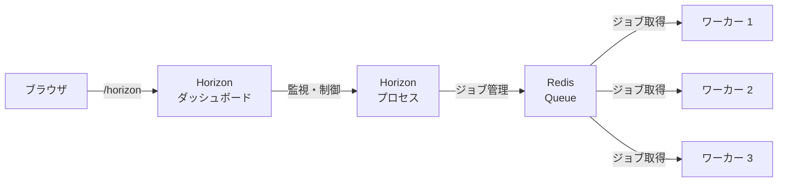

## Horizon とは

[Laravel Horizon](https://github.com/laravel/horizon) は、Laravelの**Redisキュー専用**の監視ダッシュボードです。ジョブのスループット・実行時間・失敗状況をリアルタイムで可視化し、ワーカー設定をコードで管理できます。

<Info>
  Horizon はキューの基礎機能を拡張するパッケージです。まず[キューとジョブ](/jp/queues)の基本を理解してから読み進めてください。また、バックエンドには必ず[Redis](/jp/redis)が必要です。
</Info>



## インストール

<Warning>
  Horizon は Redis をキューバックエンドとして使用します。`config/queue.php` の `QUEUE_CONNECTION` が `redis` に設定されていることを確認してください。現時点で Redis Cluster には対応していません。
</Warning>

Composer でインストールします。

```shell
composer require laravel/horizon
```

インストール後、Horizon のアセットと設定ファイルを公開します。

```shell
php artisan horizon:install
```

このコマンドで `config/horizon.php` と `app/Providers/HorizonServiceProvider.php` が生成されます。

## 設定

### config/horizon.php の構成

`config/horizon.php` はワーカーの設定をすべて管理するファイルです。中心となる設定が `environments` オプションです。

```php
'environments' => [
    'production' => [
        'supervisor-1' => [
            'connection' => 'redis',
            'queue' => ['default', 'notifications'],
            'balance' => 'auto',
            'autoScalingStrategy' => 'time',
            'minProcesses' => 1,
            'maxProcesses' => 10,
            'balanceMaxShift' => 1,
            'balanceCooldown' => 3,
            'tries' => 3,
            'timeout' => 60,
        ],
    ],

    'local' => [
        'supervisor-1' => [
            // その他の値は defaults セクションから継承されます
            'maxProcesses' => 3,
        ],
    ],
],
```

<Info>
  Horizon は内部で `horizon` という名前の Redis 接続を使用します。`config/database.php` でこの名前を他の接続に使わないでください。
</Info>

### スーパーバイザー(Supervisor)

各環境は1つ以上の「スーパーバイザー」を持てます。スーパーバイザーはワーカーグループの管理単位で、異なるキュー・バランス戦略・プロセス数を持つ複数のスーパーバイザーを同一環境で動かすことができます。

### デフォルト値

`defaults` オプションで、すべてのスーパーバイザーに適用されるデフォルト値を設定できます。

```php
'defaults' => [
    'supervisor-1' => [
        'connection' => 'redis',
        'queue' => ['default'],
        'balance' => 'auto',
        'tries' => 1,
        'timeout' => 60,
        'maxProcesses' => 1,
    ],
],
```

### メンテナンスモード

アプリケーションがメンテナンスモードのとき、Horizon はデフォルトでジョブを処理しません。強制的に処理させるには `force` オプションを使います。

```php
'environments' => [
    'production' => [
        'supervisor-1' => [
            'force' => true,
        ],
    ],
],
```

### ジョブの最大試行回数

```php
'environments' => [
    'production' => [
        'supervisor-1' => [
            'tries' => 10,
        ],
    ],
],
```

`tries` を `0` にすると無制限の再試行を許可します。

### ジョブのタイムアウト

```php
'environments' => [
    'production' => [
        'supervisor-1' => [
            'timeout' => 60,
        ],
    ],
],
```

<Warning>
  `timeout` は `config/queue.php` の `retry_after` より数秒短い値を設定してください。また、`auto` バランス戦略ではこの値より長いジョブを強制終了する場合があります。
</Warning>

### バックオフ(再試行の待機時間)

例外発生後に再試行するまでの待機秒数を指定します。

```php
// 固定値
'backoff' => 10,

// 段階的(指数バックオフ)
'backoff' => [1, 5, 10],
```

## バランス戦略

Horizon には3種類のワーカーバランス戦略があります。

<AccordionGroup>
  <Accordion title="auto（デフォルト）">
    キューの負荷に応じてワーカー数を自動調整します。`minProcesses` と `maxProcesses` で範囲を指定します。

    ```php
    'supervisor-1' => [
        'balance' => 'auto',
        'autoScalingStrategy' => 'time', // または 'size'
        'minProcesses' => 1,
        'maxProcesses' => 10,
        'balanceMaxShift' => 1,
        'balanceCooldown' => 3,
    ],
    ```

    - `time` — キューを空にするまでの推定時間でスケーリング
    - `size` — キュー内のジョブ数でスケーリング

    <Info>
      `auto` 戦略ではキューの順序が優先度を意味しません。優先度を強制したい場合は複数のスーパーバイザーを使用してください。
    </Info>
  </Accordion>

  <Accordion title="simple">
    ワーカー数を固定し、指定したキューに均等に分配します。

    ```php
    'supervisor-1' => [
        'balance' => 'simple',
        'processes' => 10,
        'queue' => ['default', 'notifications'],
    ],
    ```

    上記では `default` と `notifications` にそれぞれ5プロセスずつ割り当てられます。
  </Accordion>

  <Accordion title="false（バランスなし）">
    キューを列挙した順に厳密に優先します。Laravelデフォルトのキューシステムと同様の動作ですが、積み残しに応じてワーカー数をスケーリングします。

    ```php
    'supervisor-1' => [
        'balance' => false,
        'queue' => ['default', 'notifications'],
        'minProcesses' => 1,
        'maxProcesses' => 10,
    ],
    ```

    `default` キューのジョブが常に `notifications` キューより先に処理されます。
  </Accordion>
</AccordionGroup>

## ダッシュボードの認可

Horizon のダッシュボードは `/horizon` ルートでアクセスできます。ローカル環境ではデフォルトで誰でもアクセスできますが、**本番環境**ではゲート定義でアクセスを制限します。

`app/Providers/HorizonServiceProvider.php` の `gate()` メソッドを編集します。

```php
use App\Models\User;
use Illuminate\Support\Facades\Gate;

protected function gate(): void
{
    Gate::define('viewHorizon', function (User $user) {
        return in_array($user->email, [
            'admin@example.com',
        ]);
    });
}
```

認証を必要としない場合（IP制限などで保護している場合）は、引数をオプションにします。

```php
Gate::define('viewHorizon', function (User $user = null) {
    // IPアドレス等で制限している場合
    return true;
});
```

## Horizon の起動

### 基本コマンド

```shell
# 起動
php artisan horizon

# 一時停止 / 再開
php artisan horizon:pause
php artisan horizon:continue

# 特定スーパーバイザーの一時停止 / 再開
php artisan horizon:pause-supervisor supervisor-1
php artisan horizon:continue-supervisor supervisor-1

# ステータス確認
php artisan horizon:status
php artisan horizon:supervisor-status supervisor-1

# グレースフルシャットダウン
php artisan horizon:terminate
```

### ローカル開発: 自動再起動

ファイル変更を検知してHorizonを自動再起動するには `horizon:listen` コマンドを使います。

```shell
npm install --save-dev chokidar
php artisan horizon:listen

# Docker / Vagrant 環境では
php artisan horizon:listen --poll
```

### Supervisor による常時起動

本番環境では Supervisor を使って Horizon を常時稼働させます。

#### Supervisor のインストール

```shell
sudo apt-get install supervisor
```

#### 設定ファイルの作成

`/etc/supervisor/conf.d/horizon.conf` を作成します。

```ini
[program:horizon]
process_name=%(program_name)s
command=php /home/forge/example.com/artisan horizon
autostart=true
autorestart=true
user=forge
redirect_stderr=true
stdout_logfile=/home/forge/example.com/horizon.log
stopwaitsecs=3600
```

<Warning>
  `stopwaitsecs` は最も長いジョブの実行時間より大きな値を設定してください。小さすぎると、Supervisorがジョブを途中で強制終了させてしまいます。
</Warning>

#### Supervisor の起動

```shell
sudo supervisorctl reread
sudo supervisorctl update
sudo supervisorctl start horizon
```

#### デプロイ時

コードをデプロイするたびに Horizon を再起動して変更を反映します。

```shell
php artisan horizon:terminate
```

Supervisor が `autostart=true` / `autorestart=true` になっていれば、終了後に自動で再起動されます。

## ジョブの管理

### タグ

Horizon はジョブに関連する Eloquent モデルを自動検出してタグを付けます。

```php
// Video モデル(id=1)を受け取るジョブ → 自動で "App\Models\Video:1" タグが付く
RenderVideo::dispatch(Video::find(1));
```

手動でタグを定義するには `tags()` メソッドを実装します。

```php
class RenderVideo implements ShouldQueue
{
    /**
     * @return array<int, string>
     */
    public function tags(): array
    {
        return ['render', 'video:'.$this->video->id];
    }
}
```

イベントリスナーでは、イベントインスタンスが `tags()` メソッドに渡されます。

```php
class SendRenderNotifications implements ShouldQueue
{
    public function tags(VideoRendered $event): array
    {
        return ['video:'.$event->video->id];
    }
}
```

### サイレント化

ダッシュボードの「完了済みジョブ」リストに表示したくないジョブは、`config/horizon.php` でサイレント化できます。

```php
'silenced' => [
    App\Jobs\ProcessPodcast::class,
],

// タグ単位でサイレント化
'silenced_tags' => [
    'notifications',
],
```

`Silenced` インターフェースを実装する方法もあります。

```php
use Laravel\Horizon\Contracts\Silenced;

class ProcessPodcast implements ShouldQueue, Silenced
{
    use Queueable;
    // ...
}
```

## メトリクスとモニタリング

Horizon のメトリクスダッシュボードにはジョブ・キューのスループットと実行時間が表示されます。定期的にスナップショットを取得するためのスケジュールを設定します。

```php
// routes/console.php
use Illuminate\Support\Facades\Schedule;

Schedule::command('horizon:snapshot')->everyFiveMinutes();
```

メトリクスデータをすべて削除するには以下を実行します。

```shell
php artisan horizon:clear-metrics
```

## ジョブ失敗の通知

キューの待機時間が長くなったときに通知を受け取ることができます。`app/Providers/HorizonServiceProvider.php` の `boot()` メソッドで設定します。

```php
use Laravel\Horizon\Horizon;

public function boot(): void
{
    parent::boot();

    Horizon::routeMailNotificationsTo('admin@example.com');
    Horizon::routeSlackNotificationsTo('slack-webhook-url', '#ops');
    Horizon::routeSmsNotificationsTo('15556667777');
}
```

### 待機時間のしきい値

`config/horizon.php` の `waits` オプションで通知トリガーとなる待機秒数を設定します。

```php
'waits' => [
    'redis:critical' => 30,  // 30秒以上待機で通知
    'redis:default' => 60,
    'redis:batch' => 120,
],
```

`0` を設定するとそのキューの通知は無効になります。

## 失敗ジョブの管理

失敗したジョブは ID または UUID で削除できます。

```shell
# 特定の失敗ジョブを削除
php artisan horizon:forget 5

# すべての失敗ジョブを削除
php artisan horizon:forget --all
```

キューのジョブをすべて消去するには以下を使います。

```shell
# デフォルトキューを消去
php artisan horizon:clear

# 特定キューを消去
php artisan horizon:clear --queue=emails
```

## アップグレード

Horizon のメジャーバージョンアップ時は[アップグレードガイド](https://github.com/laravel/horizon/blob/master/UPGRADE.md)を必ず確認してください。

## 関連ページ

<CardGroup cols={2}>
  <Card title="キューとジョブ" href="/jp/queues">
    Laravel キューの基本。ジョブの作成・ディスパッチ・バッチ処理・失敗処理を解説。
  </Card>
  <Card title="Redis" href="/jp/redis">
    Horizon のバックエンドとして必要な Redis の設定と使い方。
  </Card>
</CardGroup>
