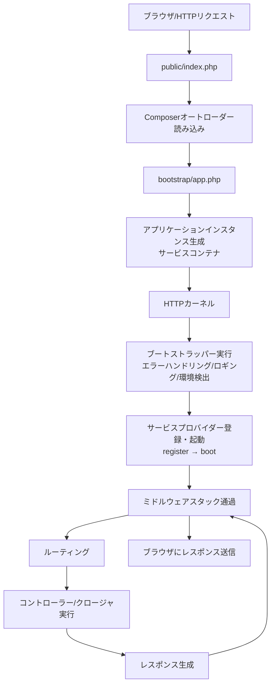
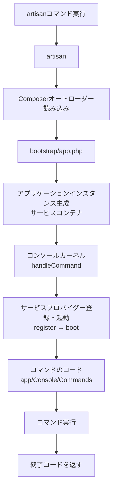

## はじめに

ツールを「現実の世界」で使う場合、そのツールがどのように動作するかを理解していると、より自信を持って使えます。アプリケーション開発でも同じです。開発ツールがどのように機能するかを理解すると、より快適に、自信を持ってアプリケーションを構築できます。

このページでは、Laravelフレームワークがどのように動作するかについて、高レベルな概要を説明します。フレームワーク全体をよく理解することで、すべてが「魔法」のように感じられなくなり、アプリケーション構築への自信が高まります。

## HTTPリクエストのライフサイクル

### 全体の流れ



### 最初のステップ

Laravelアプリケーションへのすべてのリクエストのエントリーポイントは `public/index.php` ファイルです。すべてのリクエストは、Webサーバー（Apache / Nginx）の設定によってこのファイルに転送されます。`index.php` ファイル自体はほとんどコードを含んでいません。フレームワークの残りの部分をロードするための出発点です。

`index.php` ファイルはComposerが生成したオートローダー定義を読み込み、`bootstrap/app.php` からLaravelアプリケーションのインスタンスを取得します。Laravelが最初に行う処理は、アプリケーション／[サービスコンテナ](/jp/service-container)のインスタンスを生成することです。

### HTTPカーネル

次に、受け取ったリクエストはHTTPカーネル（`Illuminate\Foundation\Http\Kernel`）に送られます。アプリケーションインスタンスの `handleRequest` メソッドを使って処理されます。

HTTPカーネルは、リクエストが実行される前に実行される**ブートストラッパー**の配列を定義しています。これらのブートストラッパーは次の処理を行います。

- エラーハンドリングの設定
- ロギングの設定
- [アプリケーション環境の検出](/jp/installation)
- その他リクエスト処理前に必要なタスク

HTTPカーネルは、リクエストをアプリケーションのミドルウェアスタックに通す責任も持ちます。これらのミドルウェアは、[HTTPセッション](/jp/session)の読み書き、アプリケーションがメンテナンスモードかどうかの確認、[CSRFトークンの検証](/jp/middleware)などを処理します。

HTTPカーネルの `handle` メソッドのシグネチャはシンプルです。`Request` を受け取り、`Response` を返します。カーネルをアプリケーション全体を表す大きなブラックボックスと考えてください。HTTPリクエストを渡すとHTTPレスポンスが返ってきます。

### サービスプロバイダー

カーネルのブートストラッピングで最も重要な処理の一つが、アプリケーションの[サービスプロバイダー](/jp/service-providers)をロードすることです。サービスプロバイダーは、データベース、キュー、バリデーション、ルーティングなど、フレームワークのさまざまなコンポーネントをブートストラップする責任を持ちます。

Laravelはプロバイダーのリストをイテレートし、各プロバイダーをインスタンス化します。インスタンス化後、すべてのプロバイダーの `register` メソッドが呼び出されます。次に、すべてのプロバイダーが登録されると、各プロバイダーの `boot` メソッドが呼び出されます。これにより、サービスプロバイダーは `boot` メソッドが実行される時点で、すべてのコンテナバインディングが登録・利用可能な状態になっています。

<Info>
  ユーザー定義またはサードパーティのサービスプロバイダーは `bootstrap/providers.php` ファイルで登録します。
</Info>

### ルーティング

アプリケーションがブートストラップされ、すべてのサービスプロバイダーが登録されると、`Request` はルーターに渡されてディスパッチされます。ルーターはリクエストをルートまたはコントローラーにディスパッチし、ルート固有のミドルウェアも実行します。

ミドルウェアは、アプリケーションに入るHTTPリクエストをフィルタリングまたは検査する便利な仕組みを提供します。たとえば、Laravelにはユーザーが認証されているかどうかを確認するミドルウェアが含まれています。ユーザーが認証されていない場合、ミドルウェアはログイン画面にリダイレクトします。認証されている場合は、リクエストをアプリケーション内部に進めます。

リクエストがマッチしたルートに割り当てられたすべてのミドルウェアを通過すると、ルートまたはコントローラーメソッドが実行され、レスポンスが返されます。

### レスポンスの返却

ルートまたはコントローラーメソッドがレスポンスを返すと、そのレスポンスはルートのミドルウェアを通って外側に戻り、アプリケーションが送信するレスポンスを変更または検査する機会を得ます。

最終的に、レスポンスがミドルウェアを通り抜けると、HTTPカーネルの `handle` メソッドはレスポンスオブジェクトをアプリケーションインスタンスの `handleRequest` に返し、このメソッドが返されたレスポンスの `send` メソッドを呼び出します。`send` メソッドはレスポンスの内容をユーザーのWebブラウザに送信します。これでLaravelのリクエストライフサイクル全体の旅が完了します。

## Consoleコマンドのライフサイクル

### 全体の流れ



### artisanエントリーポイント

コンソールコマンドのエントリーポイントはプロジェクトルートの `artisan` ファイルです。HTTPリクエストと同様に、ComposerのオートローダーとLaravelアプリケーションのインスタンスが生成されます。

次に、アプリケーションインスタンスの `handleCommand` メソッドを通じてコンソールカーネルに処理が渡されます。

### コンソールカーネルとコマンド実行

コンソールカーネルもHTTPカーネルと同様にサービスプロバイダーをロードします。すべてのプロバイダーが登録・起動された後、`app/Console/Commands` ディレクトリのコマンドがロードされ、指定されたコマンドが実行されます。

```shell
php artisan make:controller UserController
```

このコマンドは次のように処理されます。

1. `artisan` ファイルがComposerオートローダーを読み込む
2. `bootstrap/app.php` からアプリケーションインスタンスを生成
3. コンソールカーネルがサービスプロバイダーをロード
4. `make:controller` コマンドを検索して実行
5. 終了コードを返す

## サービスプロバイダーに注目する

サービスプロバイダーは、Laravelアプリケーションをブートストラップするための真の鍵です。アプリケーションインスタンスが生成され、サービスプロバイダーが登録され、リクエストがブートストラップされたアプリケーションに渡される。それだけです。

サービスプロバイダーを通じてLaravelアプリケーションがどのように構築・ブートストラップされるかをしっかり把握することは非常に価値があります。アプリケーションのユーザー定義サービスプロバイダーは `app/Providers` ディレクトリに保存されます。

<Info>
  デフォルトの `AppServiceProvider` はほぼ空の状態です。このプロバイダーは、アプリケーション独自のブートストラッピングやサービスコンテナのバインディングを追加するのに最適な場所です。大規模なアプリケーションでは、アプリケーションで使用する特定のサービスのブートストラッピングを細かく分けた複数のサービスプロバイダーを作成することをお勧めします。
</Info>

### register と boot の違い

サービスプロバイダーには2つの主要なメソッドがあります。

| メソッド | タイミング | 用途 |
| --- | --- | --- |
| `register` | 全プロバイダーのインスタンス化後に全て呼び出される | サービスコンテナへのバインディング登録のみ |
| `boot` | 全プロバイダーの `register` 完了後に呼び出される | ビューコンポーザー、イベントリスナー、その他の初期化 |

<Warning>
  `register` メソッド内でイベントリスナー、ルート、その他の機能を登録しないでください。まだロードされていないサービスプロバイダーが提供するサービスを誤って使用してしまう可能性があります。
</Warning>

## 次のステップ

<Card title="サービスコンテナ" icon="box" href="/jp/service-container">
  依存性注入とサービスコンテナの仕組みを理解します。
</Card>

<Card title="サービスプロバイダー" icon="plug" href="/jp/service-providers">
  サービスプロバイダーを使ってアプリケーションをブートストラップする方法を学びます。
</Card>
