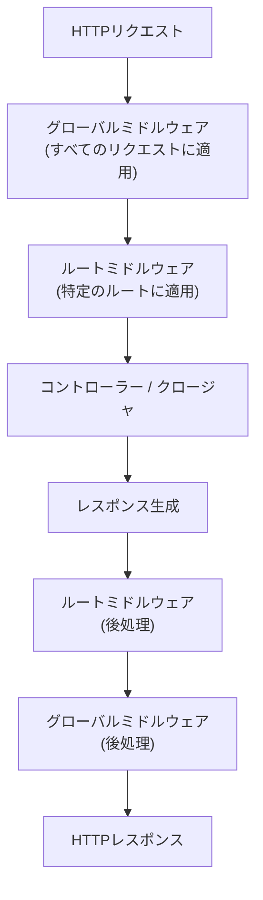

## ミドルウェアとは

ミドルウェアは、アプリケーションに届くHTTPリクエストを検査・フィルタリングする仕組みです。
リクエストがコントローラーに渡される前後に処理を挟み込めます。

例えば、Laravelには認証ミドルウェアが含まれています。
ユーザーが認証されていない場合はログイン画面にリダイレクトし、認証済みの場合はリクエストをそのままアプリケーション内部に通します。

認証以外にも、ログ記録・CSRFプロテクション・レート制限など、さまざまな目的でミドルウェアを作成できます。

<Info>
  ユーザーが定義したミドルウェアは、通常 `app/Http/Middleware` ディレクトリに置きます。
</Info>



## 組み込みミドルウェア

Laravelはデフォルトで `web` と `api` の2つのミドルウェアグループを用意しています。
`routes/web.php` には `web` グループが、`routes/api.php` には `api` グループが自動的に適用されます。

| `web` ミドルウェアグループ |
| --- |
| `EncryptCookies` |
| `AddQueuedCookiesToResponse` |
| `StartSession` |
| `ShareErrorsFromSession` |
| `PreventRequestForgery` (CSRF保護) |
| `SubstituteBindings` |

また、よく使うミドルウェアにはエイリアスが設定されており、短い名前で参照できます。

| エイリアス | ミドルウェア |
| --- | --- |
| `auth` | `Illuminate\Auth\Middleware\Authenticate` |
| `guest` | `Illuminate\Auth\Middleware\RedirectIfAuthenticated` |
| `verified` | `Illuminate\Auth\Middleware\EnsureEmailIsVerified` |
| `throttle` | `Illuminate\Routing\Middleware\ThrottleRequests` |

## ミドルウェアの作成

`make:middleware` Artisanコマンドで新しいミドルウェアを作成します。

```shell
php artisan make:middleware EnsureTokenIsValid
```

`app/Http/Middleware/EnsureTokenIsValid.php` が生成されます。
`handle` メソッドにリクエストを処理するロジックを記述します。

```php
<?php

namespace App\Http\Middleware;

use Closure;
use Illuminate\Http\Request;
use Symfony\Component\HttpFoundation\Response;

class EnsureTokenIsValid
{
    /**
     * 受信リクエストを処理する
     *
     * @param  \Closure(\Illuminate\Http\Request): (\Symfony\Component\HttpFoundation\Response)  $next
     */
    public function handle(Request $request, Closure $next): Response
    {
        if ($request->input('token') !== 'my-secret-token') {
            return redirect('/home');
        }

        return $next($request);
    }
}
```

`$next($request)` を呼び出すと、リクエストがアプリケーションの次の処理に渡されます。
条件を満たさない場合はリダイレクトやレスポンスを返してリクエストを止めます。

### リクエスト前後の処理

ミドルウェアはリクエストの**前**または**後**に処理を実行できます。

```php
// リクエスト前に処理する
public function handle(Request $request, Closure $next): Response
{
    // ここに前処理を書く

    return $next($request);
}
```

```php
// レスポンス後に処理する
public function handle(Request $request, Closure $next): Response
{
    $response = $next($request);

    // ここに後処理を書く

    return $response;
}
```

## ミドルウェアの登録

### グローバルミドルウェア

すべてのリクエストに対してミドルウェアを実行したい場合は、`bootstrap/app.php` の `withMiddleware` でグローバルスタックに追加します。

```php
// bootstrap/app.php
use App\Http\Middleware\EnsureTokenIsValid;

return Application::configure(basePath: dirname(__DIR__))
    ->withMiddleware(function (Middleware $middleware): void {
        $middleware->append(EnsureTokenIsValid::class);
    });
```

`append` はスタックの末尾に追加します。先頭に追加するには `prepend` を使います。

### ルートへのミドルウェア適用

特定のルートだけにミドルウェアを適用するには、ルート定義で `middleware` メソッドを呼び出します。

```php
use App\Http\Middleware\EnsureTokenIsValid;

Route::get('/profile', function () {
    // ...
})->middleware(EnsureTokenIsValid::class);
```

複数のミドルウェアを適用する場合は配列で渡します。

```php
Route::get('/', function () {
    // ...
})->middleware([First::class, Second::class]);
```

特定のルートだけミドルウェアを除外したい場合は `withoutMiddleware` を使います。

```php
use App\Http\Middleware\EnsureTokenIsValid;

Route::middleware([EnsureTokenIsValid::class])->group(function () {
    Route::get('/', function () {
        // このルートにはミドルウェアが適用される
    });

    Route::get('/profile', function () {
        // このルートはミドルウェアを除外
    })->withoutMiddleware([EnsureTokenIsValid::class]);
});
```

### ミドルウェアエイリアス

長いクラス名に短いエイリアスを定義できます。`bootstrap/app.php` で設定します。

```php
// bootstrap/app.php
use App\Http\Middleware\EnsureUserIsSubscribed;

return Application::configure(basePath: dirname(__DIR__))
    ->withMiddleware(function (Middleware $middleware): void {
        $middleware->alias([
            'subscribed' => EnsureUserIsSubscribed::class,
        ]);
    });
```

エイリアスを使ってルートに適用できます。

```php
Route::get('/profile', function () {
    // ...
})->middleware('subscribed');
```

## ミドルウェアグループ

複数のミドルウェアを1つのキーでまとめると、ルートへの適用が簡単になります。
`bootstrap/app.php` で `appendToGroup` または `prependToGroup` を使います。

```php
// bootstrap/app.php
use App\Http\Middleware\First;
use App\Http\Middleware\Second;

return Application::configure(basePath: dirname(__DIR__))
    ->withMiddleware(function (Middleware $middleware): void {
        $middleware->appendToGroup('group-name', [
            First::class,
            Second::class,
        ]);
    });
```

グループはルートに通常のミドルウェアと同じ方法で適用できます。

```php
Route::get('/', function () {
    // ...
})->middleware('group-name');

Route::middleware(['group-name'])->group(function () {
    // ...
});
```

既存の `web` グループや `api` グループにミドルウェアを追加する場合は専用のメソッドが使えます。

```php
// bootstrap/app.php
use App\Http\Middleware\EnsureUserIsSubscribed;

return Application::configure(basePath: dirname(__DIR__))
    ->withMiddleware(function (Middleware $middleware): void {
        $middleware->web(append: [
            EnsureUserIsSubscribed::class,
        ]);
    });
```

## ミドルウェアパラメーター

ミドルウェアは追加のパラメーターを受け取れます。
`handle` メソッドの `$next` 引数の後にパラメーターを追加します。

```php
<?php

namespace App\Http\Middleware;

use Closure;
use Illuminate\Http\Request;
use Symfony\Component\HttpFoundation\Response;

class EnsureUserHasRole
{
    public function handle(Request $request, Closure $next, string $role): Response
    {
        if (! $request->user()->hasRole($role)) {
            return redirect('/home');
        }

        return $next($request);
    }
}
```

ルート定義でミドルウェア名とパラメーターを `:` で区切って指定します。

```php
use App\Http\Middleware\EnsureUserHasRole;

Route::put('/post/{id}', function (string $id) {
    // ...
})->middleware(EnsureUserHasRole::class.':editor');
```

複数のパラメーターはカンマで区切ります。

```php
Route::put('/post/{id}', function (string $id) {
    // ...
})->middleware(EnsureUserHasRole::class.':editor,publisher');
```

## 実例：認証チェックミドルウェア

ログインしていないユーザーをリダイレクトするシンプルな例です。

```shell
php artisan make:middleware RedirectIfNotAuthenticated
```

```php
<?php

namespace App\Http\Middleware;

use Closure;
use Illuminate\Http\Request;
use Symfony\Component\HttpFoundation\Response;

class RedirectIfNotAuthenticated
{
    public function handle(Request $request, Closure $next): Response
    {
        if (! $request->user()) {
            return redirect('/login');
        }

        return $next($request);
    }
}
```

ルートに適用します。

```php
Route::get('/dashboard', function () {
    return view('dashboard');
})->middleware(RedirectIfNotAuthenticated::class);
```

<Tip>
  Laravelには認証用の `auth` ミドルウェアが組み込まれています。独自に実装する前に、既存のミドルウェアで要件を満たせないか確認しましょう。
</Tip>

## 次のステップ

<Card title="HTTPリクエスト" icon="globe" href="/jp/requests">
  コントローラーでリクエストデータを受け取る方法を学びます。
</Card>
