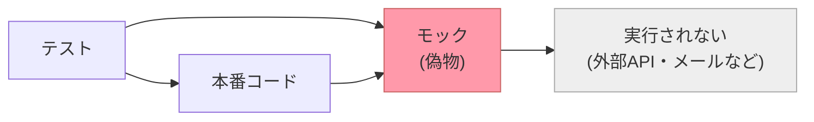
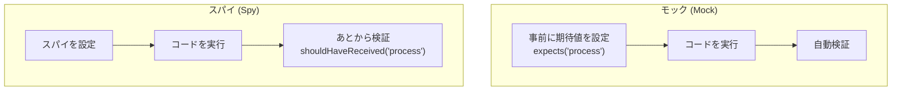

## なぜモックを使うのか

テストを書くとき、メールの送信・キャッシュの読み書き・外部APIの呼び出しなど、実際には実行したくない処理があります。
こうした処理を「本物のふりをする偽物」で置き換えることをモックと呼びます。

モックを使うメリットは次のとおりです。

- **テストが速い** — 外部サービスや重い処理を実行しないため、テストがすぐ終わる
- **テストが安定する** — 外部サービスの状態に左右されず、常に同じ結果になる
- **テストの範囲が明確になる** — 1つのクラスやメソッドだけを検証できる

Laravelはイベント・ジョブ・ファサードなどのモックをすぐに使えるヘルパーを提供しています。
内部では [Mockery](https://github.com/mockery/mockery) を使っており、複雑なセットアップなしに利用できます。



## モックオブジェクト

サービスコンテナ経由で注入されるオブジェクトをモックするには、モックインスタンスをコンテナへバインドします。
こうすると、コンテナはオブジェクトを生成する代わりにモックインスタンスを使います。

<CodeGroup>
```php Pest
use App\Service;
use Mockery;
use Mockery\MockInterface;

test('something can be mocked', function () {
    $this->instance(
        Service::class,
        Mockery::mock(Service::class, function (MockInterface $mock) {
            $mock->expects('process');
        })
    );
});
```

```php PHPUnit
use App\Service;
use Mockery;
use Mockery\MockInterface;

public function test_something_can_be_mocked(): void
{
    $this->instance(
        Service::class,
        Mockery::mock(Service::class, function (MockInterface $mock) {
            $mock->expects('process');
        })
    );
}
```
</CodeGroup>

### `mock()` メソッド

Laravelのテストケース基底クラスが提供する `mock()` メソッドを使うと、上記と同等の処理をより簡潔に書けます。

```php
use App\Service;
use Mockery\MockInterface;

$mock = $this->mock(Service::class, function (MockInterface $mock) {
    $mock->expects('process');
});
```

### `partialMock()` メソッド

オブジェクトの一部のメソッドだけをモックしたい場合は `partialMock()` を使います。
モックしていないメソッドは通常通り実行されます。

```php
use App\Service;
use Mockery\MockInterface;

$mock = $this->partialMock(Service::class, function (MockInterface $mock) {
    $mock->expects('process');
});
```

### `spy()` メソッド

スパイはモックに似ていますが、コードの実行後にインタラクションを検証する点が異なります。
モックが「このメソッドが呼ばれるはずだ」と事前に設定するのに対し、スパイは「このメソッドが呼ばれたかどうか」をあとから確認します。

```php
use App\Service;

$spy = $this->spy(Service::class);

// ...テスト対象のコードを実行...

$spy->shouldHaveReceived('process');
```



## ファサードのモック

[ファサード](/jp/facades)は通常の静的メソッド呼び出しと異なり、モックができます。
依存性注入と同等のテスタビリティを持ちながら、簡潔な構文で書けます。

例として、キャッシュを使うコントローラーを考えます。

```php
<?php

namespace App\Http\Controllers;

use Illuminate\Support\Facades\Cache;

class UserController extends Controller
{
    /**
     * アプリケーションの全ユーザー一覧を返す
     */
    public function index(): array
    {
        $value = Cache::get('key');

        return [
            // ...
        ];
    }
}
```

`Cache` ファサードの `get` メソッドをモックするには `expects()` を使います。

<CodeGroup>
```php Pest
<?php

use Illuminate\Support\Facades\Cache;

test('get index', function () {
    Cache::expects('get')
        ->with('key')
        ->andReturn('value');

    $response = $this->get('/users');

    // ...
});
```

```php PHPUnit
<?php

namespace Tests\Feature;

use Illuminate\Support\Facades\Cache;
use Tests\TestCase;

class UserControllerTest extends TestCase
{
    public function test_get_index(): void
    {
        Cache::expects('get')
            ->with('key')
            ->andReturn('value');

        $response = $this->get('/users');

        // ...
    }
}
```
</CodeGroup>

<Warning>
  `Request` ファサードはモックしないでください。その代わりに、`get` や `post` などのHTTPテストメソッドに入力値を渡してください。同様に、`Config` ファサードをモックする代わりに `Config::set()` をテスト内で呼び出してください。
</Warning>

## ファサードスパイ

ファサードをスパイで監視するには、対応するファサードの `spy()` メソッドを呼び出します。
スパイはコードが実行された後にインタラクションを検証したいときに便利です。

<CodeGroup>
```php Pest
<?php

use Illuminate\Support\Facades\Cache;

test('values are stored in cache', function () {
    Cache::spy();

    $response = $this->get('/');

    $response->assertStatus(200);

    Cache::shouldHaveReceived('put')->with('name', 'Taylor', 10);
});
```

```php PHPUnit
use Illuminate\Support\Facades\Cache;

public function test_values_are_stored_in_cache(): void
{
    Cache::spy();

    $response = $this->get('/');

    $response->assertStatus(200);

    Cache::shouldHaveReceived('put')->with('name', 'Taylor', 10);
}
```
</CodeGroup>

## 時間の操作

テストで時間に依存するロジックを検証するとき、`now()` や `Carbon::now()` が返す時刻を変更できると便利です。
Laravelのフィーチャーテスト基底クラスには、時間を操作するためのヘルパーが用意されています。

### `travel()` — 時間を移動する

<CodeGroup>
```php Pest
test('time can be manipulated', function () {
    // 未来へ進む
    $this->travel(5)->milliseconds();
    $this->travel(5)->seconds();
    $this->travel(5)->minutes();
    $this->travel(5)->hours();
    $this->travel(5)->days();
    $this->travel(5)->weeks();
    $this->travel(5)->years();

    // 過去へ戻る
    $this->travel(-5)->hours();

    // 特定の時刻へ移動する
    $this->travelTo(now()->subHours(6));

    // 現在時刻に戻る
    $this->travelBack();
});
```

```php PHPUnit
public function test_time_can_be_manipulated(): void
{
    // 未来へ進む
    $this->travel(5)->milliseconds();
    $this->travel(5)->seconds();
    $this->travel(5)->minutes();
    $this->travel(5)->hours();
    $this->travel(5)->days();
    $this->travel(5)->weeks();
    $this->travel(5)->years();

    // 過去へ戻る
    $this->travel(-5)->hours();

    // 特定の時刻へ移動する
    $this->travelTo(now()->subHours(6));

    // 現在時刻に戻る
    $this->travelBack();
}
```
</CodeGroup>

### クロージャを使った時間移動

時間移動メソッドにクロージャを渡すと、指定した時刻で時間を止めてクロージャを実行し、完了後に元の時刻に戻ります。

```php
$this->travel(5)->days(function () {
    // 5日後の状態でテストする
});

$this->travelTo(now()->subDays(10), function () {
    // 特定の瞬間でテストする
});
```

### `freezeTime()` — 時間を止める

`freezeTime()` は現在時刻を固定します。`freezeSecond()` は現在時刻を秒の先頭で固定します。

```php
use Illuminate\Support\Carbon;

// 時間を固定してクロージャを実行し、終了後に再開する
$this->freezeTime(function (Carbon $time) {
    // ...
});

// 現在の秒の先頭で固定してクロージャを実行する
$this->freezeSecond(function (Carbon $time) {
    // ...
});
```

### 実用例：非アクティブなスレッドのロック

時間操作は、一定期間操作がないと投稿がロックされるフォーラムのような機能のテストに役立ちます。

<CodeGroup>
```php Pest
use App\Models\Thread;

test('forum threads lock after one week of inactivity', function () {
    $thread = Thread::factory()->create();

    $this->travel(1)->week();

    expect($thread->isLockedByInactivity())->toBeTrue();
});
```

```php PHPUnit
use App\Models\Thread;

public function test_forum_threads_lock_after_one_week_of_inactivity(): void
{
    $thread = Thread::factory()->create();

    $this->travel(1)->week();

    $this->assertTrue($thread->isLockedByInactivity());
}
```
</CodeGroup>

<Info>
  `travel()` などの時間操作メソッドは、フィーチャーテスト（`Tests\TestCase` を継承するクラス）でのみ使えます。PHPUnitの基底 `TestCase` では使えません。
</Info>

## メソッド一覧

### モック関連

| メソッド | 説明 |
| --- | --- |
| `$this->mock(Class::class, fn)` | クラスの完全なモックを作成してコンテナに登録する |
| `$this->partialMock(Class::class, fn)` | 一部のメソッドだけをモックする |
| `$this->spy(Class::class)` | スパイを作成してコンテナに登録する |
| `$this->instance(Class::class, $mock)` | 任意のモックインスタンスをコンテナに登録する |
| `Facade::expects('method')` | ファサードのメソッドをモックする |
| `Facade::spy()` | ファサードをスパイで監視する |
| `$spy->shouldHaveReceived('method')` | スパイに対してメソッドが呼ばれたか検証する |

### 時間操作関連

| メソッド | 説明 |
| --- | --- |
| `$this->travel(n)->unit()` | 指定した単位だけ時間を移動する |
| `$this->travelTo(Carbon)` | 特定の時刻へ移動する |
| `$this->travelBack()` | 現在時刻に戻る |
| `$this->freezeTime(fn)` | 時間を固定してクロージャを実行する |
| `$this->freezeSecond(fn)` | 秒の先頭で時間を固定してクロージャを実行する |
