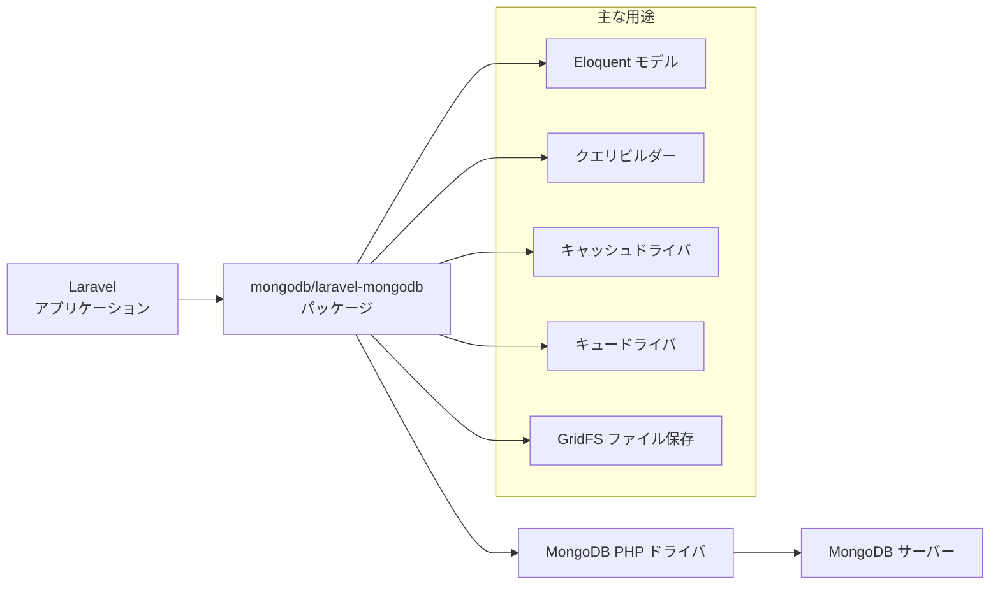
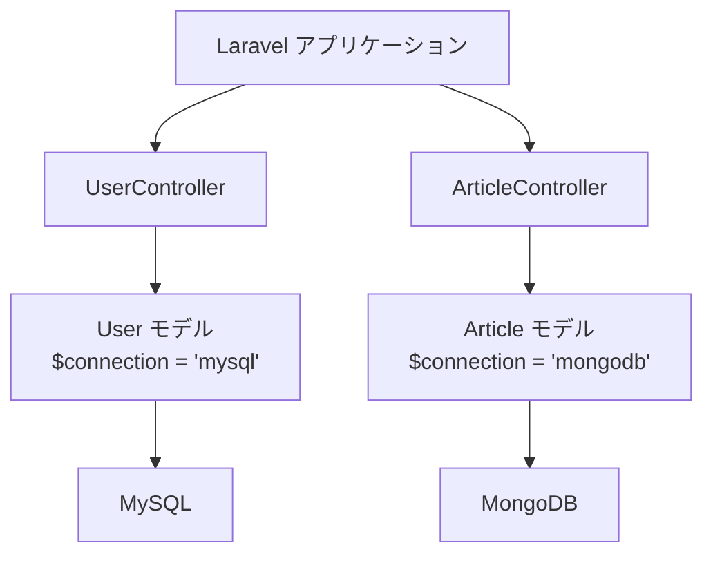

## はじめに

[MongoDB](https://www.mongodb.com/resources/products/fundamentals/why-use-mongodb) は最も人気のある NoSQL ドキュメント指向データベースの一つです。高い書き込み性能（分析や IoT に最適）、高可用性（レプリカセットによる自動フェイルオーバー）、水平スケーリング（シャーディング）、強力なクエリ言語（集計・全文検索・地理空間クエリ）が特徴です。

SQL データベースの行・列形式とは異なり、MongoDB の各レコードは BSON（バイナリ JSON）形式のドキュメントです。アプリケーションはこのデータを JSON 形式で取得できます。



<Info>
  Laravel で MongoDB を使う場合は、MongoDB 公式がメンテナンスする `mongodb/laravel-mongodb` パッケージの使用を推奨します。このパッケージは Eloquent や Laravel の各種機能とのリッチな統合を提供します。
</Info>

## インストール

### MongoDB PHP ドライバ

MongoDB に接続するには `mongodb` PHP 拡張が必要です。[Laravel Herd](https://herd.laravel.com) や `php.new` を使っている場合はすでにインストール済みです。手動でインストールするには PECL を使います。

```shell
pecl install mongodb
```

インストール詳細は [MongoDB PHP 拡張インストールガイド](https://www.php.net/manual/en/mongodb.installation.php) を参照してください。

<Warning>
  `mongodb` PHP 拡張が CLI と Web サーバーの両方で有効になっていることを確認してください。設定が異なる場合があります。
</Warning>

### MongoDB サーバーの起動

MongoDB Community Server はローカル開発用に使用できます。Windows、macOS、Linux、Docker でのインストール方法は [公式インストールガイド](https://docs.mongodb.com/manual/administration/install-community/) を参照してください。

**Docker を使う場合:**

```yaml
# docker-compose.yml
services:
  mongodb:
    image: mongo:8
    ports:
      - "27017:27017"
    environment:
      MONGO_INITDB_ROOT_USERNAME: root
      MONGO_INITDB_ROOT_PASSWORD: password
      MONGO_INITDB_DATABASE: laravel_app
    volumes:
      - mongodb_data:/data/db

volumes:
  mongodb_data:
```

```shell
docker compose up -d
```

クラウドでのホスティングには [MongoDB Atlas](https://www.mongodb.com/cloud/atlas) が利用できます。Atlas クラスターにローカルからアクセスするには、プロジェクトの IP アクセスリストに自分の IP アドレスを追加する必要があります。

### laravel-mongodb パッケージのインストール

Composer で `mongodb/laravel-mongodb` パッケージをインストールします。

```shell
composer require mongodb/laravel-mongodb
```

## 設定

### 環境変数

`.env` ファイルに MongoDB の接続情報を追加します。

```ini
MONGODB_URI="mongodb://localhost:27017"
MONGODB_DATABASE="laravel_app"
```

MongoDB Atlas を使う場合は接続文字列を Atlas のものに変更します。

```ini
MONGODB_URI="mongodb+srv://<username>:<password>@<cluster>.mongodb.net/<dbname>?retryWrites=true&w=majority"
MONGODB_DATABASE="laravel_app"
```

### config/database.php

`config/database.php` の `connections` 配列に `mongodb` 接続を追加します。

```php
'connections' => [

    // ... 既存の接続設定 ...

    'mongodb' => [
        'driver' => 'mongodb',
        'dsn' => env('MONGODB_URI', 'mongodb://localhost:27017'),
        'database' => env('MONGODB_DATABASE', 'laravel_app'),
    ],

],
```

<Tip>
  MySQL などのリレーショナル DB と MongoDB を同時に使う場合は、`default` はそのままにして `mongodb` 接続を追加するだけで OK です。モデルごとに接続を切り替えられます。
</Tip>

## 主要機能

### Eloquent モデル

`MongoDB\Laravel\Eloquent\Model` を継承することで、通常の Eloquent モデルとほぼ同じ感覚で MongoDB を操作できます。

```php
<?php

namespace App\Models;

use MongoDB\Laravel\Eloquent\Model;

class Article extends Model
{
    protected $connection = 'mongodb';
    protected $collection = 'articles'; // コレクション名（省略時はクラス名から自動生成）

    protected $fillable = [
        'title',
        'body',
        'tags',
        'published_at',
    ];
}
```

<Info>
  MongoDB はスキーマレスなので、マイグレーションは不要です。ドキュメントを保存すると自動的にコレクションが作成されます。
</Info>

#### 基本的な CRUD 操作

通常の Eloquent と同じ API で操作できます。

```php
use App\Models\Article;

// 作成
$article = Article::create([
    'title' => 'MongoDB入門',
    'body' => 'MongoDBはドキュメント指向データベースです。',
    'tags' => ['nosql', 'mongodb', 'laravel'],
    'published_at' => now(),
]);

// 取得
$article = Article::find('64f1a2b3c4d5e6f7a8b9c0d1');
$articles = Article::where('tags', 'nosql')->get();

// 更新
$article->update(['title' => '改訂版 MongoDB入門']);

// 削除
$article->delete();
```

#### 配列・埋め込みドキュメント

MongoDB の強みである配列や埋め込みドキュメントをそのまま扱えます。

```php
// 配列フィールドへの push
$article->push('tags', 'database');

// 配列フィールドからの pull
$article->pull('tags', 'nosql');

// 埋め込みドキュメントのクエリ
$articles = Article::where('meta.author', 'Taylor')->get();
```

### クエリビルダー

MongoDB のクエリビルダーを使って複雑なクエリを記述できます。詳細は [laravel-mongodb クエリビルダードキュメント](https://www.mongodb.com/docs/drivers/php/laravel-mongodb/current/query-builder/) を参照してください。

```php
use Illuminate\Support\Facades\DB;

// 基本的なクエリ
$articles = DB::connection('mongodb')
    ->collection('articles')
    ->where('tags', 'laravel')
    ->orderBy('published_at', 'desc')
    ->limit(10)
    ->get();

// 集計パイプライン
$stats = DB::connection('mongodb')
    ->collection('orders')
    ->raw(function ($collection) {
        return $collection->aggregate([
            ['$group' => ['_id' => '$status', 'total' => ['$sum' => '$amount']]],
            ['$sort' => ['total' => -1]],
        ]);
    });
```

### キャッシュドライバ

MongoDB のキャッシュドライバは TTL インデックスを使って期限切れエントリを自動的に削除します。詳細は [キャッシュドライバドキュメント](https://www.mongodb.com/docs/drivers/php/laravel-mongodb/current/cache/) を参照してください。

`config/cache.php` にストアを追加します。

```php
'stores' => [

    'mongodb' => [
        'driver' => 'mongodb',
        'connection' => 'mongodb',
        'collection' => 'cache',
    ],

],
```

`.env` でキャッシュドライバを MongoDB に変更します。

```ini
CACHE_STORE=mongodb
```

### キュードライバ

MongoDB をキュードライバとして使うことができます。詳細は [キュードライバドキュメント](https://www.mongodb.com/docs/drivers/php/laravel-mongodb/current/queues/) を参照してください。

`config/queue.php` に接続を追加します。

```php
'connections' => [

    'mongodb' => [
        'driver' => 'mongodb',
        'connection' => 'mongodb',
        'collection' => 'jobs',
        'queue' => env('MONGODB_QUEUE', 'default'),
        'retry_after' => (int) env('MONGODB_QUEUE_RETRY_AFTER', 90),
        'after_commit' => false,
    ],

],
```

`.env` でキュー接続を MongoDB に変更します。

```ini
QUEUE_CONNECTION=mongodb
```

### GridFS によるファイル保存

MongoDB の GridFS を使ってファイルを保存できます。[Flysystem 用 GridFS アダプター](https://flysystem.thephpleague.com/docs/adapter/gridfs/) を利用します。詳細は [GridFS ドキュメント](https://www.mongodb.com/docs/drivers/php/laravel-mongodb/current/filesystems/) を参照してください。

```shell
composer require league/flysystem-gridfs
```

`config/filesystems.php` にディスクを追加します。

```php
'disks' => [

    'gridfs' => [
        'driver' => 'gridfs',
        'connection' => 'mongodb',
        'database' => env('MONGODB_DATABASE', 'laravel_app'),
    ],

],
```

```php
use Illuminate\Support\Facades\Storage;

// ファイルのアップロード
Storage::disk('gridfs')->put('file.pdf', $contents);

// ファイルの取得
$contents = Storage::disk('gridfs')->get('file.pdf');
```

## MySQL との併用

Laravel では MySQL と MongoDB を同時に使用できます。モデルごとに `$connection` プロパティで接続を指定します。



```php
// MySQL を使う通常の Eloquent モデル
class User extends \Illuminate\Database\Eloquent\Model
{
    protected $connection = 'mysql';
}

// MongoDB を使うモデル
class Article extends \MongoDB\Laravel\Eloquent\Model
{
    protected $connection = 'mongodb';
}
```

<Info>
  MySQL モデルと MongoDB モデルの間でリレーションを持たせる場合は、[ハイブリッドリレーション](https://www.mongodb.com/docs/drivers/php/laravel-mongodb/current/eloquent-models/relationships/) を参照してください。
</Info>

## まとめ

<AccordionGroup>
  <Accordion title="インストールのチェックリスト">
    1. `pecl install mongodb` で PHP 拡張をインストール
    2. MongoDB サーバーを起動（ローカルまたは Docker、または Atlas）
    3. `composer require mongodb/laravel-mongodb` でパッケージをインストール
    4. `.env` に `MONGODB_URI` と `MONGODB_DATABASE` を設定
    5. `config/database.php` に `mongodb` 接続を追加
  </Accordion>

  <Accordion title="MongoDB と MySQL の使い分け">
    | 特性 | MongoDB | MySQL |
    |---|---|---|
    | データモデル | ドキュメント（JSON/BSON） | テーブル（行・列） |
    | スキーマ | スキーマレス（柔軟） | 固定スキーマ |
    | スケーリング | 水平スケーリングが容易 | 垂直スケーリングが主流 |
    | トランザクション | マルチドキュメント対応（v4+） | 完全な ACID 対応 |
    | 適した用途 | ログ・分析・IoT・柔軟な構造のデータ | 構造化データ・複雑なリレーション |
  </Accordion>

  <Accordion title="機能の使い分け">
    | 機能 | 設定箇所 |
    |---|---|
    | Eloquent モデル | `MongoDB\Laravel\Eloquent\Model` を継承 |
    | クエリビルダー | `DB::connection('mongodb')->collection(...)` |
    | キャッシュ | `config/cache.php` + `CACHE_STORE=mongodb` |
    | キュー | `config/queue.php` + `QUEUE_CONNECTION=mongodb` |
    | ファイル保存 | `config/filesystems.php` + GridFS アダプター |
  </Accordion>
</AccordionGroup>

## 次のステップ

<CardGroup cols={2}>
  <Card title="laravel-mongodb 公式ドキュメント" icon="book" href="https://www.mongodb.com/docs/drivers/php/laravel-mongodb/">
    Eloquent、クエリビルダー、リレーションなど全機能の詳細リファレンス
  </Card>
  <Card title="クイックスタート" icon="rocket" href="https://www.mongodb.com/docs/drivers/php/laravel-mongodb/current/quick-start/">
    MongoDB と Laravel の基本的な使い方を素早く学ぶ
  </Card>
  <Card title="データベース設定" icon="database" href="/jp/database">
    Laravel のデータベース接続設定の基本
  </Card>
  <Card title="Eloquent入門" icon="table" href="/jp/eloquent">
    Eloquent ORM の基本的な使い方
  </Card>
</CardGroup>
