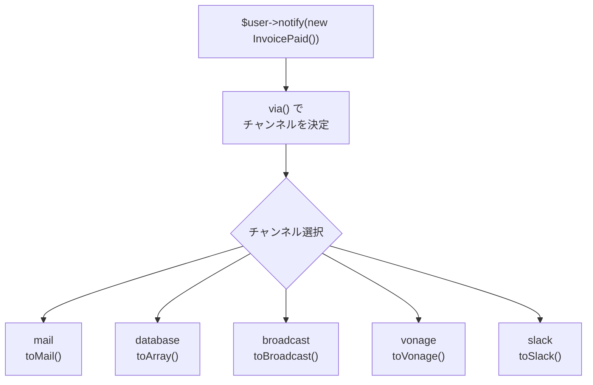

## Notificationとは

Laravelの通知(Notification)システムは、メール・SMS・Slack・データベースなど複数の配信チャンネルに対して、統一されたAPIで通知を送る仕組みです。

**MailとNotificationの違い**

| 比較 | Mail | Notification |
| --- | --- | --- |
| 主な用途 | リッチなHTMLメール | 短い情報通知 |
| 配信チャンネル | メールのみ | メール・DB・Slack・SMSなど複数 |
| テンプレート | 完全に自由 | シンプルなメッセージ形式 |

請求書の支払い完了通知のように、複数のチャンネルに同じ通知を送りたい場合はNotificationが適しています。

## Notificationクラスの作成

`make:notification` Artisanコマンドでクラスを生成します。

```shell
php artisan make:notification InvoicePaid
```

生成されたクラスは `app/Notifications/` ディレクトリに配置されます。クラスには `via()` メソッドと、各チャンネル向けのメッセージ生成メソッドが含まれます。

## 通知の送信方法

### Notifiableトレイトを使う

`App\Models\User` にはデフォルトで `Notifiable` トレイトが含まれています。`notify()` メソッドで通知を送ります。

```php
use App\Notifications\InvoicePaid;

$user->notify(new InvoicePaid($invoice));
```

<Info>
  `Notifiable` トレイトは `User` モデルに限らず、任意のモデルに追加できます。
</Info>

### Notificationファサードを使う

複数のユーザーに同時に送信するには `Notification` ファサードを使います。

```php
use Illuminate\Support\Facades\Notification;

Notification::send($users, new InvoicePaid($invoice));
```

すぐに送信する (キューをスキップする) には `sendNow()` を使います。

```php
Notification::sendNow($developers, new DeploymentCompleted($deployment));
```

## 配信チャンネルの指定

`via()` メソッドで使用するチャンネルを配列で返します。



```php
public function via(object $notifiable): array
{
    return ['mail', 'database'];
}
```

ユーザーの設定に応じてチャンネルを切り替えることもできます。

```php
public function via(object $notifiable): array
{
    return $notifiable->prefers_sms ? ['vonage'] : ['mail', 'database'];
}
```

利用可能な主なチャンネルは次のとおりです。

| チャンネル | キー | 説明 |
| --- | --- | --- |
| メール | `mail` | メールで通知を送る |
| データベース | `database` | DBに保存してUI上で表示する |
| ブロードキャスト | `broadcast` | リアルタイム通知(WebSocket) |
| SMS | `vonage` | Vonage(旧Nexmo)経由でSMS送信 |
| Slack | `slack` | Slackチャンネルに投稿 |

## メールチャンネルでの通知

`toMail()` メソッドで `MailMessage` インスタンスを返します。

```php
use Illuminate\Notifications\Messages\MailMessage;

public function toMail(object $notifiable): MailMessage
{
    $url = url('/invoice/'.$this->invoice->id);

    return (new MailMessage)
        ->greeting('こんにちは！')
        ->line('請求書のお支払いを確認しました。')
        ->action('請求書を確認する', $url)
        ->line('ご利用いただきありがとうございます。');
}
```

`MailMessage` の主なメソッドは次のとおりです。

| メソッド | 説明 |
| --- | --- |
| `greeting()` | 冒頭の挨拶文 |
| `line()` | 本文の1行 |
| `action()` | ボタンリンク |
| `subject()` | 件名 |
| `from()` | 送信者アドレス |
| `mailer()` | 使用するメーラー |

エラーを通知する場合は `error()` メソッドを追加すると、ボタンが赤くなります。

```php
return (new MailMessage)
    ->error()
    ->subject('お支払いに失敗しました')
    ->line('請求書のお支払い処理に失敗しました。');
```

### Markdown通知メール

Markdown形式のリッチなメールを使うこともできます。`--markdown` オプションでクラスを生成します。

```shell
php artisan make:notification InvoicePaid --markdown=mail.invoice.paid
```

`toMail()` の代わりに `toMarkdownMail()` を使います。

```php
use Illuminate\Notifications\Messages\MailMessage;

public function toMail(object $notifiable): MailMessage
{
    return (new MailMessage)
        ->markdown('mail.invoice.paid', [
            'url' => url('/invoice/'.$this->invoice->id),
            'invoice' => $this->invoice,
        ]);
}
```

## データベースチャンネルでの通知

データベースチャンネルを使うと、通知をDBに保存してアプリのUI上で表示できます。

### テーブルの準備

まず `notifications` テーブルを作成します。

```shell
php artisan make:notifications-table

php artisan migrate
```

### toArrayメソッドの定義

`toArray()` メソッドで保存するデータを配列で返します。

```php
public function toArray(object $notifiable): array
{
    return [
        'invoice_id' => $this->invoice->id,
        'amount' => $this->invoice->amount,
        'message' => '請求書のお支払いを確認しました。',
    ];
}
```

このデータは `notifications` テーブルの `data` カラムにJSON形式で保存されます。

### 通知の取得

`Notifiable` トレイトが提供する `notifications` リレーションで通知を取得できます。

```php
$user = App\Models\User::find(1);

foreach ($user->notifications as $notification) {
    echo $notification->type;
    echo $notification->data['message'];
}
```

未読の通知だけを取得するには `unreadNotifications` を使います。

```php
foreach ($user->unreadNotifications as $notification) {
    echo $notification->data['message'];
}
```

### 既読にする

`markAsRead()` で通知を既読にします。

```php
// 個別に既読にする
foreach ($user->unreadNotifications as $notification) {
    $notification->markAsRead();
}

// まとめて既読にする
$user->unreadNotifications->markAsRead();

// クエリで一括更新する
$user->unreadNotifications()->update(['read_at' => now()]);
```

## 通知のキュー処理

通知の送信に時間がかかる場合は、`ShouldQueue` インターフェースと `Queueable` トレイトを追加してキュー処理にします。`make:notification` で生成したクラスには最初からインポートされています。

```php
<?php

namespace App\Notifications;

use Illuminate\Bus\Queueable;
use Illuminate\Contracts\Queue\ShouldQueue;
use Illuminate\Notifications\Notification;

class InvoicePaid extends Notification implements ShouldQueue
{
    use Queueable;

    // ...
}
```

`ShouldQueue` を実装すると、`notify()` を呼び出すだけで自動的にキューに入ります。

```php
$user->notify(new InvoicePaid($invoice));
```

遅延送信も可能です。

```php
$user->notify(
    (new InvoicePaid($invoice))->delay(now()->plus(minutes: 10))
);
```

## 複数チャンネルへの同時送信

`via()` メソッドで複数のチャンネルを返し、それぞれのメソッドを定義するだけで、同じ通知を複数チャンネルに同時送信できます。

```php
<?php

namespace App\Notifications;

use Illuminate\Bus\Queueable;
use Illuminate\Contracts\Queue\ShouldQueue;
use Illuminate\Notifications\Messages\MailMessage;
use Illuminate\Notifications\Notification;

class InvoicePaid extends Notification implements ShouldQueue
{
    use Queueable;

    public function __construct(
        private readonly Invoice $invoice,
    ) {}

    public function via(object $notifiable): array
    {
        // メールとデータベースの両方に送信する
        return ['mail', 'database'];
    }

    public function toMail(object $notifiable): MailMessage
    {
        return (new MailMessage)
            ->subject('請求書のお支払いを確認しました')
            ->line('請求書 #'.$this->invoice->id.' のお支払いを確認しました。')
            ->action('請求書を確認する', url('/invoice/'.$this->invoice->id));
    }

    public function toArray(object $notifiable): array
    {
        return [
            'invoice_id' => $this->invoice->id,
            'amount' => $this->invoice->amount,
        ];
    }
}
```

## オンデマンド通知

アプリにアカウントを持たないユーザーにも通知を送りたい場合は、`Notification::route()` を使います。

```php
use Illuminate\Support\Facades\Notification;

Notification::route('mail', 'guest@example.com')
    ->route('vonage', '5555551212')
    ->notify(new InvoicePaid($invoice));
```

## まとめ

| やりたいこと | 方法 |
| --- | --- |
| Notificationを作成する | `php artisan make:notification ClassName` |
| ユーザーに通知する | `$user->notify(new MyNotification())` |
| 複数ユーザーに通知する | `Notification::send($users, new MyNotification())` |
| メールで送る | `via()` で `mail` を返し `toMail()` を定義する |
| DBに保存する | `via()` で `database` を返し `toArray()` を定義する |
| キューで非同期送信する | `ShouldQueue` を実装する |
| 複数チャンネルに送る | `via()` で複数のキーを返す |
