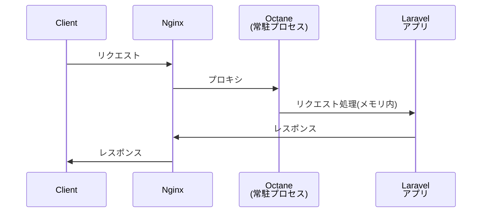
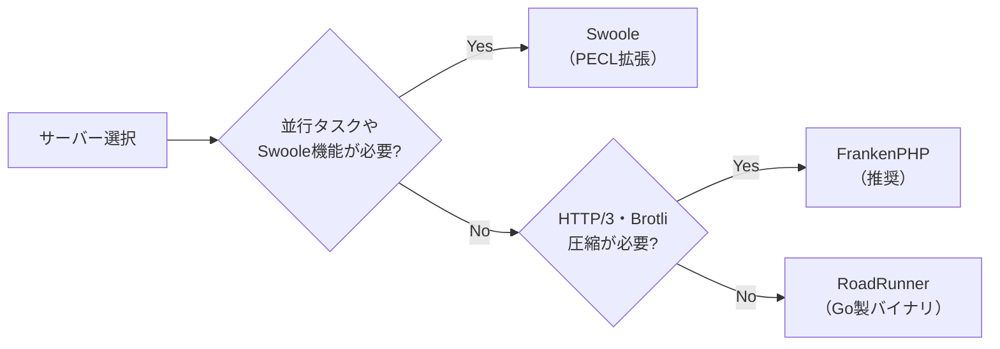
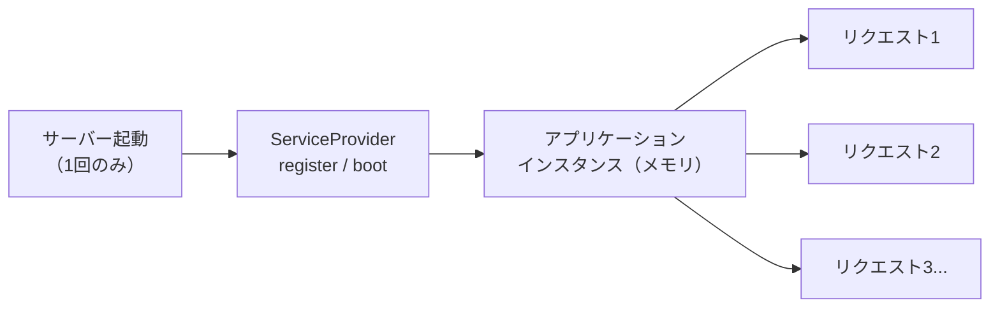

## Octane とは

[Laravel Octane](https://github.com/laravel/octane) は、高性能なアプリケーションサーバーを使って Laravel アプリケーションのパフォーマンスを劇的に向上させるパッケージです。

通常の PHP-FPM では、リクエストのたびにアプリケーションが起動・終了します。Octane ではアプリケーションを一度だけ起動してメモリに保持し、続くリクエストを高速に処理します。



PHP-FPM との最大の違いは、アプリケーションのブート処理（サービスプロバイダの登録など）がリクエストごとに繰り返されない点です。1 回起動すればあとは超高速でリクエストを処理できます。

## 対応サーバー

Octane は以下の 3 つのサーバーをサポートしています。



| サーバー | 言語 | インストール | 並行タスク | 備考 |
|---|---|---|---|---|
| FrankenPHP | Go | 自動（バイナリ） | — | 推奨。HTTP/3・Brotli 対応 |
| RoadRunner | Go | 自動（バイナリ） | — | シンプルで設定が容易 |
| Swoole | PHP 拡張 | PECL で手動 | ✅ | 並行タスク・Octane キャッシュが使える |

<Info>
  Laravel Cloud では FrankenPHP を使った Octane 運用が推奨されており、フルマネージドでサポートされています。
</Info>

## インストールと設定

### パッケージのインストール

```bash
composer require laravel/octane
```

### Octane の初期設定

```bash
php artisan octane:install
```

実行するとサーバーを選択するプロンプトが表示されます。選択すると `config/octane.php` が生成されます。

### FrankenPHP

FrankenPHP を選択すると Octane が自動でバイナリをダウンロードします。追加の手順は不要です。

### RoadRunner

RoadRunner を選択すると Octane が自動でバイナリをダウンロードします。

### Swoole

Swoole は PHP 拡張として PECL でインストールします。

```bash
pecl install swoole
```

Open Swoole を使う場合は以下のコマンドでインストールします。

```bash
pecl install openswoole
```

## 起動方法

### サーバーの起動

```bash
php artisan octane:start
```

デフォルトではポート `8000` で起動します。`http://localhost:8000` でアクセスできます。

### サーバーの指定

```bash
php artisan octane:start --server=frankenphp
php artisan octane:start --server=roadrunner
php artisan octane:start --server=swoole
```

### ワーカー数の指定

```bash
php artisan octane:start --workers=4
```

Swoole でタスクワーカーも指定する場合は以下のとおりです。

```bash
php artisan octane:start --workers=4 --task-workers=6
```

### ファイル変更の監視

開発中はファイルを変更してもサーバーを再起動しないと反映されません。`--watch` フラグを使うと自動で再起動します。

```bash
php artisan octane:start --watch
```

<Warning>
  `--watch` を使うには [Node.js](https://nodejs.org) と Chokidar が必要です。

  ```bash
  npm install --save-dev chokidar
  ```
</Warning>

### その他の管理コマンド

```bash
# ワーカーのリロード（デプロイ後に実行）
php artisan octane:reload

# サーバーの停止
php artisan octane:stop

# サーバーの状態確認
php artisan octane:status
```

## 依存性注入の注意点

Octane ではアプリケーションがメモリに保持されるため、**サービスプロバイダの `register` や `boot` はサーバー起動時に 1 回しか実行されません**。同じアプリケーションインスタンスがリクエスト間で使い回されるため、コンテナやリクエストをオブジェクトのコンストラクタに注入する場合は注意が必要です。



### コンテナのインジェクション

シングルトンのコンストラクタにコンテナを直接注入すると、古いコンテナが使い回されます。

```php
// ❌ 問題のある例 — 古いコンテナが使い回される
$this->app->singleton(Service::class, function (Application $app) {
    return new Service($app);
});

// ✅ 安全な例 — クロージャで毎回最新のコンテナを取得
$this->app->singleton(Service::class, function () {
    return new Service(fn () => Container::getInstance());
});
```

グローバルヘルパー `app()` と `Container::getInstance()` は常に最新のコンテナを返すため安全です。

### リクエストのインジェクション

```php
// ❌ 問題のある例 — 古いリクエストが使い回される
$this->app->singleton(Service::class, function (Application $app) {
    return new Service($app['request']);
});

// ✅ 安全な例 — クロージャで毎回最新のリクエストを取得
$this->app->singleton(Service::class, function (Application $app) {
    return new Service(fn () => $app['request']);
});

// ✅ 最も推奨 — 必要な値だけメソッドに渡す
$service->method($request->input('name'));
```

<Info>
  コントローラーメソッドやルートクロージャで `Illuminate\Http\Request` をタイプヒントするのは安全です。グローバルヘルパー `request()` も常に現在のリクエストを返します。
</Info>

### 設定リポジトリのインジェクション

```php
// ❌ 問題のある例 — 設定値が変わっても古いリポジトリが使われる
$this->app->singleton(Service::class, function (Application $app) {
    return new Service($app->make('config'));
});

// ✅ 安全な例
$this->app->singleton(Service::class, function () {
    return new Service(fn () => Container::getInstance()->make('config'));
});
```

グローバルヘルパー `config()` は常に最新の設定リポジトリを返すため安全です。

## メモリリーク対策

Octane はアプリケーションをメモリに保持するため、静的プロパティなどにデータを蓄積するとメモリリークが発生します。

```php
// ❌ メモリリークの例 — リクエストごとに $data が増え続ける
class Service
{
    public static array $data = [];
}

public function index(Request $request): array
{
    Service::$data[] = Str::random(10);
    return [];
}
```

### max-requests でワーカーをリサイクル

ワーカーが一定数のリクエストを処理したら自動的に再起動させることでメモリリークを軽減できます。デフォルトは 500 リクエストです。

```bash
php artisan octane:start --max-requests=250
```

### 最大実行時間の設定

`config/octane.php` でリクエストの最大実行時間を設定できます。デフォルトは 30 秒です。

```php
'max_execution_time' => 30,
```

<Warning>
  `max_execution_time` を変更した場合は Octane サーバーを再起動してください。
</Warning>

## 並行タスク（Swoole 限定）

Swoole を使用している場合、`Octane::concurrently()` で複数の処理を並行実行できます。

```php
use App\Models\User;
use App\Models\Server;
use Laravel\Octane\Facades\Octane;

[$users, $servers] = Octane::concurrently([
    fn () => User::all(),
    fn () => Server::all(),
]);
```

並行タスクは Swoole の「タスクワーカー」として別プロセスで実行されます。タスクワーカー数は `--task-workers` で指定します。

```bash
php artisan octane:start --workers=4 --task-workers=6
```

<Warning>
  `concurrently` に渡せるタスクは最大 1024 個です（Swoole の制限）。
</Warning>

## Tick と Interval（Swoole 限定）

Swoole では指定した間隔で定期実行する処理を登録できます。サービスプロバイダの `boot` メソッドで登録します。

```php
use Laravel\Octane\Facades\Octane;

// 10 秒ごとに実行
Octane::tick('delayed-ticker', fn () => ray('Ticking...'))
    ->seconds(10);

// サーバー起動直後にも即実行
Octane::tick('immediate-ticker', fn () => ray('Ticking...'))
    ->seconds(10)
    ->immediate();
```

## Octane キャッシュ（Swoole 限定）

Swoole の [Swoole テーブル](https://www.swoole.co.uk/docs/modules/swoole-table) を使った超高速インメモリキャッシュです。毎秒最大 200 万回の読み書きが可能です。

```php
use Illuminate\Support\Facades\Cache;

Cache::store('octane')->put('framework', 'Laravel', 30);
```

### インターバルキャッシュ

指定した間隔で自動更新されるキャッシュです。

```php
use Illuminate\Support\Str;

Cache::store('octane')->interval('random', function () {
    return Str::random(10);
}, seconds: 5);
```

<Warning>
  Octane キャッシュのデータはサーバーを再起動するとすべて消去されます。
</Warning>

## Swoole テーブル（Swoole 限定）

全ワーカーからアクセス可能な任意のインメモリテーブルを定義できます。`config/octane.php` の `tables` で設定します。

```php
'tables' => [
    'example:1000' => [
        'name' => 'string:1000',
        'votes' => 'int',
    ],
],
```

テーブルへのアクセスは `Octane::table()` メソッドを使います。

```php
use Laravel\Octane\Facades\Octane;

Octane::table('example')->set('uuid', [
    'name' => 'Nuno Maduro',
    'votes' => 1000,
]);

$row = Octane::table('example')->get('uuid');
```

<Warning>
  Swoole テーブルで使えるカラム型は `string`、`int`、`float` のみです。データはサーバー再起動で消えます。
</Warning>

## 本番環境での運用

### Nginx + Octane の構成

本番環境では Nginx の背後で Octane を動かすのが一般的です。Nginx が静的ファイルの配信と SSL 終端を担い、動的リクエストを Octane にプロキシします。

```nginx
map $http_upgrade $connection_upgrade {
    default upgrade;
    ''      close;
}

server {
    listen 80;
    server_name example.com;
    root /home/forge/example.com/public;

    location /index.php {
        try_files /not_exists @octane;
    }

    location / {
        try_files $uri $uri/ @octane;
    }

    location @octane {
        set $suffix "";

        if ($uri = /index.php) {
            set $suffix ?$query_string;
        }

        proxy_http_version 1.1;
        proxy_set_header Host $http_host;
        proxy_set_header Scheme $scheme;
        proxy_set_header SERVER_PORT $server_port;
        proxy_set_header REMOTE_ADDR $remote_addr;
        proxy_set_header X-Forwarded-For $proxy_add_x_forwarded_for;
        proxy_set_header Upgrade $http_upgrade;
        proxy_set_header Connection $connection_upgrade;

        proxy_pass http://127.0.0.1:8000$suffix;
    }
}
```

### Supervisor で常駐させる

本番環境では Supervisor を使って Octane を常時起動しておきます。

```ini
[program:octane]
process_name=%(program_name)s_%(process_num)02d
command=php /home/forge/example.com/artisan octane:start --server=frankenphp --host=127.0.0.1 --port=8000
autostart=true
autorestart=true
user=forge
redirect_stderr=true
stdout_logfile=/home/forge/example.com/storage/logs/octane.log
stopwaitsecs=3600
```

### HTTPS の有効化

Octane 経由で HTTPS リンクを生成するには `.env` に以下を設定します。

```ini
OCTANE_HTTPS=true
```

### Laravel Cloud との連携

[Laravel Cloud](https://cloud.laravel.com) では FrankenPHP を使った Octane をフルマネージドでサポートしています。Nginx や Supervisor の設定は不要で、たった 2 ステップで Octane を有効化できます。

<Steps>
  <Step title="パッケージのインストール">
    Octane をインストールします。`octane:install` コマンドは実行してもかまいませんが必須ではありません。

    ```bash
    composer require laravel/octane
    ```
  </Step>
  <Step title="Laravel Cloud で Octane を有効化">
    環境の App コンピュートクラスタの設定を開き、**「Use Octane as runtime」** をオンにして保存・デプロイします。Laravel Cloud が自動的に FrankenPHP + Octane でアプリケーションをビルド・起動します。
  </Step>
</Steps>

詳細は [Laravel Cloud のドキュメント](https://cloud.laravel.com/docs/compute#laravel-octane) を参照してください。

### デプロイ後のワーカーリロード

デプロイ後は新しいコードをメモリに読み込むため、ワーカーをリロードします。

```bash
php artisan octane:reload
```
